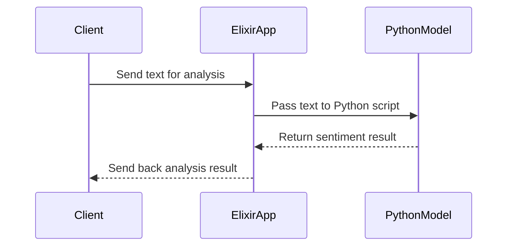
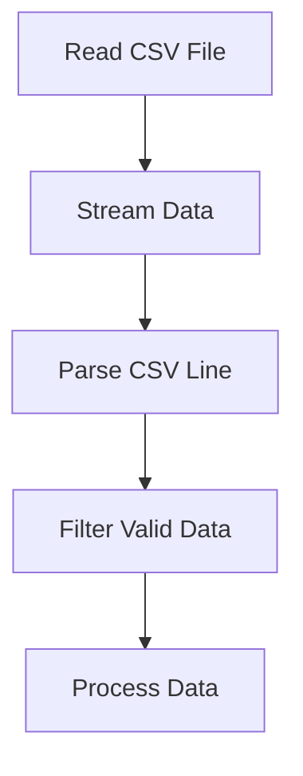
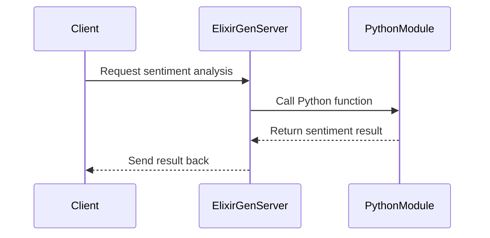

## 30.9. Using Elixir in Machine Learning Projects

As we delve into the world of machine learning (ML) with Elixir, we uncover a landscape rich with possibilities for real-time inference, efficient data processing, and hybrid approaches that leverage the strengths of multiple programming languages. Elixir, with its functional programming paradigm and robust concurrency model, offers unique advantages in building scalable and fault-tolerant ML systems. In this section, we will explore how Elixir can be effectively used in machine learning projects, focusing on three key areas: real-time inference, data processing, and hybrid approaches.

### Real-Time Inference

Real-time inference is a critical aspect of many machine learning applications, where predictions need to be made instantly based on incoming data. Elixir's ability to handle concurrent processes efficiently makes it an ideal choice for implementing real-time inference systems.

#### Integrating Trained Models for Instant Predictions

To integrate trained models for real-time predictions, Elixir can act as a bridge between the model and the application layer. This involves loading pre-trained models, often developed in languages like Python, and using them to make predictions on incoming data streams.

**Example: Using Elixir with a Python ML Model**

Let's consider a scenario where we have a Python-trained model for sentiment analysis. We can use Elixir to manage the real-time data flow and invoke the Python model for predictions.

```elixir
defmodule SentimentAnalyzer do
  @moduledoc """
  Module for real-time sentiment analysis using a Python-trained model.
  """

  @python_script_path "path/to/sentiment_model.py"

  def analyze_sentiment(text) do
    # Use Ports to communicate with the Python script
    port = Port.open({:spawn, "python #{@python_script_path}"}, [:binary, packet: 4])

    # Send the text to the Python process
    Port.command(port, text)

    # Receive the result from the Python process
    receive do
      {^port, {:data, result}} ->
        IO.puts("Sentiment Analysis Result: #{result}")
        result
    end
  end
end
```

In this example, we use Elixir's Port functionality to spawn a Python process and communicate with it. This allows us to leverage Python's ML capabilities while maintaining the concurrency and fault-tolerance benefits of Elixir.

#### Visualizing Real-Time Inference Workflow


```mermaid
sequenceDiagram
    participant Client
    participant ElixirApp
    participant PythonModel
    Client->>ElixirApp: Send text for analysis
    ElixirApp->>PythonModel: Pass text to Python script
    PythonModel-->>ElixirApp: Return sentiment result
    ElixirApp-->>Client: Send back analysis result
```

*Figure 1: Real-Time Inference Workflow with Elixir and Python*

### Data Processing

Efficient data processing is paramount in machine learning, where large datasets are often involved. Elixir's immutable data structures and concurrency model make it well-suited for handling and processing large volumes of data.

#### Handling Large Datasets Efficiently

Elixir provides several tools for efficient data processing, such as Streams and GenStage. These tools allow for lazy evaluation and backpressure management, which are essential for processing large datasets without overwhelming system resources.

**Example: Using Streams for Data Processing**

Consider a scenario where we need to process a large CSV file containing user data for training a machine learning model.

```elixir
defmodule DataProcessor do
  @moduledoc """
  Module for processing large datasets using Elixir Streams.
  """

  def process_large_csv(file_path) do
    file_path
    |> File.stream!()
    |> Stream.map(&parse_csv_line/1)
    |> Stream.filter(&valid_data?/1)
    |> Enum.each(&process_data/1)
  end

  defp parse_csv_line(line) do
    # Parse the CSV line into a data structure
    String.split(line, ",")
  end

  defp valid_data?(data) do
    # Validate the data
    Enum.all?(data, &(&1 != ""))
  end

  defp process_data(data) do
    # Process the data
    IO.inspect(data)
  end
end
```

In this example, we use Elixir Streams to lazily process each line of the CSV file, allowing us to handle large files efficiently without loading the entire file into memory.

#### Visualizing Data Processing with Streams


```mermaid
graph TD;
    A[Read CSV File] --> B[Stream Data]
    B --> C[Parse CSV Line]
    C --> D[Filter Valid Data]
    D --> E[Process Data]
```

*Figure 2: Data Processing Workflow with Elixir Streams*

### Hybrid Approaches

In many machine learning projects, a hybrid approach that combines Elixir with other languages like Python can offer the best of both worlds. Elixir can handle the concurrency and fault tolerance, while Python or R can be used for their rich ML libraries and tools.

#### Combining Elixir with Python or Other ML Languages

Elixir can be integrated with Python using Ports, NIFs (Native Implemented Functions), or external libraries like `erlport`. This allows developers to use Python's extensive ML libraries while benefiting from Elixir's concurrency model.

**Example: Hybrid Approach with Elixir and Python**

Let's extend our sentiment analysis example to demonstrate a hybrid approach using `erlport` for better integration.

```elixir
defmodule HybridSentimentAnalyzer do
  use GenServer

  @python_module "sentiment_model"

  def start_link(_) do
    GenServer.start_link(__MODULE__, %{})
  end

  def init(state) do
    {:ok, state}
  end

  def analyze_sentiment(pid, text) do
    GenServer.call(pid, {:analyze, text})
  end

  def handle_call({:analyze, text}, _from, state) do
    result = :python.call(@python_module, :analyze, [text])
    {:reply, result, state}
  end
end
```

In this example, we use a GenServer to manage the interaction with the Python script, providing a more robust and scalable solution for real-time inference.

#### Visualizing Hybrid Approach


```mermaid
sequenceDiagram
    participant Client
    participant ElixirGenServer
    participant PythonModule
    Client->>ElixirGenServer: Request sentiment analysis
    ElixirGenServer->>PythonModule: Call Python function
    PythonModule-->>ElixirGenServer: Return sentiment result
    ElixirGenServer-->>Client: Send result back
```

*Figure 3: Hybrid Approach Workflow with Elixir and Python*

### References and Further Reading

- [Elixir Official Documentation](https://elixir-lang.org/docs.html)
- [Python Official Documentation](https://docs.python.org/3/)
- [ErlPort: Erlang and Elixir Ports to Python](https://github.com/hdima/erlport)
- [GenStage: A toolkit for building demand-driven data processing pipelines](https://hexdocs.pm/gen_stage/)

### Knowledge Check

1. Explain how Elixir's concurrency model benefits real-time inference in machine learning applications.
2. Demonstrate how to use Elixir Streams for processing large datasets efficiently.
3. Provide an example of integrating Elixir with Python for machine learning tasks.
4. Discuss the advantages of using a hybrid approach in machine learning projects.
5. Describe how GenStage can be used for backpressure management in data processing.

### Embrace the Journey

Remember, this is just the beginning of exploring Elixir's potential in machine learning projects. As you progress, you'll discover more advanced techniques and integrations that can enhance your applications. Keep experimenting, stay curious, and enjoy the journey!

## Quiz Time!



### What is a key benefit of using Elixir for real-time inference in ML applications?

- [x] Efficient concurrency management
- [ ] Extensive ML libraries
- [ ] Built-in data visualization tools
- [ ] Native support for Python

> **Explanation:** Elixir's concurrency model allows for efficient handling of real-time data streams, making it ideal for real-time inference.

### How can Elixir handle large datasets efficiently?

- [x] Using Streams for lazy evaluation
- [ ] Loading entire datasets into memory
- [ ] Using built-in ML libraries
- [ ] Relying on external databases

> **Explanation:** Elixir Streams allow for lazy evaluation, processing data as needed without loading entire datasets into memory.

### What is a common method to integrate Elixir with Python?

- [x] Using Ports or NIFs
- [ ] Directly importing Python libraries
- [ ] Using Elixir's built-in ML functions
- [ ] Writing Python code in Elixir syntax

> **Explanation:** Ports and NIFs are common methods for integrating Elixir with Python, allowing for seamless interaction between the two languages.

### Which Elixir feature is beneficial for managing backpressure in data processing?

- [x] GenStage
- [ ] GenServer
- [ ] Mix
- [ ] ExUnit

> **Explanation:** GenStage is a toolkit for building demand-driven data processing pipelines, which helps manage backpressure effectively.

### What is the advantage of a hybrid approach in ML projects?

- [x] Combining strengths of multiple languages
- [ ] Using only one programming language
- [ ] Avoiding concurrency issues
- [ ] Eliminating the need for external libraries

> **Explanation:** A hybrid approach leverages the strengths of different languages, such as Elixir for concurrency and Python for ML libraries.

### In the provided example, what is the role of the GenServer?

- [x] Managing interaction with the Python script
- [ ] Performing data visualization
- [ ] Handling user authentication
- [ ] Compiling Elixir code

> **Explanation:** The GenServer manages the interaction with the Python script, providing a robust solution for real-time inference.

### How does Elixir's immutability benefit ML projects?

- [x] Ensures data consistency
- [ ] Allows for mutable data structures
- [ ] Simplifies database interactions
- [ ] Enables dynamic typing

> **Explanation:** Immutability ensures data consistency, which is crucial in processing large datasets and maintaining reliable ML models.

### What is an advantage of using Elixir's Pipe operator (`|>`) in data processing?

- [x] Enhances code readability and flow
- [ ] Allows for mutable data
- [ ] Directly integrates with Python
- [ ] Provides built-in ML functions

> **Explanation:** The Pipe operator enhances code readability and flow by allowing for clear and concise data transformations.

### Which Elixir library is mentioned for building demand-driven data processing pipelines?

- [x] GenStage
- [ ] Phoenix
- [ ] Ecto
- [ ] Plug

> **Explanation:** GenStage is mentioned as a toolkit for building demand-driven data processing pipelines in Elixir.

### True or False: Elixir has built-in machine learning libraries similar to Python.

- [ ] True
- [x] False

> **Explanation:** Elixir does not have built-in machine learning libraries like Python; instead, it can integrate with languages that do.


