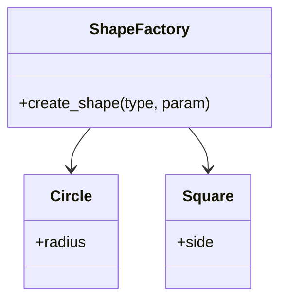
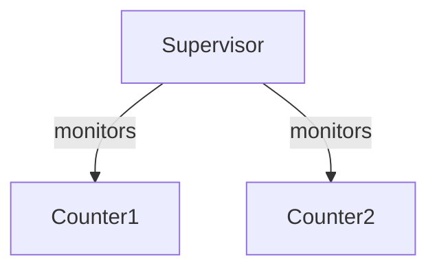

## 31.1. Recap of Key Concepts

As we conclude our journey through the advanced guide on Elixir design patterns, it's essential to revisit the key concepts that have been the cornerstone of our exploration. This recap will serve as a comprehensive summary of the design patterns, functional programming principles, and concurrency models that are pivotal in Elixir development. Let's delve into each of these areas to reinforce our understanding and appreciation of Elixir's unique capabilities.

### Reviewing Design Patterns

Design patterns are fundamental solutions to common problems in software design. In Elixir, these patterns are adapted to leverage the language's functional and concurrent nature. Here's a summary of the essential design patterns we've covered:

#### Creational Patterns

1. **Factory Pattern**: Utilizes functions and modules to create objects, allowing for flexible and reusable code. In Elixir, this pattern is often implemented using functions that return maps or structs.

   ```elixir
   defmodule ShapeFactory do
     def create_shape(:circle, radius) do
       %Circle{radius: radius}
     end

     def create_shape(:square, side) do
       %Square{side: side}
     end
   end
   ```

2. **Builder Pattern**: Employs a step-by-step approach to construct complex objects. In Elixir, this can be achieved using chained function calls.

   ```elixir
   defmodule CarBuilder do
     defstruct [:make, :model, :year]

     def new(), do: %CarBuilder{}

     def set_make(car, make), do: %{car | make: make}
     def set_model(car, model), do: %{car | model: model}
     def set_year(car, year), do: %{car | year: year}
   end
   ```

3. **Singleton Pattern**: Ensures a class has only one instance. In Elixir, this is often managed through application environment configurations.

   ```elixir
   defmodule AppConfig do
     def get_config(key), do: Application.get_env(:my_app, key)
   end
   ```

#### Structural Patterns

1. **Adapter Pattern**: Allows incompatible interfaces to work together. In Elixir, protocols and behaviors are used to achieve this.

   ```elixir
   defprotocol Drawable do
     def draw(shape)
   end

   defimpl Drawable, for: Circle do
     def draw(%Circle{radius: radius}) do
       IO.puts("Drawing a circle with radius #{radius}")
     end
   end
   ```

2. **Decorator Pattern**: Adds behavior to objects dynamically. In Elixir, this can be done through function wrapping.

   ```elixir
   defmodule LoggerDecorator do
     def log(func) do
       IO.puts("Starting function")
       result = func.()
       IO.puts("Function finished")
       result
     end
   end
   ```

#### Behavioral Patterns

1. **Strategy Pattern**: Defines a family of algorithms and makes them interchangeable. In Elixir, higher-order functions are used to implement this pattern.

   ```elixir
   defmodule PaymentProcessor do
     def process(payment, strategy) do
       strategy.(payment)
     end
   end

   credit_card_strategy = fn payment -> IO.puts("Processing credit card payment: #{payment}") end
   PaymentProcessor.process(100, credit_card_strategy)
   ```

2. **Observer Pattern**: Establishes a subscription mechanism to allow multiple objects to listen to and react to events. In Elixir, `Phoenix.PubSub` is commonly used.

   ```elixir
   defmodule EventNotifier do
     use Phoenix.PubSub

     def notify(event) do
       Phoenix.PubSub.broadcast(MyApp.PubSub, "events", event)
     end
   end
   ```

### Functional Programming Principles

Functional programming is at the heart of Elixir, and understanding its principles is crucial for mastering the language. Let's reinforce some of the core concepts:

#### Immutability and Pure Functions

Immutability ensures that data cannot be changed once created, leading to more predictable and bug-free code. Pure functions, which always produce the same output for the same input, are a natural fit for this paradigm.

```elixir
defmodule Math do
  def add(a, b), do: a + b
end
```

#### First-Class and Higher-Order Functions

Elixir treats functions as first-class citizens, allowing them to be passed as arguments, returned from other functions, and stored in data structures. Higher-order functions take other functions as arguments or return them.

```elixir
defmodule Functional do
  def apply(func, value), do: func.(value)
end

square = fn x -> x * x end
Functional.apply(square, 5) # => 25
```

#### Pattern Matching and Guards

Pattern matching is a powerful feature in Elixir that allows for the decomposition of data structures. Guards provide additional constraints on pattern matches.

```elixir
defmodule Matcher do
  def match({:ok, value}), do: IO.puts("Matched value: #{value}")
  def match({:error, _reason}), do: IO.puts("Error occurred")
end
```

#### Recursion and Tail Call Optimization

Recursion is a common technique in functional programming, and Elixir optimizes tail-recursive functions to prevent stack overflow.

```elixir
defmodule Factorial do
  def calculate(0), do: 1
  def calculate(n), do: n * calculate(n - 1)
end
```

### Concurrency and OTP

Elixir's concurrency model is one of its standout features, powered by the Erlang VM (BEAM). The OTP (Open Telecom Platform) framework provides tools for building robust, concurrent applications.

#### The Actor Model

Elixir uses the actor model, where processes are the primary units of concurrency. These lightweight processes communicate via message passing.

```elixir
defmodule Counter do
  def start_link(initial_value) do
    spawn(fn -> loop(initial_value) end)
  end

  defp loop(value) do
    receive do
      {:increment, caller} ->
        send(caller, value + 1)
        loop(value + 1)
    end
  end
end
```

#### Supervisors and Supervision Trees

Supervisors are OTP components that monitor processes and restart them if they fail, ensuring fault tolerance.

```elixir
defmodule MyApp.Supervisor do
  use Supervisor

  def start_link(_) do
    Supervisor.start_link(__MODULE__, :ok, name: __MODULE__)
  end

  def init(:ok) do
    children = [
      {Counter, 0}
    ]

    Supervisor.init(children, strategy: :one_for_one)
  end
end
```

### Adapting Patterns to Elixir

Traditional design patterns often need to be adapted to fit Elixir's functional and concurrent nature. This involves rethinking object-oriented patterns to align with Elixir's paradigms.

#### Embracing Functional Constructs

Many design patterns in object-oriented languages rely on mutable state and inheritance. In Elixir, we use functional constructs like higher-order functions, pattern matching, and immutability to achieve similar goals.

#### Leveraging Concurrency

Patterns that involve state management or event handling can be adapted to use Elixir's concurrency model. For example, the observer pattern can be implemented using `GenServer` processes and message passing.

### Visualizing Key Concepts

To better understand these concepts, let's visualize some of the key patterns and principles using Mermaid.js diagrams.

#### Diagram: Factory Pattern in Elixir



**Caption**: This diagram illustrates the Factory Pattern in Elixir, where the `ShapeFactory` module creates instances of `Circle` and `Square`.

#### Diagram: Supervisor Tree



**Caption**: This diagram represents a simple supervision tree in Elixir, where a `Supervisor` monitors multiple `Counter` processes.

### Knowledge Check

Let's reinforce our understanding with some questions and challenges:

- **Question**: How does Elixir's concurrency model differ from traditional threading models?
- **Challenge**: Modify the `Counter` module to decrement the counter instead of incrementing it.
- **Exercise**: Implement a simple observer pattern using `GenServer` and message passing.

### Embrace the Journey

Remember, this is just the beginning. As you continue to explore Elixir, you'll discover more about its powerful features and how they can be leveraged to build scalable, fault-tolerant systems. Keep experimenting, stay curious, and enjoy the journey!

## Quiz: Recap of Key Concepts



### Which pattern ensures a class has only one instance in Elixir?

- [ ] Factory Pattern
- [ ] Builder Pattern
- [x] Singleton Pattern
- [ ] Observer Pattern

> **Explanation:** The Singleton Pattern ensures a class has only one instance, often managed through application environment configurations in Elixir.

### What is the primary unit of concurrency in Elixir?

- [x] Process
- [ ] Thread
- [ ] Fiber
- [ ] Coroutine

> **Explanation:** In Elixir, the primary unit of concurrency is the process, which is lightweight and managed by the BEAM VM.

### How does Elixir handle state management in concurrent applications?

- [ ] Shared mutable state
- [x] Message passing
- [ ] Global variables
- [ ] Locks and semaphores

> **Explanation:** Elixir uses message passing between processes to handle state management, avoiding shared mutable state.

### What is the purpose of a Supervisor in Elixir?

- [ ] To execute functions
- [ ] To manage memory
- [x] To monitor and restart processes
- [ ] To compile code

> **Explanation:** A Supervisor in Elixir is responsible for monitoring processes and restarting them if they fail, ensuring fault tolerance.

### Which principle is central to functional programming in Elixir?

- [ ] Inheritance
- [x] Immutability
- [ ] Encapsulation
- [ ] Polymorphism

> **Explanation:** Immutability is a central principle in functional programming, ensuring data cannot be changed once created.

### What is a common use of higher-order functions in Elixir?

- [ ] To manage memory
- [x] To pass functions as arguments
- [ ] To create classes
- [ ] To handle exceptions

> **Explanation:** Higher-order functions in Elixir are commonly used to pass functions as arguments or return them from other functions.

### How does Elixir optimize recursive functions?

- [ ] By using loops
- [ ] By using global variables
- [x] By tail call optimization
- [ ] By using threads

> **Explanation:** Elixir optimizes recursive functions through tail call optimization, preventing stack overflow.

### What is the role of pattern matching in Elixir?

- [ ] To create classes
- [x] To decompose data structures
- [ ] To manage memory
- [ ] To handle exceptions

> **Explanation:** Pattern matching in Elixir is used to decompose data structures, allowing for more expressive and concise code.

### Which pattern is adapted using `GenServer` in Elixir?

- [ ] Factory Pattern
- [ ] Builder Pattern
- [x] Observer Pattern
- [ ] Singleton Pattern

> **Explanation:** The Observer Pattern can be adapted using `GenServer` in Elixir, leveraging message passing for event handling.

### True or False: Elixir uses threads for concurrency.

- [ ] True
- [x] False

> **Explanation:** False. Elixir uses lightweight processes for concurrency, managed by the BEAM VM, rather than traditional threads.


