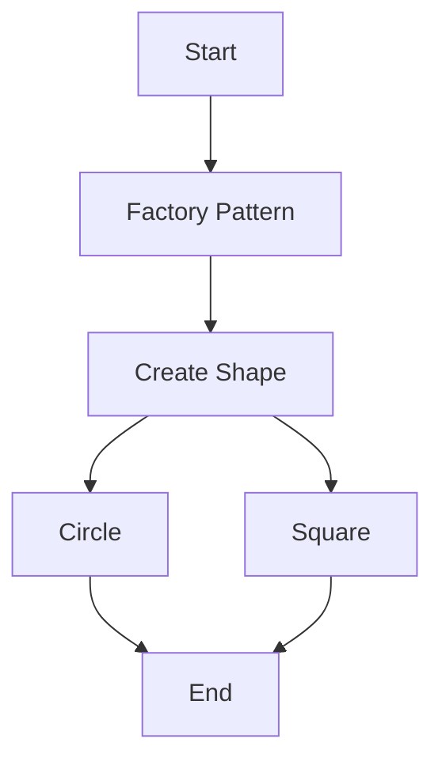
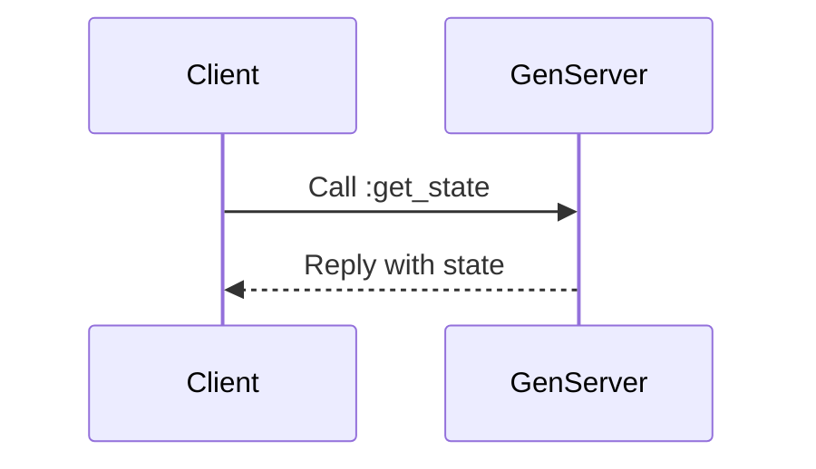

## 31.1. Recap of Key Concepts

As we conclude this advanced guide on Elixir design patterns, let's take a moment to revisit the key concepts and principles that have been discussed throughout. This recap will serve as a comprehensive overview, reinforcing the critical elements of design patterns, functional programming, concurrency, and OTP that are essential for expert software engineers and architects working with Elixir.

### Reviewing Design Patterns

Design patterns are reusable solutions to common problems in software design. In Elixir, these patterns are adapted to fit the functional and concurrent nature of the language. Here's a summary of the essential design patterns covered in this guide:

#### Creational Patterns

- **Factory Pattern**: Utilizes functions and modules to create objects, allowing for flexibility and decoupling in object creation.
  
  ```elixir
  defmodule ShapeFactory do
    def create_shape(:circle), do: %Circle{}
    def create_shape(:square), do: %Square{}
  end
  ```

- **Builder Pattern**: Employs a functional approach to construct complex objects step-by-step, enhancing readability and maintainability.
  
  ```elixir
  defmodule CarBuilder do
    def build do
      %Car{}
      |> add_engine(:v8)
      |> add_wheels(4)
      |> add_color(:red)
    end
  end
  ```

- **Singleton Pattern**: Managed through Elixir's application environment, ensuring a single instance of a module or resource.
  
  ```elixir
  defmodule Config do
    @moduledoc "Singleton for application configuration"
    def get(key), do: Application.get_env(:my_app, key)
  end
  ```

#### Structural Patterns

- **Adapter Pattern**: Uses protocols and behaviors to allow incompatible interfaces to work together.
  
  ```elixir
  defprotocol Payment do
    def pay(amount)
  end

  defmodule PayPalAdapter do
    defimpl Payment, for: PayPal do
      def pay(amount), do: PayPal.send_payment(amount)
    end
  end
  ```

- **Decorator Pattern**: Achieved by wrapping functions to add behavior dynamically.
  
  ```elixir
  defmodule LoggerDecorator do
    def log(func) do
      IO.puts("Function called")
      func.()
    end
  end
  ```

#### Behavioral Patterns

- **Strategy Pattern**: Utilizes higher-order functions to define a family of algorithms, encapsulating each one and making them interchangeable.
  
  ```elixir
  defmodule Sorter do
    def sort(list, strategy), do: strategy.(list)
  end

  ascending = fn list -> Enum.sort(list) end
  descending = fn list -> Enum.sort(list, &>=/2) end
  ```

- **Observer Pattern**: Implemented with PubSub systems like `Phoenix.PubSub` for event-driven architectures.
  
  ```elixir
  defmodule EventManager do
    use Phoenix.PubSub
    
    def notify(event), do: Phoenix.PubSub.broadcast(MyApp.PubSub, "events", event)
  end
  ```

### Functional Programming Principles

Elixir's functional programming paradigm is foundational to its design patterns. Key principles include:

#### Immutability and Pure Functions

Immutability ensures that data cannot be changed once created, leading to safer and more predictable code. Pure functions, which have no side effects and return the same output for the same input, are central to functional programming.

```elixir
defmodule Math do
  def add(a, b), do: a + b
end
```

#### First-Class and Higher-Order Functions

Functions in Elixir can be passed as arguments, returned from other functions, and assigned to variables, enabling powerful abstractions and code reuse.

```elixir
defmodule Calculator do
  def operate(a, b, func), do: func.(a, b)
end

add = fn a, b -> a + b end
Calculator.operate(1, 2, add)
```

#### Pattern Matching and Guards

Pattern matching allows for concise and expressive code, while guards provide additional checks in function clauses.

```elixir
defmodule Example do
  def check({:ok, result}), do: "Success: #{result}"
  def check({:error, reason}), do: "Error: #{reason}"
end
```

### Concurrency and OTP

Elixir's concurrency model, based on the Actor model, is one of its most powerful features. OTP (Open Telecom Platform) provides a set of libraries and design principles for building robust, fault-tolerant applications.

#### The Actor Model

Processes in Elixir are lightweight and isolated, communicating through message passing. This model simplifies concurrency and parallelism.

```elixir
defmodule Worker do
  def start_link do
    spawn_link(fn -> loop() end)
  end

  defp loop do
    receive do
      {:work, task} -> IO.puts("Working on #{task}")
    end
    loop()
  end
end
```

#### OTP Principles

- **GenServer**: A generic server implementation that abstracts common patterns in process communication and state management.

  ```elixir
  defmodule MyServer do
    use GenServer

    def start_link(initial_state) do
      GenServer.start_link(__MODULE__, initial_state, name: __MODULE__)
    end

    def handle_call(:get_state, _from, state) do
      {:reply, state, state}
    end
  end
  ```

- **Supervision Trees**: Structures that manage process lifecycles, restarting failed processes to maintain system stability.

  ```elixir
  defmodule MyApp.Supervisor do
    use Supervisor

    def start_link do
      Supervisor.start_link(__MODULE__, :ok, name: __MODULE__)
    end

    def init(:ok) do
      children = [
        {MyServer, []}
      ]
      Supervisor.init(children, strategy: :one_for_one)
    end
  end
  ```

### Adapting Patterns to Elixir

Traditional design patterns often need adaptation to fit Elixir's functional and concurrent nature. This involves:

- **Functionalizing State**: Using immutable data structures and pure functions to manage state changes.
  
- **Leveraging Processes**: Utilizing Elixir's lightweight processes for concurrency instead of traditional threading models.

- **Embracing Message Passing**: Replacing shared state and locks with message-based communication between processes.

### Try It Yourself

To solidify your understanding, try modifying the code examples above. Experiment with creating a new design pattern or adapting an existing one to fit a different use case. Consider how you might implement a new feature using Elixir's concurrency model or functional programming principles.

### Visualizing Elixir Concepts

Let's visualize some of these concepts using Mermaid.js diagrams to enhance understanding.


```mermaid
graph TD;
    A[Start] --> B[Factory Pattern];
    B --> C[Create Shape];
    C --> D[Circle];
    C --> E[Square];
    D --> F[End];
    E --> F[End];
```

**Diagram Description**: This flowchart illustrates the Factory Pattern in Elixir, showing how different shapes are created based on input.


```mermaid
sequenceDiagram
    participant Client
    participant GenServer
    Client->>GenServer: Call :get_state
    GenServer-->>Client: Reply with state
```

**Diagram Description**: This sequence diagram demonstrates the interaction between a client and a GenServer in Elixir, highlighting the request-response cycle.

### References and Links

For further reading and deeper dives into specific topics, consider exploring the following resources:

- [Elixir Official Documentation](https://elixir-lang.org/docs.html)
- [Learn You Some Erlang for Great Good!](https://learnyousomeerlang.com/)
- [Elixir School](https://elixirschool.com/)

### Knowledge Check

To reinforce your learning, consider the following questions:

1. How does the Factory Pattern in Elixir differ from its implementation in object-oriented languages?
2. What are the benefits of using immutable data structures in Elixir?
3. How do GenServers facilitate process communication in Elixir?
4. Why is the "Let It Crash" philosophy important in Elixir applications?

### Embrace the Journey

Remember, mastering Elixir design patterns and functional programming is a journey. As you continue to experiment and apply these concepts, you'll build more robust and scalable applications. Stay curious, keep learning, and enjoy the process!

## Quiz Time!



### What is the primary advantage of using the Factory Pattern in Elixir?

- [x] It provides flexibility and decoupling in object creation.
- [ ] It allows for direct manipulation of data structures.
- [ ] It simplifies the process of writing recursive functions.
- [ ] It enforces strict type checking.

> **Explanation:** The Factory Pattern in Elixir provides flexibility and decoupling in object creation by abstracting the instantiation logic.

### Which of the following is a key characteristic of pure functions?

- [x] They have no side effects.
- [ ] They modify global state.
- [ ] They rely on external input.
- [ ] They return different outputs for the same input.

> **Explanation:** Pure functions have no side effects and always return the same output for the same input, making them predictable and reliable.

### How does Elixir's Actor Model simplify concurrency?

- [x] By using lightweight processes and message passing.
- [ ] By relying on shared memory and locks.
- [ ] By enforcing strict type systems.
- [ ] By using global variables for state management.

> **Explanation:** Elixir's Actor Model simplifies concurrency by using lightweight processes that communicate through message passing, avoiding shared memory and locks.

### What role do Supervision Trees play in OTP?

- [x] They manage process lifecycles and restart failed processes.
- [ ] They enforce strict type checking.
- [ ] They allow for direct manipulation of data structures.
- [ ] They simplify the process of writing recursive functions.

> **Explanation:** Supervision Trees manage process lifecycles and restart failed processes, ensuring system stability and fault tolerance.

### Which principle is central to Elixir's functional programming paradigm?

- [x] Immutability
- [ ] Shared state
- [ ] Global variables
- [ ] Side effects

> **Explanation:** Immutability is central to Elixir's functional programming paradigm, promoting safer and more predictable code.

### What is the primary purpose of the GenServer module in Elixir?

- [x] To abstract common patterns in process communication and state management.
- [ ] To enforce strict type checking.
- [ ] To allow for direct manipulation of data structures.
- [ ] To simplify the process of writing recursive functions.

> **Explanation:** The GenServer module abstracts common patterns in process communication and state management, facilitating the development of concurrent applications.

### How does the Strategy Pattern utilize higher-order functions in Elixir?

- [x] By defining a family of algorithms and encapsulating each one.
- [ ] By modifying global state.
- [ ] By relying on external input.
- [ ] By returning different outputs for the same input.

> **Explanation:** The Strategy Pattern utilizes higher-order functions to define a family of algorithms, encapsulating each one and making them interchangeable.

### Why is the "Let It Crash" philosophy important in Elixir applications?

- [x] It promotes fault tolerance by allowing processes to fail and restart.
- [ ] It simplifies the process of writing recursive functions.
- [ ] It enforces strict type checking.
- [ ] It allows for direct manipulation of data structures.

> **Explanation:** The "Let It Crash" philosophy promotes fault tolerance by allowing processes to fail and restart, ensuring system stability.

### What is a key benefit of using immutable data structures in Elixir?

- [x] They lead to safer and more predictable code.
- [ ] They allow for direct manipulation of data structures.
- [ ] They simplify the process of writing recursive functions.
- [ ] They enforce strict type checking.

> **Explanation:** Immutable data structures lead to safer and more predictable code by preventing unintended modifications.

### True or False: Elixir's concurrency model is based on shared memory and locks.

- [ ] True
- [x] False

> **Explanation:** False. Elixir's concurrency model is based on the Actor Model, which uses lightweight processes and message passing, avoiding shared memory and locks.


