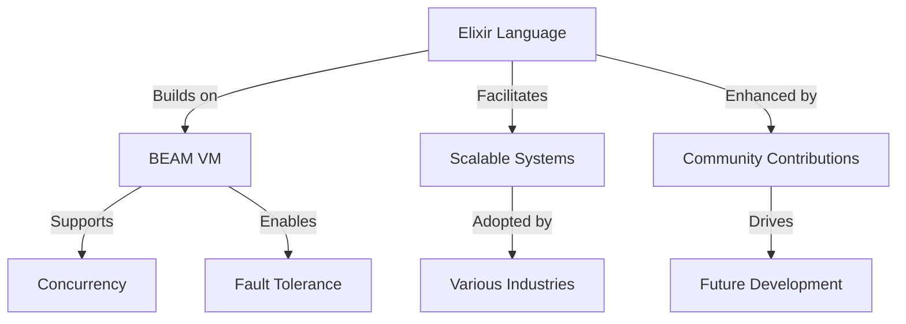

## 31.2. The Future of Elixir and the BEAM VM

As we delve into the future of Elixir and the BEAM VM, we find ourselves at the intersection of innovation and tradition. The Elixir programming language, built on the robust Erlang VM (BEAM), is renowned for its ability to create scalable, maintainable, and fault-tolerant systems. This section will explore Elixir's growth trajectory, upcoming features, the evolution of the BEAM VM, emerging technologies, and the invaluable contributions of its community.

### Elixir's Growth Trajectory

#### Continuous Development and Adoption

Elixir has seen a steady rise in adoption across various industries, from telecommunications and finance to web development and IoT. Its functional programming paradigm, coupled with the reliability of the BEAM VM, makes it an attractive choice for organizations aiming to build scalable and maintainable systems.

- **Scalability and Fault Tolerance**: Elixir's concurrency model, based on lightweight processes, allows it to handle millions of connections simultaneously. This makes it ideal for real-time applications like chat systems, online gaming, and financial trading platforms.
- **Maintainability**: The language's emphasis on readability, immutability, and pattern matching contributes to the creation of clean and maintainable codebases. This is particularly appealing in large-scale systems where code quality is paramount.

#### Increasing Popularity

Elixir's popularity is not just limited to its technical merits. The vibrant community, comprehensive documentation, and a growing ecosystem of libraries and tools have all contributed to its widespread adoption. Companies like Discord, Pinterest, and Bleacher Report have publicly shared their success stories with Elixir, further solidifying its reputation as a language of choice for modern software development.

### Upcoming Features and Improvements

#### Planned Enhancements to Elixir

The Elixir core team is continuously working on enhancing the language and its standard libraries. Some of the anticipated features include:

- **Improved Compiler Performance**: Efforts are being made to optimize the Elixir compiler for faster build times, which is crucial for large projects with extensive codebases.
- **Enhanced Debugging Tools**: New tools and features are being developed to make debugging Elixir applications more intuitive and efficient. This includes better support for tracing and profiling.
- **Expanded Standard Library**: The standard library is set to grow, with new modules and functions that simplify common tasks and improve developer productivity.

#### Advancements in Tooling and Ecosystem Support

The Elixir ecosystem is constantly evolving, with new tools and libraries emerging to address various needs. Some notable advancements include:

- **LiveView Enhancements**: Phoenix LiveView, which allows developers to build interactive, real-time web applications without writing JavaScript, is receiving continuous updates to improve performance and usability.
- **Nerves Project**: The Nerves Project, which focuses on building embedded systems with Elixir, is expanding its capabilities to support a wider range of hardware and use cases.
- **Hex Package Manager**: Hex, the package manager for Elixir, is evolving to provide better dependency management and security features.

### Evolution of the BEAM VM

#### Ongoing Optimization Efforts

The BEAM VM is at the heart of Elixir's performance and scalability. Ongoing efforts to optimize the VM include:

- **Performance Improvements**: The BEAM is being continuously optimized for better performance, particularly in areas like garbage collection and process scheduling.
- **Scalability Enhancements**: Work is being done to improve the VM's ability to handle even larger numbers of concurrent processes, making it suitable for the most demanding applications.

#### Supporting Distributed and Fault-Tolerant Applications

The BEAM VM's design inherently supports distributed and fault-tolerant applications. Features like process isolation, hot code swapping, and built-in support for distributed computing make it an ideal platform for building resilient systems.

- **Process Isolation**: Each process in the BEAM runs in its own isolated memory space, ensuring that a failure in one process does not affect others.
- **Hot Code Swapping**: The ability to update code without stopping the system is a critical feature for high-availability applications.
- **Distributed Computing**: The BEAM's support for distributed computing allows Elixir applications to scale across multiple nodes seamlessly.

### Emerging Technologies

#### Integration with Future Technologies

Elixir is well-positioned to integrate with and influence emerging technologies. Some areas of interest include:

- **WebAssembly**: As WebAssembly gains traction for running code in web browsers, there is potential for Elixir to leverage this technology for client-side applications.
- **Artificial Intelligence**: While Elixir is not traditionally associated with AI, its concurrency model and fault tolerance make it suitable for certain AI workloads, particularly those involving real-time data processing.
- **New Hardware Architectures**: As hardware architectures evolve, there is potential for the BEAM VM to be optimized for new platforms, ensuring that Elixir remains relevant in a changing technological landscape.

#### Influence on Future Technologies

Elixir's design principles, particularly its emphasis on concurrency and fault tolerance, could influence the development of future programming languages and platforms. The success of Elixir and the BEAM VM demonstrates the viability of functional programming and actor-based concurrency models in modern software development.

### Community Contributions

#### Impact of the Open-Source Community

The Elixir community plays a crucial role in the language's evolution. Community contributions include:

- **Open-Source Libraries**: A wealth of open-source libraries and tools are available, covering everything from web development to data processing and machine learning.
- **Educational Resources**: The community has produced a wide range of educational resources, including books, tutorials, and online courses, making it easier for new developers to learn Elixir.
- **Community Events**: Conferences, meetups, and online forums provide opportunities for developers to share knowledge, collaborate on projects, and contribute to the language's development.

#### Future Directions for Community Involvement

As Elixir continues to grow, the community will play an increasingly important role in shaping its future. Areas where community involvement is particularly valuable include:

- **Diversity and Inclusion**: Efforts to make the Elixir community more diverse and inclusive will help ensure that a wide range of perspectives are represented in the language's development.
- **Mentorship and Support**: Experienced developers can provide mentorship and support to newcomers, helping to grow the community and ensure the continued success of Elixir.
- **Contributions to Core Development**: Contributions to the core language and its libraries are always welcome, and the community's input is invaluable in guiding the direction of future development.

### Visualizing Elixir's Future

To better understand the future trajectory of Elixir and the BEAM VM, let's visualize some of the key components and their interactions.

**Figure 1**: This diagram illustrates how Elixir builds on the BEAM VM to support concurrency and fault tolerance, enabling scalable systems adopted by various industries. Community contributions enhance Elixir, driving its future development.

### Try It Yourself

To get a feel for Elixir's capabilities and its future potential, try experimenting with some of the language's features. For instance, you could:

- **Explore Concurrency**: Create a simple application that spawns multiple processes to handle concurrent tasks. Observe how Elixir's lightweight processes and message-passing model simplify concurrency.
- **Leverage Fault Tolerance**: Build a small application that demonstrates Elixir's fault tolerance by simulating process crashes and observing how supervisors automatically restart them.
- **Experiment with LiveView**: Use Phoenix LiveView to create a real-time web application without writing JavaScript. Explore how LiveView's updates and interactivity work seamlessly with Elixir's backend.

### Knowledge Check

Before we conclude, let's reinforce our understanding with some key takeaways:

- Elixir's growth trajectory is marked by its increasing adoption across various industries, driven by its scalability, maintainability, and fault tolerance.
- Upcoming features and improvements in Elixir focus on enhancing compiler performance, expanding the standard library, and advancing tooling support.
- The BEAM VM's evolution involves ongoing optimization efforts to improve performance and scalability, supporting distributed and fault-tolerant applications.
- Elixir is well-positioned to integrate with emerging technologies like WebAssembly and AI, potentially influencing future technological developments.
- The open-source community plays a vital role in Elixir's evolution, contributing libraries, educational resources, and community events.

### Embrace the Journey

Remember, the future of Elixir and the BEAM VM is bright, with endless possibilities for innovation and growth. As you continue your journey with Elixir, stay curious, experiment with new features, and engage with the community. Together, we can shape the future of this remarkable language and its ecosystem.

## Quiz Time!



### What makes Elixir particularly suitable for real-time applications?

- [x] Its concurrency model based on lightweight processes
- [ ] Its object-oriented programming paradigm
- [ ] Its use of mutable state
- [ ] Its lack of fault tolerance

> **Explanation:** Elixir's concurrency model, based on lightweight processes, allows it to handle many simultaneous connections, making it ideal for real-time applications.

### What is one of the anticipated features for Elixir's future development?

- [x] Improved compiler performance
- [ ] Removal of pattern matching
- [ ] Introduction of mutable state
- [ ] Elimination of the BEAM VM

> **Explanation:** Improved compiler performance is one of the anticipated features, aimed at speeding up build times for large projects.

### How does the BEAM VM support distributed applications?

- [x] Through process isolation and distributed computing support
- [ ] By using a single-threaded execution model
- [ ] By relying solely on external libraries
- [ ] By disabling fault tolerance features

> **Explanation:** The BEAM VM supports distributed applications through process isolation and built-in distributed computing capabilities.

### What role does the Elixir community play in the language's evolution?

- [x] Contributing open-source libraries and educational resources
- [ ] Restricting access to the language
- [ ] Reducing the number of available tools
- [ ] Eliminating community events

> **Explanation:** The Elixir community contributes open-source libraries, educational resources, and participates in events, driving the language's evolution.

### Which emerging technology could Elixir potentially integrate with?

- [x] WebAssembly
- [ ] COBOL
- [ ] Assembly language
- [ ] BASIC

> **Explanation:** Elixir has the potential to integrate with WebAssembly, which is gaining traction for running code in web browsers.

### What is one of the ongoing optimization efforts for the BEAM VM?

- [x] Improving garbage collection and process scheduling
- [ ] Removing support for concurrency
- [ ] Increasing memory usage
- [ ] Disabling distributed computing

> **Explanation:** Ongoing optimization efforts for the BEAM VM include improving garbage collection and process scheduling.

### How can Elixir's fault tolerance be demonstrated?

- [x] By simulating process crashes and observing supervisor restarts
- [ ] By disabling all error handling
- [ ] By using mutable state extensively
- [ ] By avoiding process isolation

> **Explanation:** Elixir's fault tolerance can be demonstrated by simulating process crashes and observing how supervisors automatically restart them.

### What is one way the Elixir community can contribute to its future?

- [x] Providing mentorship and support to newcomers
- [ ] Restricting access to educational resources
- [ ] Reducing diversity and inclusion efforts
- [ ] Eliminating open-source contributions

> **Explanation:** The community can contribute by providing mentorship and support to newcomers, fostering growth and diversity.

### What is a key feature of Phoenix LiveView?

- [x] Building interactive web applications without JavaScript
- [ ] Replacing the BEAM VM
- [ ] Introducing mutable state
- [ ] Eliminating real-time capabilities

> **Explanation:** Phoenix LiveView allows developers to build interactive web applications without writing JavaScript.

### True or False: Elixir's design principles could influence future programming languages.

- [x] True
- [ ] False

> **Explanation:** Elixir's design principles, particularly its emphasis on concurrency and fault tolerance, could influence the development of future programming languages.


