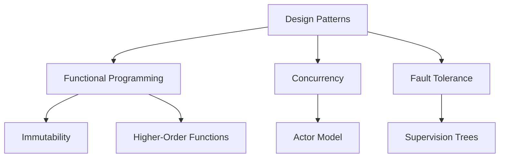

## 31.3. Final Thoughts on Design Patterns in Elixir

### The Importance of Patterns

Design patterns serve as a vital tool in the software engineer's toolkit, offering time-tested solutions to common problems. In Elixir, these patterns are not just about solving problems but enhancing code quality and boosting developer productivity. By providing a shared language for developers, design patterns facilitate communication and understanding, making it easier to collaborate and maintain codebases.

#### Reflecting on Code Quality and Developer Productivity

Design patterns in Elixir help in structuring code in a way that is both efficient and easy to understand. They promote best practices that lead to cleaner, more maintainable code. For instance, the use of the Supervisor pattern in Elixir's OTP (Open Telecom Platform) ensures that applications are fault-tolerant and can recover from failures gracefully. This not only improves the reliability of the software but also reduces the time developers spend on debugging and maintenance.

**Example: Supervisor Pattern in Elixir**

```elixir
defmodule MyApp.Supervisor do
  use Supervisor

  def start_link(init_arg) do
    Supervisor.start_link(__MODULE__, init_arg, name: __MODULE__)
  end

  def init(_init_arg) do
    children = [
      {MyApp.Worker, arg1: "value1", arg2: "value2"}
    ]

    Supervisor.init(children, strategy: :one_for_one)
  end
end
```

In this example, the Supervisor pattern is used to manage a worker process, ensuring that if the worker crashes, it is restarted automatically. This pattern enhances the robustness of the application, allowing developers to focus on building features rather than handling errors.

### Continuous Adaptation

As Elixir and its ecosystem evolve, so too must the design patterns we use. The language's functional nature and its emphasis on concurrency and fault tolerance mean that traditional object-oriented patterns often need to be adapted to fit the Elixir paradigm.

#### Evolving Patterns with Language and Best Practices

Elixir's community is vibrant and constantly innovating, which means new patterns and best practices are always emerging. Staying open to these changes and being willing to adapt is crucial for any developer looking to make the most of Elixir.

**Example: Adapting the Singleton Pattern**

In traditional object-oriented programming, the Singleton pattern ensures a class has only one instance and provides a global point of access to it. In Elixir, this can be achieved using a GenServer to maintain state across the application.

```elixir
defmodule SingletonServer do
  use GenServer

  def start_link(_) do
    GenServer.start_link(__MODULE__, %{}, name: __MODULE__)
  end

  def get_state do
    GenServer.call(__MODULE__, :get_state)
  end

  def handle_call(:get_state, _from, state) do
    {:reply, state, state}
  end
end
```

Here, the Singleton pattern is adapted to Elixir's functional paradigm using a GenServer, which manages state in a concurrent environment. This adaptation highlights the need for continuous learning and flexibility in applying design patterns.

### Balancing Theory and Practice

Understanding design patterns theoretically is important, but practical implementation is where the real learning happens. Theoretical knowledge provides the foundation, but applying patterns in real-world scenarios solidifies understanding and reveals nuances that books and articles may not cover.

#### Combining Theoretical Knowledge with Practical Experience

When implementing design patterns, it's crucial to understand not just how to use them, but why they are used. This understanding helps in making informed decisions about when and where to apply a particular pattern.

**Example: Strategy Pattern with Higher-Order Functions**

The Strategy pattern allows you to define a family of algorithms, encapsulate each one, and make them interchangeable. In Elixir, this can be elegantly implemented using higher-order functions.

```elixir
defmodule PaymentProcessor do
  def process(payment, strategy) do
    strategy.(payment)
  end
end

defmodule PaymentStrategies do
  def credit_card(payment) do
    # Process credit card payment
  end

  def paypal(payment) do
    # Process PayPal payment
  end
end

# Usage
PaymentProcessor.process(payment, &PaymentStrategies.credit_card/1)
```

In this example, the Strategy pattern is implemented using higher-order functions, allowing different payment processing strategies to be passed and executed dynamically. This demonstrates the power of combining theoretical knowledge with practical implementation.

### Encouragement for Innovation

While established design patterns provide a solid foundation, innovation is key to advancing the field of software engineering. Elixir's unique features, such as its concurrency model and metaprogramming capabilities, offer opportunities to create new patterns or adapt existing ones to meet specific challenges.

#### Inspiring Developers to Create and Adapt Patterns

Developers are encouraged to experiment and innovate, contributing to the broader knowledge base within the Elixir community. This not only helps in solving unique problems but also enriches the community with new ideas and approaches.

**Example: Creating a New Pattern with Elixir's Concurrency Model**

Elixir's concurrency model, based on the Actor model, allows for the creation of patterns that are not possible in other languages. For instance, a pattern for managing distributed state across multiple nodes can be developed using Elixir's GenServer and distributed Erlang capabilities.

```elixir
defmodule DistributedState do
  use GenServer

  def start_link(initial_state) do
    GenServer.start_link(__MODULE__, initial_state, name: {:global, __MODULE__})
  end

  def get_state do
    GenServer.call({:global, __MODULE__}, :get_state)
  end

  def handle_call(:get_state, _from, state) do
    {:reply, state, state}
  end
end
```

This example demonstrates how Elixir's concurrency model can be leveraged to manage state across distributed systems, showcasing the potential for innovation within the language.

### Visualizing Design Patterns in Elixir

To further enhance understanding, let's visualize how design patterns fit into the Elixir ecosystem using a Mermaid.js diagram.



**Diagram Description:** This diagram illustrates the relationship between design patterns and key features of Elixir, such as functional programming, concurrency, and fault tolerance. It highlights how patterns are influenced by and leverage these features to create robust and efficient applications.

### References and Links

For further reading and deeper dives into the topics discussed, consider exploring the following resources:

- [Elixir School](https://elixirschool.com/): A comprehensive resource for learning Elixir.
- [The Pragmatic Programmer's Guide to Elixir](https://pragprog.com/titles/elixir/programming-elixir-1-6/): A book that covers Elixir in depth.
- [Elixir Forum](https://elixirforum.com/): A community forum for discussing Elixir-related topics.

### Knowledge Check

Before we conclude, let's reinforce what we've learned with a few questions and exercises.

1. **Reflect on how design patterns enhance code quality in Elixir.**
2. **Discuss the importance of adapting patterns as the language evolves.**
3. **Explain the balance between theoretical knowledge and practical implementation.**
4. **Consider how you might innovate or adapt a pattern to solve a specific problem in your work.**

### Embrace the Journey

Remember, this is just the beginning. As you continue to explore Elixir and its design patterns, you'll uncover new ways to solve problems and create efficient, maintainable code. Keep experimenting, stay curious, and enjoy the journey!

## Quiz: Final Thoughts on Design Patterns in Elixir



### How do design patterns enhance code quality in Elixir?

- [x] By providing structured solutions to common problems
- [ ] By making code more complex
- [ ] By reducing the need for testing
- [ ] By eliminating the need for documentation

> **Explanation:** Design patterns offer structured solutions to common problems, enhancing code quality by promoting best practices and maintainability.

### Why is continuous adaptation important for design patterns in Elixir?

- [x] Because the language and best practices evolve
- [ ] Because patterns never change
- [ ] Because Elixir is a static language
- [ ] Because patterns are only theoretical

> **Explanation:** Continuous adaptation is crucial because Elixir and its ecosystem are constantly evolving, requiring patterns to be updated to reflect new best practices.

### What is the benefit of balancing theory and practice in design patterns?

- [x] It helps in understanding both the 'why' and 'how' of patterns
- [ ] It makes patterns irrelevant
- [ ] It focuses only on theoretical knowledge
- [ ] It ignores practical implementation

> **Explanation:** Balancing theory and practice ensures a comprehensive understanding of design patterns, allowing developers to apply them effectively in real-world scenarios.

### How can developers contribute to the Elixir community through design patterns?

- [x] By creating new patterns or adapting existing ones
- [ ] By ignoring community feedback
- [ ] By avoiding innovation
- [ ] By focusing only on established patterns

> **Explanation:** Developers can contribute by innovating and adapting patterns to solve unique challenges, enriching the community's knowledge base.

### What is a key feature of Elixir that influences design patterns?

- [x] Concurrency model
- [ ] Object-oriented programming
- [ ] Lack of fault tolerance
- [ ] Static typing

> **Explanation:** Elixir's concurrency model, based on the Actor model, significantly influences how design patterns are implemented in the language.

### Which pattern is commonly used for fault tolerance in Elixir?

- [x] Supervisor pattern
- [ ] Singleton pattern
- [ ] Adapter pattern
- [ ] Proxy pattern

> **Explanation:** The Supervisor pattern is widely used in Elixir for fault tolerance, managing process lifecycles and ensuring system reliability.

### How does the Strategy pattern benefit from Elixir's functional nature?

- [x] By using higher-order functions for dynamic strategy selection
- [ ] By enforcing a single strategy
- [ ] By eliminating the need for functions
- [ ] By using global variables

> **Explanation:** The Strategy pattern benefits from Elixir's functional nature by using higher-order functions, allowing dynamic selection and execution of strategies.

### What is the role of the GenServer in adapting the Singleton pattern in Elixir?

- [x] It manages state across the application
- [ ] It eliminates the need for state
- [ ] It complicates the pattern
- [ ] It replaces the need for processes

> **Explanation:** In Elixir, a GenServer is used to manage state across the application, adapting the Singleton pattern to the functional paradigm.

### How can visualization tools like Mermaid.js aid in understanding design patterns?

- [x] By providing clear diagrams of pattern relationships
- [ ] By making patterns more complex
- [ ] By replacing code examples
- [ ] By eliminating the need for explanations

> **Explanation:** Visualization tools like Mermaid.js help in understanding design patterns by providing clear diagrams that illustrate relationships and concepts.

### True or False: Innovation in design patterns is discouraged in the Elixir community.

- [ ] True
- [x] False

> **Explanation:** Innovation is encouraged in the Elixir community, as it leads to the development of new patterns and solutions to unique challenges.



By reflecting on these final thoughts, we hope you feel inspired to continue exploring and innovating within the world of Elixir design patterns. Your journey as a software engineer is a continuous one, filled with opportunities to learn, grow, and contribute to the vibrant Elixir community.
