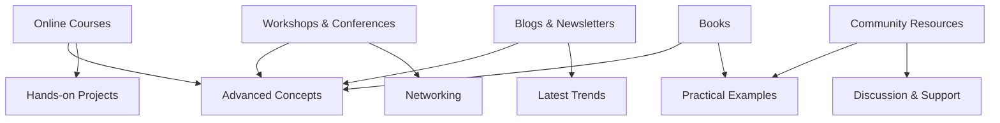

## 31.4. Continuing Education and Resources

As expert software engineers and architects, the journey of mastering Elixir and its design patterns is ongoing. The dynamic nature of technology necessitates continuous learning and adaptation. This section provides a comprehensive guide to resources that will help you stay at the forefront of Elixir development, ensuring you can build scalable, fault-tolerant systems with confidence.

### Advanced Reading Materials

#### Books for Deepening Your Understanding

1. **"Elixir in Action" by Saša Jurić**
   - This book is a must-read for anyone looking to understand Elixir's capabilities in building concurrent and fault-tolerant applications. It covers the language's core concepts and provides practical examples to illustrate how Elixir can be used in real-world scenarios.

2. **"Designing Elixir Systems with OTP" by James Edward Gray II and Bruce A. Tate**
   - This book delves into the OTP framework, which is essential for building robust Elixir applications. It offers insights into designing systems that can handle failures gracefully and scale effectively.

3. **"Programming Elixir ≥ 1.6" by Dave Thomas**
   - A comprehensive guide to Elixir programming, this book covers the language's syntax, idioms, and libraries. It is particularly useful for understanding how to write idiomatic Elixir code.

4. **"The Little Elixir & OTP Guidebook" by Benjamin Tan Wei Hao**
   - This book provides a gentle introduction to Elixir and OTP, focusing on building concurrent applications. It is ideal for those new to OTP or looking to solidify their understanding.

5. **Advanced Functional Programming Literature**
   - Books such as "Functional Programming in Scala" by Paul Chiusano and Rúnar Bjarnason, though not Elixir-specific, offer valuable insights into functional programming paradigms that can be applied in Elixir.

#### Articles and Papers

- **Research Papers on Concurrent System Design**
  - Explore academic papers that discuss the principles of concurrent system design, which can provide a deeper theoretical understanding of the concepts applied in Elixir.

- **Blog Posts and Articles**
  - Follow blogs like "Elixir Radar" and "The Pragmatic Studio" for regular updates and insights into Elixir development.

### Online Courses and Tutorials

#### Platforms Offering Elixir Courses

1. **Udemy**
   - Udemy offers a variety of courses on Elixir, ranging from beginner to advanced levels. Courses often include hands-on projects to reinforce learning.

2. **Pluralsight**
   - Known for its high-quality video content, Pluralsight provides courses on Elixir and related technologies, such as Phoenix and OTP.

3. **Code School (now part of Pluralsight)**
   - Offers interactive courses that allow you to practice Elixir coding directly in your browser.

4. **Coursera and edX**
   - While not as focused on Elixir, these platforms offer courses on functional programming and concurrent systems that can complement your Elixir studies.

#### Specialized Tutorials

- **OTP and Concurrency**
  - Look for tutorials that focus on mastering OTP, as it is crucial for building reliable Elixir applications.

- **Phoenix Framework**
  - Tutorials on Phoenix can help you build web applications and APIs, leveraging Elixir's strengths in handling concurrent connections.

- **Nerves Project**
  - For those interested in IoT, tutorials on Nerves will guide you in building embedded systems with Elixir.

### Workshops and Conferences

#### Key Events to Attend

1. **ElixirConf**
   - The largest conference dedicated to Elixir, offering talks, workshops, and networking opportunities with industry leaders.

2. **Code BEAM**
   - A conference that covers the entire BEAM ecosystem, including Elixir, Erlang, and other BEAM languages.

3. **Local Meetups and Hackathons**
   - Participating in local Elixir meetups and hackathons can provide hands-on experience and the chance to collaborate with other developers.

#### Benefits of Networking

- **Learning from Experts**
  - Conferences and workshops are excellent opportunities to learn from experts and gain insights into the latest trends and best practices.

- **Building Professional Connections**
  - Networking with other professionals can lead to collaborations, job opportunities, and a deeper understanding of the industry.

### Community Resources

#### Forums and Discussion Platforms

1. **Elixir Forum**
   - A vibrant community where you can ask questions, share knowledge, and stay updated on the latest Elixir developments.

2. **Stack Overflow**
   - A valuable resource for finding solutions to specific coding problems and learning from the experiences of others.

3. **Reddit (r/elixir)**
   - A community-driven platform where you can discuss Elixir-related topics and share interesting projects.

#### Blogs and Newsletters

- **Elixir Radar**
  - A weekly newsletter that curates the latest news, articles, and tutorials about Elixir.

- **The Pragmatic Studio Blog**
  - Offers insights and tutorials on Elixir and other programming topics.

### Visualizing Your Learning Path

To help you visualize your learning journey, consider the following diagram that outlines the various resources and how they interconnect to support your continuous education in Elixir:

### Knowledge Check

To reinforce your understanding, consider the following questions:

- What are the key benefits of attending Elixir conferences?
- How can online courses complement your reading materials?
- Why is networking important in the context of professional development?

### Embrace the Journey

Remember, the path to mastering Elixir and its design patterns is a continuous journey. Stay curious, keep experimenting, and leverage the wealth of resources available to you. As you progress, you'll not only enhance your technical skills but also contribute to the vibrant Elixir community.

## Quiz: Continuing Education and Resources



### Which book is recommended for understanding Elixir's capabilities in building concurrent applications?

- [x] "Elixir in Action" by Saša Jurić
- [ ] "Programming Elixir" by Dave Thomas
- [ ] "The Pragmatic Programmer" by Andrew Hunt
- [ ] "Clean Code" by Robert C. Martin

> **Explanation:** "Elixir in Action" by Saša Jurić is specifically recommended for understanding Elixir's capabilities in building concurrent applications.

### What is the primary focus of "Designing Elixir Systems with OTP"?

- [x] Building robust Elixir applications using OTP
- [ ] Learning Elixir syntax
- [ ] Web development with Phoenix
- [ ] Data science with Elixir

> **Explanation:** "Designing Elixir Systems with OTP" focuses on building robust Elixir applications using the OTP framework.

### Which platform offers interactive Elixir courses that allow you to practice coding in your browser?

- [x] Code School (now part of Pluralsight)
- [ ] Coursera
- [ ] edX
- [ ] Khan Academy

> **Explanation:** Code School, now part of Pluralsight, offers interactive Elixir courses that allow you to practice coding in your browser.

### What is a key benefit of attending ElixirConf?

- [x] Networking with industry leaders
- [ ] Learning basic programming concepts
- [ ] Access to free online courses
- [ ] Discounts on Elixir books

> **Explanation:** A key benefit of attending ElixirConf is networking with industry leaders and gaining insights into the latest trends and best practices.

### Which community resource is known for curating the latest news and tutorials about Elixir?

- [x] Elixir Radar
- [ ] Stack Overflow
- [ ] Reddit
- [ ] GitHub

> **Explanation:** Elixir Radar is known for curating the latest news, articles, and tutorials about Elixir.

### What is the focus of the Nerves Project tutorials?

- [x] Building embedded systems with Elixir
- [ ] Web development with Phoenix
- [ ] Data analysis with Elixir
- [ ] Game development with Elixir

> **Explanation:** The Nerves Project tutorials focus on building embedded systems with Elixir.

### Which forum is a vibrant community for discussing Elixir-related topics?

- [x] Elixir Forum
- [ ] JavaScript Forum
- [ ] Python Forum
- [ ] Ruby Forum

> **Explanation:** Elixir Forum is a vibrant community where you can discuss Elixir-related topics and stay updated on the latest developments.

### What is a benefit of networking at workshops and conferences?

- [x] Building professional connections
- [ ] Access to free books
- [ ] Learning basic programming concepts
- [ ] Discounts on software tools

> **Explanation:** Networking at workshops and conferences helps in building professional connections, which can lead to collaborations and job opportunities.

### Which book provides a gentle introduction to Elixir and OTP?

- [x] "The Little Elixir & OTP Guidebook" by Benjamin Tan Wei Hao
- [ ] "Clean Code" by Robert C. Martin
- [ ] "The Pragmatic Programmer" by Andrew Hunt
- [ ] "Design Patterns" by Erich Gamma

> **Explanation:** "The Little Elixir & OTP Guidebook" by Benjamin Tan Wei Hao provides a gentle introduction to Elixir and OTP.

### Is it important to stay updated with the latest trends in Elixir development?

- [x] True
- [ ] False

> **Explanation:** Staying updated with the latest trends in Elixir development is important to ensure you are using the most efficient and effective practices.


