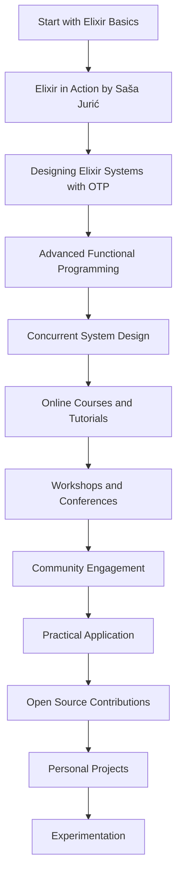

## 31.4. Continuing Education and Resources

As expert software engineers and architects, the journey of mastering Elixir and its design patterns is an ongoing one. Staying updated with the latest advancements and continuously refining your skills is crucial in the ever-evolving landscape of software development. In this section, we will explore various resources and strategies to enhance your expertise in Elixir design patterns, functional programming, and concurrent system design.

### Advanced Reading Materials

To deepen your understanding of Elixir and its ecosystem, consider diving into the following advanced reading materials:

- **"Elixir in Action" by Saša Jurić**: This book provides a comprehensive introduction to Elixir, covering its syntax, semantics, and powerful features. Jurić delves into concurrent programming and the OTP framework, offering practical examples and insights that are invaluable for mastering Elixir.

- **"Designing Elixir Systems with OTP" by James Edward Gray II and Bruce A. Tate**: This book focuses on building robust and scalable systems using Elixir and OTP. It guides you through the process of designing fault-tolerant applications, leveraging the power of OTP behaviors and design patterns.

- **Advanced Functional Programming Literature**: Explore books and papers on advanced functional programming concepts. Understanding the theoretical underpinnings of functional programming will enhance your ability to apply these principles effectively in Elixir.

- **Concurrent System Design**: Investigate literature on concurrent system design to gain insights into building high-performance, scalable applications. Books like "Concurrency in Go" by Katherine Cox-Buday can provide valuable cross-language insights that are applicable to Elixir.

### Online Courses and Tutorials

Online courses and tutorials offer a flexible and interactive way to learn and practice Elixir design patterns:

- **Udemy**: Platforms like Udemy offer a variety of Elixir courses, ranging from beginner to advanced levels. Look for courses that focus on OTP, Phoenix, and building real-world applications.

- **Pluralsight**: Pluralsight provides in-depth courses on Elixir, covering topics such as functional programming, concurrency, and web development with Phoenix. Their structured learning paths can help you progress systematically.

- **Code School**: Although not as extensive as Udemy or Pluralsight, Code School offers specialized tutorials on Elixir and functional programming. These tutorials are great for quick, focused learning sessions.

- **Specialized Tutorials**: Seek out tutorials that delve into specific topics like OTP, Phoenix, and Nerves. Websites like [Elixir School](https://elixirschool.com/) and [Learn Elixir](https://learn-elixir.dev/) offer free resources that are continually updated.

### Workshops and Conferences

Attending workshops and conferences is an excellent way to learn from experts, network with peers, and stay updated with the latest trends:

- **ElixirConf**: As the largest conference dedicated to Elixir, ElixirConf offers a wealth of knowledge through talks, workshops, and networking opportunities. It's an ideal place to learn from the creators and maintainers of Elixir and its libraries.

- **Code BEAM**: This conference focuses on the Erlang and Elixir ecosystems, covering topics like concurrency, distributed systems, and functional programming. It's a great platform to explore the broader BEAM ecosystem.

- **Local Meetups**: Participating in local Elixir meetups can provide valuable insights and foster connections with other developers in your area. These meetups often feature talks, coding sessions, and collaborative projects.

- **Networking Benefits**: Engaging with the community at these events allows you to share experiences, learn from others, and gain new perspectives on solving complex problems.

### Community Resources

The Elixir community is vibrant and supportive, offering numerous resources for learning and collaboration:

- **Elixir Forum**: This is a go-to platform for discussions on Elixir-related topics. It's a great place to ask questions, share knowledge, and connect with other Elixir enthusiasts.

- **Stack Overflow**: Utilize Stack Overflow for quick answers to specific technical questions. The Elixir tag is active, and you'll find a wealth of information from experienced developers.

- **Reddit**: The Elixir subreddit is another valuable resource for news, discussions, and community engagement. It's a more informal platform where you can share projects and insights.

- **Blogs and Newsletters**: Follow blogs and newsletters dedicated to Elixir to stay informed about the latest updates, libraries, and best practices. Some popular ones include [Elixir Radar](https://elixir-radar.com/) and [The Elixir Community](https://elixircommunity.com/).

### Practical Application and Experimentation

To truly master Elixir design patterns, it's essential to apply what you've learned through practical projects and experimentation:

- **Open Source Contributions**: Contributing to open source projects is an excellent way to gain real-world experience and collaborate with other developers. Platforms like GitHub host numerous Elixir projects that welcome contributions.

- **Personal Projects**: Build your own projects to explore different design patterns and architectural styles. This hands-on approach will solidify your understanding and reveal practical challenges and solutions.

- **Experiment with Code**: Modify and extend code examples from this guide and other resources. Experimentation is a powerful way to discover new techniques and deepen your understanding.

### Visualizing Learning Paths

To help you visualize your learning journey, consider the following diagram that outlines a potential path for continuing education in Elixir:

```mermaid
graph TD;
    A[Start with Elixir Basics] --> B["Elixir in Action" by Saša Jurić];
    B --> C["Designing Elixir Systems with OTP"];
    C --> D[Advanced Functional Programming];
    D --> E[Concurrent System Design];
    E --> F[Online Courses and Tutorials];
    F --> G[Workshops and Conferences];
    G --> H[Community Engagement];
    H --> I[Practical Application];
    I --> J[Open Source Contributions];
    J --> K[Personal Projects];
    K --> L[Experimentation];
```

This diagram represents a continuous loop of learning and application, emphasizing the importance of both theoretical knowledge and practical experience.

### References and Links

To supplement your learning, here are some reputable external resources:

- [Elixir School](https://elixirschool.com/): A comprehensive resource for learning Elixir, offering tutorials and guides on various topics.

- [Learn Elixir](https://learn-elixir.dev/): A platform providing free resources and tutorials for learning Elixir.

- [Elixir Radar](https://elixir-radar.com/): A newsletter that curates the latest news, articles, and projects in the Elixir community.

- [The Elixir Community](https://elixircommunity.com/): A blog that shares insights, tutorials, and updates on Elixir and its ecosystem.

### Knowledge Check

To reinforce your learning, consider the following questions and exercises:

- **What are the key benefits of attending Elixir conferences and meetups?**
- **How can contributing to open source projects enhance your Elixir skills?**
- **Experiment with modifying a code example from this guide. What new insights did you gain?**

### Embrace the Journey

Remember, continuing education is a journey, not a destination. As you progress, you'll build more complex and robust systems, leveraging the power of Elixir and its design patterns. Keep experimenting, stay curious, and enjoy the journey!

## Quiz Time!



### Which book provides a comprehensive introduction to Elixir and its powerful features?

- [x] "Elixir in Action" by Saša Jurić
- [ ] "Designing Elixir Systems with OTP" by James Edward Gray II and Bruce A. Tate
- [ ] "Concurrency in Go" by Katherine Cox-Buday
- [ ] "Functional Programming in Scala" by Paul Chiusano and Rúnar Bjarnason

> **Explanation:** "Elixir in Action" by Saša Jurić is known for its comprehensive introduction to Elixir, covering its syntax, semantics, and powerful features.

### What is a key benefit of attending ElixirConf?

- [x] Learning from the creators and maintainers of Elixir
- [ ] Free access to online courses
- [ ] Guaranteed job placement
- [ ] Discounts on Elixir books

> **Explanation:** ElixirConf offers the opportunity to learn from the creators and maintainers of Elixir, providing valuable insights and networking opportunities.

### Which platform offers structured learning paths for Elixir?

- [ ] Code School
- [x] Pluralsight
- [ ] Reddit
- [ ] Elixir Forum

> **Explanation:** Pluralsight offers structured learning paths for Elixir, covering various topics such as functional programming, concurrency, and web development with Phoenix.

### What is a recommended way to gain real-world experience in Elixir?

- [x] Contributing to open source projects
- [ ] Watching YouTube tutorials
- [ ] Reading blog posts
- [ ] Attending webinars

> **Explanation:** Contributing to open source projects is an excellent way to gain real-world experience and collaborate with other developers.

### Which community resource is known for informal discussions and sharing projects?

- [ ] Elixir Forum
- [ ] Stack Overflow
- [x] Reddit
- [ ] Pluralsight

> **Explanation:** Reddit is known for informal discussions and sharing projects, making it a valuable resource for community engagement.

### What is the focus of "Designing Elixir Systems with OTP"?

- [x] Building robust and scalable systems using Elixir and OTP
- [ ] Introduction to Elixir syntax and semantics
- [ ] Advanced functional programming concepts
- [ ] Cross-language insights for concurrent system design

> **Explanation:** "Designing Elixir Systems with OTP" focuses on building robust and scalable systems using Elixir and OTP, guiding readers through the design of fault-tolerant applications.

### Which online resource offers free tutorials on Elixir and functional programming?

- [x] Elixir School
- [ ] Udemy
- [ ] Pluralsight
- [ ] Code BEAM

> **Explanation:** Elixir School offers free resources and tutorials on Elixir and functional programming, making it an accessible platform for learning.

### What is a benefit of participating in local Elixir meetups?

- [x] Fostering connections with other developers
- [ ] Free access to Elixir books
- [ ] Guaranteed job placement
- [ ] Discounts on conference tickets

> **Explanation:** Participating in local Elixir meetups fosters connections with other developers, providing valuable insights and collaborative opportunities.

### What is the purpose of the diagram in the learning path section?

- [x] To visualize a continuous loop of learning and application
- [ ] To compare different programming languages
- [ ] To illustrate the syntax of Elixir
- [ ] To demonstrate the architecture of a web application

> **Explanation:** The diagram in the learning path section is designed to visualize a continuous loop of learning and application, emphasizing the importance of both theoretical knowledge and practical experience.

### True or False: Experimentation is a powerful way to discover new techniques and deepen your understanding.

- [x] True
- [ ] False

> **Explanation:** Experimentation allows you to explore different approaches, discover new techniques, and deepen your understanding of Elixir and its design patterns.


