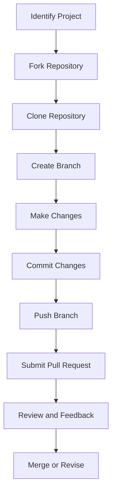

## 32.10. Contributing to Open Source Elixir Projects

Contributing to open source projects is a rewarding way to enhance your skills, gain recognition, and give back to the community. As an expert software engineer or architect, your contributions can have a significant impact on the Elixir ecosystem. This guide will walk you through the process of contributing to open source Elixir projects, from finding the right projects to mastering collaboration practices and making impactful contributions.

### Finding Projects

#### Identifying Projects Seeking Contributors

The first step in contributing to open source is finding the right project. Platforms like GitHub are excellent places to start. Here are some strategies to identify projects that are seeking contributors:

1. **Explore GitHub's Explore Page**: GitHub's Explore page showcases trending repositories and topics. You can filter by language to find Elixir projects.

2. **Search for Good First Issues**: Many repositories label beginner-friendly issues as "good first issue" or "help wanted." Use GitHub's search feature to find these labels in Elixir projects.

3. **Follow Elixir Organizations**: Organizations like `elixir-lang`, `phoenixframework`, and `nerves-project` host numerous repositories. Following these organizations can keep you updated on their projects.

4. **Community Recommendations**: Engage with the Elixir community on forums, mailing lists, or social media platforms like Twitter and Reddit. Community members often recommend projects that need help.

5. **Attend Elixir Meetups and Conferences**: Networking at meetups and conferences can lead to discovering projects that align with your interests and expertise.

#### Evaluating Project Suitability

Once you've identified potential projects, evaluate their suitability for your contribution:

- **Project Activity**: Check the frequency of commits, issues, and pull requests to ensure the project is active.
- **Documentation Quality**: Well-documented projects are easier to contribute to. Look for comprehensive README files, contribution guidelines, and code comments.
- **Community and Maintainer Engagement**: Active engagement from maintainers and a welcoming community are crucial for a positive contribution experience.

### Contribution Workflow

#### Forking Repositories

Forking a repository is the first step in contributing to a project. This creates a personal copy of the repository where you can make changes without affecting the original project.

```bash
# Fork the repository on GitHub and clone it locally
git clone https://github.com/your-username/project-name.git
cd project-name
```

#### Creating Branches

Before making changes, create a new branch. This keeps your work organized and allows you to work on multiple features or fixes simultaneously.

```bash
# Create and switch to a new branch
git checkout -b feature-or-fix-name
```

#### Making Changes and Committing

Make your changes in the new branch. Ensure your code adheres to the project's coding standards and passes all tests.

```bash
# Stage changes for commit
git add .

# Commit changes with a descriptive message
git commit -m "Add feature or fix description"
```

#### Submitting Pull Requests

Once your changes are ready, push the branch to your fork and submit a pull request to the original repository. Provide a clear description of your changes and reference any related issues.

```bash
# Push changes to your fork
git push origin feature-or-fix-name
```

On GitHub, navigate to the original repository and click "New Pull Request." Follow the prompts to submit your pull request.

### Collaboration Practices

#### Communicating with Maintainers

Effective communication with maintainers is key to a successful contribution. Here are some tips:

- **Be Respectful and Professional**: Maintain a respectful tone in all communications.
- **Ask Questions**: If you're unsure about something, don't hesitate to ask for clarification.
- **Provide Context**: When discussing issues or pull requests, provide enough context for maintainers to understand your perspective.

#### Adhering to Coding Standards

Each project may have its own coding standards. Adhering to these standards ensures consistency and quality across the codebase.

- **Follow Style Guides**: Use tools like `mix format` to automatically format your code according to Elixir's style guide.
- **Write Tests**: Ensure your changes are covered by tests. Use `ExUnit` for unit testing and `Credo` for static code analysis.

### Making a Positive Impact

#### Focusing on Meaningful Contributions

To make a positive impact, focus on contributions that add value to the project:

- **Fix Bugs**: Identify and fix bugs to improve the project's stability.
- **Enhance Documentation**: Improve or expand documentation to help other contributors and users.
- **Implement Features**: Work on new features that align with the project's goals and roadmap.

#### Learning and Growth

Contributing to open source is an excellent opportunity for learning and growth:

- **Gain Experience**: Work on real-world projects and gain experience with different technologies and tools.
- **Build a Portfolio**: Showcase your contributions in your portfolio to demonstrate your skills to potential employers.
- **Network with Peers**: Connect with other contributors and expand your professional network.

### Visualizing the Contribution Workflow

Below is a diagram illustrating the typical workflow for contributing to an open source project on GitHub:



**Diagram Description**: This flowchart outlines the steps involved in contributing to an open source project, from identifying a project to submitting a pull request and receiving feedback.

### Try It Yourself

To solidify your understanding, try contributing to an open source Elixir project. Start by finding a project with a "good first issue" label, fork the repository, and follow the contribution workflow outlined above. Experiment with making changes, writing tests, and submitting a pull request.

### References and Links

- [GitHub Explore](https://github.com/explore)
- [Elixir Lang GitHub](https://github.com/elixir-lang)
- [Phoenix Framework GitHub](https://github.com/phoenixframework)
- [Nerves Project GitHub](https://github.com/nerves-project)
- [ExUnit Documentation](https://hexdocs.pm/ex_unit/ExUnit.html)
- [Credo Documentation](https://hexdocs.pm/credo/Credo.html)

### Knowledge Check

- What are some ways to find open source projects to contribute to?
- How do you fork a repository on GitHub?
- Why is it important to adhere to a project's coding standards?
- What are some benefits of contributing to open source projects?

### Embrace the Journey

Remember, contributing to open source is a journey of continuous learning and growth. As you contribute, you'll build valuable skills, connect with like-minded individuals, and make a positive impact on the Elixir community. Keep experimenting, stay curious, and enjoy the journey!

## Quiz: Contributing to Open Source Elixir Projects



### What is the first step in contributing to an open source project on GitHub?

- [x] Forking the repository
- [ ] Creating a branch
- [ ] Submitting a pull request
- [ ] Cloning the repository

> **Explanation:** Forking the repository is the first step, as it creates a personal copy of the project where you can make changes.

### Which label should you look for to find beginner-friendly issues?

- [x] good first issue
- [ ] critical
- [ ] enhancement
- [ ] bug

> **Explanation:** The "good first issue" label is commonly used to identify beginner-friendly issues.

### What tool can you use to automatically format your Elixir code?

- [x] mix format
- [ ] ExUnit
- [ ] Dialyzer
- [ ] Credo

> **Explanation:** `mix format` is used to format Elixir code according to the language's style guide.

### Why is it important to write tests for your contributions?

- [x] To ensure code quality and functionality
- [ ] To increase the number of commits
- [ ] To make the repository larger
- [ ] To avoid writing documentation

> **Explanation:** Writing tests ensures that your contributions maintain code quality and functionality.

### What is a benefit of contributing to open source projects?

- [x] Gaining experience and recognition
- [ ] Reducing your workload
- [x] Building a professional network
- [ ] Avoiding collaboration

> **Explanation:** Contributing to open source projects helps you gain experience, recognition, and build a professional network.

### What should you do if you're unsure about a project's coding standards?

- [x] Ask the maintainers for clarification
- [ ] Ignore the standards
- [ ] Make up your own standards
- [ ] Avoid contributing

> **Explanation:** If you're unsure about coding standards, it's best to ask the maintainers for clarification.

### How can you find projects that align with your interests?

- [x] Follow Elixir organizations on GitHub
- [ ] Only contribute to trending projects
- [x] Engage with the Elixir community
- [ ] Randomly select projects

> **Explanation:** Following Elixir organizations and engaging with the community can help you find projects that align with your interests.

### What is the purpose of creating a branch before making changes?

- [x] To organize work and allow multiple features
- [ ] To delete the original code
- [ ] To avoid using GitHub
- [ ] To make the repository private

> **Explanation:** Creating a branch helps organize work and allows you to work on multiple features or fixes simultaneously.

### What is the role of a pull request in the contribution workflow?

- [x] To propose changes to the original repository
- [ ] To delete the repository
- [ ] To merge branches automatically
- [ ] To create a new repository

> **Explanation:** A pull request is used to propose changes to the original repository for review and merging.

### Contributing to open source projects can help you build a portfolio.

- [x] True
- [ ] False

> **Explanation:** True. Contributing to open source projects allows you to showcase your work and skills, which can be included in your professional portfolio.


