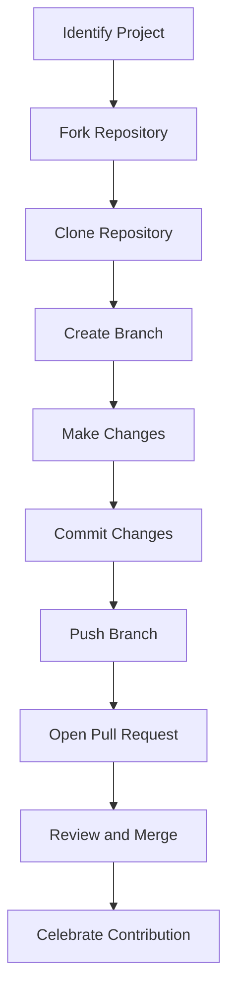

## 32.10. Contributing to Open Source Elixir Projects

Contributing to open source projects is a rewarding endeavor that not only enhances your skills but also helps you build a reputation within the developer community. In this guide, we will explore how you can contribute to open source Elixir projects, from finding the right projects to making meaningful contributions and growing as a developer.

### Finding Projects

The first step in contributing to open source Elixir projects is identifying projects that align with your interests and skills. Here are some strategies to find suitable projects:

#### Identifying Projects on GitHub

GitHub is the most popular platform for open source projects. Here's how you can find Elixir projects seeking contributors:

- **Explore GitHub Topics**: Visit [GitHub Topics](https://github.com/topics/elixir) and search for "Elixir" to find repositories tagged with Elixir.
- **Check the "Help Wanted" Label**: Many repositories use labels like "help wanted" or "good first issue" to indicate tasks that are suitable for new contributors.
- **Follow Elixir Organizations**: Organizations like [elixir-lang](https://github.com/elixir-lang) or [phoenixframework](https://github.com/phoenixframework) often have repositories that welcome contributions.

#### Using Other Platforms

While GitHub is the most prominent, other platforms like GitLab and Bitbucket also host Elixir projects. Explore these platforms to find additional opportunities.

### Contribution Workflow

Once you've identified a project, understanding the contribution workflow is crucial. Here's a typical workflow for contributing to open source projects:

#### Forking and Cloning Repositories

- **Fork the Repository**: Create a personal copy of the project repository on GitHub by clicking the "Fork" button.
- **Clone the Fork**: Clone your forked repository to your local machine using the command:
  ```bash
  git clone https://github.com/your-username/repository-name.git
  ```

#### Creating Branches

- **Create a New Branch**: It's best practice to create a new branch for each feature or bug fix you work on. Use a descriptive name for the branch:
  ```bash
  git checkout -b feature/your-feature-name
  ```

#### Making Changes and Committing

- **Make Changes**: Implement your changes, ensuring they adhere to the project's coding standards.
- **Commit Changes**: Commit your changes with a meaningful commit message:
  ```bash
  git commit -m "Add feature: description of feature"
  ```

#### Submitting Pull Requests

- **Push Your Branch**: Push your branch to your forked repository:
  ```bash
  git push origin feature/your-feature-name
  ```
- **Open a Pull Request**: Navigate to the original repository and open a pull request from your branch. Provide a clear description of the changes and any relevant context.

### Collaboration Practices

Effective collaboration is key to successful contributions. Here are some practices to follow:

#### Communicating with Maintainers

- **Engage Early**: Before starting work on an issue, comment on it to express your interest and ask any clarifying questions.
- **Be Respectful**: Remember that maintainers are often volunteers. Be respectful and patient in your communications.

#### Adhering to Coding Standards

- **Follow Guidelines**: Most projects have a CONTRIBUTING.md file or similar documentation outlining coding standards. Ensure you follow these guidelines.
- **Write Tests**: If the project includes tests, write tests for your changes to ensure they work as expected.

### Making a Positive Impact

Focus on contributions that add real value to the project. Here are some ways to make a positive impact:

#### Addressing Issues

- **Fix Bugs**: Start by fixing bugs, especially those labeled as "good first issue."
- **Enhance Documentation**: Improving documentation is a valuable contribution that can help other developers.

#### Adding Features

- **Propose Features**: If you have an idea for a new feature, discuss it with the maintainers before starting work.
- **Implement Features**: Once approved, implement the feature, ensuring it aligns with the project's goals.

### Learning and Growth

Contributing to open source projects is an excellent way to learn and grow as a developer:

#### Gaining Experience

- **Hands-On Practice**: Working on real-world projects provides hands-on experience with Elixir and its ecosystem.
- **Exposure to Best Practices**: You'll learn best practices from experienced developers and see how large projects are structured.

#### Building a Reputation

- **Recognition**: Regular contributions can lead to recognition within the community, enhancing your professional reputation.
- **Networking**: Engaging with other contributors and maintainers can expand your professional network.

### Try It Yourself

Let's put this into practice. Find an Elixir project on GitHub, fork it, and try fixing a small bug or enhancing the documentation. Experiment with the workflow outlined above, and don't hesitate to reach out to the community for help.

### Visualizing the Contribution Workflow

Below is a diagram illustrating the typical workflow for contributing to open source projects:


```mermaid
graph TD;
    A[Identify Project] --> B[Fork Repository];
    B --> C[Clone Repository];
    C --> D[Create Branch];
    D --> E[Make Changes];
    E --> F[Commit Changes];
    F --> G[Push Branch];
    G --> H[Open Pull Request];
    H --> I[Review and Merge];
    I --> J[Celebrate Contribution];
```

This diagram provides a visual representation of the steps involved in the contribution process, from identifying a project to celebrating your contribution.

### References and Links

- [GitHub Topics: Elixir](https://github.com/topics/elixir)
- [Elixir Lang GitHub](https://github.com/elixir-lang)
- [Phoenix Framework GitHub](https://github.com/phoenixframework)
- [GitHub Documentation](https://docs.github.com/en)

### Knowledge Check

- **What is the first step in contributing to an open source project?**
- **Why is it important to create a new branch for each feature or bug fix?**
- **How can you communicate effectively with project maintainers?**
- **What are some ways to make a positive impact on a project?**
- **How can contributing to open source projects help you grow as a developer?**

### Embrace the Journey

Contributing to open source projects is a journey of learning, collaboration, and growth. By engaging with the community, you not only improve your skills but also contribute to the collective knowledge and success of the Elixir ecosystem. Remember, every contribution, no matter how small, makes a difference. Keep experimenting, stay curious, and enjoy the journey!

## Quiz Time!



### What is the first step in contributing to an open source Elixir project?

- [x] Identify a project that aligns with your interests and skills.
- [ ] Fork the repository.
- [ ] Create a new branch.
- [ ] Open a pull request.

> **Explanation:** The first step is to identify a project that aligns with your interests and skills, as this will ensure you are motivated and capable of contributing effectively.

### Why is it important to create a new branch for each feature or bug fix?

- [x] It helps keep changes organized and isolated.
- [ ] It allows you to delete the main branch.
- [ ] It prevents other contributors from seeing your changes.
- [ ] It automatically merges changes into the main branch.

> **Explanation:** Creating a new branch for each feature or bug fix helps keep changes organized and isolated, making it easier to manage and review.

### How can you communicate effectively with project maintainers?

- [x] Engage early and be respectful.
- [ ] Only communicate when you have completed your work.
- [ ] Demand immediate responses to your questions.
- [ ] Avoid asking questions to not bother them.

> **Explanation:** Engaging early and being respectful in communications helps build a positive relationship with maintainers, who are often volunteers.

### What are some ways to make a positive impact on a project?

- [x] Fix bugs and enhance documentation.
- [ ] Delete unnecessary files without permission.
- [ ] Rewrite the entire codebase.
- [ ] Ignore existing coding standards.

> **Explanation:** Fixing bugs and enhancing documentation are valuable contributions that can significantly improve a project.

### How can contributing to open source projects help you grow as a developer?

- [x] Provides hands-on experience and exposure to best practices.
- [ ] Guarantees immediate job offers.
- [ ] Ensures you become a project maintainer.
- [ ] Allows you to work in isolation without feedback.

> **Explanation:** Contributing to open source projects provides hands-on experience and exposure to best practices, which are essential for growth as a developer.

### What should you do before starting work on an issue?

- [x] Comment on the issue to express interest and ask clarifying questions.
- [ ] Start working immediately without any communication.
- [ ] Wait for someone else to fix it.
- [ ] Close the issue if you think it's not important.

> **Explanation:** Commenting on the issue to express interest and ask clarifying questions ensures you understand the task and have the maintainer's approval.

### What is the purpose of a pull request?

- [x] To propose your changes for review and merging into the main project.
- [ ] To delete your forked repository.
- [ ] To automatically merge changes without review.
- [ ] To prevent others from contributing to the project.

> **Explanation:** A pull request proposes your changes for review and merging into the main project, allowing maintainers and other contributors to provide feedback.

### Why is it important to follow a project's coding standards?

- [x] It ensures consistency and quality across the codebase.
- [ ] It allows you to write code in any style you prefer.
- [ ] It makes your code invisible to other contributors.
- [ ] It automatically fixes all bugs in the project.

> **Explanation:** Following a project's coding standards ensures consistency and quality across the codebase, making it easier for everyone to understand and maintain.

### How can you find Elixir projects seeking contributors on GitHub?

- [x] Explore GitHub Topics and check for "help wanted" labels.
- [ ] Only contribute to projects with no issues.
- [ ] Look for projects without any documentation.
- [ ] Search for projects with the most stars.

> **Explanation:** Exploring GitHub Topics and checking for "help wanted" labels helps you find projects that are actively seeking contributors.

### True or False: Contributing to open source projects guarantees immediate job offers.

- [ ] True
- [x] False

> **Explanation:** While contributing to open source projects can enhance your skills and reputation, it does not guarantee immediate job offers.


