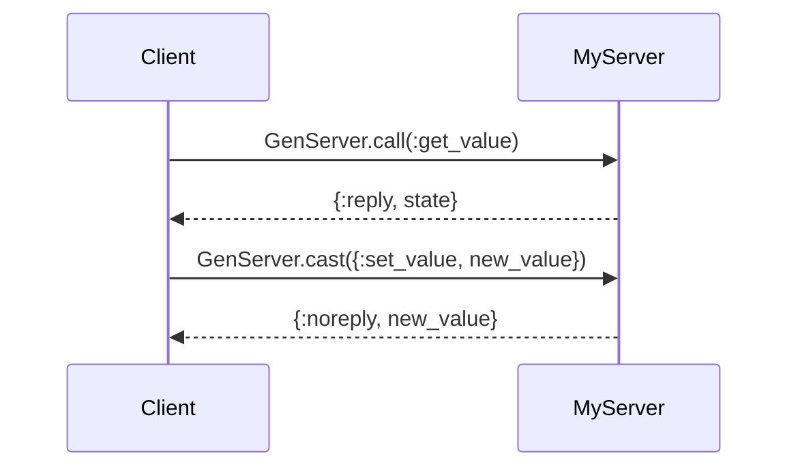

## 32.2. Bibliography and Further Reading

In this section, we provide a comprehensive list of resources for further reading and exploration of Elixir design patterns. These resources include books, academic papers, articles, and official documentation that will deepen your understanding of Elixir, functional programming, and software architecture.

### Books

Books are an invaluable resource for gaining in-depth knowledge and insights into Elixir and its ecosystem. Here are some highly recommended books:

- **"Programming Elixir ≥ 1.6" by Dave Thomas**  
  This book is a must-read for anyone looking to master Elixir. It covers the language's fundamentals and advanced topics, including concurrency and OTP, with practical examples and exercises.

- **"The Little Elixir & OTP Guidebook" by Benjamin Tan Wei Hao**  
  This guidebook provides a concise introduction to Elixir and OTP, focusing on building concurrent and fault-tolerant applications. It is ideal for developers transitioning from other programming languages.

- **"Designing Elixir Systems with OTP" by James Edward Gray II and Bruce Tate**  
  This book delves into the design and architecture of Elixir systems using OTP. It provides practical insights into building scalable and maintainable applications.

- **"Elixir in Action" by Saša Jurić**  
  This book offers a comprehensive overview of Elixir, focusing on real-world applications and best practices. It covers functional programming concepts, concurrency, and fault tolerance.

- **"Metaprogramming Elixir" by Chris McCord**  
  This book explores the powerful metaprogramming capabilities of Elixir, providing insights into macros and compile-time code generation.

### Academic Papers

Academic papers provide a deeper understanding of the theoretical foundations of functional programming, concurrency, and distributed systems. Here are some notable papers:

- **"A History of Erlang" by Joe Armstrong**  
  This paper provides a historical perspective on the development of Erlang, the language that inspired Elixir. It discusses the design decisions and challenges faced during its creation.

- **"The Actor Model: A Foundation for Distributed Systems" by Carl Hewitt**  
  This seminal paper introduces the Actor Model, a key concept in concurrent and distributed systems, which influences Elixir's design.

- **"Concurrency Oriented Programming in Erlang" by Joe Armstrong**  
  This paper explores the principles of concurrency-oriented programming in Erlang, which are directly applicable to Elixir.

- **"Functional Programming with Elixir" by José Valim**  
  This paper discusses the functional programming paradigm in Elixir, highlighting its benefits and unique features.

### Articles and Blog Posts

Articles and blog posts offer practical insights and real-world examples of Elixir design patterns and best practices. Here are some curated articles:

- **"Building Scalable Systems with Elixir" by Chris McCord**  
  This article explores the architectural patterns and techniques for building scalable systems using Elixir and the Phoenix framework.

- **"Elixir's Concurrency Model: A Deep Dive" by Saša Jurić**  
  This blog post provides an in-depth analysis of Elixir's concurrency model, including processes, message passing, and fault tolerance.

- **"Functional Design Patterns in Elixir" by Ben Marx**  
  This article discusses common functional design patterns in Elixir, with examples and use cases.

- **"Exploring OTP Behaviours in Elixir" by James Fish**  
  This post delves into OTP behaviours, such as GenServer and Supervisor, and their role in building robust applications.

### Documentation

Official documentation is an essential resource for understanding the intricacies of Elixir and its ecosystem. Here are some key documentation links:

- **[Elixir Official Documentation](https://elixir-lang.org/docs.html)**  
  The official Elixir documentation provides comprehensive coverage of the language's features, modules, and libraries.

- **[Erlang Official Documentation](https://www.erlang.org/docs)**  
  Since Elixir runs on the Erlang VM, the Erlang documentation is a valuable resource for understanding the underlying platform.

- **[Phoenix Framework Documentation](https://hexdocs.pm/phoenix/overview.html)**  
  The Phoenix framework documentation offers detailed information on building web applications with Elixir.

- **[Hex Documentation](https://hexdocs.pm/)**  
  Hex is the package manager for the Erlang ecosystem, and its documentation provides insights into managing dependencies and libraries.

### Code Examples

To illustrate the concepts discussed in the resources above, let's explore a simple Elixir code example that demonstrates the use of OTP behaviours:

```elixir
defmodule MyServer do
  use GenServer

  # Client API

  def start_link(initial_value) do
    GenServer.start_link(__MODULE__, initial_value, name: __MODULE__)
  end

  def get_value do
    GenServer.call(__MODULE__, :get_value)
  end

  def set_value(new_value) do
    GenServer.cast(__MODULE__, {:set_value, new_value})
  end

  # Server Callbacks

  def init(initial_value) do
    {:ok, initial_value}
  end

  def handle_call(:get_value, _from, state) do
    {:reply, state, state}
  end

  def handle_cast({:set_value, new_value}, _state) do
    {:noreply, new_value}
  end
end

# Start the server
{:ok, _pid} = MyServer.start_link(0)

# Interact with the server
MyServer.set_value(42)
IO.puts("Current value: #{MyServer.get_value()}")
```

In this example, we define a simple GenServer that maintains a state and provides functions to get and set its value. The `start_link/1` function initializes the server, while `get_value/0` and `set_value/1` interact with it. The server's state is managed through the `handle_call/3` and `handle_cast/2` callbacks.

### Visualizing Elixir's Concurrency Model

To better understand Elixir's concurrency model, let's visualize the interaction between processes using a Mermaid.js sequence diagram:



This diagram illustrates the message-passing mechanism between a client and a GenServer. The client sends synchronous (`call`) and asynchronous (`cast`) messages to the server, which processes them and updates its state accordingly.

### References and Links

For further exploration, here are some additional resources and links:

- **[Elixir Forum](https://elixirforum.com/)**: A community forum for discussing Elixir-related topics and sharing knowledge.
- **[Elixir School](https://elixirschool.com/)**: A free, open-source curriculum for learning Elixir.
- **[Awesome Elixir](https://github.com/h4cc/awesome-elixir)**: A curated list of Elixir libraries, tools, and resources.
- **[Erlang and Elixir Factory](https://www.erlang-factory.com/)**: Conferences and events focused on Erlang and Elixir technologies.

### Knowledge Check

To reinforce your understanding, consider the following questions:

1. What are the key benefits of using OTP behaviours in Elixir?
2. How does Elixir's concurrency model differ from traditional threading models?
3. What role does the Actor Model play in Elixir's design?
4. How can metaprogramming enhance the flexibility of Elixir applications?
5. What are some common functional design patterns used in Elixir?

### Embrace the Journey

Remember, this is just the beginning of your journey with Elixir design patterns. As you explore these resources, keep experimenting, stay curious, and enjoy the process of learning and building with Elixir. The community is vibrant and supportive, so don't hesitate to engage with others and share your experiences.

## Quiz: Bibliography and Further Reading



### Which book is recommended for mastering Elixir's concurrency and OTP?

- [x] "Programming Elixir ≥ 1.6" by Dave Thomas
- [ ] "The Little Elixir & OTP Guidebook" by Benjamin Tan Wei Hao
- [ ] "Designing Elixir Systems with OTP" by James Edward Gray II and Bruce Tate
- [ ] "Metaprogramming Elixir" by Chris McCord

> **Explanation:** "Programming Elixir ≥ 1.6" by Dave Thomas covers concurrency and OTP in depth.

### What is the focus of "The Little Elixir & OTP Guidebook"?

- [ ] Metaprogramming in Elixir
- [x] Building concurrent and fault-tolerant applications
- [ ] Designing scalable systems
- [ ] Functional programming concepts

> **Explanation:** "The Little Elixir & OTP Guidebook" focuses on building concurrent and fault-tolerant applications.

### Which paper introduces the Actor Model?

- [ ] "A History of Erlang" by Joe Armstrong
- [x] "The Actor Model: A Foundation for Distributed Systems" by Carl Hewitt
- [ ] "Concurrency Oriented Programming in Erlang" by Joe Armstrong
- [ ] "Functional Programming with Elixir" by José Valim

> **Explanation:** "The Actor Model: A Foundation for Distributed Systems" by Carl Hewitt introduces the Actor Model.

### What is the main topic of the article "Elixir's Concurrency Model: A Deep Dive"?

- [ ] Metaprogramming techniques
- [ ] Functional design patterns
- [x] Elixir's concurrency model
- [ ] Building scalable systems

> **Explanation:** The article "Elixir's Concurrency Model: A Deep Dive" focuses on Elixir's concurrency model.

### Which documentation link provides information on managing dependencies in Elixir?

- [ ] Elixir Official Documentation
- [x] Hex Documentation
- [ ] Phoenix Framework Documentation
- [ ] Erlang Official Documentation

> **Explanation:** Hex Documentation provides insights into managing dependencies in Elixir.

### What does the sequence diagram illustrate in the article?

- [ ] The process of metaprogramming
- [x] Interaction between a client and a GenServer
- [ ] Building scalable systems
- [ ] Functional design patterns

> **Explanation:** The sequence diagram illustrates the interaction between a client and a GenServer.

### Which resource is a community forum for discussing Elixir-related topics?

- [x] Elixir Forum
- [ ] Elixir School
- [ ] Awesome Elixir
- [ ] Erlang and Elixir Factory

> **Explanation:** Elixir Forum is a community forum for discussing Elixir-related topics.

### What is the main focus of "Metaprogramming Elixir" by Chris McCord?

- [ ] Concurrency and OTP
- [ ] Building scalable systems
- [x] Metaprogramming capabilities
- [ ] Functional programming concepts

> **Explanation:** "Metaprogramming Elixir" by Chris McCord focuses on metaprogramming capabilities.

### Which book offers a comprehensive overview of Elixir with real-world applications?

- [ ] "Programming Elixir ≥ 1.6" by Dave Thomas
- [ ] "The Little Elixir & OTP Guidebook" by Benjamin Tan Wei Hao
- [x] "Elixir in Action" by Saša Jurić
- [ ] "Designing Elixir Systems with OTP" by James Edward Gray II and Bruce Tate

> **Explanation:** "Elixir in Action" by Saša Jurić offers a comprehensive overview of Elixir with real-world applications.

### True or False: "Designing Elixir Systems with OTP" focuses on metaprogramming.

- [ ] True
- [x] False

> **Explanation:** "Designing Elixir Systems with OTP" focuses on the design and architecture of Elixir systems using OTP, not metaprogramming.


