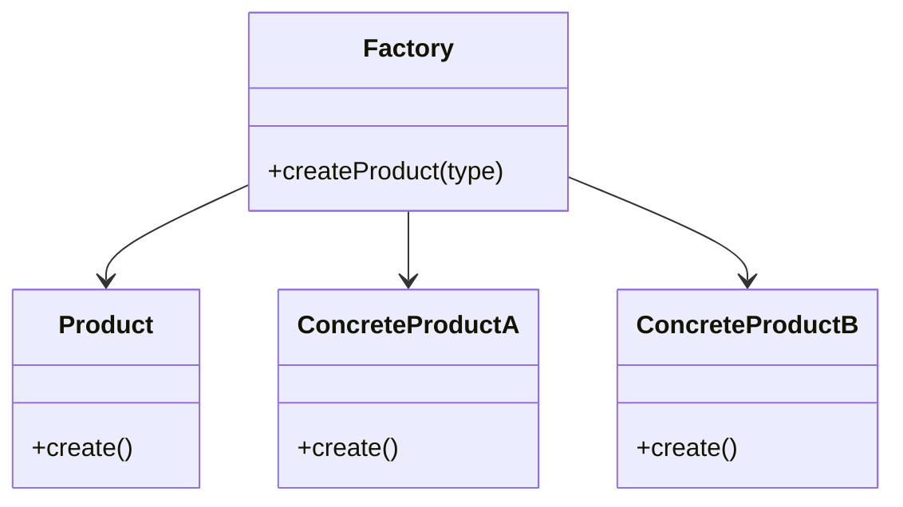
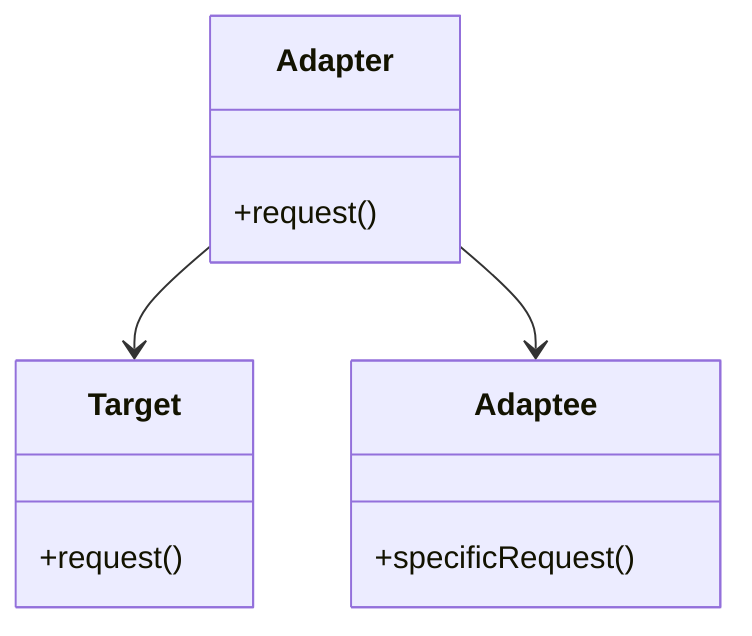
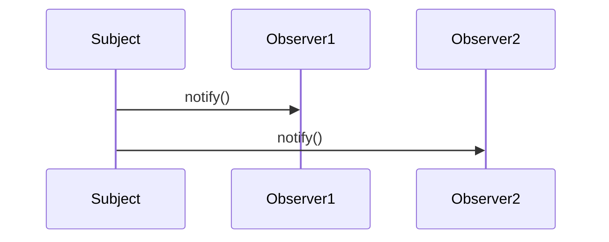

## 32.3. Design Pattern Reference Cheat Sheet

In this section, we provide a comprehensive reference guide to Elixir design patterns. This cheat sheet is designed to help expert software engineers and architects quickly recall the essential aspects of each pattern, understand their implementation in Elixir, and visualize their structures. Whether you're designing scalable systems or optimizing existing applications, this guide will serve as a valuable resource.

### Summarized Patterns

#### Creational Patterns

**Factory Pattern**
- **Intent:** Create objects without specifying the exact class of object that will be created.
- **Key Participants:** Factory module, product modules.
- **Applicability:** Use when a system should be independent of how its products are created.
- **Elixir Unique Features:** Use modules and functions to encapsulate object creation logic.

**Builder Pattern**
- **Intent:** Separate the construction of a complex object from its representation.
- **Key Participants:** Builder module, director module.
- **Applicability:** Use when the construction process must allow different representations.
- **Elixir Unique Features:** Leverage functional approaches to build complex data structures.

**Singleton Pattern**
- **Intent:** Ensure a class has only one instance and provide a global point of access to it.
- **Key Participants:** Singleton module.
- **Applicability:** Use when exactly one instance of a class is needed.
- **Elixir Unique Features:** Use application environment or process registry for singleton behavior.

#### Structural Patterns

**Adapter Pattern**
- **Intent:** Convert the interface of a class into another interface clients expect.
- **Key Participants:** Adapter module, adaptee module.
- **Applicability:** Use when you want to use an existing class, and its interface does not match the one you need.
- **Elixir Unique Features:** Utilize protocols and behaviors to adapt interfaces.

**Proxy Pattern**
- **Intent:** Provide a surrogate or placeholder for another object to control access to it.
- **Key Participants:** Proxy module, real subject module.
- **Applicability:** Use when you need to control access to an object.
- **Elixir Unique Features:** Implement using GenServers to manage state and access.

**Decorator Pattern**
- **Intent:** Attach additional responsibilities to an object dynamically.
- **Key Participants:** Component module, decorator module.
- **Applicability:** Use to add responsibilities to individual objects without affecting others.
- **Elixir Unique Features:** Use function wrapping to add behavior.

#### Behavioral Patterns

**Strategy Pattern**
- **Intent:** Define a family of algorithms, encapsulate each one, and make them interchangeable.
- **Key Participants:** Strategy module, context module.
- **Applicability:** Use when you need to switch between different algorithms dynamically.
- **Elixir Unique Features:** Implement using higher-order functions.

**Observer Pattern**
- **Intent:** Define a one-to-many dependency between objects so that when one object changes state, all its dependents are notified.
- **Key Participants:** Subject module, observer module.
- **Applicability:** Use when an object should notify other objects without knowing who they are.
- **Elixir Unique Features:** Use PubSub and Phoenix.PubSub for event broadcasting.

**Command Pattern**
- **Intent:** Encapsulate a request as an object, thereby allowing for parameterization of clients with queues, requests, and operations.
- **Key Participants:** Command module, invoker module.
- **Applicability:** Use to parameterize objects with operations.
- **Elixir Unique Features:** Use message passing for command execution.

### Implementation Tips

- **Leverage Elixir's Concurrency:** Many patterns can be enhanced by utilizing Elixir's lightweight processes and message-passing capabilities.
- **Use Pattern Matching:** Elixir's pattern matching can simplify the implementation of many design patterns by making code more readable and expressive.
- **Embrace Immutability:** Design patterns in Elixir should take advantage of immutable data structures to ensure thread safety and predictability.
- **Utilize Protocols and Behaviors:** These features can help implement polymorphic behavior and interface adaptation in a functional way.

### Comparison Table

| Pattern Name     | Category      | Intent                                                                 | Use Case                                                                 |
|------------------|---------------|------------------------------------------------------------------------|--------------------------------------------------------------------------|
| Factory          | Creational    | Create objects without specifying the exact class                      | When a system should be independent of how its products are created      |
| Builder          | Creational    | Separate construction of a complex object from its representation      | When the construction process must allow different representations       |
| Singleton        | Creational    | Ensure a class has only one instance                                   | When exactly one instance of a class is needed                           |
| Adapter          | Structural    | Convert the interface of a class into another interface clients expect | When you want to use an existing class, and its interface does not match |
| Proxy            | Structural    | Provide a surrogate or placeholder for another object                  | When you need to control access to an object                             |
| Decorator        | Structural    | Attach additional responsibilities to an object dynamically            | To add responsibilities to individual objects without affecting others   |
| Strategy         | Behavioral    | Define a family of algorithms, encapsulate each one                    | When you need to switch between different algorithms dynamically         |
| Observer         | Behavioral    | Define a one-to-many dependency between objects                        | When an object should notify other objects without knowing who they are  |
| Command          | Behavioral    | Encapsulate a request as an object                                     | To parameterize objects with operations                                  |

### Visual Aids

#### Factory Pattern Diagram

*Diagram 1: Factory Pattern Structure*

#### Adapter Pattern Diagram

*Diagram 2: Adapter Pattern Structure*

#### Observer Pattern Diagram

*Diagram 3: Observer Pattern Notification Flow*

### Design Considerations

- **When to Use Patterns:** Consider the complexity and scalability of your application. Patterns should simplify your design, not complicate it.
- **Avoid Overengineering:** Use patterns judiciously. Overuse can lead to unnecessary complexity.
- **Elixir's Unique Features:** Take advantage of Elixir's strengths, such as concurrency and immutability, when implementing patterns.

### Elixir Unique Features

- **Concurrency Model:** Elixir's actor model and lightweight processes make it ideal for implementing patterns that require concurrent operations.
- **Pattern Matching:** This feature simplifies many design patterns by allowing more expressive and concise code.
- **Immutability:** Ensures that data remains consistent across concurrent operations, reducing the risk of race conditions.

### Differences and Similarities

- **Factory vs. Builder:** Both are creational patterns, but the Factory pattern focuses on object creation, while the Builder pattern focuses on constructing complex objects step by step.
- **Adapter vs. Proxy:** Both are structural patterns, but the Adapter pattern changes the interface of an existing object, while the Proxy pattern controls access to it.
- **Strategy vs. Command:** Both are behavioral patterns, but the Strategy pattern defines a family of algorithms, while the Command pattern encapsulates a request as an object.

### Try It Yourself

To deepen your understanding, try modifying the code examples provided. For instance, implement a new product type in the Factory pattern or add a new observer in the Observer pattern. Experiment with different scenarios to see how these patterns can be adapted to various use cases.

## Quiz: Design Pattern Reference Cheat Sheet



### Which pattern is used to create objects without specifying the exact class?

- [x] Factory Pattern
- [ ] Builder Pattern
- [ ] Singleton Pattern
- [ ] Adapter Pattern

> **Explanation:** The Factory Pattern is used to create objects without specifying the exact class of object that will be created.

### What is the main intent of the Adapter Pattern?

- [ ] Control access to an object
- [x] Convert the interface of a class into another interface clients expect
- [ ] Attach additional responsibilities to an object
- [ ] Define a family of algorithms

> **Explanation:** The Adapter Pattern is used to convert the interface of a class into another interface that clients expect.

### Which pattern ensures a class has only one instance?

- [ ] Factory Pattern
- [ ] Builder Pattern
- [x] Singleton Pattern
- [ ] Proxy Pattern

> **Explanation:** The Singleton Pattern ensures that a class has only one instance and provides a global point of access to it.

### In Elixir, which feature is commonly used to implement the Strategy Pattern?

- [ ] GenServer
- [ ] Protocols
- [x] Higher-order functions
- [ ] Supervisors

> **Explanation:** Higher-order functions are commonly used in Elixir to implement the Strategy Pattern by allowing algorithms to be passed as parameters.

### What is the key participant in the Observer Pattern?

- [x] Subject module
- [ ] Command module
- [ ] Adapter module
- [ ] Factory module

> **Explanation:** The Subject module is a key participant in the Observer Pattern, responsible for notifying observers of state changes.

### Which pattern is used to encapsulate a request as an object?

- [ ] Strategy Pattern
- [x] Command Pattern
- [ ] Observer Pattern
- [ ] Decorator Pattern

> **Explanation:** The Command Pattern encapsulates a request as an object, allowing for parameterization of clients with queues, requests, and operations.

### What is a common use case for the Proxy Pattern?

- [ ] Convert interfaces
- [x] Control access to an object
- [ ] Create complex objects
- [ ] Notify observers

> **Explanation:** The Proxy Pattern is used to control access to an object by providing a surrogate or placeholder for it.

### Which pattern is best suited for adding responsibilities to individual objects dynamically?

- [ ] Factory Pattern
- [ ] Adapter Pattern
- [ ] Observer Pattern
- [x] Decorator Pattern

> **Explanation:** The Decorator Pattern is used to attach additional responsibilities to an object dynamically without affecting other objects.

### Which Elixir feature is particularly useful for implementing polymorphic behavior?

- [ ] GenServer
- [x] Protocols
- [ ] Supervisors
- [ ] Higher-order functions

> **Explanation:** Protocols in Elixir are particularly useful for implementing polymorphic behavior by allowing different implementations for different data types.

### True or False: The Builder Pattern is used to ensure a class has only one instance.

- [ ] True
- [x] False

> **Explanation:** False. The Builder Pattern is used to separate the construction of a complex object from its representation, not to ensure a class has only one instance.



Remember, this is just the beginning. As you progress, you'll build more complex and interactive systems. Keep experimenting, stay curious, and enjoy the journey!
