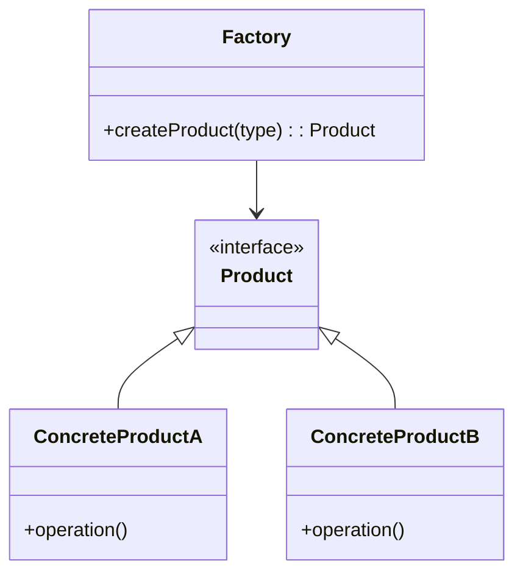
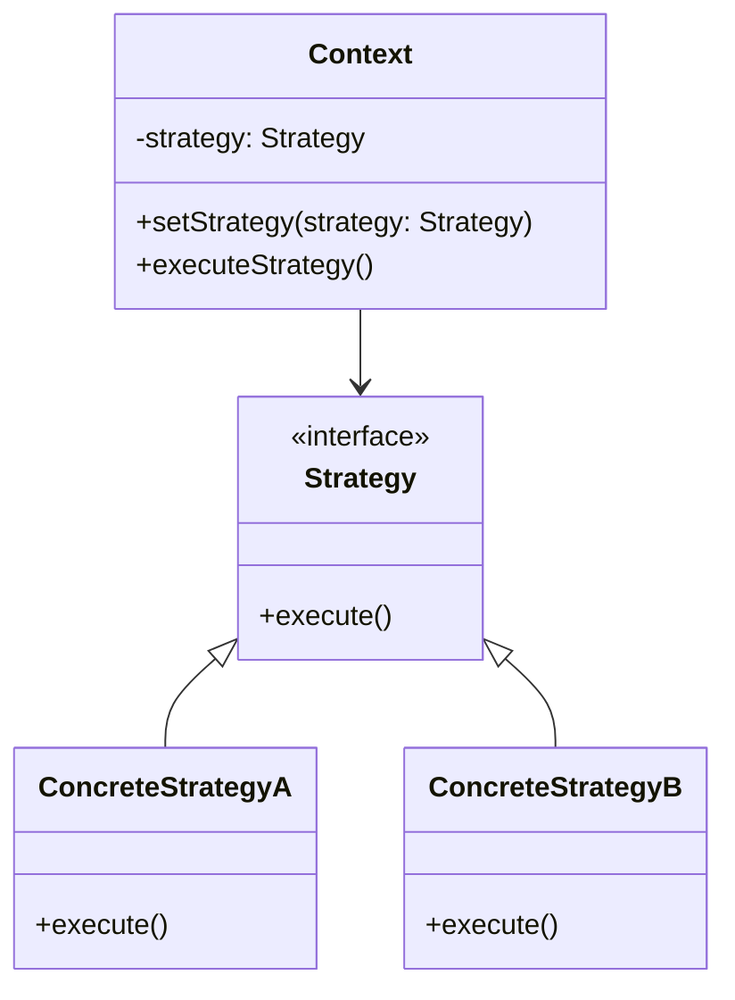

## 32.3. Design Pattern Reference Cheat Sheet

Design patterns are essential tools in a software engineer's toolkit, especially when working with a powerful language like Elixir. This cheat sheet serves as a quick reference guide to help you navigate the world of Elixir design patterns. We'll cover concise descriptions of each pattern, implementation tips, a comparison table, and visual aids to enhance your understanding.

### Summarized Patterns

#### Creational Patterns

**Factory Pattern**
- **Intent:** Create objects without specifying the exact class.
- **Key Participants:** Factory module, product modules.
- **Applicability:** Use when you need flexibility in object creation.
- **Elixir Unique Features:** Leverage pattern matching to determine the product type.

**Builder Pattern**
- **Intent:** Separate the construction of a complex object from its representation.
- **Key Participants:** Builder module, director module.
- **Applicability:** Ideal for constructing complex objects step-by-step.
- **Elixir Unique Features:** Use functional pipelines to build objects incrementally.

**Singleton Pattern**
- **Intent:** Ensure a class has only one instance.
- **Key Participants:** Singleton module.
- **Applicability:** Use when a single instance is needed across the system.
- **Elixir Unique Features:** Utilize Elixir's application environment for singleton state.

#### Structural Patterns

**Adapter Pattern**
- **Intent:** Convert the interface of a class into another interface clients expect.
- **Key Participants:** Adapter module, adaptee module.
- **Applicability:** Use when you need to integrate incompatible interfaces.
- **Elixir Unique Features:** Use protocols and behaviors to define adaptable interfaces.

**Proxy Pattern**
- **Intent:** Provide a surrogate or placeholder for another object.
- **Key Participants:** Proxy module, real subject module.
- **Applicability:** Use to control access to an object.
- **Elixir Unique Features:** Implement using GenServers for concurrency control.

**Decorator Pattern**
- **Intent:** Add responsibilities to objects dynamically.
- **Key Participants:** Decorator module, component module.
- **Applicability:** Use for adding functionality to objects without altering their structure.
- **Elixir Unique Features:** Use function wrapping to enhance behavior.

#### Behavioral Patterns

**Strategy Pattern**
- **Intent:** Define a family of algorithms and make them interchangeable.
- **Key Participants:** Strategy module, context module.
- **Applicability:** Use when you need different algorithms for a task.
- **Elixir Unique Features:** Leverage higher-order functions for dynamic strategy selection.

**Observer Pattern**
- **Intent:** Define a one-to-many dependency between objects.
- **Key Participants:** Subject module, observer module.
- **Applicability:** Use for event-driven systems.
- **Elixir Unique Features:** Utilize `Phoenix.PubSub` for efficient event handling.

**Command Pattern**
- **Intent:** Encapsulate a request as an object.
- **Key Participants:** Command module, invoker module.
- **Applicability:** Use to parameterize objects with operations.
- **Elixir Unique Features:** Implement using message passing between processes.

### Implementation Tips

- **Pattern Matching:** Use pattern matching to simplify logic and enhance readability.
- **Immutability:** Leverage Elixir's immutable data structures to ensure thread safety.
- **Concurrency:** Use processes and GenServers to handle concurrent tasks efficiently.
- **Pipelines:** Utilize the pipe operator (`|>`) to create clear and concise data transformations.
- **Error Handling:** Follow the "let it crash" philosophy for robust error recovery.

### Comparison Table

| Pattern       | Category    | Purpose                               | Use Case Example                      |
|---------------|-------------|---------------------------------------|---------------------------------------|
| Factory       | Creational  | Object creation without class spec.   | Creating different types of users     |
| Builder       | Creational  | Step-by-step object construction      | Building complex configuration files  |
| Singleton     | Creational  | Single instance management            | Application configuration settings    |
| Adapter       | Structural  | Interface compatibility               | Integrating third-party libraries     |
| Proxy         | Structural  | Access control                        | Lazy loading of resources             |
| Decorator     | Structural  | Dynamic behavior addition             | Adding logging to functions           |
| Strategy      | Behavioral  | Interchangeable algorithms            | Sorting algorithms                    |
| Observer      | Behavioral  | Event-driven communication            | Real-time notifications               |
| Command       | Behavioral  | Encapsulated requests                 | Undo/redo operations                  |

### Visual Aids

#### Factory Pattern Diagram

```mermaid
classDiagram
    class Factory {
        +createProduct(type): Product
    }
    class Product {
        <<interface>>
    }
    class ConcreteProductA {
        +operation()
    }
    class ConcreteProductB {
        +operation()
    }
    Factory --> Product
    Product <|-- ConcreteProductA
    Product <|-- ConcreteProductB
```

*Diagram Explanation:* The Factory class creates instances of Products, which can be of type ConcreteProductA or ConcreteProductB.

#### Strategy Pattern Diagram

```mermaid
classDiagram
    class Context {
        -strategy: Strategy
        +setStrategy(strategy: Strategy)
        +executeStrategy()
    }
    class Strategy {
        <<interface>>
        +execute()
    }
    class ConcreteStrategyA {
        +execute()
    }
    class ConcreteStrategyB {
        +execute()
    }
    Context --> Strategy
    Strategy <|-- ConcreteStrategyA
    Strategy <|-- ConcreteStrategyB
```

*Diagram Explanation:* The Context class uses a Strategy to execute an algorithm, which can be swapped dynamically.

### Design Considerations

- **When to Use:** Choose patterns based on the specific problem you're solving. Not all patterns fit every scenario.
- **Performance:** Consider the performance implications of each pattern, especially in a concurrent environment.
- **Complexity:** Avoid overcomplicating your design with unnecessary patterns.
- **Maintainability:** Ensure that the use of patterns improves code readability and maintainability.

### Elixir Unique Features

- **Concurrency Model:** Elixir's actor model is perfect for implementing concurrent design patterns.
- **Pattern Matching:** A powerful tool for implementing patterns like Factory and Strategy.
- **Immutability:** Ensures thread safety and simplifies state management.
- **Functional Paradigm:** Encourages the use of higher-order functions and pipelines.

### Differences and Similarities

- **Factory vs. Builder:** Both create objects, but Builder is for complex objects with many parts.
- **Adapter vs. Proxy:** Adapter changes interfaces, while Proxy controls access.
- **Strategy vs. Command:** Strategy is for interchangeable algorithms, Command is for encapsulating requests.

### Try It Yourself

Experiment with the provided code examples by modifying them to fit different scenarios. For instance, try creating a new strategy in the Strategy pattern or adding a new product type in the Factory pattern.

## Quiz Time!



### What is the primary intent of the Factory Pattern?

- [x] Create objects without specifying the exact class.
- [ ] Add responsibilities to objects dynamically.
- [ ] Provide a surrogate for another object.
- [ ] Define a family of algorithms.

> **Explanation:** The Factory Pattern is intended to create objects without specifying the exact class, allowing for flexibility in object creation.

### Which pattern uses the "let it crash" philosophy in Elixir?

- [x] Error Handling
- [ ] Singleton
- [ ] Observer
- [ ] Adapter

> **Explanation:** The "let it crash" philosophy is commonly used in Elixir's error handling to ensure robust error recovery.

### What is a key feature of the Proxy Pattern?

- [x] Provides a surrogate or placeholder for another object.
- [ ] Converts the interface of a class into another interface.
- [ ] Defines a family of algorithms.
- [ ] Encapsulates a request as an object.

> **Explanation:** The Proxy Pattern provides a surrogate or placeholder for another object, often used for access control.

### How does Elixir handle concurrency?

- [x] Through processes and GenServers.
- [ ] By using threads.
- [ ] With locks and semaphores.
- [ ] Using shared memory.

> **Explanation:** Elixir handles concurrency through processes and GenServers, leveraging the actor model for efficient concurrent programming.

### What is a common use case for the Observer Pattern?

- [x] Real-time notifications.
- [ ] Building complex objects.
- [ ] Integrating third-party libraries.
- [ ] Sorting algorithms.

> **Explanation:** The Observer Pattern is commonly used for real-time notifications, where changes in one object are communicated to others.

### Which pattern is ideal for constructing complex objects step-by-step?

- [x] Builder Pattern
- [ ] Factory Pattern
- [ ] Singleton Pattern
- [ ] Strategy Pattern

> **Explanation:** The Builder Pattern is ideal for constructing complex objects step-by-step, separating construction from representation.

### What is the purpose of the Strategy Pattern?

- [x] Define a family of algorithms and make them interchangeable.
- [ ] Provide a surrogate or placeholder for another object.
- [ ] Convert the interface of a class into another interface.
- [ ] Encapsulate a request as an object.

> **Explanation:** The Strategy Pattern defines a family of algorithms and makes them interchangeable, allowing dynamic selection.

### Which Elixir feature is leveraged for implementing the Factory Pattern?

- [x] Pattern matching
- [ ] Higher-order functions
- [ ] Immutability
- [ ] GenServers

> **Explanation:** Pattern matching is leveraged in Elixir for implementing the Factory Pattern, determining product types efficiently.

### What is a key advantage of using the Decorator Pattern?

- [x] Adding responsibilities to objects dynamically.
- [ ] Ensuring a class has only one instance.
- [ ] Separating the construction of a complex object from its representation.
- [ ] Defining a one-to-many dependency between objects.

> **Explanation:** The Decorator Pattern allows adding responsibilities to objects dynamically, enhancing functionality without altering structure.

### True or False: The Singleton Pattern is used to create multiple instances of a class.

- [ ] True
- [x] False

> **Explanation:** False. The Singleton Pattern ensures that a class has only one instance, not multiple instances.



Remember, mastering design patterns in Elixir is a journey. Keep experimenting, stay curious, and enjoy the process of building robust and scalable applications!
