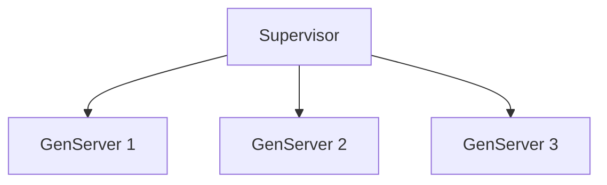
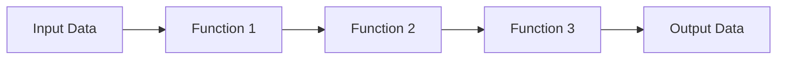

## 32.4. Common Interview Questions on Elixir and Design Patterns

As an expert Elixir developer, you may encounter a variety of questions during interviews that test your understanding of functional programming, concurrency, OTP (Open Telecom Platform), and design patterns. This section provides a comprehensive list of common interview questions, suggested answers, and tips to help you prepare effectively.

### Sample Questions

1. **Explain the concept of immutability in Elixir and its benefits.**
   - **Suggested Answer:** Immutability in Elixir means that once a data structure is created, it cannot be changed. This leads to safer code by avoiding side effects, simplifies reasoning about code, and enhances concurrency since immutable data can be shared between processes without locking.

2. **What is the "Let It Crash" philosophy in Elixir, and how does it relate to fault tolerance?**
   - **Suggested Answer:** The "Let It Crash" philosophy encourages developers to allow processes to fail and rely on supervisors to restart them. This approach simplifies error handling and enhances fault tolerance by ensuring that the system can recover from unexpected failures.

3. **Describe how pattern matching works in Elixir and provide an example.**
   - **Suggested Answer:** Pattern matching in Elixir is a powerful feature that allows you to match data structures against patterns. It is used in variable assignment, function clauses, and case expressions. For example:
     ```elixir
     case {1, 2, 3} do
       {1, x, 3} -> "Matched with x = #{x}"
       _ -> "No match"
     end
     ```

4. **How do you implement a GenServer in Elixir, and what are its key components?**
   - **Suggested Answer:** A GenServer is a generic server process in Elixir. It consists of a module implementing the `GenServer` behavior, with callback functions such as `init/1`, `handle_call/3`, `handle_cast/2`, and `handle_info/2`. Here's a simple example:
     ```elixir
     defmodule MyServer do
       use GenServer

       def start_link(initial_state) do
         GenServer.start_link(__MODULE__, initial_state, name: __MODULE__)
       end

       def init(initial_state) do
         {:ok, initial_state}
       end

       def handle_call(:get_state, _from, state) do
         {:reply, state, state}
       end

       def handle_cast({:set_state, new_state}, _state) do
         {:noreply, new_state}
       end
     end
     ```

5. **What are Elixir protocols, and how do they differ from behaviors?**
   - **Suggested Answer:** Protocols in Elixir are a mechanism to achieve polymorphism, allowing different data types to implement specific functions. They differ from behaviors, which define a set of functions that a module must implement. Protocols are more flexible as they can be extended to new data types without modifying existing code.

6. **Explain the use of the pipe operator (`|>`) in Elixir.**
   - **Suggested Answer:** The pipe operator (`|>`) is used to pass the result of one expression as the first argument to the next function call, improving code readability by reducing nested function calls. For example:
     ```elixir
     "hello"
     |> String.upcase()
     |> String.reverse()
     ```

7. **How does Elixir handle concurrency, and what are some common concurrency patterns?**
   - **Suggested Answer:** Elixir handles concurrency using lightweight processes managed by the BEAM VM. Common concurrency patterns include using GenServers for stateful processes, Tasks for asynchronous computations, and Supervisors for process management.

8. **Describe the Supervisor pattern in Elixir and its importance.**
   - **Suggested Answer:** The Supervisor pattern is used to manage and monitor processes, ensuring they are restarted in case of failure. It is crucial for building fault-tolerant systems by defining a supervision tree that specifies how processes are restarted.

9. **What is the role of ETS (Erlang Term Storage) in Elixir applications?**
   - **Suggested Answer:** ETS is a powerful in-memory storage system for storing large amounts of data efficiently. It is used in Elixir for caching, session storage, and other scenarios where fast data access is required.

10. **How do you implement a state machine in Elixir using `GenStateMachine`?**
    - **Suggested Answer:** `GenStateMachine` is a behavior for implementing state machines. It involves defining states and transitions between them using callback functions. Here's a simple example:
      ```elixir
      defmodule MyStateMachine do
        use GenStateMachine

        def start_link(initial_state) do
          GenStateMachine.start_link(__MODULE__, initial_state, name: __MODULE__)
        end

        def init(initial_state) do
          {:ok, initial_state}
        end

        def handle_event(:cast, :event, state) do
          {:next_state, :new_state, state}
        end
      end
      ```

### Interview Tips

- **Understand the Fundamentals:** Ensure you have a strong grasp of functional programming concepts, OTP, and concurrency in Elixir.
- **Practice Coding:** Regularly practice coding problems and implement design patterns in Elixir to build confidence.
- **Explain Your Thought Process:** During interviews, clearly explain your thought process and reasoning behind your solutions.
- **Stay Updated:** Keep up with the latest developments in the Elixir community and ecosystem.
- **Showcase Projects:** Highlight any projects or contributions to open-source Elixir projects to demonstrate your expertise.

### Visualizing Elixir Concepts

To further enhance your understanding, let's visualize some key concepts using Mermaid.js diagrams.

#### Visualizing the Supervisor Tree



**Description:** This diagram represents a simple supervision tree with a supervisor managing three GenServers. Each GenServer can be restarted independently if it crashes.

#### Visualizing the Pipe Operator



**Description:** This diagram illustrates the flow of data through a series of functions using the pipe operator, enhancing readability and maintainability.

### Knowledge Check

- **Question:** What is the primary benefit of using the "Let It Crash" philosophy in Elixir?
  - **Answer:** It simplifies error handling and enhances fault tolerance by allowing processes to fail and be restarted by supervisors.

- **Challenge:** Implement a simple GenServer that maintains a counter and supports increment and decrement operations.

### Embrace the Journey

Remember, mastering Elixir and its design patterns is a journey. As you progress, you'll build more robust and scalable systems. Keep experimenting, stay curious, and enjoy the journey!

## Quiz: Common Interview Questions on Elixir and Design Patterns



### What is the primary benefit of immutability in Elixir?

- [x] It avoids side effects and enhances concurrency.
- [ ] It allows for mutable state management.
- [ ] It simplifies syntax.
- [ ] It increases code verbosity.

> **Explanation:** Immutability avoids side effects, making code safer and enhancing concurrency by allowing data to be shared without locking.

### How does the "Let It Crash" philosophy contribute to fault tolerance?

- [x] By allowing processes to fail and be restarted by supervisors.
- [ ] By preventing any process from crashing.
- [ ] By using complex error handling mechanisms.
- [ ] By avoiding the use of supervisors.

> **Explanation:** The "Let It Crash" philosophy allows processes to fail and rely on supervisors to restart them, enhancing fault tolerance.

### What is the purpose of pattern matching in Elixir?

- [x] To match data structures against patterns for variable assignment and function clauses.
- [ ] To create mutable data structures.
- [ ] To simplify syntax.
- [ ] To enhance code verbosity.

> **Explanation:** Pattern matching allows matching data structures against patterns, used in variable assignment, function clauses, and case expressions.

### What are the key components of a GenServer?

- [x] Module implementing GenServer behavior, callback functions like `init/1`, `handle_call/3`.
- [ ] Module implementing HTTP behavior, callback functions like `init/1`, `handle_call/3`.
- [ ] Module implementing GenServer behavior, callback functions like `init/1`, `handle_http/3`.
- [ ] Module implementing HTTP behavior, callback functions like `init/1`, `handle_http/3`.

> **Explanation:** A GenServer consists of a module implementing GenServer behavior with callback functions like `init/1`, `handle_call/3`.

### How do protocols differ from behaviors in Elixir?

- [x] Protocols allow polymorphism for different data types, behaviors define a set of functions for a module.
- [ ] Protocols define a set of functions for a module, behaviors allow polymorphism for different data types.
- [ ] Protocols and behaviors are the same in Elixir.
- [ ] Protocols are used for error handling, behaviors for concurrency.

> **Explanation:** Protocols allow polymorphism for different data types, while behaviors define a set of functions that a module must implement.

### What is the role of the pipe operator (`|>`) in Elixir?

- [x] To pass the result of one expression as the first argument to the next function call.
- [ ] To create loops.
- [ ] To define modules.
- [ ] To handle errors.

> **Explanation:** The pipe operator (`|>`) passes the result of one expression as the first argument to the next function call, improving readability.

### How does Elixir handle concurrency?

- [x] Using lightweight processes managed by the BEAM VM.
- [ ] Using threads managed by the operating system.
- [ ] Using heavy processes managed by the BEAM VM.
- [ ] Using threads managed by Elixir.

> **Explanation:** Elixir handles concurrency using lightweight processes managed by the BEAM VM, allowing efficient concurrent execution.

### What is the importance of the Supervisor pattern in Elixir?

- [x] To manage and monitor processes, ensuring they are restarted in case of failure.
- [ ] To create HTTP servers.
- [ ] To handle database connections.
- [ ] To manage file systems.

> **Explanation:** The Supervisor pattern manages and monitors processes, ensuring they are restarted in case of failure, enhancing fault tolerance.

### What is the role of ETS in Elixir applications?

- [x] To provide in-memory storage for fast data access.
- [ ] To handle HTTP requests.
- [ ] To manage file systems.
- [ ] To create user interfaces.

> **Explanation:** ETS provides in-memory storage for fast data access, used for caching, session storage, and other scenarios.

### True or False: Elixir's "Let It Crash" philosophy avoids complex error handling mechanisms.

- [x] True
- [ ] False

> **Explanation:** The "Let It Crash" philosophy avoids complex error handling mechanisms by allowing processes to fail and be restarted by supervisors.



By preparing for these questions and understanding the underlying concepts, you'll be well-equipped to demonstrate your expertise in Elixir and design patterns during interviews.
