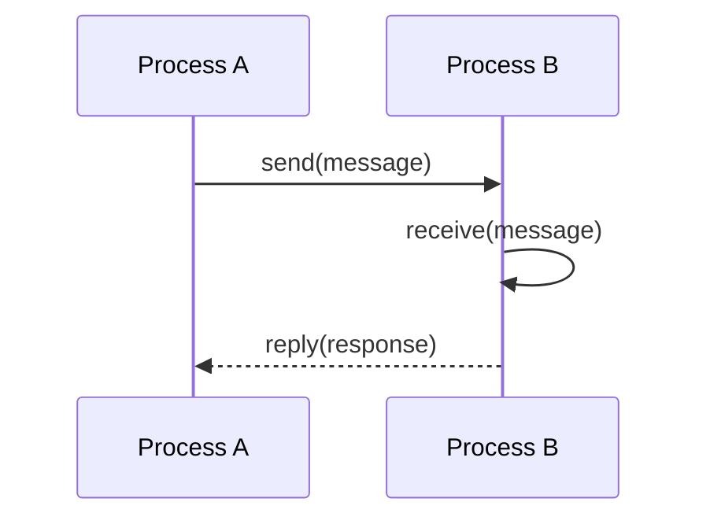
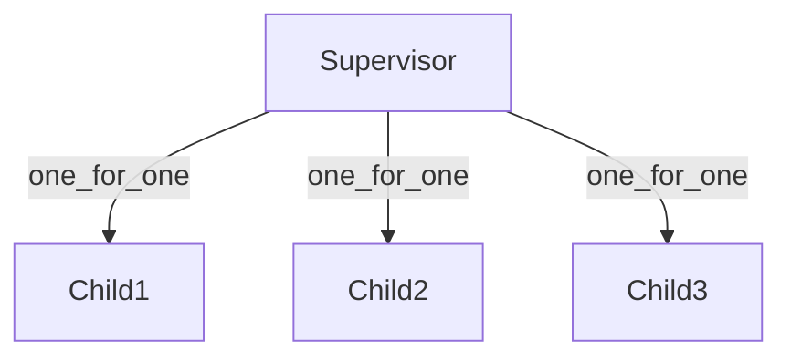

## 32.4. Common Interview Questions on Elixir and Design Patterns

In this section, we will explore a comprehensive list of common interview questions that you might encounter when interviewing for a position involving Elixir and its design patterns. This guide will help you prepare effectively by covering key topics such as functional programming concepts, OTP (Open Telecom Platform), concurrency, and design patterns. We will provide suggested answers and tips to help you showcase your expertise during technical interviews.

### Sample Questions

#### 1. Explain the concept of immutability in Elixir and its significance.

**Suggested Answer:**  
Immutability in Elixir means that once a data structure is created, it cannot be altered. This is a fundamental aspect of functional programming that helps ensure data consistency and thread safety in concurrent applications. Immutability allows Elixir to efficiently manage state changes without side effects, making it easier to reason about code behavior and reducing the risk of bugs.

#### 2. What are the benefits of using the OTP framework in Elixir applications?

**Suggested Answer:**  
OTP provides a set of tools and libraries for building robust and fault-tolerant applications. Key benefits include:

- **Concurrency Management:** OTP simplifies the creation and management of concurrent processes.
- **Fault Tolerance:** Supervisors and supervision trees help recover from failures gracefully.
- **Code Reusability:** OTP behaviors like GenServer and Supervisor encapsulate common patterns, promoting code reuse.
- **Scalability:** OTP's architecture supports distributed systems, making it easier to scale applications.

#### 3. How does pattern matching enhance function definitions in Elixir?

**Suggested Answer:**  
Pattern matching in Elixir allows for more expressive and concise function definitions by enabling the direct extraction of values from data structures. It helps in defining multiple function clauses, each handling different patterns of input data. This leads to cleaner and more readable code, as well as easier debugging and maintenance.

#### 4. Describe the actor model and its implementation in Elixir.

**Suggested Answer:**  
The actor model is a conceptual model for concurrent computation where "actors" are the fundamental units of computation. In Elixir, the actor model is implemented using processes. Each process is isolated, communicates via message passing, and maintains its own state. This model simplifies concurrent programming by avoiding shared state and enabling fault-tolerant designs.

#### 5. What is a GenServer, and how is it used in Elixir?

**Suggested Answer:**  
A GenServer is a generic server behavior in OTP that abstracts the common patterns of a server process. It provides a framework for implementing server-side functionality, handling state, and processing synchronous and asynchronous requests. GenServers are used to build modular and maintainable applications by encapsulating business logic within processes.

#### 6. Explain the concept of "let it crash" philosophy in Elixir.

**Suggested Answer:**  
The "let it crash" philosophy in Elixir encourages developers to focus on building robust supervision structures rather than defensive coding. Instead of trying to handle every possible error, processes are allowed to fail and restart in a controlled manner. This approach simplifies error handling and enhances system reliability by leveraging OTP's supervision trees to recover from failures automatically.

#### 7. How do you implement a singleton pattern in Elixir?

**Suggested Answer:**  
In Elixir, the singleton pattern can be implemented using a GenServer or an Agent to maintain a single instance of a stateful process. By starting the process under a supervisor with a unique name, you ensure that only one instance exists. Access to the singleton can be managed through a public API that interacts with the process.

#### 8. Discuss the role of supervisors in OTP.

**Suggested Answer:**  
Supervisors in OTP are responsible for monitoring and managing child processes. They define a supervision strategy (e.g., one_for_one, one_for_all) to determine how to respond to process failures. Supervisors help build fault-tolerant systems by ensuring that processes are restarted in case of crashes, maintaining system stability and availability.

#### 9. What are protocols in Elixir, and how do they differ from behaviors?

**Suggested Answer:**  
Protocols in Elixir are a mechanism for polymorphism, allowing different data types to implement a common set of functions. They enable extensibility by allowing new data types to be added without modifying existing code. Behaviors, on the other hand, define a set of functions that a module must implement, serving as a contract for module functionality. Protocols focus on data polymorphism, while behaviors focus on module contracts.

#### 10. How can you optimize performance in an Elixir application?

**Suggested Answer:**  
Performance optimization in Elixir can be achieved through various techniques, such as:

- **Profiling and Benchmarking:** Use tools like `ExProf` and `Benchee` to identify bottlenecks.
- **Efficient Data Structures:** Choose appropriate data structures like tuples, maps, and lists based on use cases.
- **Concurrency:** Leverage processes and Task.async for parallel execution.
- **ETS (Erlang Term Storage):** Use ETS for fast, in-memory data storage.
- **Lazy Evaluation:** Utilize streams for processing large datasets efficiently.

### Interview Tips

- **Understand the Fundamentals:** Ensure a solid grasp of functional programming concepts, concurrency, and OTP principles.
- **Practice Problem-Solving:** Work on coding challenges and projects to improve your problem-solving skills.
- **Know the Ecosystem:** Familiarize yourself with Elixir libraries and tools, such as Phoenix, Ecto, and GenStage.
- **Prepare for Behavioral Questions:** Be ready to discuss past experiences and how you've applied Elixir in real-world scenarios.
- **Demonstrate Soft Skills:** Showcase your ability to work in teams, communicate effectively, and adapt to new challenges.

### Visualizing Key Concepts

#### Diagram: Elixir Process Communication

```mermaid
sequenceDiagram
    participant A as Process A
    participant B as Process B
    A->>B: send(message)
    B->>B: receive(message)
    B-->>A: reply(response)
```

**Caption:** This diagram illustrates how two processes in Elixir communicate using message passing, a core concept of the actor model.

#### Diagram: OTP Supervision Tree

```mermaid
graph TD;
    Supervisor -->|one_for_one| Child1;
    Supervisor -->|one_for_one| Child2;
    Supervisor -->|one_for_one| Child3;
```

**Caption:** A simple OTP supervision tree with a `one_for_one` strategy, where each child process is monitored and restarted independently upon failure.

### Knowledge Check

- **Question:** What are the advantages of using pattern matching in Elixir?
- **Exercise:** Implement a GenServer that acts as a counter, incrementing and decrementing its state based on messages received.

### Embrace the Journey

Remember, mastering Elixir and its design patterns is a journey. As you delve deeper into the language and its ecosystem, you'll discover new ways to build efficient, scalable, and maintainable applications. Stay curious, keep experimenting, and enjoy the process of learning and growing as a developer.

## Quiz Time!



### What is the primary benefit of immutability in Elixir?

- [x] Ensures data consistency and thread safety
- [ ] Allows for mutable state changes
- [ ] Simplifies error handling
- [ ] Enhances code readability

> **Explanation:** Immutability ensures data consistency and thread safety by preventing changes to data structures once they are created.

### How does OTP enhance application scalability?

- [x] By supporting distributed systems
- [ ] Through mutable state management
- [ ] By simplifying error handling
- [ ] Through synchronous message passing

> **Explanation:** OTP's architecture supports distributed systems, making it easier to scale applications horizontally.

### What is the role of a GenServer in Elixir?

- [x] To abstract common server patterns
- [ ] To manage distributed nodes
- [ ] To handle synchronous requests only
- [ ] To implement polymorphic functions

> **Explanation:** A GenServer abstracts common server patterns, handling both synchronous and asynchronous requests.

### What is the "let it crash" philosophy in Elixir?

- [x] Focus on robust supervision structures instead of defensive coding
- [ ] Prevent all possible errors
- [ ] Use defensive coding to handle errors
- [ ] Avoid process failures at all costs

> **Explanation:** The "let it crash" philosophy encourages building robust supervision structures to handle process failures gracefully.

### How can you implement a singleton pattern in Elixir?

- [x] Using a GenServer or Agent with a unique name
- [ ] By creating multiple processes
- [ ] Through mutable state management
- [ ] By using protocols

> **Explanation:** A singleton pattern can be implemented using a GenServer or Agent with a unique name to ensure a single instance.

### What is the difference between protocols and behaviors in Elixir?

- [x] Protocols focus on data polymorphism, behaviors on module contracts
- [ ] Protocols define module contracts, behaviors on data polymorphism
- [ ] Both are used for data polymorphism
- [ ] Both are used for module contracts

> **Explanation:** Protocols enable data polymorphism, while behaviors define module contracts.

### What is the purpose of a supervisor in OTP?

- [x] To monitor and manage child processes
- [ ] To implement polymorphic functions
- [ ] To handle synchronous requests
- [ ] To manage distributed nodes

> **Explanation:** Supervisors monitor and manage child processes, ensuring system stability and availability.

### How can you optimize performance in an Elixir application?

- [x] Use ETS for fast, in-memory data storage
- [ ] Avoid concurrency
- [ ] Use mutable state changes
- [ ] Rely on synchronous message passing

> **Explanation:** ETS provides fast, in-memory data storage, enhancing performance in Elixir applications.

### What is the actor model's implementation in Elixir?

- [x] Using isolated processes and message passing
- [ ] Through shared state and synchronization
- [ ] By using mutable state changes
- [ ] Through synchronous message passing

> **Explanation:** The actor model is implemented using isolated processes and message passing, avoiding shared state.

### True or False: Pattern matching in Elixir allows for more expressive function definitions.

- [x] True
- [ ] False

> **Explanation:** Pattern matching enables more expressive function definitions by allowing direct extraction of values from data structures.



By preparing with these questions and understanding the underlying concepts, you'll be well-equipped to excel in interviews and demonstrate your expertise in Elixir and design patterns.
