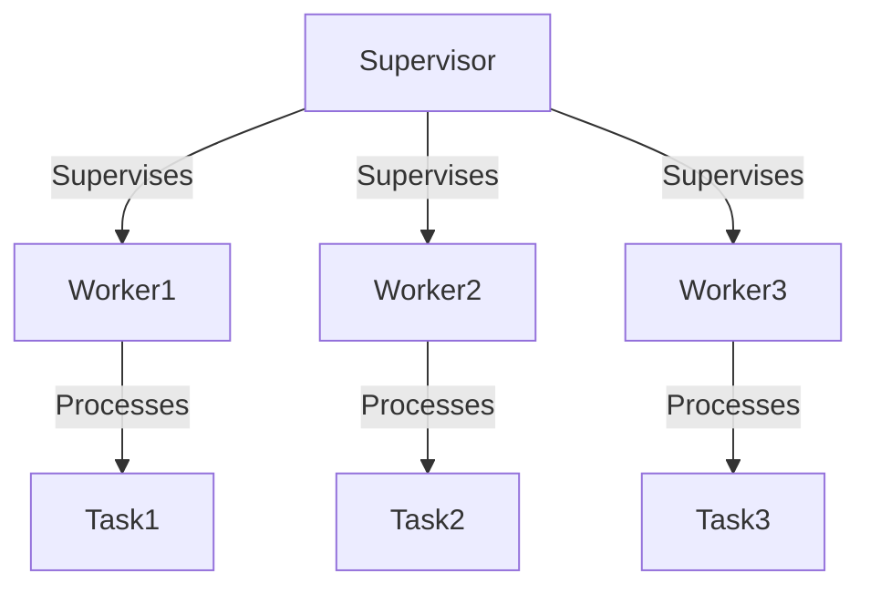

## 32.6. Frequently Asked Questions (FAQ)

Welcome to the Frequently Asked Questions (FAQ) section of the Elixir Design Patterns: Advanced Guide for Expert Software Engineers and Architects. This section aims to address common queries and provide valuable insights into Elixir's features, technical how-tos, best practices, and community guidelines. Whether you're a seasoned Elixir developer or new to the language, this FAQ is designed to enhance your understanding and help you navigate the Elixir ecosystem effectively.

### General Questions

#### What makes Elixir unique compared to other functional programming languages?

Elixir is a dynamic, functional language designed for building scalable and maintainable applications. It runs on the Erlang Virtual Machine (BEAM), which provides excellent support for concurrency, distribution, and fault tolerance. Elixir's syntax is modern and approachable, making it easier for developers to adopt. It also offers powerful metaprogramming capabilities through macros, allowing for greater flexibility and expressiveness.

#### How does Elixir handle concurrency?

Elixir leverages the Actor Model for concurrency, where each actor is a lightweight process. These processes are isolated and communicate via message passing, allowing for safe concurrency without shared state. The BEAM VM efficiently schedules these processes, enabling Elixir applications to handle millions of concurrent connections with ease.

#### What is OTP, and why is it important in Elixir?

OTP (Open Telecom Platform) is a set of libraries and design principles for building robust, fault-tolerant applications. It includes behaviors like GenServer, Supervisor, and Application, which provide abstractions for common patterns such as servers, state machines, and process supervision. OTP is essential in Elixir for creating applications that can recover from failures and scale effectively.

### Technical How-Tos

#### How do I handle errors in Elixir?

Elixir encourages a "let it crash" philosophy, where processes are allowed to fail and are then restarted by a supervisor. This approach simplifies error handling by separating concerns. For handling expected errors, Elixir uses pattern matching with tuples like `{:ok, result}` and `{:error, reason}`. This pattern is common in Elixir libraries and allows for clear and concise error handling.

```elixir
def divide(a, b) do
  if b == 0 do
    {:error, "Cannot divide by zero"}
  else
    {:ok, a / b}
  end
end

case divide(10, 0) do
  {:ok, result} -> IO.puts("Result: #{result}")
  {:error, reason} -> IO.puts("Error: #{reason}")
end
```

#### How can I optimize performance in Elixir applications?

Performance optimization in Elixir involves several strategies:

1. **Profiling**: Use tools like `:fprof` and `:eprof` to identify bottlenecks.
2. **Efficient Data Structures**: Choose the right data structures, such as using maps for key-value storage.
3. **Concurrency**: Leverage Elixir's concurrency model to parallelize tasks.
4. **Caching**: Use ETS (Erlang Term Storage) for in-memory caching.
5. **Lazy Evaluation**: Utilize streams for processing large data sets lazily.

### Best Practices

#### What are some best practices for writing maintainable Elixir code?

1. **Use Pattern Matching**: Take advantage of pattern matching for clear and concise code.
2. **Leverage the Pipe Operator (`|>`)**: Use the pipe operator to improve readability by chaining function calls.
3. **Document Your Code**: Use ExDoc for generating documentation and ensure all public functions have specs.
4. **Write Tests**: Use ExUnit for unit testing and ensure your code is well-tested.
5. **Follow Elixir Style Guide**: Adhere to community conventions for consistent code style.

#### How should I structure an Elixir project?

An Elixir project typically follows a standard structure:

- **lib/**: Contains the main application code.
- **test/**: Contains test files.
- **config/**: Holds configuration files.
- **mix.exs**: The main project file that defines dependencies and project settings.

Ensure logical separation of concerns within your modules and use contexts to define boundaries in larger applications.

### Community Guidelines

#### How can I contribute to the Elixir community?

1. **Participate in Forums**: Engage with the community on platforms like Elixir Forum and Stack Overflow.
2. **Contribute to Open Source**: Explore open-source Elixir projects on GitHub and contribute by reporting issues, submitting pull requests, or improving documentation.
3. **Attend Conferences and Meetups**: Join Elixir conferences and local meetups to network and learn from other developers.
4. **Share Knowledge**: Write blog posts, create tutorials, or give talks to share your expertise with others.

#### How do I report bugs or suggest features for Elixir projects?

Most Elixir projects are hosted on GitHub. To report a bug or suggest a feature:

1. **Search Existing Issues**: Check if the issue has already been reported.
2. **Create a New Issue**: Provide a detailed description, steps to reproduce, and any relevant logs or screenshots.
3. **Follow Contribution Guidelines**: Adhere to the project's contribution guidelines when submitting issues or pull requests.

### Visualizing Elixir Concepts

To better understand Elixir's concurrency model and OTP architecture, let's visualize the process supervision tree using Mermaid.js:



**Diagram Explanation:** The diagram represents a simple supervision tree where a supervisor manages three worker processes. Each worker handles different tasks, and if a worker fails, the supervisor can restart it.

### Knowledge Check

To reinforce your understanding, consider the following questions:

1. How does Elixir's "let it crash" philosophy simplify error handling?
2. What are the key benefits of using OTP in Elixir applications?
3. How can you optimize an Elixir application for performance?
4. What are some best practices for structuring an Elixir project?
5. How can you contribute to the Elixir community?

### Embrace the Journey

Remember, mastering Elixir design patterns and best practices is a journey. As you continue to explore and experiment, you'll gain deeper insights into building scalable, maintainable applications. Stay curious, engage with the community, and enjoy the process of learning and growing as an Elixir developer.

## Quiz Time!



### What is a unique feature of Elixir compared to other functional languages?

- [x] Runs on the BEAM VM
- [ ] Uses a static type system
- [ ] Requires manual memory management
- [ ] Lacks support for concurrency

> **Explanation:** Elixir runs on the BEAM VM, which provides excellent support for concurrency, distribution, and fault tolerance.

### How does Elixir handle concurrency?

- [x] Through the Actor Model
- [ ] By using threads
- [ ] With global locks
- [ ] By sharing mutable state

> **Explanation:** Elixir uses the Actor Model, where processes communicate via message passing, allowing for safe concurrency without shared state.

### What is the role of OTP in Elixir?

- [x] Provides libraries and design principles for building robust applications
- [ ] Offers a graphical user interface framework
- [ ] Manages database connections
- [ ] Handles network communication exclusively

> **Explanation:** OTP is a set of libraries and design principles that help build robust, fault-tolerant applications with features like GenServer and Supervisor.

### How can you handle errors in Elixir?

- [x] Using pattern matching with tuples like `{:ok, result}` and `{:error, reason}`
- [ ] By using global exception handlers
- [ ] Through try-catch blocks only
- [ ] By ignoring them

> **Explanation:** Elixir uses pattern matching with tuples for clear and concise error handling, following the "let it crash" philosophy.

### What is a best practice for writing maintainable Elixir code?

- [x] Use pattern matching and the pipe operator for clarity
- [ ] Avoid writing tests
- [ ] Use global variables extensively
- [ ] Write long, complex functions

> **Explanation:** Using pattern matching and the pipe operator improves code clarity and maintainability.

### How should an Elixir project be structured?

- [x] With directories like lib/, test/, and config/
- [ ] With all code in a single file
- [ ] Without any directory structure
- [ ] Using a monolithic main function

> **Explanation:** An Elixir project typically follows a standard structure with directories like lib/, test/, and config/ for organization.

### How can you contribute to the Elixir community?

- [x] Participate in forums and contribute to open source
- [ ] Keep your knowledge to yourself
- [ ] Avoid engaging with other developers
- [ ] Use Elixir only for personal projects

> **Explanation:** Engaging with the community through forums, open source contributions, and sharing knowledge are great ways to contribute.

### What is the purpose of a supervisor in Elixir?

- [x] To manage and restart worker processes
- [ ] To execute SQL queries
- [ ] To handle HTTP requests
- [ ] To compile code

> **Explanation:** A supervisor manages worker processes and restarts them if they fail, ensuring fault tolerance.

### What is the "let it crash" philosophy in Elixir?

- [x] Allowing processes to fail and be restarted by a supervisor
- [ ] Preventing any failures from occurring
- [ ] Ignoring errors entirely
- [ ] Using global exception handlers

> **Explanation:** The "let it crash" philosophy allows processes to fail and be restarted by a supervisor, simplifying error handling.

### True or False: Elixir lacks support for concurrency.

- [ ] True
- [x] False

> **Explanation:** False. Elixir has strong support for concurrency, leveraging the Actor Model and the BEAM VM.



By exploring these FAQs, we hope you've gained a clearer understanding of Elixir's capabilities and best practices. Continue to explore, experiment, and engage with the community to deepen your expertise in this powerful language.
