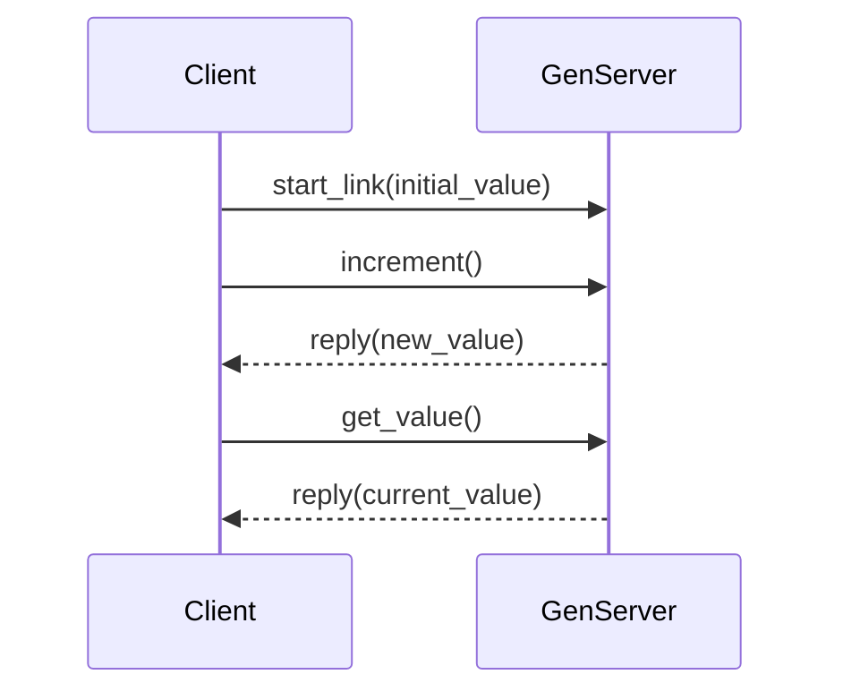

## 32.7. Sample Projects and Code Examples

Welcome to the comprehensive section on sample projects and code examples in Elixir. This section is designed to provide you with practical insights into applying design patterns in Elixir through real-world projects, code repositories, practice exercises, and templates. Whether you're building web applications, APIs, or command-line tools, these resources will guide you in mastering Elixir's functional programming paradigm.

### Tutorial Projects

Let's dive into some step-by-step guides to building applications with Elixir. These projects will help you understand how to apply design patterns effectively in real-world scenarios.

#### 1. Building a Real-Time Chat Application

**Objective:** Create a real-time chat application using the Phoenix framework and Elixir's concurrency features.

**Key Concepts:**
- **Concurrency:** Utilize Elixir's lightweight processes to handle multiple chat sessions.
- **Phoenix Channels:** Implement real-time communication between clients and the server.
- **OTP Supervision Trees:** Ensure fault-tolerance and reliability.

**Step-by-Step Guide:**

1. **Set Up Phoenix Project:**
   ```bash
   mix phx.new chat_app --no-ecto
   cd chat_app
   ```

2. **Create a Chat Room Channel:**
   ```elixir
   defmodule ChatAppWeb.RoomChannel do
     use ChatAppWeb, :channel

     def join("room:lobby", _message, socket) do
       {:ok, socket}
     end

     def handle_in("new_msg", %{"body" => body}, socket) do
       broadcast!(socket, "new_msg", %{body: body})
       {:noreply, socket}
     end
   end
   ```

3. **Configure the Endpoint:**
   ```elixir
   socket "/socket", ChatAppWeb.UserSocket,
     websocket: true,
     longpoll: false
   ```

4. **Create a Simple Frontend:**
   Use JavaScript to connect to the channel and handle incoming messages.

5. **Run the Application:**
   ```bash
   mix phx.server
   ```

**Try It Yourself:** Modify the application to support multiple chat rooms and add user authentication.

#### 2. Developing a RESTful API with Elixir

**Objective:** Build a RESTful API using Elixir and the Phoenix framework.

**Key Concepts:**
- **RESTful Design:** Implement CRUD operations.
- **Ecto:** Use Ecto for database interactions.
- **JSON Serialization:** Convert Elixir data structures to JSON.

**Step-by-Step Guide:**

1. **Initialize Phoenix Project with Ecto:**
   ```bash
   mix phx.new api_app --no-html
   cd api_app
   ```

2. **Define a Resource Schema:**
   ```elixir
   defmodule ApiApp.Blog.Post do
     use Ecto.Schema
     import Ecto.Changeset

     schema "posts" do
       field :title, :string
       field :content, :string
       timestamps()
     end

     def changeset(post, attrs) do
       post
       |> cast(attrs, [:title, :content])
       |> validate_required([:title, :content])
     end
   end
   ```

3. **Create a Controller:**
   ```elixir
   defmodule ApiAppWeb.PostController do
     use ApiAppWeb, :controller

     alias ApiApp.Blog
     alias ApiApp.Blog.Post

     def index(conn, _params) do
       posts = Blog.list_posts()
       render(conn, "index.json", posts: posts)
     end

     def create(conn, %{"post" => post_params}) do
       with {:ok, %Post{} = post} <- Blog.create_post(post_params) do
         conn
         |> put_status(:created)
         |> render("show.json", post: post)
       end
     end
   end
   ```

4. **Set Up Routes:**
   ```elixir
   scope "/api", ApiAppWeb do
     pipe_through :api
     resources "/posts", PostController, except: [:new, :edit]
   end
   ```

5. **Run the Server:**
   ```bash
   mix phx.server
   ```

**Try It Yourself:** Extend the API to include user authentication and authorization.

### Code Repositories

Explore these GitHub repositories for more code examples illustrating various design patterns in Elixir.

- **Elixir Design Patterns Repository:** [GitHub Link](https://github.com/elixir-design-patterns)
  - Contains examples of creational, structural, and behavioral patterns.
  
- **Phoenix Real-Time Chat Example:** [GitHub Link](https://github.com/phoenix-chat-example)
  - A complete implementation of a real-time chat application using Phoenix Channels.

- **Elixir RESTful API Example:** [GitHub Link](https://github.com/elixir-restful-api)
  - Demonstrates building a RESTful API with Phoenix and Ecto.

### Practice Exercises

Hone your Elixir programming skills with these challenges and exercises.

#### Exercise 1: Implement a GenServer

**Objective:** Create a GenServer that manages a simple counter.

**Instructions:**
1. **Define the GenServer Module:**
   ```elixir
   defmodule Counter do
     use GenServer

     # Client API
     def start_link(initial_value) do
       GenServer.start_link(__MODULE__, initial_value, name: __MODULE__)
     end

     def increment do
       GenServer.call(__MODULE__, :increment)
     end

     def get_value do
       GenServer.call(__MODULE__, :get_value)
     end

     # Server Callbacks
     def init(initial_value) do
       {:ok, initial_value}
     end

     def handle_call(:increment, _from, state) do
       {:reply, state + 1, state + 1}
     end

     def handle_call(:get_value, _from, state) do
       {:reply, state, state}
     end
   end
   ```

2. **Test the GenServer:**
   ```elixir
   Counter.start_link(0)
   Counter.increment()
   Counter.get_value() # Should return 1
   ```

**Try It Yourself:** Modify the GenServer to support decrementing the counter.

#### Exercise 2: Create a Simple Web Scraper

**Objective:** Build a web scraper using Elixir's HTTP client and Floki for HTML parsing.

**Instructions:**
1. **Set Up HTTPoison and Floki:**
   Add dependencies to `mix.exs`:
   ```elixir
   defp deps do
     [
       {:httpoison, "~> 1.8"},
       {:floki, "~> 0.30"}
     ]
   end
   ```

2. **Implement the Scraper:**
   ```elixir
   defmodule WebScraper do
     def fetch_titles(url) do
       {:ok, response} = HTTPoison.get(url)
       {:ok, document} = Floki.parse_document(response.body)
       Floki.find(document, "h1")
       |> Enum.map(&Floki.text/1)
     end
   end
   ```

3. **Test the Scraper:**
   ```elixir
   WebScraper.fetch_titles("https://example.com")
   ```

**Try It Yourself:** Extend the scraper to extract links and other HTML elements.

### Templates and Boilerplates

Kickstart your projects with these starter kits for various types of applications.

- **Phoenix Web App Template:** A boilerplate for building web applications with Phoenix.
- **Elixir CLI Tool Template:** A starter kit for creating command-line tools in Elixir.
- **RESTful API Boilerplate:** A template for building RESTful APIs with Phoenix and Ecto.

### Visualizing Elixir Design Patterns

To enhance understanding, let's visualize some of the design patterns using Mermaid.js diagrams.

#### Visualizing the GenServer Pattern



**Description:** This sequence diagram illustrates the interaction between a client and a GenServer, highlighting the process of starting the server, incrementing a counter, and retrieving its value.

### References and Links

For further reading and deeper dives into Elixir and design patterns, consider these resources:

- [Elixir Official Documentation](https://elixir-lang.org/docs.html)
- [Phoenix Framework Guides](https://hexdocs.pm/phoenix/overview.html)
- [Ecto Documentation](https://hexdocs.pm/ecto/Ecto.html)

### Knowledge Check

To reinforce your learning, let's pose some questions and challenges.

1. **Question:** How would you implement a Supervisor to manage multiple GenServers?
2. **Challenge:** Extend the real-time chat application to support private messaging.
3. **Exercise:** Create a new design pattern example using Elixir's unique features.

### Embrace the Journey

Remember, this is just the beginning. As you progress, you'll build more complex and interactive applications. Keep experimenting, stay curious, and enjoy the journey!

## Quiz: Sample Projects and Code Examples



### What is the primary purpose of using Phoenix Channels in a chat application?

- [x] To enable real-time communication between clients and the server
- [ ] To handle database interactions
- [ ] To manage application configuration
- [ ] To perform background tasks

> **Explanation:** Phoenix Channels are used to facilitate real-time communication between clients and the server, making them ideal for chat applications.

### Which Elixir library is commonly used for parsing HTML in web scraping?

- [x] Floki
- [ ] Ecto
- [ ] Phoenix
- [ ] Plug

> **Explanation:** Floki is a library used for parsing HTML and extracting information from web pages in Elixir.

### In the GenServer pattern, what is the purpose of the `handle_call` function?

- [x] To handle synchronous requests from clients
- [ ] To initialize the server state
- [ ] To handle asynchronous messages
- [ ] To terminate the server

> **Explanation:** The `handle_call` function in a GenServer is used to handle synchronous requests from clients and return a response.

### What is the role of Ecto in a RESTful API built with Elixir?

- [x] To manage database interactions and queries
- [ ] To handle HTTP requests
- [ ] To render HTML templates
- [ ] To manage application configuration

> **Explanation:** Ecto is used for managing database interactions and queries in Elixir applications, making it essential for building RESTful APIs.

### How can you start a GenServer with an initial state?

- [x] By calling `GenServer.start_link/2` with the initial state
- [ ] By using `GenServer.init/1` directly
- [ ] By calling `GenServer.handle_call/3`
- [ ] By using `GenServer.terminate/2`

> **Explanation:** The `GenServer.start_link/2` function is used to start a GenServer with an initial state.

### What is a common use case for the `broadcast!` function in Phoenix Channels?

- [x] To send a message to all subscribers of a channel
- [ ] To send a message to a specific client
- [ ] To log messages to the console
- [ ] To handle HTTP requests

> **Explanation:** The `broadcast!` function is used to send a message to all subscribers of a channel in Phoenix.

### Which tool is used for managing dependencies in Elixir projects?

- [x] Mix
- [ ] Hex
- [ ] Rebar
- [ ] NPM

> **Explanation:** Mix is the build tool for Elixir that manages dependencies, compiles code, and runs tests.

### What is the purpose of the `use` keyword in Elixir modules?

- [x] To inject behavior and functions from another module
- [ ] To import functions from another module
- [ ] To define a new module
- [ ] To start a process

> **Explanation:** The `use` keyword in Elixir is used to inject behavior and functions from another module, often used with macros.

### How can you test a GenServer's functionality in Elixir?

- [x] By calling its public API functions and asserting the results
- [ ] By directly calling its private functions
- [ ] By modifying its internal state
- [ ] By using a different process

> **Explanation:** Testing a GenServer involves calling its public API functions and asserting the expected results.

### True or False: Elixir's concurrency model is based on the Actor model.

- [x] True
- [ ] False

> **Explanation:** Elixir's concurrency model is based on the Actor model, where processes communicate through message passing.



By exploring these sample projects and code examples, you will gain a deeper understanding of how to apply design patterns in Elixir, enhancing your ability to build scalable and maintainable applications. Keep experimenting and learning, and you'll continue to grow as an Elixir developer.
