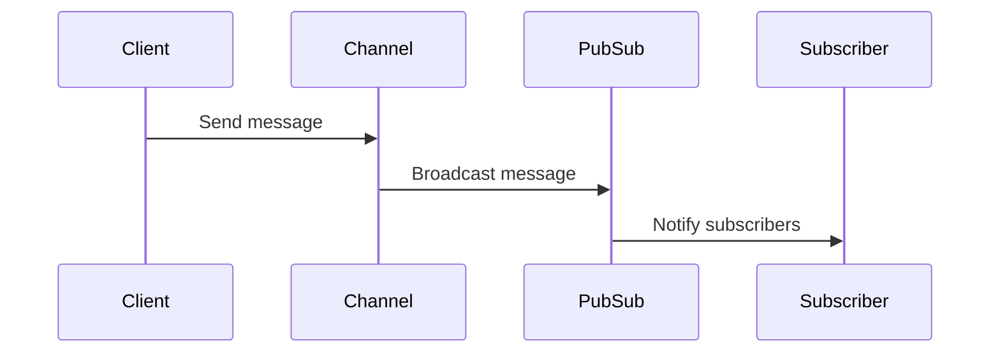
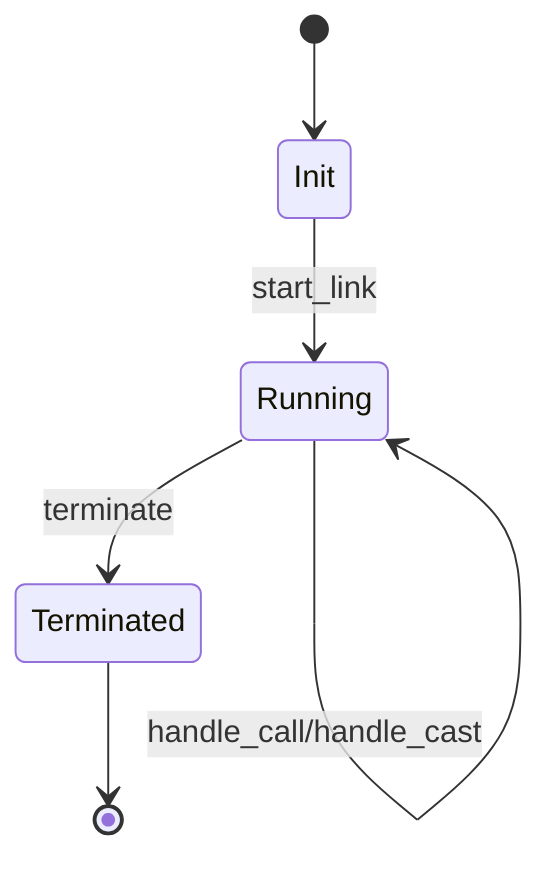

## 32.7. Sample Projects and Code Examples

In this section, we will delve into a collection of sample projects and code examples designed to illustrate the application of advanced design patterns in Elixir. By exploring these examples, you will gain a deeper understanding of how to implement functional programming concepts, leverage Elixir's unique features, and build scalable, fault-tolerant systems.

### Tutorial Projects

#### Building a Real-Time Chat Application

**Objective:** Create a real-time chat application using Phoenix Channels to demonstrate the Observer Pattern and Pub/Sub architecture.

**Project Overview:**

1. **Setup Phoenix Framework:**
   - Install Phoenix by running `mix phx.new chat_app`.
   - Navigate to the project directory and install dependencies with `mix deps.get`.

2. **Implement Channels:**
   - Define a channel in `lib/chat_app_web/channels/room_channel.ex`.
   - Use `Phoenix.PubSub` to broadcast messages to all subscribers.

```elixir
defmodule ChatAppWeb.RoomChannel do
  use ChatAppWeb, :channel

  def join("room:lobby", _message, socket) do
    {:ok, socket}
  end

  def handle_in("new_msg", %{"body" => body}, socket) do
    broadcast(socket, "new_msg", %{body: body})
    {:noreply, socket}
  end
end
```

3. **Create Frontend Interface:**
   - Use JavaScript to establish a WebSocket connection and handle incoming messages.
   - Update the HTML DOM to display new messages in real-time.

4. **Run and Test:**
   - Start the server with `mix phx.server`.
   - Open multiple browser tabs to test real-time communication.

**Try It Yourself:**
- Modify the channel to support private messaging.
- Add user authentication to manage chat rooms.

#### Developing a RESTful API with Elixir

**Objective:** Build a RESTful API to demonstrate the use of the Factory Pattern and Dependency Injection.

**Project Overview:**

1. **Setup Phoenix API:**
   - Create a new Phoenix project with `mix phx.new api_app --no-html --no-webpack`.
   - Define a resource in `lib/api_app_web/controllers/item_controller.ex`.

2. **Implement Factory Pattern:**
   - Use a module to create different types of items based on input parameters.

```elixir
defmodule ItemFactory do
  def create_item(type, attributes) do
    case type do
      :book -> %Book{title: attributes.title, author: attributes.author}
      :movie -> %Movie{title: attributes.title, director: attributes.director}
      _ -> {:error, "Unknown item type"}
    end
  end
end
```

3. **Inject Dependencies:**
   - Use configuration files to manage dependencies and switch between different implementations.

```elixir
config :api_app, :item_repository, ItemRepositoryPostgres
```

4. **Test the API:**
   - Use tools like `curl` or Postman to send HTTP requests and verify responses.

**Try It Yourself:**
- Extend the factory to support additional item types.
- Implement caching for frequently accessed resources.

### Code Repositories

Explore these GitHub repositories to see real-world examples of Elixir design patterns:

- [Elixir Design Patterns](https://github.com/elixir-patterns/elixir-design-patterns): A collection of design patterns implemented in Elixir, including Singleton, Factory, and Observer patterns.
- [Phoenix Real-Time Examples](https://github.com/phoenixframework/phoenix-examples): Demonstrates various real-time features of the Phoenix Framework, including channels and presence.

### Practice Exercises

#### Exercise 1: Implementing a Simple GenServer

**Challenge:** Create a GenServer that manages a counter. Implement functions to increment, decrement, and retrieve the counter value.

```elixir
defmodule Counter do
  use GenServer

  # Client API
  def start_link(initial_value) do
    GenServer.start_link(__MODULE__, initial_value, name: __MODULE__)
  end

  def increment do
    GenServer.cast(__MODULE__, :increment)
  end

  def decrement do
    GenServer.cast(__MODULE__, :decrement)
  end

  def value do
    GenServer.call(__MODULE__, :value)
  end

  # Server Callbacks
  def init(initial_value) do
    {:ok, initial_value}
  end

  def handle_cast(:increment, state) do
    {:noreply, state + 1}
  end

  def handle_cast(:decrement, state) do
    {:noreply, state - 1}
  end

  def handle_call(:value, _from, state) do
    {:reply, state, state}
  end
end
```

**Try It Yourself:**
- Add a reset function to set the counter back to its initial value.
- Implement a timeout to automatically reset the counter after a period of inactivity.

#### Exercise 2: Using ETS for Caching

**Challenge:** Use Erlang Term Storage (ETS) to implement a simple caching mechanism for storing and retrieving key-value pairs.

```elixir
defmodule Cache do
  def start_link do
    :ets.new(:cache, [:named_table, :public, read_concurrency: true])
  end

  def put(key, value) do
    :ets.insert(:cache, {key, value})
  end

  def get(key) do
    case :ets.lookup(:cache, key) do
      [{^key, value}] -> {:ok, value}
      [] -> :error
    end
  end
end
```

**Try It Yourself:**
- Implement a TTL (Time-To-Live) feature to automatically expire cache entries.
- Add a function to clear all cache entries.

### Templates and Boilerplates

#### Web Application Starter Kit

**Objective:** Provide a boilerplate for building web applications with Phoenix, including user authentication and database integration.

**Features:**

- User authentication with Guardian.
- Database setup with Ecto and PostgreSQL.
- Pre-configured routes and controllers for common operations.

**Repository:** [Phoenix Web Starter Kit](https://github.com/elixir-starter-kits/phoenix-web-starter)

#### Command-Line Tool Template

**Objective:** Create a boilerplate for building command-line tools in Elixir, demonstrating the use of Mix tasks and CLI parsing.

**Features:**

- Command-line argument parsing with `OptionParser`.
- Custom Mix tasks for common operations.
- Logging and error handling.

**Repository:** [Elixir CLI Template](https://github.com/elixir-starter-kits/elixir-cli-template)

### Visualizing Elixir Design Patterns

To better understand the architecture and flow of Elixir applications, we can use diagrams to visualize key concepts.

#### Visualizing the Observer Pattern


```mermaid
sequenceDiagram
    participant Client
    participant Channel
    participant PubSub
    participant Subscriber

    Client->>Channel: Send message
    Channel->>PubSub: Broadcast message
    PubSub->>Subscriber: Notify subscribers
```

**Description:** This sequence diagram illustrates the flow of messages in a real-time chat application using the Observer Pattern. The client sends a message to the channel, which broadcasts it through the PubSub system to all subscribers.

#### Visualizing GenServer Lifecycle


```mermaid
stateDiagram-v2
    [*] --> Init
    Init --> Running : start_link
    Running --> Terminated : terminate
    Running --> Running : handle_call/handle_cast
    Terminated --> [*]
```

**Description:** This state diagram represents the lifecycle of a GenServer. It starts in the `Init` state, transitions to `Running` upon successful initialization, and eventually moves to `Terminated` when the server is stopped.

### References and Links

- [Elixir Lang](https://elixir-lang.org/): Official Elixir website with comprehensive documentation.
- [Phoenix Framework](https://www.phoenixframework.org/): Official site for the Phoenix Framework, including guides and tutorials.
- [Ecto Documentation](https://hexdocs.pm/ecto/Ecto.html): Detailed documentation for Ecto, Elixir's database wrapper and query generator.

### Knowledge Check

- **Question:** What is the primary use of Phoenix Channels in a web application?
  - **Answer:** To enable real-time communication between clients and the server.

- **Exercise:** Implement a GenServer that manages a list of tasks, allowing tasks to be added, removed, and listed.

### Embrace the Journey

Remember, the key to mastering Elixir and its design patterns is consistent practice and exploration. As you work through these projects and exercises, you'll gain a deeper understanding of how to leverage Elixir's powerful features to build robust applications. Keep experimenting, stay curious, and enjoy the journey!

## Quiz Time!



### What is the primary purpose of Phoenix Channels?

- [x] Enable real-time communication
- [ ] Manage database connections
- [ ] Handle HTTP requests
- [ ] Perform background jobs

> **Explanation:** Phoenix Channels are used to enable real-time communication between clients and the server.

### Which pattern is demonstrated by using `Phoenix.PubSub`?

- [x] Observer Pattern
- [ ] Singleton Pattern
- [ ] Factory Pattern
- [ ] Strategy Pattern

> **Explanation:** `Phoenix.PubSub` is an implementation of the Observer Pattern, where messages are broadcasted to subscribers.

### What is the role of a GenServer in Elixir?

- [x] Manage state and handle asynchronous messages
- [ ] Serve HTTP requests
- [ ] Compile Elixir code
- [ ] Manage database schemas

> **Explanation:** A GenServer is used to manage state and handle asynchronous messages in Elixir applications.

### How can you implement a TTL feature in an ETS cache?

- [x] Use a separate process to periodically check and remove expired entries
- [ ] Store expiration times in a database
- [ ] Use a built-in ETS function
- [ ] Manually delete entries when needed

> **Explanation:** Implementing a TTL feature typically involves using a separate process to periodically check and remove expired entries.

### What is the benefit of using the Factory Pattern?

- [x] Encapsulate object creation logic
- [ ] Simplify database queries
- [ ] Enhance real-time communication
- [ ] Improve code readability

> **Explanation:** The Factory Pattern encapsulates object creation logic, allowing for more flexible and maintainable code.

### Which library is commonly used for user authentication in Phoenix applications?

- [x] Guardian
- [ ] Ecto
- [ ] Plug
- [ ] Logger

> **Explanation:** Guardian is a library commonly used for user authentication in Phoenix applications.

### What is a key advantage of using Mix tasks in Elixir?

- [x] Automate repetitive tasks
- [ ] Manage database connections
- [ ] Compile Elixir code
- [ ] Handle HTTP requests

> **Explanation:** Mix tasks are used to automate repetitive tasks, such as running tests or generating code.

### How can you visualize the flow of messages in a real-time application?

- [x] Use a sequence diagram
- [ ] Use a class diagram
- [ ] Use a bar chart
- [ ] Use a pie chart

> **Explanation:** A sequence diagram is used to visualize the flow of messages in a real-time application.

### What is the purpose of the `OptionParser` module in Elixir?

- [x] Parse command-line arguments
- [ ] Manage database schemas
- [ ] Handle HTTP requests
- [ ] Compile Elixir code

> **Explanation:** The `OptionParser` module is used to parse command-line arguments in Elixir applications.

### True or False: ETS provides a built-in TTL feature.

- [ ] True
- [x] False

> **Explanation:** ETS does not provide a built-in TTL feature; it must be implemented manually.


