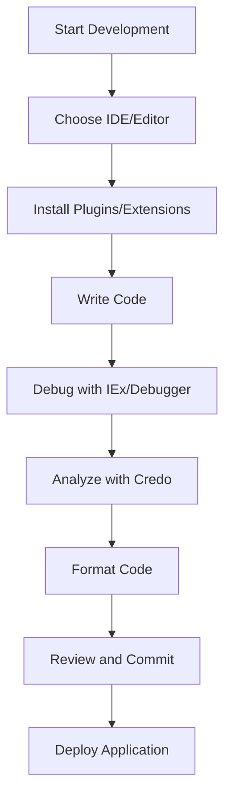

## 32.8. Tooling and IDEs for Elixir Development

As an expert software engineer or architect, leveraging the right tools and IDEs can significantly enhance your productivity and efficiency when working with Elixir. This section delves into the best practices for setting up and using various tools and IDEs tailored for Elixir development. We'll explore integrated development environments, code editors, debugging tools, and productivity enhancements that can streamline your workflow.

### Integrated Development Environments (IDEs)

#### Visual Studio Code

Visual Studio Code (VS Code) is a popular choice among developers due to its versatility and extensive plugin ecosystem. For Elixir development, the ElixirLS (Elixir Language Server) extension is essential. It provides features such as code completion, inline documentation, and debugging support.

**Setup Guide:**

1. **Install VS Code**: Download and install Visual Studio Code from the [official website](https://code.visualstudio.com/).
2. **Install ElixirLS**: Open the Extensions view (`Ctrl+Shift+X`), search for "ElixirLS", and install the extension.
3. **Configure ElixirLS**: Customize settings in `settings.json` to suit your development needs.

```json
{
  "elixirLS.dialyzerEnabled": true,
  "elixirLS.fetchDeps": true
}
```

**Key Features:**

- **Code Completion**: Provides intelligent code suggestions.
- **Inline Documentation**: Displays documentation for functions and modules.
- **Debugging**: Supports breakpoints and step-through debugging.

#### IntelliJ IDEA

IntelliJ IDEA, with the Elixir plugin, offers a robust environment for Elixir development. It integrates well with other JetBrains tools, making it a great choice for developers already using the JetBrains ecosystem.

**Setup Guide:**

1. **Install IntelliJ IDEA**: Download and install from the [JetBrains website](https://www.jetbrains.com/idea/).
2. **Install Elixir Plugin**: Navigate to `File > Settings > Plugins`, search for "Elixir", and install the plugin.
3. **Configure Project**: Create a new Elixir project or import an existing one.

**Key Features:**

- **Refactoring Tools**: Supports advanced refactoring capabilities.
- **Version Control Integration**: Seamlessly integrates with Git and other VCS.
- **Code Analysis**: Offers static code analysis and inspections.

### Code Editors

While IDEs provide a comprehensive suite of tools, some developers prefer lightweight code editors for their simplicity and speed. Here are some popular choices for Elixir development:

#### Atom

Atom is a hackable text editor that can be customized extensively with packages. For Elixir, the `language-elixir` package provides syntax highlighting and basic support.

**Setup Guide:**

1. **Install Atom**: Download from the [Atom website](https://atom.io/).
2. **Install Elixir Package**: Go to `Edit > Preferences > Install`, search for "language-elixir", and install it.

**Customization Tips:**

- **Themes**: Customize the look and feel with themes.
- **Keybindings**: Modify keybindings to match your workflow.

#### Sublime Text

Sublime Text is known for its speed and efficiency. The `ElixirSublime` package adds Elixir support, including syntax highlighting and snippets.

**Setup Guide:**

1. **Install Sublime Text**: Download from the [Sublime Text website](https://www.sublimetext.com/).
2. **Install Package Control**: Follow instructions on the [Package Control website](https://packagecontrol.io/installation).
3. **Install ElixirSublime**: Use Package Control to install `ElixirSublime`.

**Customization Tips:**

- **Snippets**: Create custom snippets for frequently used code patterns.
- **Build Systems**: Set up custom build systems for Elixir projects.

#### Vim

Vim is a highly configurable text editor that can be tailored for Elixir development with plugins like `vim-elixir`.

**Setup Guide:**

1. **Install Vim**: Available on most Unix-based systems or download from [Vim website](https://www.vim.org/).
2. **Install vim-elixir**: Use a plugin manager like `vim-plug` to install `vim-elixir`.

```vim
Plug 'elixir-editors/vim-elixir'
```

**Customization Tips:**

- **Key Mappings**: Customize key mappings for efficient navigation.
- **Plugins**: Enhance functionality with additional plugins like `ale` for linting.

### Debugging Tools

Debugging is a critical aspect of software development. Elixir provides powerful built-in tools, and there are third-party options to enhance debugging capabilities.

#### IEx Debugging

IEx (Interactive Elixir) is a powerful tool for debugging Elixir code. It allows you to inspect and manipulate running processes.

**Key Commands:**

- **`break!`**: Set breakpoints in your code.
- **`continue`**: Continue execution after hitting a breakpoint.
- **`whereami`**: Show the current execution point.

**Example:**

```elixir
defmodule Example do
  def run do
    IO.puts("Start")
    :timer.sleep(1000)
    IO.puts("End")
  end
end

# In IEx
iex> :debugger.start()
iex> :int.ni(Example)
iex> :int.break(Example, 2)
iex> Example.run()
```

#### Debugger for Elixir

The Debugger for Elixir is a third-party tool that provides a graphical interface for debugging Elixir applications.

**Setup Guide:**

1. **Install Debugger**: Follow instructions on the [Debugger for Elixir GitHub page](https://github.com/elixir-lang/elixir).
2. **Configure**: Set up your project to use the debugger.

**Key Features:**

- **Graphical Interface**: Provides a visual representation of the call stack.
- **Breakpoints**: Easily set and manage breakpoints.
- **Variable Inspection**: Inspect variables and their values.

### Productivity Enhancements

Maximizing productivity involves using tools that ensure code quality and consistency. Here are some essential tools for Elixir development:

#### Credo

Credo is a static code analysis tool that helps you enforce coding conventions and identify potential issues in your code.

**Setup Guide:**

1. **Add Credo to Mix**: Add `{:credo, "~> 1.0", only: [:dev, :test], runtime: false}` to your `mix.exs` file.
2. **Run Credo**: Execute `mix credo` to analyze your code.

**Key Features:**

- **Code Consistency**: Enforces style guidelines.
- **Complexity Warnings**: Identifies complex code that may need refactoring.
- **Customizable**: Configure rules to match your project's needs.

#### Formatter Tools

Elixir comes with a built-in formatter that ensures your code adheres to a consistent style.

**Usage:**

- **Format Code**: Run `mix format` to automatically format your code.
- **Configuration**: Customize formatting options in `.formatter.exs`.

```elixir
[
  inputs: ["{mix,.formatter}.exs", "{config,lib,test}/**/*.{ex,exs}"]
]
```

### Visualizing Elixir Development Workflow

To better understand how these tools fit into your development workflow, let's visualize the process using a Mermaid.js diagram.



**Diagram Description:** This flowchart illustrates the typical workflow for Elixir development, starting from choosing an IDE or editor, through writing and debugging code, to deploying the application.

### References and Links

- [ElixirLS GitHub Repository](https://github.com/elixir-lsp/elixir-ls)
- [IntelliJ IDEA Elixir Plugin](https://plugins.jetbrains.com/plugin/7522-elixir)
- [Credo GitHub Repository](https://github.com/rrrene/credo)
- [Elixir Formatter Documentation](https://hexdocs.pm/mix/master/Mix.Tasks.Format.html)

### Knowledge Check

- **Question:** What are the benefits of using ElixirLS with VS Code?
- **Exercise:** Set up a new Elixir project in your preferred IDE and configure it with the tools discussed.

### Embrace the Journey

Remember, mastering these tools and IDEs is just the beginning. As you continue to develop with Elixir, you'll discover more ways to optimize your workflow and enhance your productivity. Keep experimenting, stay curious, and enjoy the journey!

## Quiz: Tooling and IDEs for Elixir Development



### Which IDE is known for its extensive plugin ecosystem and is popular for Elixir development?

- [x] Visual Studio Code
- [ ] Atom
- [ ] Sublime Text
- [ ] Vim

> **Explanation:** Visual Studio Code is known for its extensive plugin ecosystem, including the ElixirLS extension for Elixir development.

### What is the primary function of the ElixirLS extension in VS Code?

- [x] Code completion and debugging support
- [ ] Syntax highlighting
- [ ] Version control integration
- [ ] Build automation

> **Explanation:** ElixirLS provides code completion and debugging support, enhancing the development experience in VS Code.

### Which tool is used for static code analysis in Elixir?

- [x] Credo
- [ ] Dialyzer
- [ ] Mix
- [ ] ExUnit

> **Explanation:** Credo is a static code analysis tool that helps enforce coding conventions and identify potential issues in Elixir code.

### What is the purpose of the `mix format` command?

- [x] Automatically format Elixir code
- [ ] Compile Elixir code
- [ ] Run tests
- [ ] Start the Elixir application

> **Explanation:** The `mix format` command is used to automatically format Elixir code according to a consistent style.

### Which of the following editors is known for its speed and efficiency?

- [ ] Atom
- [x] Sublime Text
- [ ] Visual Studio Code
- [ ] IntelliJ IDEA

> **Explanation:** Sublime Text is known for its speed and efficiency, making it a popular choice among developers.

### What is the role of IEx in Elixir development?

- [x] Interactive shell for debugging and testing
- [ ] Code editor
- [ ] Build tool
- [ ] Version control system

> **Explanation:** IEx is an interactive shell used for debugging and testing Elixir code.

### Which plugin manager is commonly used with Vim for installing Elixir plugins?

- [x] vim-plug
- [ ] Package Control
- [ ] ElixirLS
- [ ] Mix

> **Explanation:** vim-plug is a popular plugin manager for Vim, used to install plugins like `vim-elixir`.

### What is the main advantage of using IntelliJ IDEA for Elixir development?

- [x] Advanced refactoring tools and version control integration
- [ ] Lightweight and fast
- [ ] Built-in terminal
- [ ] Extensive plugin ecosystem

> **Explanation:** IntelliJ IDEA offers advanced refactoring tools and seamless version control integration, making it a robust environment for Elixir development.

### True or False: The Elixir formatter can be customized using a `.formatter.exs` file.

- [x] True
- [ ] False

> **Explanation:** The Elixir formatter can be customized using a `.formatter.exs` file to specify formatting options.

### Which tool provides a graphical interface for debugging Elixir applications?

- [x] Debugger for Elixir
- [ ] IEx
- [ ] Mix
- [ ] Credo

> **Explanation:** Debugger for Elixir provides a graphical interface for debugging Elixir applications, making it easier to manage breakpoints and inspect variables.


