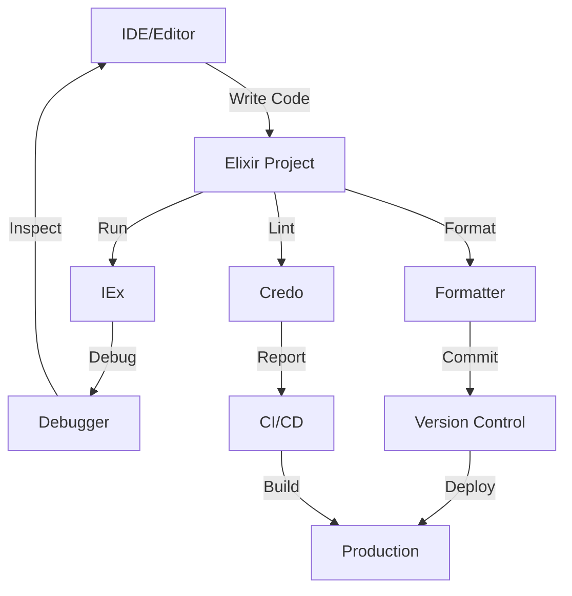

## 32.8. Tooling and IDEs for Elixir Development

As an expert software engineer or architect working with Elixir, having the right tools at your disposal is crucial for enhancing productivity, ensuring code quality, and simplifying the development process. This section provides a comprehensive overview of the best tooling and IDEs available for Elixir development, covering integrated development environments, code editors, debugging tools, and productivity enhancements.

### Integrated Development Environments (IDEs)

#### Visual Studio Code with Elixir Plugins

**Visual Studio Code (VS Code)** is a popular choice among developers due to its versatility, extensive plugin ecosystem, and robust support for various programming languages, including Elixir. To set up VS Code for Elixir development:

1. **Install ElixirLS**: The Elixir Language Server (ElixirLS) extension provides essential features such as code completion, inline documentation, and syntax highlighting. It also supports debugging and dialyzer integration.
   
   ```shell
   # Install ElixirLS through the Extensions Marketplace
   ext install jakebecker.elixir-ls
   ```

2. **Configure Formatter**: Ensure that the Elixir formatter is configured to maintain code consistency. You can customize the formatter settings in your `mix.exs` file.

3. **Utilize Snippets**: Leverage code snippets for common Elixir constructs to speed up development.

4. **Debugging Capabilities**: Use the built-in debugger to set breakpoints, inspect variables, and step through code execution.

#### IntelliJ IDEA with Elixir Plugin

**IntelliJ IDEA** is another powerful IDE that supports Elixir development through the Elixir plugin. It offers a rich set of features that enhance the development experience:

1. **Install the Elixir Plugin**: Available through the JetBrains plugin repository, the Elixir plugin provides syntax highlighting, code completion, and project management features.

2. **Refactoring Tools**: IntelliJ IDEA offers advanced refactoring tools that make it easier to maintain and improve your codebase.

3. **Integrated Version Control**: Seamlessly integrate with Git and other version control systems to manage your code efficiently.

4. **Comprehensive Debugging**: Utilize IntelliJ's robust debugging tools to troubleshoot and optimize your Elixir applications.

### Code Editors

While IDEs offer a comprehensive suite of tools, some developers prefer lightweight code editors for their simplicity and speed. Here are some popular code editors and how to configure them for Elixir development:

#### Atom

**Atom** is a hackable text editor that can be customized to suit your Elixir development needs:

1. **Install Elixir Packages**: Use the Atom package manager to install Elixir-specific packages such as `language-elixir` for syntax highlighting and `atom-elixir` for code snippets.

2. **Custom Keybindings**: Configure custom keybindings to streamline your workflow and improve efficiency.

3. **Git Integration**: Atom's built-in Git integration allows you to manage version control directly from the editor.

#### Sublime Text

**Sublime Text** is known for its speed and simplicity. To set it up for Elixir development:

1. **Install Elixir Syntax Highlighter**: Use the Package Control to install `ElixirSublime` for syntax highlighting.

2. **Code Snippets**: Create custom snippets for frequently used Elixir code patterns to save time.

3. **Build System Configuration**: Set up a custom build system to compile and run Elixir code directly from the editor.

#### Vim

**Vim** is a highly configurable text editor favored by many experienced developers. To optimize Vim for Elixir:

1. **Install Elixir Plugins**: Use a plugin manager like Vundle or Pathogen to install Elixir plugins such as `vim-elixir`.

2. **Custom Vimrc Configuration**: Customize your `.vimrc` file to include keybindings and settings specific to Elixir development.

3. **Syntax Highlighting and Indentation**: Ensure that syntax highlighting and proper indentation are enabled for Elixir files.

### Debugging Tools

Debugging is an essential part of software development. Elixir provides robust tools for debugging, both natively and through third-party solutions.

#### Utilizing IEx's Debugging Capabilities

**IEx** (Interactive Elixir) is a powerful tool for debugging Elixir applications:

1. **Breakpoints with IEx.pry**: Use `IEx.pry` to set breakpoints in your code. When the breakpoint is hit, the execution will pause, and you can inspect the current state.

   ```elixir
   defmodule Example do
     def run do
       IO.puts("Before breakpoint")
       require IEx; IEx.pry
       IO.puts("After breakpoint")
     end
   end
   ```

2. **Inspecting Variables**: Use IEx to inspect variables and evaluate expressions on the fly.

3. **Tracing and Profiling**: Utilize tools like `:dbg` and `:fprof` for tracing and profiling your applications.

#### Third-Party Tools: Debugger for Elixir

**Debugger for Elixir** is a third-party tool that provides a graphical interface for debugging Elixir applications:

1. **Installation**: Install the Debugger for Elixir package through your IDE's plugin manager or manually.

2. **Graphical Interface**: Use the graphical interface to set breakpoints, step through code, and inspect variables.

3. **Integration with IDEs**: The Debugger for Elixir integrates with popular IDEs like VS Code and IntelliJ IDEA, providing a seamless debugging experience.

### Productivity Enhancements

To maximize productivity, it's important to leverage tools that enforce code quality and streamline the development process.

#### Linters: Credo for Code Consistency

**Credo** is a static code analysis tool that helps maintain code consistency and quality:

1. **Installation**: Add Credo to your project's dependencies in `mix.exs` and run `mix credo` to analyze your code.

2. **Custom Configuration**: Customize Credo's configuration to tailor its checks to your project's specific needs.

3. **Continuous Integration**: Integrate Credo into your CI/CD pipeline to ensure code quality is maintained across your team.

#### Formatter Tools for Automatic Code Formatting

Elixir's built-in formatter ensures that your code adheres to a consistent style:

1. **Configuration**: Configure the formatter settings in your `mix.exs` file to suit your project's style guide.

2. **Automatic Formatting**: Use the `mix format` command to automatically format your codebase.

3. **Editor Integration**: Most IDEs and code editors support automatic formatting on save, ensuring that your code is always well-formatted.

### Try It Yourself

To deepen your understanding of Elixir tooling and IDEs, try the following exercises:

1. **Set Up VS Code**: Install ElixirLS and configure the formatter. Create a simple Elixir project and experiment with the debugging features.

2. **Customize Vim**: Install `vim-elixir` and configure your `.vimrc` file to enhance your Elixir development experience.

3. **Use IEx.pry**: Add breakpoints to an Elixir script using `IEx.pry` and practice inspecting variables and stepping through code execution.

4. **Analyze Code with Credo**: Run Credo on an existing Elixir project and address any issues it identifies.

### Visualizing Elixir Tooling Workflow

To better understand the workflow of using Elixir tooling, consider the following diagram that illustrates the interaction between various tools and the development process:


```mermaid
graph TD;
    A[IDE/Editor] -->|Write Code| B[Elixir Project];
    B -->|Run| C[IEx];
    B -->|Format| D[Formatter];
    B -->|Lint| E[Credo];
    C -->|Debug| F[Debugger];
    D -->|Commit| G[Version Control];
    E -->|Report| H[CI/CD];
    F -->|Inspect| A;
    G -->|Deploy| I[Production];
    H -->|Build| I;
```

This diagram represents the typical workflow of an Elixir developer, starting from writing code in an IDE or editor, running and debugging with IEx, formatting and linting the code, and finally deploying the application.

### Knowledge Check

Before moving on, consider these questions to test your understanding:

1. What are the benefits of using ElixirLS with Visual Studio Code for Elixir development?
2. How can you set breakpoints in Elixir code using IEx?
3. What role does Credo play in maintaining code quality?
4. How can you integrate Elixir's formatter into your development workflow?

### Embrace the Journey

Remember, mastering Elixir tooling and IDEs is an ongoing journey. As you continue to explore and experiment with different tools, you'll discover new ways to enhance your productivity and code quality. Stay curious, keep experimenting, and enjoy the process of becoming an even more proficient Elixir developer!

## Quiz Time!



### Which IDE is recommended for Elixir development due to its plugin ecosystem?

- [x] Visual Studio Code
- [ ] Notepad++
- [ ] Eclipse
- [ ] NetBeans

> **Explanation:** Visual Studio Code is recommended for Elixir development because of its extensive plugin ecosystem, including ElixirLS for language support.

### What is the purpose of the ElixirLS extension in Visual Studio Code?

- [x] Provides code completion and debugging features
- [ ] Translates Elixir code to JavaScript
- [ ] Converts Elixir to Python
- [ ] Analyzes network traffic

> **Explanation:** ElixirLS provides essential features such as code completion, debugging, and syntax highlighting for Elixir in Visual Studio Code.

### How can you set breakpoints in Elixir code using IEx?

- [x] Use `IEx.pry` in the code
- [ ] Use `debugger` keyword
- [ ] Use `breakpoint` function
- [ ] Use `halt` command

> **Explanation:** `IEx.pry` is used to set breakpoints in Elixir code, allowing you to pause execution and inspect variables.

### What tool is used for static code analysis in Elixir?

- [x] Credo
- [ ] Dialyzer
- [ ] Mix
- [ ] ExUnit

> **Explanation:** Credo is a static code analysis tool that helps maintain code consistency and quality in Elixir projects.

### Which text editor is known for its speed and simplicity?

- [x] Sublime Text
- [ ] IntelliJ IDEA
- [ ] Eclipse
- [ ] Visual Studio

> **Explanation:** Sublime Text is known for its speed and simplicity, making it a popular choice for lightweight code editing.

### What is the role of the Elixir formatter?

- [x] Ensures code adheres to a consistent style
- [ ] Translates Elixir to Ruby
- [ ] Compiles Elixir code to bytecode
- [ ] Analyzes code for security vulnerabilities

> **Explanation:** The Elixir formatter ensures that code adheres to a consistent style, promoting readability and maintainability.

### How can you integrate Credo into a CI/CD pipeline?

- [x] Run `mix credo` as part of the build process
- [ ] Use `credo` command in IEx
- [ ] Install Credo as a browser extension
- [ ] Use Credo to deploy applications

> **Explanation:** Credo can be integrated into a CI/CD pipeline by running `mix credo` as part of the build process to ensure code quality.

### What is the benefit of using custom keybindings in Atom?

- [x] Streamlines workflow and improves efficiency
- [ ] Increases file size
- [ ] Decreases application speed
- [ ] Complicates the user interface

> **Explanation:** Custom keybindings in Atom streamline workflow and improve efficiency by allowing developers to perform actions quickly.

### Which tool provides a graphical interface for debugging Elixir applications?

- [x] Debugger for Elixir
- [ ] Mix
- [ ] ExUnit
- [ ] Dialyzer

> **Explanation:** Debugger for Elixir provides a graphical interface for debugging Elixir applications, allowing for easier inspection of code execution.

### Is it true that IntelliJ IDEA offers advanced refactoring tools for Elixir development?

- [x] True
- [ ] False

> **Explanation:** IntelliJ IDEA offers advanced refactoring tools that make it easier to maintain and improve Elixir codebases.


