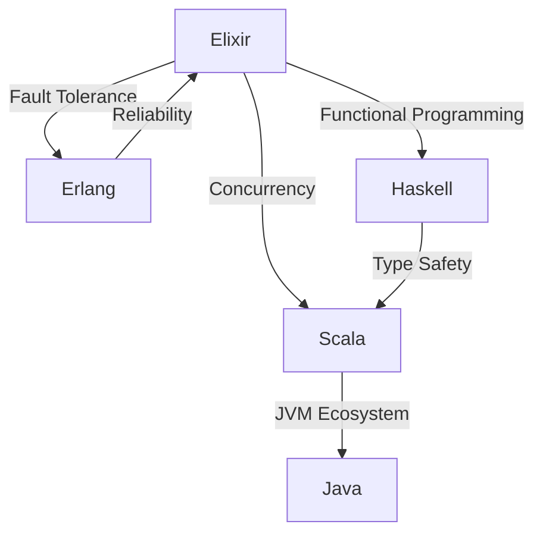

## 32.9. Comparing Elixir with Other Functional Languages

In this section, we will delve into a detailed comparison of Elixir with other prominent functional programming languages: Haskell, Erlang, and Scala. Each of these languages has its own philosophy, strengths, and use cases, making them suitable for different types of projects. By understanding these differences, you can make informed decisions about which language to use for your specific needs.

### Elixir vs. Haskell

#### Language Philosophy and Type Systems

**Elixir** is a dynamic, functional language built on the Erlang VM (BEAM). It emphasizes concurrency, fault tolerance, and scalability, making it ideal for building distributed systems. Elixir's syntax is designed to be approachable and readable, drawing inspiration from Ruby.

**Haskell**, on the other hand, is a statically typed, purely functional language. It is known for its strong type system, which includes features like type inference, algebraic data types, and monads. Haskell's type system helps catch errors at compile time, leading to more robust code.

**Key Differences:**

- **Type System:** Elixir is dynamically typed, while Haskell is statically typed. Haskell's type system can prevent many runtime errors, but it requires more upfront effort in defining types.
- **Purity:** Haskell is a purely functional language, meaning functions have no side effects. Elixir allows side effects, which can make certain tasks more straightforward but requires careful management of state and side effects.
- **Concurrency:** Elixir excels in concurrency with its lightweight processes and message-passing model, whereas Haskell uses Software Transactional Memory (STM) and other concurrency abstractions.

#### Use Cases

- **Elixir** is well-suited for web applications, real-time systems, and distributed applications due to its concurrency model and fault tolerance.
- **Haskell** is often used in academia, financial systems, and applications where correctness and mathematical precision are paramount.

#### Code Example: Elixir vs. Haskell

Let's compare a simple example of a function that calculates the factorial of a number in both languages.

**Elixir:**

```elixir
defmodule Math do
  def factorial(0), do: 1
  def factorial(n) when n > 0 do
    n * factorial(n - 1)
  end
end

IO.puts Math.factorial(5) # Output: 120
```

**Haskell:**

```haskell
factorial :: Integer -> Integer
factorial 0 = 1
factorial n = n * factorial (n - 1)

main :: IO ()
main = print (factorial 5) -- Output: 120
```

**Try It Yourself:** Modify the factorial function to handle negative numbers gracefully in both languages.

### Elixir vs. Erlang

#### Syntax Sugar and Tooling

**Elixir** was created to bring modern programming constructs and a more approachable syntax to the Erlang ecosystem. It provides features like macros, the pipe operator, and a more extensive standard library.

**Erlang** is the language on which Elixir is built. It is known for its simplicity, robustness, and ability to handle concurrent processes efficiently. Erlang's syntax can be more challenging for newcomers, but it is highly effective for building reliable systems.

**Key Differences:**

- **Syntax:** Elixir's syntax is more modern and user-friendly, while Erlang's syntax is more traditional and minimalistic.
- **Tooling:** Elixir offers a richer set of tools, such as Mix for build automation and Hex for package management, which can enhance developer productivity.
- **Community and Ecosystem:** Elixir has a growing community and ecosystem, with many libraries and frameworks like Phoenix for web development.

#### Use Cases

- **Elixir** is often chosen for web applications and projects that benefit from its modern syntax and tooling.
- **Erlang** remains a strong choice for telecommunications, messaging systems, and applications where uptime and reliability are critical.

#### Code Example: Elixir vs. Erlang

Let's see how a simple GenServer is implemented in both languages.

**Elixir:**

```elixir
defmodule Counter do
  use GenServer

  # Client API
  def start_link(initial_value) do
    GenServer.start_link(__MODULE__, initial_value, name: __MODULE__)
  end

  def increment do
    GenServer.call(__MODULE__, :increment)
  end

  # Server Callbacks
  def init(initial_value) do
    {:ok, initial_value}
  end

  def handle_call(:increment, _from, state) do
    {:reply, state + 1, state + 1}
  end
end

{:ok, _} = Counter.start_link(0)
IO.puts Counter.increment() # Output: 1
```

**Erlang:**

```erlang
-module(counter).
-behaviour(gen_server).

%% API
-export([start_link/1, increment/0]).

%% gen_server callbacks
-export([init/1, handle_call/3]).

start_link(InitialValue) ->
    gen_server:start_link({local, ?MODULE}, ?MODULE, InitialValue, []).

increment() ->
    gen_server:call(?MODULE, increment).

init(InitialValue) ->
    {ok, InitialValue}.

handle_call(increment, _From, State) ->
    {reply, State + 1, State + 1}.

%% Usage
{ok, _} = counter:start_link(0),
io:format("~p~n", [counter:increment()]). % Output: 1
```

**Try It Yourself:** Extend the GenServer to support decrementing the counter in both languages.

### Elixir vs. Scala

#### Concurrency and Application Domains

**Elixir** uses the Actor model for concurrency, where lightweight processes communicate via message passing. This model is highly effective for building scalable and fault-tolerant systems.

**Scala** is a hybrid language that combines functional and object-oriented programming. It runs on the JVM and offers powerful concurrency abstractions like Akka, which also uses the Actor model.

**Key Differences:**

- **Concurrency Model:** Both Elixir and Scala use the Actor model, but Elixir's implementation is more lightweight and integrated into the language itself.
- **Language Paradigms:** Scala supports both functional and object-oriented paradigms, providing flexibility in how you structure your code.
- **Ecosystem:** Scala benefits from the vast Java ecosystem, while Elixir has a growing ecosystem focused on functional programming and concurrency.

#### Use Cases

- **Elixir** is ideal for real-time applications, web services, and distributed systems.
- **Scala** is often used in data processing, big data applications, and systems that require integration with Java libraries.

#### Code Example: Elixir vs. Scala

Let's compare a simple example of concurrent processing in both languages.

**Elixir:**

```elixir
defmodule Concurrent do
  def run do
    tasks = for i <- 1..5 do
      Task.async(fn -> process(i) end)
    end

    Enum.map(tasks, &Task.await/1)
  end

  defp process(i) do
    IO.puts("Processing #{i}")
    :timer.sleep(1000)
    i * 2
  end
end

Concurrent.run()
```

**Scala:**

```scala
import scala.concurrent._
import ExecutionContext.Implicits.global
import scala.concurrent.duration._

object Concurrent {
  def run(): Unit = {
    val tasks = (1 to 5).map { i =>
      Future {
        process(i)
      }
    }

    Await.result(Future.sequence(tasks), Duration.Inf)
  }

  def process(i: Int): Int = {
    println(s"Processing $i")
    Thread.sleep(1000)
    i * 2
  }
}

Concurrent.run()
```

**Try It Yourself:** Modify the concurrent processing to handle errors gracefully in both languages.

### Strengths and Trade-offs

#### Understanding Where Elixir Excels

Elixir's strengths lie in its ability to handle concurrent, distributed, and fault-tolerant systems with ease. Its syntax and tooling make it accessible to developers, while its foundation on the BEAM VM ensures reliability and performance.

#### Scenarios Where Another Language Might Be More Suitable

- **Haskell** is preferable when type safety and mathematical precision are critical.
- **Erlang** is a strong choice for systems where uptime and reliability are paramount, especially in telecommunications.
- **Scala** is ideal for applications that require integration with Java or need to leverage the JVM's capabilities.

### Visualizing Language Comparisons

To better understand the differences and similarities between these languages, let's visualize their key characteristics using a Venn diagram.



**Diagram Description:** This Venn diagram illustrates the overlapping features and unique strengths of Elixir, Haskell, Erlang, and Scala. Elixir shares concurrency features with Scala, fault tolerance with Erlang, and functional programming with Haskell.

### Conclusion

In conclusion, Elixir offers a unique blend of features that make it an excellent choice for building scalable, concurrent, and fault-tolerant systems. However, understanding the strengths and trade-offs of other functional languages like Haskell, Erlang, and Scala can help you choose the right tool for your specific project needs. Remember, the best language is the one that aligns with your project's requirements and your team's expertise.

## Quiz: Comparing Elixir with Other Functional Languages



### Which language is known for its strong type system and purely functional nature?

- [ ] Elixir
- [x] Haskell
- [ ] Erlang
- [ ] Scala

> **Explanation:** Haskell is known for its strong type system and purely functional nature, which helps catch errors at compile time.

### What concurrency model does Elixir use?

- [x] Actor model
- [ ] Software Transactional Memory
- [ ] Thread-based concurrency
- [ ] Coroutine-based concurrency

> **Explanation:** Elixir uses the Actor model for concurrency, where lightweight processes communicate via message passing.

### Which language is built on the BEAM VM and emphasizes fault tolerance?

- [x] Elixir
- [ ] Haskell
- [x] Erlang
- [ ] Scala

> **Explanation:** Both Elixir and Erlang are built on the BEAM VM and emphasize fault tolerance and concurrency.

### Which language combines functional and object-oriented programming paradigms?

- [ ] Elixir
- [ ] Haskell
- [ ] Erlang
- [x] Scala

> **Explanation:** Scala is a hybrid language that combines functional and object-oriented programming paradigms.

### Which language benefits from the vast Java ecosystem?

- [ ] Elixir
- [ ] Haskell
- [ ] Erlang
- [x] Scala

> **Explanation:** Scala benefits from the vast Java ecosystem as it runs on the JVM and can leverage Java libraries.

### What is a key feature of Haskell's type system?

- [x] Type inference
- [ ] Dynamic typing
- [ ] Macros
- [ ] Message passing

> **Explanation:** Haskell's type system includes type inference, which allows the compiler to deduce types automatically.

### Which language is known for its simplicity and robustness in building reliable systems?

- [ ] Elixir
- [ ] Haskell
- [x] Erlang
- [ ] Scala

> **Explanation:** Erlang is known for its simplicity and robustness, making it ideal for building reliable systems.

### What tool does Elixir provide for build automation?

- [x] Mix
- [ ] Maven
- [ ] Gradle
- [ ] Cabal

> **Explanation:** Elixir provides Mix for build automation, which enhances developer productivity.

### Which language is often used in academia and financial systems?

- [ ] Elixir
- [x] Haskell
- [ ] Erlang
- [ ] Scala

> **Explanation:** Haskell is often used in academia and financial systems due to its emphasis on correctness and precision.

### True or False: Elixir and Scala both use the Actor model for concurrency.

- [x] True
- [ ] False

> **Explanation:** Both Elixir and Scala use the Actor model for concurrency, although their implementations differ.



Remember, this is just the beginning. As you progress, you'll build more complex and interactive systems. Keep experimenting, stay curious, and enjoy the journey!
