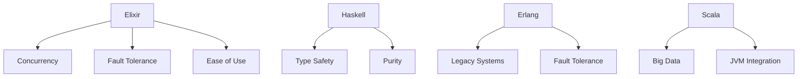

## 32.9. Comparing Elixir with Other Functional Languages

In the realm of functional programming, Elixir stands out for its concurrency model, fault tolerance, and ease of use. However, it shares the stage with several other powerful languages, each with its unique philosophy and strengths. In this section, we will delve into how Elixir compares with Haskell, Erlang, and Scala, exploring their differences in language philosophy, type systems, concurrency models, and more.

### Elixir vs. Haskell

#### Language Philosophy

Haskell is a purely functional programming language, emphasizing immutability and mathematical functions. It is designed to be a research-oriented language, focusing on type safety and correctness. Elixir, on the other hand, is a functional language built on the Erlang VM (BEAM), designed for building scalable and maintainable applications. While Haskell is often used in academic and research settings, Elixir is more pragmatic, aimed at solving real-world problems in distributed systems.

#### Type Systems

Haskell boasts a strong static type system with type inference, which can catch errors at compile time, ensuring a high level of correctness. This makes Haskell ideal for applications where reliability is paramount. Elixir, however, is dynamically typed, which offers flexibility and rapid development cycles. While this can lead to runtime errors, Elixir's robust tooling and testing frameworks help mitigate these risks.

#### Use Cases

Haskell is often used in domains where correctness and mathematical precision are crucial, such as financial systems and compilers. Elixir excels in web applications, real-time systems, and distributed applications, thanks to its concurrency model and the powerful OTP framework.

#### Code Example

Let's compare a simple example of a function that calculates the factorial of a number in both languages:

**Haskell:**

```haskell
factorial :: Integer -> Integer
factorial 0 = 1
factorial n = n * factorial (n - 1)
```

**Elixir:**

```elixir
defmodule Math do
  def factorial(0), do: 1
  def factorial(n), do: n * factorial(n - 1)
end
```

### Elixir vs. Erlang

#### Syntax Sugar

Elixir was created to bring a more modern syntax to the Erlang ecosystem, making it more approachable for developers coming from Ruby or Python backgrounds. It introduces features like macros and the pipe operator, which enhance code readability and maintainability.

#### Tooling and Ecosystem

Elixir offers a rich set of tools, such as Mix for project management and Hex for package management, which streamline development processes. While Erlang has a mature ecosystem, Elixir's tooling is more developer-friendly, contributing to its growing popularity.

#### Community

Elixir has a vibrant and rapidly growing community, with a strong focus on web development and real-time applications. Erlang's community, while smaller, is deeply rooted in telecommunications and highly reliable systems.

#### Code Example

Let's see how a simple GenServer is implemented in both languages:

**Erlang:**

```erlang
-module(counter).
-behaviour(gen_server).

%% API
-export([start_link/0, increment/0, get_count/0]).

%% gen_server callbacks
-export([init/1, handle_call/3, handle_cast/2, handle_info/2, terminate/2, code_change/3]).

start_link() ->
    gen_server:start_link({local, ?MODULE}, ?MODULE, [], []).

increment() ->
    gen_server:cast(?MODULE, increment).

get_count() ->
    gen_server:call(?MODULE, get_count).

init([]) ->
    {ok, 0}.

handle_call(get_count, _From, Count) ->
    {reply, Count, Count}.

handle_cast(increment, Count) ->
    {noreply, Count + 1}.
```

**Elixir:**

```elixir
defmodule Counter do
  use GenServer

  ## Client API

  def start_link do
    GenServer.start_link(__MODULE__, 0, name: __MODULE__)
  end

  def increment do
    GenServer.cast(__MODULE__, :increment)
  end

  def get_count do
    GenServer.call(__MODULE__, :get_count)
  end

  ## Server Callbacks

  def init(initial_count) do
    {:ok, initial_count}
  end

  def handle_call(:get_count, _from, count) do
    {:reply, count, count}
  end

  def handle_cast(:increment, count) do
    {:noreply, count + 1}
  end
end
```

### Elixir vs. Scala

#### Concurrency Models

Scala runs on the Java Virtual Machine (JVM) and offers a hybrid of object-oriented and functional programming paradigms. It uses the Akka toolkit for concurrency, which is based on the actor model, similar to Elixir's processes. Elixir's lightweight processes and message-passing model, however, are more efficient for building highly concurrent systems.

#### Application Domains

Scala is often used in big data processing, thanks to its seamless integration with Apache Spark. Elixir, with its real-time capabilities, is favored in web development and telecommunications.

#### Code Example

Consider a simple actor model implementation in both languages:

**Scala with Akka:**

```scala
import akka.actor._

class Counter extends Actor {
  var count = 0

  def receive = {
    case "increment" => count += 1
    case "get_count" => sender() ! count
  }
}

object Main extends App {
  val system = ActorSystem("CounterSystem")
  val counter = system.actorOf(Props[Counter], name = "counter")

  counter ! "increment"
  counter ! "get_count"
}
```

**Elixir:**

```elixir
defmodule Counter do
  use GenServer

  ## Client API

  def start_link do
    GenServer.start_link(__MODULE__, 0, name: __MODULE__)
  end

  def increment do
    GenServer.cast(__MODULE__, :increment)
  end

  def get_count do
    GenServer.call(__MODULE__, :get_count)
  end

  ## Server Callbacks

  def init(initial_count) do
    {:ok, initial_count}
  end

  def handle_call(:get_count, _from, count) do
    {:reply, count, count}
  end

  def handle_cast(:increment, count) do
    {:noreply, count + 1}
  end
end
```

### Strengths and Trade-offs

#### Elixir's Strengths

- **Concurrency:** Elixir's lightweight processes and the BEAM VM make it ideal for concurrent applications.
- **Fault Tolerance:** Built-in support for fault tolerance through OTP.
- **Ease of Use:** Modern syntax and rich tooling make it accessible for developers.

#### Trade-offs

- **Type Safety:** Lack of static typing can lead to runtime errors.
- **Performance:** While efficient in concurrency, Elixir may not match the raw performance of languages like C++ or Rust in CPU-intensive tasks.

#### When to Choose Another Language

- **Haskell:** When correctness and type safety are critical.
- **Erlang:** For legacy systems or when deep integration with existing Erlang codebases is needed.
- **Scala:** For big data processing or when JVM integration is required.

### Visualizing Language Comparisons

To better understand the differences and similarities between Elixir and these languages, let's visualize their key characteristics:


```mermaid
graph TD;
    A[Elixir] --> B[Concurrency];
    A --> C[Fault Tolerance];
    A --> D[Ease of Use];
    E[Haskell] --> F[Type Safety];
    E --> G[Purity];
    H[Erlang] --> I[Legacy Systems];
    H --> J[Fault Tolerance];
    K[Scala] --> L[Big Data];
    K --> M[JVM Integration];
```

**Diagram Description:** This diagram highlights the key characteristics of each language, showing where they excel.

### Try It Yourself

Experiment with the code examples provided. Try modifying the factorial functions to handle larger numbers or add logging to the GenServer implementations to track state changes.

### Knowledge Check

- Explain the primary differences between Elixir and Haskell in terms of type systems.
- Demonstrate how Elixir's syntax sugar improves upon Erlang's syntax.
- Provide an example of a scenario where Scala might be preferred over Elixir.

### Embrace the Journey

Remember, choosing the right language depends on your specific needs and the problem you're trying to solve. Each language has its strengths and trade-offs. Keep experimenting, stay curious, and enjoy the journey!

## Quiz Time!



### What is a key difference between Elixir and Haskell?

- [x] Elixir is dynamically typed, while Haskell is statically typed.
- [ ] Both are statically typed.
- [ ] Elixir is statically typed, while Haskell is dynamically typed.
- [ ] Both are dynamically typed.

> **Explanation:** Elixir is dynamically typed, offering flexibility, whereas Haskell is statically typed, providing type safety.

### Which language is known for its strong type system and mathematical precision?

- [ ] Elixir
- [x] Haskell
- [ ] Erlang
- [ ] Scala

> **Explanation:** Haskell is known for its strong static type system and emphasis on mathematical precision.

### How does Elixir improve upon Erlang in terms of syntax?

- [x] By introducing modern syntax features like macros and the pipe operator.
- [ ] By removing macros.
- [ ] By using the same syntax as Erlang.
- [ ] By eliminating the pipe operator.

> **Explanation:** Elixir introduces modern syntax features such as macros and the pipe operator, enhancing code readability.

### What concurrency model does Scala use?

- [ ] GenServer
- [ ] Processes
- [x] Actor model with Akka
- [ ] Threads

> **Explanation:** Scala uses the actor model for concurrency, implemented through the Akka toolkit.

### Which language is best suited for building real-time web applications?

- [x] Elixir
- [ ] Haskell
- [ ] Erlang
- [ ] Scala

> **Explanation:** Elixir, with its concurrency model and real-time capabilities, is ideal for building real-time web applications.

### Which language is often used for big data processing?

- [ ] Elixir
- [ ] Haskell
- [ ] Erlang
- [x] Scala

> **Explanation:** Scala is commonly used in big data processing, particularly with Apache Spark.

### When might you choose Haskell over Elixir?

- [x] When type safety and correctness are critical.
- [ ] When building web applications.
- [ ] When you need real-time capabilities.
- [ ] When integrating with the JVM.

> **Explanation:** Haskell is chosen for its strong type safety and correctness, especially in domains requiring mathematical precision.

### What is a key benefit of Elixir's concurrency model?

- [x] Lightweight processes and efficient message-passing.
- [ ] Heavyweight threads.
- [ ] Static typing.
- [ ] Object-oriented programming.

> **Explanation:** Elixir's concurrency model is based on lightweight processes and efficient message-passing, ideal for concurrent applications.

### Which language has a vibrant community focused on web development?

- [x] Elixir
- [ ] Haskell
- [ ] Erlang
- [ ] Scala

> **Explanation:** Elixir has a vibrant community with a strong focus on web development and real-time applications.

### True or False: Erlang and Elixir share the same underlying VM.

- [x] True
- [ ] False

> **Explanation:** Both Erlang and Elixir run on the BEAM VM, which is known for its concurrency and fault tolerance.


