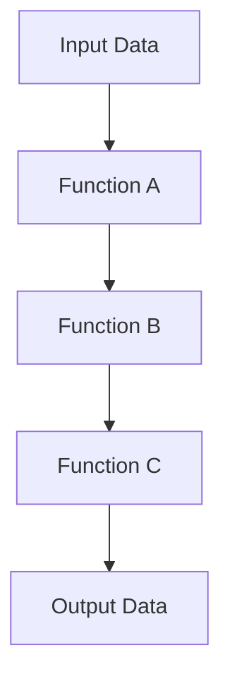

## 4.1. Using the Pipe Operator Effectively

The pipe operator (`|>`) is a powerful tool in Elixir that allows developers to write more readable and maintainable code by transforming nested function calls into clear, linear pipelines. This section will guide you through the effective use of the pipe operator, enhancing your ability to write idiomatic Elixir code. We'll explore best practices, common use cases, and provide practical examples to solidify your understanding.

### Enhancing Readability

One of the primary benefits of the pipe operator is its ability to enhance code readability. In functional programming, functions often return values that are immediately used as inputs to other functions. This can lead to deeply nested function calls, which are difficult to read and understand. The pipe operator addresses this by allowing you to express a sequence of operations in a linear, top-to-bottom fashion.

#### Transforming Nested Function Calls into Clear Pipelines

Consider the following example of nested function calls:

```elixir
result = function_c(function_b(function_a(value)))
```

This code can be difficult to read, especially as the number of functions increases. Using the pipe operator, we can transform this into a more readable form:

```elixir
result = value
         |> function_a()
         |> function_b()
         |> function_c()
```

In this pipeline, the output of each function is passed as the input to the next function, creating a clear and logical flow of data.

#### Code Example: Data Transformation

Let's look at a practical example involving data transformation. Suppose we have a list of numbers and we want to perform the following operations: filter out even numbers, square the remaining numbers, and then sum them up.

Without the pipe operator, the code might look like this:

```elixir
numbers = [1, 2, 3, 4, 5, 6]
sum_of_squares = Enum.sum(Enum.map(Enum.filter(numbers, fn x -> rem(x, 2) != 0 end), fn x -> x * x end))
```

With the pipe operator, we can rewrite this code to improve readability:

```elixir
numbers = [1, 2, 3, 4, 5, 6]

sum_of_squares = numbers
                 |> Enum.filter(fn x -> rem(x, 2) != 0 end)
                 |> Enum.map(fn x -> x * x end)
                 |> Enum.sum()
```

This version is easier to read and understand, as it clearly outlines the sequence of operations.

### Best Practices

To use the pipe operator effectively, it's important to follow certain best practices. These practices will help you write clean, maintainable, and efficient code.

#### Keeping Functions Simple

When using the pipe operator, aim to keep each function in the pipeline simple and focused on a single task. This makes it easier to understand the purpose of each step in the pipeline and reduces the likelihood of introducing bugs.

#### Avoiding Side Effects

Functions in a pipeline should ideally be pure, meaning they do not have side effects. Side effects can make it difficult to reason about the behavior of the pipeline and can lead to unexpected results.

#### Consistent Data Types

Ensure that the data type returned by each function in the pipeline is compatible with the next function. This consistency is crucial for maintaining the flow of data through the pipeline.

#### Code Example: Avoiding Side Effects

Consider a scenario where we want to log each step in a pipeline. A common mistake is to include logging as a side effect within the pipeline:

```elixir
result = data
         |> step_one()
         |> IO.inspect(label: "After step one") # Side effect
         |> step_two()
         |> IO.inspect(label: "After step two") # Side effect
         |> step_three()
```

Instead, handle logging outside of the pipeline to maintain purity:

```elixir
result = data
         |> step_one()
         |> step_two()
         |> step_three()

IO.inspect(result, label: "Final result")
```

### Common Use Cases

The pipe operator is particularly useful in scenarios involving data transformation sequences and processing workflows. Let's explore some common use cases where the pipe operator shines.

#### Data Transformation Sequences

Data transformation often involves applying a series of operations to a collection of data. The pipe operator allows you to express these transformations in a clear and concise manner.

#### Code Example: String Manipulation

Suppose we have a string and we want to perform the following operations: trim whitespace, convert to uppercase, and split into a list of words.

Without the pipe operator, the code might look like this:

```elixir
string = "  hello world  "
words = String.split(String.upcase(String.trim(string)))
```

With the pipe operator, we can rewrite this code to improve readability:

```elixir
string = "  hello world  "

words = string
        |> String.trim()
        |> String.upcase()
        |> String.split()
```

#### Processing Workflows

In processing workflows, data often flows through multiple stages, each performing a specific operation. The pipe operator allows you to express these workflows in a linear fashion, making it easier to understand the overall process.

#### Code Example: Image Processing

Consider an image processing pipeline where we want to load an image, apply a filter, and then save the result.

Without the pipe operator, the code might look like this:

```elixir
image = load_image("path/to/image.png")
filtered_image = apply_filter(image, :sepia)
save_image(filtered_image, "path/to/filtered_image.png")
```

With the pipe operator, we can rewrite this code to improve readability:

```elixir
"image.png"
|> load_image()
|> apply_filter(:sepia)
|> save_image("filtered_image.png")
```

### Visualizing the Pipe Operator

To further enhance your understanding of the pipe operator, let's visualize how data flows through a pipeline using a Mermaid.js diagram.



In this diagram, data flows from the input through each function in the pipeline, ultimately producing the output. This visual representation highlights the linear nature of pipelines and the clear flow of data.

### Try It Yourself

To solidify your understanding of the pipe operator, try modifying the code examples provided in this section. Experiment with different functions and data types to see how the pipe operator can be used in various scenarios.

#### Exercise: Data Transformation

Given a list of strings, transform each string by trimming whitespace, converting to lowercase, and then reversing the characters. Use the pipe operator to achieve this transformation.

```elixir
strings = ["  Hello ", " World  ", " Elixir "]

transformed_strings = strings
                      |> Enum.map(&String.trim/1)
                      |> Enum.map(&String.downcase/1)
                      |> Enum.map(&String.reverse/1)

IO.inspect(transformed_strings)
```

### Knowledge Check

Before moving on, let's review some key takeaways from this section:

- The pipe operator enhances code readability by transforming nested function calls into clear pipelines.
- Keep functions in a pipeline simple and avoid side effects to maintain code purity.
- The pipe operator is particularly useful in data transformation sequences and processing workflows.

### Embrace the Journey

Remember, mastering the pipe operator is just one step in your journey to becoming an expert Elixir developer. As you continue to explore the language, you'll discover more powerful tools and techniques that will enhance your coding skills. Keep experimenting, stay curious, and enjoy the journey!

## Quiz: Using the Pipe Operator Effectively



### What is the primary benefit of using the pipe operator in Elixir?

- [x] Enhancing code readability
- [ ] Improving execution speed
- [ ] Reducing memory usage
- [ ] Enabling parallel processing

> **Explanation:** The pipe operator enhances code readability by transforming nested function calls into clear, linear pipelines.

### Which of the following is a best practice when using the pipe operator?

- [x] Keeping functions simple
- [ ] Including side effects
- [ ] Using complex data types
- [ ] Nesting pipelines

> **Explanation:** Keeping functions simple helps maintain readability and reduces the likelihood of introducing bugs.

### What should you avoid when using the pipe operator?

- [x] Side effects
- [ ] Pure functions
- [ ] Consistent data types
- [ ] Simple functions

> **Explanation:** Avoiding side effects ensures that the pipeline remains predictable and easy to reason about.

### In which scenario is the pipe operator particularly useful?

- [x] Data transformation sequences
- [ ] Memory management
- [ ] Network communication
- [ ] File I/O operations

> **Explanation:** The pipe operator is particularly useful in data transformation sequences, where multiple operations are applied to a collection of data.

### What is the result of the following pipeline?
```elixir
"  hello  "
|> String.trim()
|> String.upcase()
```

- [x] "HELLO"
- [ ] "  HELLO  "
- [ ] "hello"
- [ ] "  hello  "

> **Explanation:** The pipeline trims whitespace and converts the string to uppercase, resulting in "HELLO".

### How can you handle logging in a pipeline without introducing side effects?

- [x] Handle logging outside of the pipeline
- [ ] Include logging as a side effect within the pipeline
- [ ] Use a separate logging function within the pipeline
- [ ] Avoid logging altogether

> **Explanation:** Handling logging outside of the pipeline maintains purity and avoids side effects.

### What is a common mistake when using the pipe operator?

- [x] Including side effects
- [ ] Using pure functions
- [ ] Maintaining consistent data types
- [ ] Keeping functions simple

> **Explanation:** Including side effects can lead to unpredictable behavior and should be avoided.

### Which of the following is a benefit of using the pipe operator?

- [x] Improved code readability
- [ ] Faster execution
- [ ] Reduced memory usage
- [ ] Enhanced security

> **Explanation:** The pipe operator improves code readability by allowing you to express a sequence of operations in a linear, top-to-bottom fashion.

### What is the purpose of the pipe operator in Elixir?

- [x] To pass the result of one function as the input to the next function
- [ ] To execute functions in parallel
- [ ] To optimize memory usage
- [ ] To handle errors

> **Explanation:** The pipe operator is used to pass the result of one function as the input to the next function, creating a clear flow of data.

### True or False: The pipe operator can be used to transform nested function calls into clear pipelines.

- [x] True
- [ ] False

> **Explanation:** True. The pipe operator transforms nested function calls into clear, linear pipelines, enhancing code readability.




