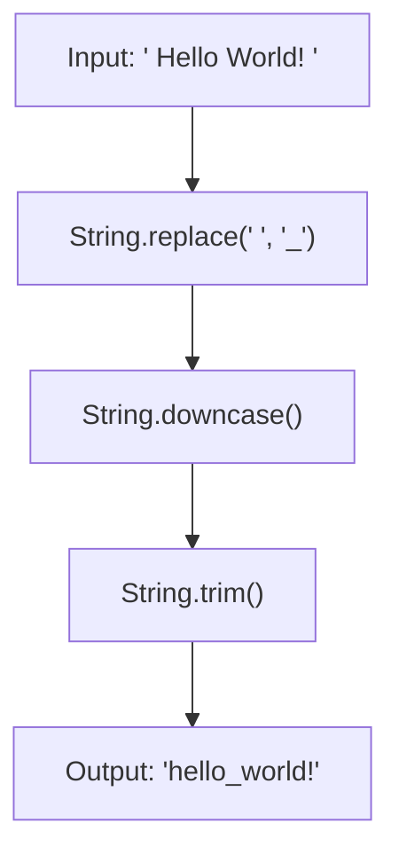

## 4.1. Using the Pipe Operator Effectively

The Elixir pipe operator (`|>`) is a powerful tool that enhances code readability and maintainability by transforming nested function calls into a clear and concise sequence of operations. In this section, we will explore the effective use of the pipe operator, delve into best practices, and examine common use cases that highlight its utility in data transformation and processing workflows.

### Enhancing Readability

One of the primary benefits of the pipe operator is its ability to transform complex, nested function calls into a linear sequence of operations. This not only makes the code more readable but also easier to reason about.

#### Transforming Nested Function Calls into Clear Pipelines

Consider the following example of nested function calls:

```elixir
result = String.trim(String.downcase(String.replace(" Hello World! ", " ", "_")))
```

While this code is functional, it can be difficult to read and understand at a glance. By using the pipe operator, we can transform this into a more readable pipeline:

```elixir
result = " Hello World! "
|> String.replace(" ", "_")
|> String.downcase()
|> String.trim()
```

In this transformation, each step of the data processing is clearly delineated, making it easier to follow the flow of data through the functions.

#### Visualizing the Flow of Data

To better understand how the pipe operator facilitates data flow, consider the following diagram:


```mermaid
graph TD;
    A["Input: ' Hello World! '"] --> B["String.replace(' ', '_')"];
    B --> C["String.downcase()"];
    C --> D["String.trim()"];
    D --> E["Output: 'hello_world!'"];
```

This diagram illustrates how the input string is transformed step-by-step through each function in the pipeline, ultimately resulting in the final output.

### Best Practices

While the pipe operator is a powerful tool, it is important to use it effectively to maintain clean and efficient code.

#### Keeping Functions Simple

When using the pipe operator, it is best to keep each function in the pipeline simple and focused on a single task. This not only enhances readability but also makes it easier to test and debug individual functions.

#### Avoiding Side Effects

Functions within a pipeline should be pure, meaning they do not produce side effects or rely on external state. This ensures that the pipeline is predictable and behaves consistently.

#### Consistent Data Types

Ensure that the output of each function in the pipeline matches the expected input type of the subsequent function. This consistency prevents runtime errors and maintains the integrity of the pipeline.

### Common Use Cases

The pipe operator is particularly useful in scenarios involving data transformation and processing workflows.

#### Data Transformation Sequences

Consider a scenario where we need to process a list of user inputs, trimming whitespace, converting to lowercase, and removing duplicates:

```elixir
inputs = [" Alice ", "BOB", "alice", " Bob "]

processed_inputs = inputs
|> Enum.map(&String.trim/1)
|> Enum.map(&String.downcase/1)
|> Enum.uniq()
```

In this example, the pipe operator allows us to apply a series of transformations to the list in a clear and concise manner.

#### Processing Workflows

The pipe operator is also useful in more complex workflows, such as processing data from an external API:

```elixir
def fetch_and_process_data(url) do
  HTTPoison.get(url)
  |> handle_response()
  |> extract_data()
  |> transform_data()
end
```

In this workflow, each step is clearly defined, from fetching the data to transforming it for further use.

### Try It Yourself

Experiment with the pipe operator by modifying the following code example to add additional transformations or change the order of operations:

```elixir
data = ["  Cat ", "dog", "BIRD", " cat "]

processed_data = data
|> Enum.map(&String.trim/1)
|> Enum.map(&String.downcase/1)
|> Enum.uniq()
|> Enum.sort()

IO.inspect(processed_data)
```

Try adding a transformation to capitalize each word or remove items that are shorter than 4 characters.

### Conclusion

The pipe operator is an essential tool in Elixir for writing clean, readable, and efficient code. By transforming nested function calls into clear pipelines, we can enhance the readability of our code and streamline data processing workflows. Remember to keep functions simple, avoid side effects, and ensure consistent data types throughout the pipeline.

## Quiz Time!



### What is the primary benefit of using the pipe operator in Elixir?

- [x] Enhancing code readability
- [ ] Increasing code execution speed
- [ ] Reducing memory usage
- [ ] Enabling parallel processing

> **Explanation:** The pipe operator enhances code readability by transforming nested function calls into clear, linear pipelines.

### Which of the following is a best practice when using the pipe operator?

- [x] Keeping functions simple and focused
- [ ] Using side effects to modify external state
- [ ] Mixing data types within the pipeline
- [ ] Including complex logic within each function

> **Explanation:** Keeping functions simple and focused enhances readability and maintainability, while avoiding side effects ensures predictability.

### In a pipeline, what should be consistent between each function?

- [x] Data types
- [ ] Variable names
- [ ] Function names
- [ ] Comments

> **Explanation:** Consistent data types between functions prevent runtime errors and maintain the integrity of the pipeline.

### What is the output of the following pipeline?
```elixir
result = " Hello World! "
|> String.replace(" ", "_")
|> String.downcase()
|> String.trim()
```

- [x] "hello_world!"
- [ ] " Hello World! "
- [ ] "hello world!"
- [ ] "hello_world"

> **Explanation:** The pipeline replaces spaces with underscores, converts to lowercase, and trims whitespace, resulting in "hello_world!".

### Which function is used to remove duplicates in a list within a pipeline?

- [x] Enum.uniq()
- [ ] Enum.map()
- [ ] Enum.filter()
- [ ] Enum.reduce()

> **Explanation:** Enum.uniq() is used to remove duplicates from a list.

### What is a common use case for the pipe operator?

- [x] Data transformation sequences
- [ ] Memory management
- [ ] Thread synchronization
- [ ] File I/O operations

> **Explanation:** The pipe operator is commonly used for data transformation sequences, allowing for clear and concise processing workflows.

### How does the pipe operator improve code maintainability?

- [x] By making the sequence of operations clear and easy to follow
- [ ] By reducing the number of lines of code
- [ ] By eliminating the need for comments
- [ ] By increasing code execution speed

> **Explanation:** The pipe operator improves maintainability by making the sequence of operations clear and easy to follow.

### What should be avoided within functions in a pipeline?

- [x] Side effects
- [ ] Pure functions
- [ ] Simple logic
- [ ] Consistent data types

> **Explanation:** Side effects should be avoided to ensure the pipeline is predictable and behaves consistently.

### Which of the following is true about the pipe operator?

- [x] It transforms nested function calls into a linear sequence
- [ ] It increases code execution speed
- [ ] It is used for error handling
- [ ] It manages memory allocation

> **Explanation:** The pipe operator transforms nested function calls into a linear sequence, enhancing readability.

### True or False: The pipe operator can be used to parallelize code execution.

- [ ] True
- [x] False

> **Explanation:** The pipe operator does not parallelize code execution; it is used to create a linear sequence of operations.



Remember, mastering the pipe operator is just the beginning of writing clean and efficient Elixir code. As you continue to explore and experiment, you'll discover even more ways to leverage this powerful tool. Keep practicing, stay curious, and enjoy the journey!
