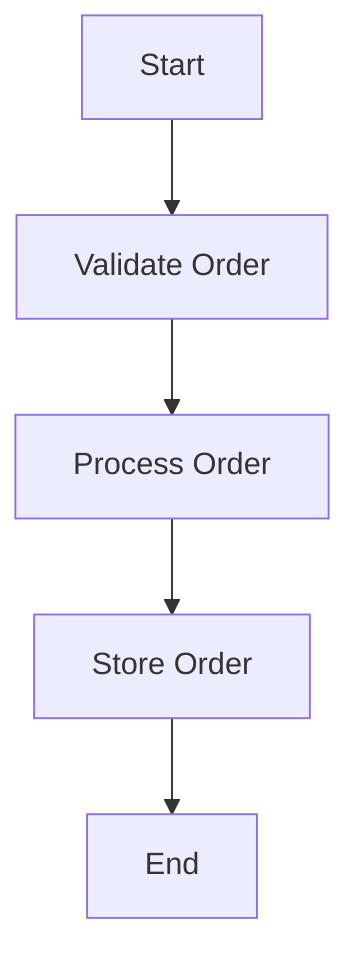

## 4.10. Respecting the Single Responsibility Principle

In the realm of software engineering, the Single Responsibility Principle (SRP) is a cornerstone of maintainable and scalable code. This principle asserts that every module or class should have responsibility over a single part of the functionality provided by the software, and that responsibility should be entirely encapsulated by the class. In Elixir, this principle translates into writing focused functions and modules that each serve a distinct purpose. Let's explore how we can apply SRP in Elixir to create clean, efficient, and maintainable code.

### Understanding the Single Responsibility Principle

The Single Responsibility Principle is one of the five SOLID principles of object-oriented design, but it is equally applicable to functional programming languages like Elixir. The essence of SRP is to ensure that a piece of code, whether it be a function or a module, has one clear purpose. This makes the code easier to understand, test, and maintain.

#### Key Concepts

- **Focused Functions**: Functions should perform a single task or operation. This makes them easier to test and reuse.
- **Cohesive Modules**: Modules should encapsulate related functions that work together to perform a broader task.
- **Separation of Concerns**: Different aspects of the application should be handled by different modules or functions.

### Benefits of the Single Responsibility Principle

Adhering to the Single Responsibility Principle offers several benefits:

- **Easier Testing**: Functions and modules with a single responsibility are easier to test because they have fewer dependencies and side effects.
- **Simplified Debugging**: When a function or module has a single responsibility, it's easier to identify where a bug might be occurring.
- **Enhanced Maintainability**: Code that adheres to SRP is easier to modify and extend because changes are localized to specific parts of the codebase.
- **Improved Readability**: Code with a single responsibility is easier to read and understand, which is crucial for collaboration and long-term maintenance.

### Writing Focused Functions and Modules

To respect the Single Responsibility Principle in Elixir, we must write focused functions and modules. Let's explore how to achieve this with practical examples.

#### Example: Breaking Down Complex Logic

Consider a scenario where we need to process a list of orders. Each order needs to be validated, processed, and then stored in a database. Instead of writing a single function that does all of this, we can break it down into smaller, focused functions.

```elixir
defmodule OrderProcessor do
  def process_orders(orders) do
    orders
    |> Enum.map(&validate_order/1)
    |> Enum.map(&process_order/1)
    |> Enum.each(&store_order/1)
  end

  defp validate_order(order) do
    # Validate the order
    # Return {:ok, order} or {:error, reason}
  end

  defp process_order(order) do
    # Process the order
    # Return processed order
  end

  defp store_order(order) do
    # Store the order in the database
  end
end
```

In this example, each function has a single responsibility: `validate_order/1` is responsible for validation, `process_order/1` for processing, and `store_order/1` for storage. This makes the code easier to test and maintain.

### Ensuring Each Piece of Code Has One Clear Purpose

To ensure that each piece of code has one clear purpose, follow these guidelines:

- **Limit Function Scope**: Keep functions small and focused. If a function is doing too much, consider breaking it into smaller functions.
- **Use Descriptive Names**: Function and module names should clearly indicate their purpose.
- **Encapsulate Related Logic**: Group related functions into modules to encapsulate their logic.

#### Example: Refactoring for Clarity

Let's refactor a function that calculates the total price of a shopping cart, including discounts and taxes.

```elixir
defmodule ShoppingCart do
  def calculate_total(cart) do
    subtotal = calculate_subtotal(cart)
    discount = apply_discount(subtotal)
    tax = calculate_tax(subtotal - discount)
    subtotal - discount + tax
  end

  defp calculate_subtotal(cart) do
    Enum.reduce(cart, 0, fn item, acc -> acc + item.price end)
  end

  defp apply_discount(subtotal) do
    # Apply discount logic
  end

  defp calculate_tax(amount) do
    # Calculate tax based on amount
  end
end
```

By breaking down the logic into smaller functions, we make the code easier to understand and modify.

### Visualizing the Single Responsibility Principle

To better understand how SRP can be applied in Elixir, let's visualize the flow of a simple order processing system using a Mermaid.js diagram.



This diagram illustrates the clear separation of responsibilities in the order processing system. Each step in the process is handled by a distinct function, adhering to the Single Responsibility Principle.

### Elixir's Unique Features and SRP

Elixir offers several unique features that make it easier to adhere to the Single Responsibility Principle:

- **Pattern Matching**: Use pattern matching to simplify function logic and ensure functions have a single responsibility.
- **Pipelines**: Use the pipe operator (`|>`) to chain functions together, keeping each function focused on a single task.
- **Modules and Behaviours**: Use modules to encapsulate related functions and behaviours to define shared interfaces.

#### Example: Using Pattern Matching

Pattern matching can be used to simplify function logic and ensure each function has a single responsibility.

```elixir
defmodule User do
  def handle_user(%{role: :admin} = user) do
    # Handle admin user
  end

  def handle_user(%{role: :guest} = user) do
    # Handle guest user
  end
end
```

In this example, pattern matching is used to handle different user roles, ensuring each function has a single responsibility.

### Differences and Similarities with Other Patterns

The Single Responsibility Principle is often confused with other design principles, such as the Separation of Concerns (SoC) and the Interface Segregation Principle (ISP). While these principles share similarities, they have distinct focuses:

- **Separation of Concerns**: Focuses on separating different aspects of the application into distinct sections.
- **Interface Segregation Principle**: Focuses on creating specific interfaces for different clients.

### Design Considerations

When applying the Single Responsibility Principle, consider the following:

- **Avoid Over-Engineering**: While it's important to adhere to SRP, avoid breaking down functions and modules to the point where the code becomes fragmented and difficult to follow.
- **Balance Cohesion and Coupling**: Ensure that modules are cohesive (related functions are grouped together) and loosely coupled (modules are independent of each other).

### Try It Yourself

To reinforce your understanding of the Single Responsibility Principle, try refactoring a piece of code in your current project. Identify a function or module that is doing too much and break it down into smaller, focused components. Experiment with using pattern matching and pipelines to simplify your logic.

### Knowledge Check

- **Question**: What is the main benefit of adhering to the Single Responsibility Principle?
- **Exercise**: Refactor a complex function in your project to adhere to SRP. What challenges did you encounter?

### Summary

Respecting the Single Responsibility Principle in Elixir involves writing focused functions and modules that each serve a distinct purpose. By adhering to SRP, we can create code that is easier to test, debug, and maintain. Remember, this is just the beginning. As you progress, you'll build more complex and interactive applications. Keep experimenting, stay curious, and enjoy the journey!

## Quiz: Respecting the Single Responsibility Principle



### What is the main goal of the Single Responsibility Principle?

- [x] To ensure each function or module has one clear purpose
- [ ] To maximize code reuse
- [ ] To minimize the number of functions
- [ ] To increase the complexity of the code

> **Explanation:** The Single Responsibility Principle focuses on ensuring each function or module has one clear purpose, making the code easier to maintain and understand.

### How does the Single Responsibility Principle benefit testing?

- [x] It makes functions easier to test by reducing dependencies
- [ ] It increases the number of test cases needed
- [ ] It complicates the testing process
- [ ] It eliminates the need for testing

> **Explanation:** By ensuring functions have a single responsibility, they have fewer dependencies and side effects, making them easier to test.

### Which Elixir feature helps in adhering to the Single Responsibility Principle?

- [x] Pattern Matching
- [ ] Global Variables
- [ ] Inheritance
- [ ] Multiple Inheritance

> **Explanation:** Pattern matching in Elixir helps simplify function logic, ensuring each function has a single responsibility.

### What is a potential pitfall when applying the Single Responsibility Principle?

- [x] Over-engineering and creating fragmented code
- [ ] Under-engineering and creating monolithic code
- [ ] Increasing code complexity
- [ ] Reducing code readability

> **Explanation:** While adhering to SRP, it's important to avoid over-engineering, which can lead to fragmented and difficult-to-follow code.

### How can the pipe operator (`|>`) help in adhering to SRP?

- [x] By chaining functions together, keeping each function focused
- [ ] By increasing the number of arguments in a function
- [ ] By reducing the number of functions
- [ ] By eliminating the need for functions

> **Explanation:** The pipe operator allows chaining of functions, ensuring each function remains focused on a single task.

### What is the relationship between SRP and Separation of Concerns?

- [x] SRP is a specific application of Separation of Concerns
- [ ] SRP and Separation of Concerns are unrelated
- [ ] SRP is a broader concept than Separation of Concerns
- [ ] SRP contradicts Separation of Concerns

> **Explanation:** The Single Responsibility Principle is a specific application of the broader concept of Separation of Concerns.

### Which of the following is NOT a benefit of SRP?

- [ ] Easier testing
- [ ] Simplified debugging
- [ ] Enhanced maintainability
- [x] Increased code complexity

> **Explanation:** SRP aims to reduce code complexity by ensuring each function or module has a single responsibility.

### What should you do if a function is doing too much?

- [x] Break it into smaller, focused functions
- [ ] Add more comments to explain the logic
- [ ] Increase the number of arguments
- [ ] Combine it with other functions

> **Explanation:** If a function is doing too much, it should be broken into smaller, focused functions to adhere to SRP.

### How does SRP improve code readability?

- [x] By ensuring each piece of code has one clear purpose
- [ ] By increasing the number of lines of code
- [ ] By adding more comments
- [ ] By using complex algorithms

> **Explanation:** SRP improves code readability by ensuring each piece of code has one clear purpose, making it easier to understand.

### True or False: The Single Responsibility Principle is only applicable to object-oriented programming.

- [ ] True
- [x] False

> **Explanation:** The Single Responsibility Principle is applicable to both object-oriented and functional programming languages, including Elixir.



Remember, the journey of mastering design patterns in Elixir is ongoing. Keep exploring, experimenting, and engaging with the community to enhance your skills and understanding.
