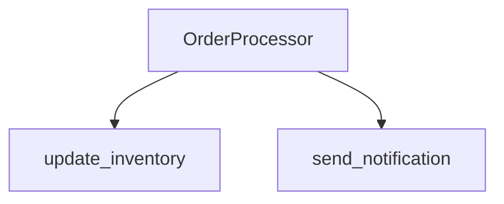

## 4.10. Respecting the Single Responsibility Principle

In the realm of software engineering, the Single Responsibility Principle (SRP) is a cornerstone of clean code and maintainable architecture. In Elixir, a language that thrives on simplicity and functional paradigms, respecting the SRP means crafting functions and modules that do one thing and do it well. This section will guide you through the nuances of implementing SRP in Elixir, highlighting its benefits and providing practical examples.

### Understanding the Single Responsibility Principle

The Single Responsibility Principle states that a class or module should have one, and only one, reason to change. In other words, each function or module should focus on a single task or responsibility. This principle helps in creating systems that are easier to understand, test, and maintain.

#### Key Benefits of SRP

1. **Easier Testing**: With a single focus, functions and modules can be tested in isolation, making unit tests straightforward and comprehensive.
2. **Simplified Debugging**: When a module or function has a single responsibility, identifying the source of a bug becomes easier.
3. **Enhanced Maintainability**: Code that adheres to SRP is easier to modify and extend, as changes are localized to specific areas.
4. **Improved Readability**: Clear and concise functions make it easier for developers to understand the codebase.

### Writing Focused Functions and Modules in Elixir

In Elixir, functions are first-class citizens and are often small and focused. Modules, on the other hand, group related functions together. Let's explore how to structure these elements to respect the SRP.

#### Functions: The Building Blocks

Functions in Elixir should be small, performing a single task. This aligns with the functional programming paradigm, where functions are pure and side-effect-free.

```elixir
defmodule MathOperations do
  # Function to add two numbers
  def add(a, b) do
    a + b
  end

  # Function to multiply two numbers
  def multiply(a, b) do
    a * b
  end
end
```

In the example above, each function is responsible for a single arithmetic operation. This simplicity ensures that any changes to the addition or multiplication logic are isolated to their respective functions.

#### Modules: Grouping Related Functions

Modules in Elixir serve as containers for related functions. A module should encapsulate functions that share a common purpose or domain.

```elixir
defmodule UserManager do
  # Function to create a user
  def create_user(attrs) do
    # Logic to create a user
  end

  # Function to update user information
  def update_user(user, attrs) do
    # Logic to update user
  end
end
```

The `UserManager` module groups functions related to user management. Each function within the module has a distinct responsibility, such as creating or updating a user.

### Breaking Down Complex Logic

Complex logic can often violate the SRP by trying to do too much. Breaking down such logic into smaller, focused components is crucial.

#### Example: Refactoring a Complex Function

Consider a function that processes orders, updates inventory, and sends notifications. This function has multiple responsibilities and should be refactored.

```elixir
defmodule OrderProcessor do
  def process_order(order) do
    update_inventory(order)
    send_notification(order)
  end

  defp update_inventory(order) do
    # Logic to update inventory
  end

  defp send_notification(order) do
    # Logic to send notification
  end
end
```

In the refactored example, `process_order` delegates tasks to `update_inventory` and `send_notification`, each handling a specific responsibility.

### Visualizing the Single Responsibility Principle

To better understand how SRP influences code structure, let's visualize the relationship between functions and modules in Elixir.


```mermaid
graph TD;
  A[OrderProcessor] --> B[update_inventory]
  A --> C[send_notification]
```

This diagram illustrates how the `OrderProcessor` module delegates responsibilities to focused functions, ensuring each has a single purpose.

### Elixir's Unique Features Supporting SRP

Elixir provides several features that naturally support the SRP:

- **Pattern Matching**: Allows functions to handle specific cases, keeping them focused.
- **Pipelines**: Enable chaining of functions, each performing a distinct step.
- **Immutability**: Encourages side-effect-free functions, aligning with SRP.

### Differences and Similarities with Object-Oriented SRP

In object-oriented programming, SRP often applies to classes. In Elixir, the focus is on functions and modules. While the principle remains the same, the implementation differs due to Elixir's functional nature.

### Practical Considerations

When implementing SRP in Elixir, consider the following:

- **Granularity**: Determine the appropriate level of granularity for functions and modules. Too granular can lead to unnecessary complexity, while too broad can violate SRP.
- **Naming**: Use descriptive names for functions and modules to clearly convey their responsibility.
- **Refactoring**: Regularly refactor code to adhere to SRP, especially as new features are added.

### Try It Yourself: Experimenting with SRP

To reinforce your understanding of SRP, try refactoring a piece of complex code in your project. Break down large functions into smaller ones, each with a single responsibility. Observe how this impacts the testability and readability of your code.

### Knowledge Check

- **What is the Single Responsibility Principle?**
- **How does SRP benefit code maintainability?**
- **Why is it important to write focused functions in Elixir?**

### Summary

Respecting the Single Responsibility Principle in Elixir leads to cleaner, more maintainable code. By writing focused functions and modules, we enhance testability, readability, and scalability. Remember, SRP is not just a guideline but a mindset that fosters better software design.

## Quiz Time!



### What is the primary goal of the Single Responsibility Principle?

- [x] To ensure each function or module has one clear purpose
- [ ] To maximize code reuse
- [ ] To minimize the number of functions
- [ ] To increase code complexity

> **Explanation:** The Single Responsibility Principle aims to ensure that each function or module has one clear purpose, making the code easier to understand and maintain.

### How does SRP benefit testing?

- [x] It allows functions to be tested in isolation
- [ ] It increases the number of tests needed
- [ ] It makes tests more complex
- [ ] It reduces the need for tests

> **Explanation:** SRP allows functions to be tested in isolation, simplifying the testing process and ensuring comprehensive coverage.

### What is a key feature of Elixir that supports SRP?

- [x] Pattern Matching
- [ ] Inheritance
- [ ] Polymorphism
- [ ] Encapsulation

> **Explanation:** Pattern matching in Elixir allows functions to handle specific cases, keeping them focused and aligned with SRP.

### In Elixir, what is the primary role of a module?

- [x] To group related functions
- [ ] To define classes
- [ ] To manage state
- [ ] To execute code

> **Explanation:** In Elixir, a module serves as a container for related functions, encapsulating a specific domain or responsibility.

### What should you consider when applying SRP in Elixir?

- [x] Granularity of functions and modules
- [ ] Number of lines in a function
- [ ] Amount of comments
- [ ] Complexity of algorithms

> **Explanation:** When applying SRP, consider the granularity of functions and modules to ensure they are neither too broad nor too granular.

### Why is it important to refactor code regularly?

- [x] To adhere to SRP and improve maintainability
- [ ] To increase the number of lines of code
- [ ] To make code more complex
- [ ] To reduce the number of functions

> **Explanation:** Regular refactoring helps adhere to SRP, improving code maintainability and readability.

### What is a potential pitfall of not respecting SRP?

- [x] Increased complexity and maintenance difficulty
- [ ] Reduced code size
- [ ] Improved performance
- [ ] Decreased number of functions

> **Explanation:** Ignoring SRP can lead to increased complexity and difficulty in maintaining the codebase.

### How can SRP improve code readability?

- [x] By ensuring functions and modules have a single, clear purpose
- [ ] By reducing the number of comments
- [ ] By increasing the number of functions
- [ ] By using complex algorithms

> **Explanation:** SRP improves readability by ensuring functions and modules have a single, clear purpose, making the code easier to understand.

### What is a common misunderstanding about SRP?

- [x] That it applies only to object-oriented programming
- [ ] That it improves code performance
- [ ] That it reduces the need for documentation
- [ ] That it increases code size

> **Explanation:** A common misunderstanding is that SRP applies only to object-oriented programming, but it is equally relevant in functional programming languages like Elixir.

### True or False: SRP is only applicable to large projects.

- [ ] True
- [x] False

> **Explanation:** SRP is applicable to projects of all sizes, as it helps maintain clean and maintainable code regardless of project scale.



Remember, respecting the Single Responsibility Principle is a journey. As you continue to write Elixir code, keep experimenting with focused functions and modules. Stay curious and enjoy the process of crafting clean, maintainable software!
