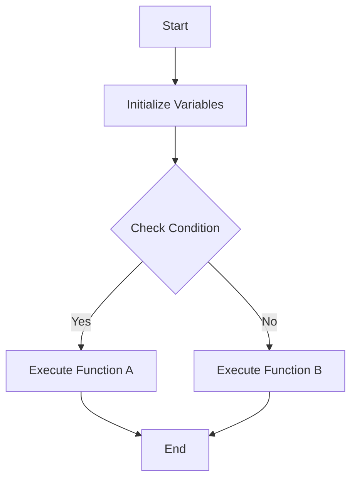

## 4.11. Writing Clear and Expressive Code

Writing clear and expressive code is a hallmark of expert software engineering. In Elixir, a language known for its functional programming paradigm and concurrency model, clarity and expressiveness are not just desirable—they are essential. This section will guide you through best practices for writing code that is not only functional but also easy to read, understand, and maintain.

### Descriptive Naming Conventions

#### Using Meaningful Names for Functions and Variables

One of the simplest yet most effective ways to make your code clear is by using descriptive names for functions and variables. This practice helps convey the purpose and functionality of your code without requiring additional comments.

**Example:**

```elixir
# Bad example
def f(x), do: x * x

# Good example
def square(number), do: number * number
```

In the good example, the function name `square` clearly indicates what the function does, and the parameter `number` suggests what kind of input it expects.

#### Guidelines for Naming

- **Be Specific:** Use names that precisely describe the entity's role. For instance, `calculate_total_price` is more informative than `calculate`.
- **Use Consistent Naming Conventions:** Stick to a naming convention throughout your codebase, such as snake_case for variables and functions.
- **Avoid Abbreviations:** Unless they are universally understood, avoid abbreviations that can confuse readers.

### Avoiding Unnecessary Complexity

#### Keeping Code Simple

Simplicity is the ultimate sophistication. Avoiding unnecessary complexity in your code makes it easier to understand and maintain. This involves breaking down complex problems into smaller, manageable functions and avoiding over-engineering.

**Example:**

```elixir
# Bad example
def calculate_area(shape, dimensions) do
  if shape == :circle do
    3.14 * dimensions[:radius] * dimensions[:radius]
  else
    dimensions[:length] * dimensions[:width]
  end
end

# Good example
def calculate_circle_area(radius), do: 3.14 * radius * radius

def calculate_rectangle_area(length, width), do: length * width
```

In the good example, the code is broken down into two separate functions, each handling a specific shape. This makes the code more modular and easier to extend.

#### Avoiding Over-Engineering

Over-engineering occurs when you add complexity to your code that isn't necessary for the current requirements. This can make your code harder to understand and maintain.

- **Focus on Current Requirements:** Implement features that are needed now, not those that might be needed in the future.
- **Refactor Regularly:** Regularly review and refactor your code to ensure it remains simple and efficient.

### Commenting and Documentation

#### Providing Context and Explanations

While clear code should be self-explanatory, comments and documentation are essential for providing context and explaining complex logic. They are particularly useful in areas where the code's intent might not be immediately obvious.

**Example:**

```elixir
# Calculates the area of a circle given its radius
def calculate_circle_area(radius) do
  # Use the formula πr²
  3.14 * radius * radius
end
```

#### Best Practices for Commenting

- **Explain Why, Not What:** Focus on explaining why a piece of code exists rather than what it does, as the latter should be clear from the code itself.
- **Keep Comments Up-to-Date:** Ensure comments are updated whenever the code changes to prevent them from becoming misleading.

#### Documentation with ExDoc

Elixir provides a powerful tool called ExDoc for generating documentation. Use it to create comprehensive and accessible documentation for your projects.

- **Document Public APIs:** Ensure all public functions and modules are well-documented.
- **Use @doc and @moduledoc:** These attributes allow you to add documentation directly in your code.

**Example:**

```elixir
defmodule Geometry do
  @moduledoc """
  A module for performing geometric calculations.
  """

  @doc """
  Calculates the area of a circle given its radius.
  """
  def calculate_circle_area(radius), do: 3.14 * radius * radius
end
```

### Code Examples

Let's explore some code examples that demonstrate these principles in action.

**Example 1: Descriptive Naming and Simplicity**

```elixir
defmodule ShoppingCart do
  @moduledoc """
  A module for managing a shopping cart.
  """

  @doc """
  Adds an item to the cart.
  """
  def add_item(cart, item) do
    cart ++ [item]
  end

  @doc """
  Calculates the total price of items in the cart.
  """
  def calculate_total(cart) do
    Enum.reduce(cart, 0, fn item, acc -> acc + item.price end)
  end
end
```

In this example, the module and function names clearly describe their purpose, and the code is simple and easy to follow.

**Example 2: Avoiding Over-Engineering**

```elixir
defmodule TemperatureConverter do
  @moduledoc """
  A module for converting temperatures between Celsius and Fahrenheit.
  """

  @doc """
  Converts Celsius to Fahrenheit.
  """
  def celsius_to_fahrenheit(celsius) do
    (celsius * 9 / 5) + 32
  end

  @doc """
  Converts Fahrenheit to Celsius.
  """
  def fahrenheit_to_celsius(fahrenheit) do
    (fahrenheit - 32) * 5 / 9
  end
end
```

This module focuses on its core functionality without adding unnecessary features or complexity.

### Visualizing Code Clarity

To further illustrate the importance of clear and expressive code, let's use a diagram to visualize the flow of a simple Elixir application.



**Diagram Description:** This flowchart represents a simple decision-making process in an Elixir application. It starts by initializing variables, checks a condition, and executes one of two functions based on the result.

### Try It Yourself

To truly master the art of writing clear and expressive code, practice is key. Try modifying the examples provided to suit different scenarios or add new features. Experiment with different naming conventions and refactor complex code to improve clarity.

### References and Links

For further reading on writing clear and expressive code, consider the following resources:

- [Elixir School: Writing Documentation](https://elixirschool.com/en/lessons/basics/documentation/)
- [ExDoc: Elixir Documentation Generator](https://hexdocs.pm/ex_doc/readme.html)
- [Clean Code: A Handbook of Agile Software Craftsmanship](https://www.amazon.com/Clean-Code-Handbook-Software-Craftsmanship/dp/0132350882)

### Knowledge Check

Before moving on, let's reinforce what we've learned with a few questions:

1. Why is it important to use descriptive names for functions and variables?
2. How can over-engineering negatively impact your code?
3. What is the purpose of comments and documentation in code?
4. How does ExDoc help in documenting Elixir projects?

### Embrace the Journey

Remember, writing clear and expressive code is a journey, not a destination. As you continue to develop your skills in Elixir, keep experimenting with new techniques and refining your approach. Stay curious, and enjoy the process of creating clean, maintainable code.

## Quiz: Writing Clear and Expressive Code



### Why is it important to use descriptive names for functions and variables?

- [x] To convey the purpose and functionality of the code
- [ ] To make the code longer
- [ ] To confuse other developers
- [ ] To make the code look complex

> **Explanation:** Descriptive names help convey the purpose and functionality of the code, making it easier to understand and maintain.


### What is a key benefit of keeping code simple?

- [x] It is easier to understand and maintain
- [ ] It makes the code run faster
- [ ] It allows for more features
- [ ] It requires more comments

> **Explanation:** Simple code is easier to understand and maintain, reducing the likelihood of errors and making it easier to extend.


### How can over-engineering negatively impact your code?

- [x] It adds unnecessary complexity
- [ ] It makes the code run faster
- [ ] It improves code readability
- [ ] It reduces the number of lines of code

> **Explanation:** Over-engineering adds unnecessary complexity, making the code harder to understand and maintain.


### What should comments in code focus on explaining?

- [x] Why a piece of code exists
- [ ] What the code does
- [ ] How to write code
- [ ] The history of the code

> **Explanation:** Comments should focus on explaining why a piece of code exists, as the code itself should make its functionality clear.


### What tool does Elixir provide for generating documentation?

- [x] ExDoc
- [ ] Javadoc
- [ ] Doxygen
- [ ] Sphinx

> **Explanation:** ExDoc is the tool provided by Elixir for generating documentation.


### What is a good practice when naming functions?

- [x] Use specific and descriptive names
- [ ] Use abbreviations
- [ ] Use random names
- [ ] Use numbers

> **Explanation:** Using specific and descriptive names helps convey the function's purpose and makes the code more readable.


### What is the purpose of the @doc attribute in Elixir?

- [x] To add documentation to a function
- [ ] To execute a function
- [ ] To delete a function
- [ ] To rename a function

> **Explanation:** The @doc attribute is used to add documentation to a function in Elixir.


### How can you avoid over-engineering in your code?

- [x] Focus on current requirements
- [ ] Add as many features as possible
- [ ] Use complex algorithms
- [ ] Write longer code

> **Explanation:** Focusing on current requirements helps avoid over-engineering by preventing unnecessary complexity.


### What is a benefit of using consistent naming conventions?

- [x] It improves code readability
- [ ] It makes the code longer
- [ ] It confuses other developers
- [ ] It requires more comments

> **Explanation:** Consistent naming conventions improve code readability by making it easier to understand the code's structure and purpose.


### True or False: Comments should always explain what the code does.

- [ ] True
- [x] False

> **Explanation:** Comments should focus on explaining why the code exists, as the code itself should make its functionality clear.


