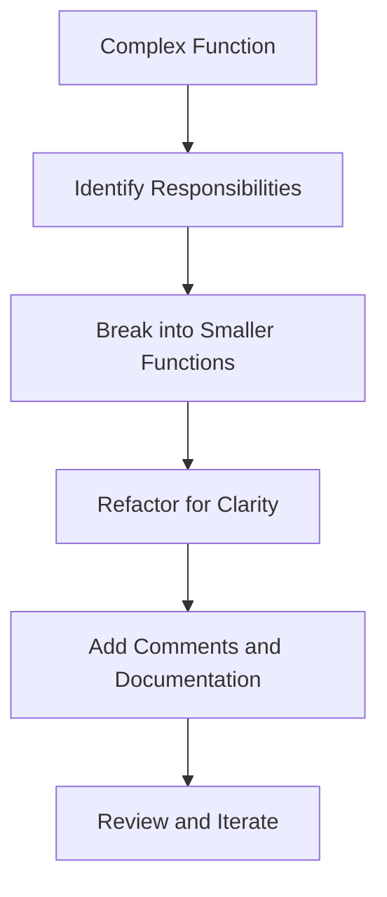

## 4.11. Writing Clear and Expressive Code

Writing clear and expressive code is an essential skill for any software engineer, especially when working with a language as powerful as Elixir. In this section, we will explore techniques and best practices to ensure your code is not only functional but also easy to understand and maintain. We will cover descriptive naming conventions, avoiding unnecessary complexity, and the importance of commenting and documentation.

### Descriptive Naming Conventions

#### Importance of Naming

Names in code are like signposts on a road. They guide developers through the logic and structure of the program. In Elixir, where functions and variables are first-class citizens, choosing the right name is crucial.

#### Guidelines for Naming

1. **Use Meaningful Names**: Ensure that the names of functions and variables clearly describe their purpose. For example, instead of naming a function `f`, use `calculate_total_price`.

2. **Be Consistent**: Stick to a consistent naming convention throughout your codebase. This could be snake_case for variables and functions, and CamelCase for modules.

3. **Avoid Abbreviations**: While it might be tempting to shorten names, abbreviations can often lead to confusion. Instead, opt for full words unless the abbreviation is widely recognized (e.g., `HTTP`).

4. **Use Contextual Names**: Provide context within the name to clarify its use. For instance, `user_email` is more informative than just `email`.

#### Examples

```elixir
# Bad Naming
defmodule U do
  def c(u) do
    u + 1
  end
end

# Good Naming
defmodule User do
  def calculate_age(user) do
    user.age + 1
  end
end
```

### Avoiding Unnecessary Complexity

#### KISS Principle

The KISS (Keep It Simple, Stupid) principle is a fundamental guideline in software development. It emphasizes the importance of simplicity in design and implementation.

#### Strategies to Simplify Code

1. **Break Down Functions**: If a function is doing too much, break it into smaller, more manageable pieces. Each function should have a single responsibility.

2. **Use Built-in Functions**: Elixir provides a rich set of built-in functions and modules. Familiarize yourself with them to avoid reinventing the wheel.

3. **Avoid Over-Engineering**: Resist the urge to add features or complexity that are not currently necessary. Focus on the current requirements and extend functionality as needed.

4. **Refactor Regularly**: Regularly revisit and refactor your code to improve clarity and performance.

#### Examples

```elixir
# Overly Complex
defmodule Math do
  def calculate(a, b, c) do
    result = if a > b do
      if b > c do
        a + b + c
      else
        a * b * c
      end
    else
      a - b - c
    end
    result
  end
end

# Simplified
defmodule Math do
  def calculate_sum(a, b, c) when a > b and b > c do
    a + b + c
  end

  def calculate_product(a, b, c) do
    a * b * c
  end

  def calculate_difference(a, b, c) do
    a - b - c
  end
end
```

### Commenting and Documentation

#### Importance of Comments

Comments provide context and explanations that are not immediately obvious from the code itself. They are crucial for maintaining and extending codebases.

#### Best Practices for Commenting

1. **Explain Why, Not What**: Comments should explain the reasoning behind a piece of code, not just restate what the code does.

2. **Use Comments Sparingly**: Over-commenting can clutter the code and make it harder to read. Use comments where they add value.

3. **Keep Comments Updated**: As code changes, ensure that comments are updated to reflect those changes.

4. **Document Edge Cases**: Use comments to highlight any edge cases or assumptions in the code.

#### Examples

```elixir
# Bad Commenting
defmodule Calculator do
  # This function adds two numbers
  def add(a, b) do
    a + b
  end
end

# Good Commenting
defmodule Calculator do
  # Adds two numbers. This function assumes that the inputs are integers.
  def add(a, b) do
    a + b
  end
end
```

### Documentation with ExDoc

Elixir provides a powerful tool called ExDoc for generating documentation from your code. It's essential to document your modules and functions to provide clear guidance for other developers.

#### Steps to Document with ExDoc

1. **Install ExDoc**: Add ExDoc as a dependency in your `mix.exs` file.

2. **Annotate Code with @doc and @moduledoc**: Use these attributes to provide descriptions for modules and functions.

3. **Generate Documentation**: Run the `mix docs` command to generate HTML documentation.

#### Example

```elixir
defmodule Calculator do
  @moduledoc """
  A simple calculator module that provides basic arithmetic operations.
  """

  @doc """
  Adds two numbers together.

  ## Examples

      iex> Calculator.add(1, 2)
      3

  """
  def add(a, b) do
    a + b
  end
end
```

### Try It Yourself

To reinforce these concepts, try refactoring a piece of your own code using the principles discussed. Focus on improving naming conventions, simplifying logic, and adding meaningful comments and documentation.

### Visualizing Code Clarity

To better understand the impact of clear and expressive code, let's visualize the process of refactoring a complex function into simpler, more maintainable components.


```mermaid
graph TD;
    A[Complex Function] --> B[Identify Responsibilities]
    B --> C[Break into Smaller Functions]
    C --> D[Refactor for Clarity]
    D --> E[Add Comments and Documentation]
    E --> F[Review and Iterate]
```

### References and Links

For further reading on writing clear and expressive code, consider the following resources:

- [Elixir School: Naming Conventions](https://elixirschool.com/en/lessons/basics/naming_conventions/)
- [Clean Code by Robert C. Martin](https://www.goodreads.com/book/show/3735293-clean-code)
- [ExDoc Documentation](https://hexdocs.pm/ex_doc/readme.html)

### Knowledge Check

As you progress through this section, consider the following questions to test your understanding:

1. What are the key benefits of using descriptive naming conventions in Elixir?
2. How can simplifying code improve its maintainability?
3. Why is it important to update comments as code changes?
4. What role does ExDoc play in Elixir development?

### Embrace the Journey

Remember, writing clear and expressive code is a continuous journey. As you gain experience, you'll develop your own style and preferences. Keep experimenting, stay curious, and enjoy the process of crafting beautiful code.

### Formatting and Structure

Organize your code with clear headings and subheadings. Use bullet points to break down complex information and highlight important terms or concepts using bold or italic text sparingly.

### Writing Style

Use first-person plural (we, let's) to create a collaborative feel. Avoid gender-specific pronouns; use they/them or rewrite sentences to be inclusive. Define acronyms and abbreviations upon first use.

## Quiz Time!



### What is a key benefit of using descriptive naming conventions in Elixir?

- [x] They make the code more readable and understandable.
- [ ] They reduce the number of lines of code.
- [ ] They increase the performance of the code.
- [ ] They eliminate the need for comments.

> **Explanation:** Descriptive naming conventions improve code readability and understanding by clearly indicating the purpose of variables and functions.

### How does the KISS principle help in writing clear code?

- [x] It emphasizes simplicity and avoids unnecessary complexity.
- [ ] It encourages the use of advanced algorithms.
- [ ] It mandates the use of design patterns.
- [ ] It requires extensive documentation.

> **Explanation:** The KISS principle helps in writing clear code by emphasizing simplicity and avoiding unnecessary complexity.

### Why should comments explain why the code is written a certain way?

- [x] To provide context and reasoning behind the code.
- [ ] To restate what the code does.
- [ ] To increase the size of the codebase.
- [ ] To make the code look more professional.

> **Explanation:** Comments should explain why the code is written a certain way to provide context and reasoning, which aids in understanding and maintaining the code.

### What is the purpose of using ExDoc in Elixir?

- [x] To generate documentation from code annotations.
- [ ] To compile Elixir code into binaries.
- [ ] To optimize code for performance.
- [ ] To manage project dependencies.

> **Explanation:** ExDoc is used to generate documentation from code annotations, making it easier for developers to understand and use the code.

### Which of the following is a strategy to simplify code?

- [x] Break down functions into smaller pieces.
- [ ] Use as many features as possible.
- [ ] Avoid using built-in functions.
- [ ] Write long, complex functions.

> **Explanation:** Breaking down functions into smaller pieces is a strategy to simplify code, making it more manageable and understandable.

### What should be done to comments as code changes?

- [x] Update them to reflect the changes.
- [ ] Delete them to reduce clutter.
- [ ] Ignore them as they are not important.
- [ ] Convert them into code.

> **Explanation:** Comments should be updated to reflect changes in the code to ensure they remain accurate and helpful.

### What is a potential downside of over-commenting code?

- [x] It can clutter the code and make it harder to read.
- [ ] It provides too much information.
- [ ] It makes the code run slower.
- [ ] It increases the file size significantly.

> **Explanation:** Over-commenting can clutter the code and make it harder to read, so comments should be used where they add value.

### How can you ensure that names in code are meaningful?

- [x] Use full words and provide context within the name.
- [ ] Use abbreviations to save space.
- [ ] Use random letters for uniqueness.
- [ ] Use numbers to differentiate variables.

> **Explanation:** Using full words and providing context within the name ensures that names in code are meaningful and informative.

### What is the first step in using ExDoc for documentation?

- [x] Install ExDoc as a dependency in your `mix.exs` file.
- [ ] Write extensive comments in the code.
- [ ] Compile the project with special flags.
- [ ] Export the code to a different format.

> **Explanation:** The first step in using ExDoc is to install it as a dependency in your `mix.exs` file, which allows you to generate documentation.

### True or False: Descriptive naming conventions can eliminate the need for comments.

- [ ] True
- [x] False

> **Explanation:** While descriptive naming conventions improve code readability, they do not eliminate the need for comments, which provide additional context and explanations.


