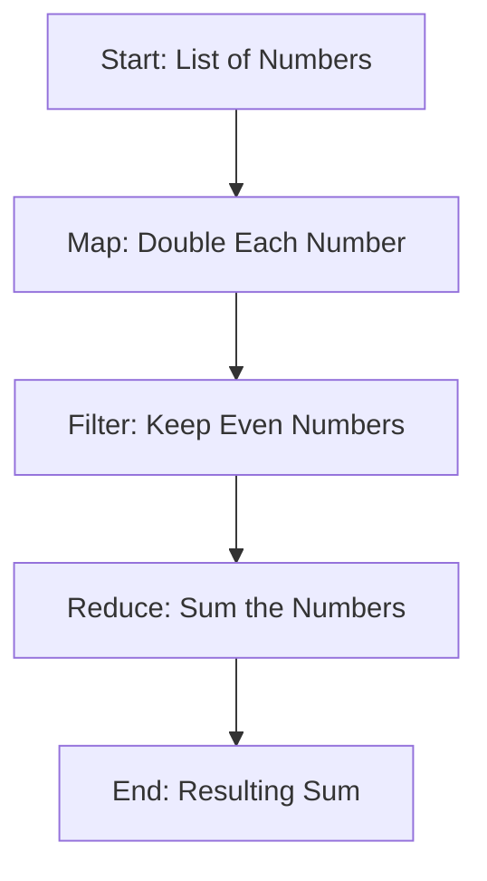

## 4.12. Leveraging Enumerables for Data Manipulation

In Elixir, enumerables are a cornerstone for data manipulation, allowing developers to process collections in a functional and expressive manner. This section delves into the idiomatic use of enumerables, exploring common patterns, transforming data streams, and implementing custom enumerables. By mastering these techniques, you'll be able to write more concise, efficient, and maintainable code.

### Common Patterns

Elixir provides a rich set of functions for working with enumerables, such as `map`, `filter`, `reduce`, and `reject`. These functions enable you to perform complex data transformations with ease.

#### Using `map`, `filter`, `reduce`, `reject`, etc.

- **`map/2`**: Transforms each element in a collection.

```elixir
# Example: Doubling each number in a list
numbers = [1, 2, 3, 4]
doubled = Enum.map(numbers, fn x -> x * 2 end)
IO.inspect(doubled) # Output: [2, 4, 6, 8]
```

- **`filter/2`**: Selects elements that satisfy a given condition.

```elixir
# Example: Filtering even numbers
even_numbers = Enum.filter(numbers, fn x -> rem(x, 2) == 0 end)
IO.inspect(even_numbers) # Output: [2, 4]
```

- **`reduce/3`**: Accumulates a result by applying a function to each element.

```elixir
# Example: Summing a list of numbers
sum = Enum.reduce(numbers, 0, fn x, acc -> x + acc end)
IO.inspect(sum) # Output: 10
```

- **`reject/2`**: Opposite of `filter`, removes elements that satisfy a condition.

```elixir
# Example: Removing odd numbers
odd_numbers_removed = Enum.reject(numbers, fn x -> rem(x, 2) != 0 end)
IO.inspect(odd_numbers_removed) # Output: [2, 4]
```

### Transforming Data Streams

Processing collections in a functional style is a powerful technique that can be applied to data streams, enabling efficient and lazy evaluation.

#### Stream Module

The `Stream` module allows for lazy enumeration, which is particularly useful when dealing with large datasets or infinite streams.

- **Lazy Evaluation with Streams**

```elixir
# Example: Creating an infinite stream of numbers
infinite_numbers = Stream.iterate(0, &(&1 + 1))

# Taking the first 5 numbers
first_five = Stream.take(infinite_numbers, 5) |> Enum.to_list()
IO.inspect(first_five) # Output: [0, 1, 2, 3, 4]
```

- **Composing Stream Operations**

```elixir
# Example: Combining map and filter in a stream
stream = 1..100
result = stream
         |> Stream.map(&(&1 * 2))
         |> Stream.filter(&(&1 > 50))
         |> Enum.to_list()
IO.inspect(result) # Output: [52, 54, 56, ..., 200]
```

### Custom Enumerables

Implementing the Enumerable protocol for custom data types allows you to leverage Elixir's enumerable functions on your own data structures.

#### Implementing the Enumerable Protocol

To create a custom enumerable, you need to implement the `Enumerable` protocol for your data type.

```elixir
defmodule MyList do
  defstruct [:elements]

  defimpl Enumerable do
    def count(%MyList{elements: elements}), do: {:ok, length(elements)}

    def member?(%MyList{elements: elements}, value), do: {:ok, Enum.member?(elements, value)}

    def reduce(%MyList{elements: elements}, acc, fun) do
      Enum.reduce(elements, acc, fun)
    end
  end
end

# Example usage
my_list = %MyList{elements: [1, 2, 3, 4]}
IO.inspect(Enum.map(my_list, &(&1 * 2))) # Output: [2, 4, 6, 8]
```

### Visualizing Data Flow with Enumerables

Understanding how data flows through enumerable operations can be enhanced with visual diagrams. Below is a flowchart illustrating the process of mapping, filtering, and reducing a list of numbers.



**Diagram Description:** This flowchart represents a sequence of operations on a list of numbers, starting with mapping to double each number, filtering to keep even numbers, and finally reducing to sum the numbers.

### Key Considerations

- **Performance**: Use streams for large datasets to avoid loading everything into memory.
- **Readability**: Chain operations to make code more readable and expressive.
- **Custom Data Types**: Implement the Enumerable protocol to extend functionality to your own data structures.

### Elixir Unique Features

Elixir's approach to enumerables is deeply rooted in its functional programming paradigm, emphasizing immutability and function composition. The language's support for lazy evaluation through streams is a unique feature that sets it apart from many other languages.

### Differences and Similarities

Enumerables in Elixir share similarities with collections in other functional languages like Haskell and Scala, but with a syntax and approach tailored to the Elixir ecosystem. The use of protocols to extend enumerable functionality is a distinctive feature.

### Try It Yourself

Experiment with the code examples provided. Try modifying the functions to perform different transformations, such as:

- Changing the mapping function to triple each number.
- Filtering numbers greater than a certain threshold.
- Implementing a custom enumerable for a different data structure.

### Knowledge Check

- What is the difference between `map` and `filter`?
- How does lazy evaluation with streams benefit performance?
- What steps are involved in implementing the Enumerable protocol for a custom data type?

### Summary

In this section, we've explored how to leverage Elixir's powerful enumerable functions for data manipulation. By mastering these techniques, you can write more efficient and expressive code, taking full advantage of Elixir's functional programming capabilities.

## Quiz: Leveraging Enumerables for Data Manipulation



### What function would you use to transform each element in a list?

- [x] map
- [ ] filter
- [ ] reduce
- [ ] reject

> **Explanation:** The `map` function is used to apply a transformation to each element in a list.

### Which function is used to select elements that satisfy a condition?

- [ ] map
- [x] filter
- [ ] reduce
- [ ] reject

> **Explanation:** The `filter` function selects elements that satisfy a given condition.

### What is the primary benefit of using streams in Elixir?

- [ ] Faster execution
- [x] Lazy evaluation
- [ ] Simpler syntax
- [ ] More readable code

> **Explanation:** Streams in Elixir allow for lazy evaluation, which is beneficial for handling large datasets efficiently.

### How do you implement the Enumerable protocol for a custom data type?

- [x] By defining functions like `count`, `member?`, and `reduce`
- [ ] By using the `Stream` module
- [ ] By creating a new module
- [ ] By using the `Enum` module

> **Explanation:** Implementing the Enumerable protocol involves defining specific functions such as `count`, `member?`, and `reduce`.

### What is the result of `Enum.reduce([1, 2, 3], 0, fn x, acc -> x + acc end)`?

- [ ] [1, 2, 3]
- [ ] 0
- [x] 6
- [ ] 3

> **Explanation:** The `reduce` function accumulates the sum of the list elements, resulting in 6.

### Which function removes elements that satisfy a condition?

- [ ] map
- [ ] filter
- [ ] reduce
- [x] reject

> **Explanation:** The `reject` function removes elements that satisfy a given condition.

### What is the output of `Enum.map([1, 2, 3], &(&1 * 2))`?

- [x] [2, 4, 6]
- [ ] [1, 2, 3]
- [ ] [3, 6, 9]
- [ ] [0, 1, 2]

> **Explanation:** The `map` function doubles each element, resulting in [2, 4, 6].

### How can you create an infinite stream of numbers in Elixir?

- [x] Using `Stream.iterate`
- [ ] Using `Enum.map`
- [ ] Using `Enum.reduce`
- [ ] Using `Stream.map`

> **Explanation:** `Stream.iterate` is used to create an infinite stream of numbers.

### What is the purpose of the `reduce` function?

- [ ] To transform each element
- [ ] To select elements
- [x] To accumulate a result
- [ ] To remove elements

> **Explanation:** The `reduce` function is used to accumulate a result by applying a function to each element.

### True or False: Streams in Elixir are evaluated eagerly.

- [ ] True
- [x] False

> **Explanation:** Streams in Elixir are evaluated lazily, not eagerly.



Remember, this is just the beginning. As you progress, you'll build more complex and interactive applications. Keep experimenting, stay curious, and enjoy the journey!
