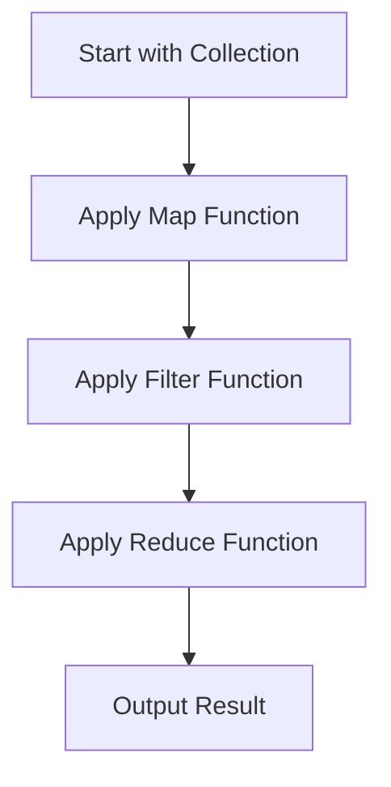

## 4.12. Leveraging Enumerables for Data Manipulation

In Elixir, Enumerables are a powerful abstraction for working with collections of data. They allow developers to perform complex data manipulations in a concise and expressive manner. In this section, we will explore common patterns for using Enumerables, learn how to transform data streams, and delve into implementing custom Enumerables for specialized data types.

### Common Patterns

Enumerables in Elixir provide a rich set of functions for data manipulation. Let's explore some of the most common patterns used in Elixir's functional programming paradigm.

#### Using `map`, `filter`, `reduce`, `reject`, etc.

1. **Map**: The `map` function is used to apply a transformation to each element in a collection.

   ```elixir
   # Example: Increment each number in a list
   numbers = [1, 2, 3, 4, 5]
   incremented_numbers = Enum.map(numbers, fn x -> x + 1 end)
   IO.inspect(incremented_numbers) # Output: [2, 3, 4, 5, 6]
   ```

2. **Filter**: The `filter` function is used to select elements from a collection that meet a certain condition.

   ```elixir
   # Example: Filter out even numbers
   even_numbers = Enum.filter(numbers, fn x -> rem(x, 2) == 0 end)
   IO.inspect(even_numbers) # Output: [2, 4]
   ```

3. **Reduce**: The `reduce` function is used to accumulate a result from a collection.

   ```elixir
   # Example: Sum all numbers in a list
   sum = Enum.reduce(numbers, 0, fn x, acc -> x + acc end)
   IO.inspect(sum) # Output: 15
   ```

4. **Reject**: The `reject` function is the opposite of `filter`. It removes elements that meet a certain condition.

   ```elixir
   # Example: Reject numbers less than 3
   greater_than_two = Enum.reject(numbers, fn x -> x < 3 end)
   IO.inspect(greater_than_two) # Output: [3, 4, 5]
   ```

### Transforming Data Streams

Elixir's functional style allows for the transformation of data streams efficiently. This is particularly useful when working with large datasets or when performing complex data manipulations.

#### Processing Collections in a Functional Style

1. **Chaining Operations**: Elixir's pipe operator (`|>`) allows for chaining multiple operations in a clear and readable manner.

   ```elixir
   # Example: Chain map, filter, and reduce operations
   result = numbers
   |> Enum.map(&(&1 * 2))
   |> Enum.filter(&(&1 > 5))
   |> Enum.reduce(0, &(&1 + &2))

   IO.inspect(result) # Output: 18
   ```

2. **Lazy Evaluation with Streams**: Elixir's `Stream` module provides a way to work with potentially infinite collections in a lazy manner.

   ```elixir
   # Example: Create a stream and process it lazily
   stream = Stream.cycle([1, 2, 3])
   |> Stream.map(&(&1 * 2))
   |> Stream.take(5)

   result = Enum.to_list(stream)
   IO.inspect(result) # Output: [2, 4, 6, 2, 4]
   ```

### Custom Enumerables

The power of Enumerables in Elixir can be extended by implementing the `Enumerable` protocol for custom data types. This allows you to define how your data type should be traversed and manipulated.

#### Implementing the Enumerable Protocol

1. **Define a Custom Data Type**: Create a module that represents your custom data type.

   ```elixir
   defmodule CustomCollection do
     defstruct data: []
   end
   ```

2. **Implement the Enumerable Protocol**: Implement the required functions for the `Enumerable` protocol.

   ```elixir
   defimpl Enumerable, for: CustomCollection do
     def count(%CustomCollection{data: data}), do: {:ok, length(data)}

     def member?(%CustomCollection{data: data}, value), do: {:ok, Enum.member?(data, value)}

     def reduce(%CustomCollection{data: data}, acc, fun), do: Enum.reduce(data, acc, fun)
   end
   ```

3. **Use the Custom Enumerable**: Use your custom data type with Elixir's Enumerable functions.

   ```elixir
   collection = %CustomCollection{data: [1, 2, 3, 4, 5]}
   IO.inspect(Enum.map(collection, &(&1 * 2))) # Output: [2, 4, 6, 8, 10]
   ```

### Visualizing Data Manipulation with Enumerables

To better understand how data flows through Enumerables, let's visualize the process using Mermaid.js diagrams.

#### Data Flow in Enumerables


```mermaid
graph TD;
    A[Start with Collection] --> B[Apply Map Function];
    B --> C[Apply Filter Function];
    C --> D[Apply Reduce Function];
    D --> E[Output Result];
```

**Diagram Description**: This diagram represents the flow of data through a series of Enumerable transformations, starting with a collection and applying `map`, `filter`, and `reduce` functions sequentially.

### Try It Yourself

To deepen your understanding, try modifying the code examples provided. Here are some suggestions:

- Change the transformation function in the `map` example to perform a different operation.
- Modify the condition in the `filter` example to select a different subset of elements.
- Experiment with different initial accumulator values in the `reduce` example.
- Create your own custom data type and implement the `Enumerable` protocol for it.

### Knowledge Check

Before moving on, let's reinforce what we've learned with a few questions:

- What is the purpose of the `map` function in Elixir?
- How does the `filter` function differ from the `reject` function?
- What are the benefits of using lazy evaluation with streams?
- How can you implement the `Enumerable` protocol for a custom data type?

### Summary

In this section, we've explored the powerful capabilities of Enumerables in Elixir for data manipulation. We've learned about common patterns such as `map`, `filter`, `reduce`, and `reject`, and how to process collections in a functional style. We also covered how to implement the `Enumerable` protocol for custom data types, allowing for greater flexibility and control over data processing.

### Embrace the Journey

Remember, mastering Enumerables in Elixir is a journey. As you continue to experiment and apply these concepts, you'll unlock new possibilities for data manipulation in your applications. Keep exploring, stay curious, and enjoy the process of learning and growing as a developer.

## Quiz Time!



### What is the primary use of the `map` function in Elixir?

- [x] To apply a transformation to each element in a collection
- [ ] To filter elements based on a condition
- [ ] To accumulate a result from a collection
- [ ] To remove elements that meet a certain condition

> **Explanation:** The `map` function is used to apply a transformation to each element in a collection, resulting in a new collection with the transformed elements.

### How does the `filter` function operate differently from the `reject` function?

- [x] `filter` selects elements that meet a condition, while `reject` removes them
- [ ] `filter` removes elements that meet a condition, while `reject` selects them
- [ ] Both functions perform the same operation
- [ ] `filter` is used for transformation, while `reject` is used for accumulation

> **Explanation:** The `filter` function selects elements that meet a specified condition, whereas the `reject` function removes elements that meet the condition.

### What advantage does lazy evaluation with streams provide?

- [x] It allows processing of potentially infinite collections without loading all data into memory
- [ ] It speeds up the execution of all functions
- [ ] It ensures that all data is processed in parallel
- [ ] It simplifies the syntax of the code

> **Explanation:** Lazy evaluation with streams allows processing of potentially infinite collections without loading all data into memory, enabling efficient handling of large datasets.

### What is required to implement the `Enumerable` protocol for a custom data type?

- [x] Define functions for `count`, `member?`, and `reduce`
- [ ] Only define a `reduce` function
- [ ] Implement a `map` function
- [ ] Define functions for `filter` and `reject`

> **Explanation:** To implement the `Enumerable` protocol for a custom data type, you need to define functions for `count`, `member?`, and `reduce`.

### Which of the following is a benefit of using the pipe operator (`|>`) in Elixir?

- [x] It allows chaining of multiple operations in a clear and readable manner
- [ ] It speeds up the execution of code
- [ ] It simplifies error handling
- [ ] It ensures type safety

> **Explanation:** The pipe operator (`|>`) allows for chaining multiple operations in a clear and readable manner, enhancing code readability and maintainability.

### What does the `reduce` function do in Elixir?

- [x] It accumulates a result from a collection
- [ ] It transforms each element in a collection
- [ ] It filters elements based on a condition
- [ ] It removes elements that meet a certain condition

> **Explanation:** The `reduce` function is used to accumulate a result from a collection by applying a function to each element and an accumulator.

### How can you create a stream that processes data lazily in Elixir?

- [x] Use the `Stream` module to define the data processing
- [ ] Use the `Enum` module for all operations
- [ ] Use the `reduce` function with an initial value
- [ ] Use the `filter` function with a condition

> **Explanation:** The `Stream` module in Elixir is used to define data processing operations that are executed lazily, allowing for efficient handling of large or infinite collections.

### What is the purpose of the `reject` function in Elixir?

- [x] To remove elements that meet a certain condition
- [ ] To apply a transformation to each element in a collection
- [ ] To accumulate a result from a collection
- [ ] To select elements that meet a condition

> **Explanation:** The `reject` function is used to remove elements from a collection that meet a specified condition, effectively filtering out unwanted elements.

### What is a key feature of Enumerables in Elixir?

- [x] They provide a rich set of functions for data manipulation
- [ ] They ensure data is processed in parallel
- [ ] They automatically optimize memory usage
- [ ] They are only used for list processing

> **Explanation:** Enumerables in Elixir provide a rich set of functions for data manipulation, allowing developers to perform complex operations on collections in a functional style.

### True or False: The `filter` function can be used to transform data in a collection.

- [ ] True
- [x] False

> **Explanation:** False. The `filter` function is used to select elements from a collection based on a condition, not to transform them. The `map` function is used for transformation.


