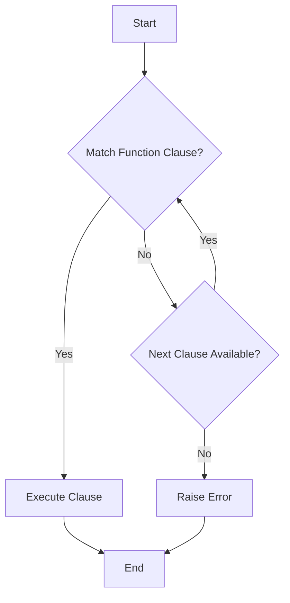

## 4.2. Pattern Matching in Function Definitions

Pattern matching is a cornerstone of Elixir's expressive power, allowing developers to write concise and readable code. In this section, we will delve into how pattern matching can be effectively used in function definitions to simplify control flow, enhance error handling, and parse input data efficiently. 

### Simplifying Control Flow

Pattern matching in function definitions allows us to define multiple clauses for a single function, each tailored to handle specific input patterns. This approach simplifies control flow by eliminating the need for complex conditional logic.

#### Using Different Function Clauses Based on Input Patterns

In Elixir, you can define multiple clauses for a function, each with its own pattern. The Elixir runtime will attempt to match the function call against these patterns in the order they are defined. This feature is particularly useful for handling different types of input data or conditions.

**Example: Handling Different Shapes**

```elixir
defmodule Shape do
  def area({:circle, radius}) do
    :math.pi() * radius * radius
  end

  def area({:rectangle, width, height}) do
    width * height
  end

  def area({:triangle, base, height}) do
    0.5 * base * height
  end
end

IO.puts Shape.area({:circle, 5})       # Outputs: 78.53981633974483
IO.puts Shape.area({:rectangle, 4, 5}) # Outputs: 20
IO.puts Shape.area({:triangle, 3, 4})  # Outputs: 6.0
```

In this example, the `area/1` function has three clauses, each handling a different shape. The pattern matching in the function head allows for clear and concise code, avoiding the need for nested `if` or `case` statements.

### Error Handling

Pattern matching can also be leveraged for error handling by providing specialized function clauses for error cases. This approach allows for clean separation of normal and error handling logic.

#### Providing Specialized Functions for Error Cases

By defining function clauses that match specific error patterns, you can handle errors gracefully without cluttering your main logic.

**Example: Handling Division Errors**

```elixir
defmodule Math do
  def divide(_numerator, 0) do
    {:error, "Cannot divide by zero"}
  end

  def divide(numerator, denominator) do
    {:ok, numerator / denominator}
  end
end

case Math.divide(10, 0) do
  {:ok, result} -> IO.puts("Result: #{result}")
  {:error, message} -> IO.puts("Error: #{message}")
end

case Math.divide(10, 2) do
  {:ok, result} -> IO.puts("Result: #{result}")
  {:error, message} -> IO.puts("Error: #{message}")
end
```

In this example, the `divide/2` function has two clauses: one for handling division by zero and another for normal division. This separation of concerns makes the code easier to read and maintain.

### Examples

Pattern matching is particularly powerful when parsing input data and handling various formats. Let's explore some examples that demonstrate this capability.

#### Parsing Input Data and Handling Various Formats

Pattern matching can be used to parse complex data structures and handle different input formats efficiently.

**Example: Parsing a List of Tuples**

```elixir
defmodule Parser do
  def parse([{key, value} | rest]) do
    IO.puts("#{key}: #{value}")
    parse(rest)
  end

  def parse([]) do
    :ok
  end
end

data = [{:name, "Alice"}, {:age, 30}, {:city, "New York"}]
Parser.parse(data)
```

In this example, the `parse/1` function uses pattern matching to iterate over a list of tuples, printing each key-value pair. The base case handles an empty list, terminating the recursion.

**Example: Handling JSON-like Structures**

```elixir
defmodule JSONParser do
  def parse(%{"type" => "user", "name" => name, "age" => age}) do
    IO.puts("User: #{name}, Age: #{age}")
  end

  def parse(%{"type" => "product", "name" => name, "price" => price}) do
    IO.puts("Product: #{name}, Price: $#{price}")
  end

  def parse(_unknown) do
    IO.puts("Unknown data format")
  end
end

user_data = %{"type" => "user", "name" => "Bob", "age" => 25}
product_data = %{"type" => "product", "name" => "Laptop", "price" => 999.99}

JSONParser.parse(user_data)
JSONParser.parse(product_data)
```

This example demonstrates how pattern matching can be used to parse JSON-like maps, handling different data types based on the "type" key.

### Visualizing Pattern Matching in Function Definitions

To better understand how pattern matching works in function definitions, let's visualize the process using a flowchart.



**Description:** This flowchart illustrates the process of pattern matching in function definitions. The Elixir runtime attempts to match the function call against each clause in order. If a match is found, the corresponding clause is executed. If no match is found, an error is raised.

### Key Takeaways

- **Pattern Matching Simplifies Control Flow:** By using different function clauses based on input patterns, you can simplify control flow and avoid complex conditional logic.
- **Enhanced Error Handling:** Specialized function clauses for error cases allow for clean separation of normal and error handling logic.
- **Efficient Data Parsing:** Pattern matching is particularly powerful for parsing input data and handling various formats, making your code more concise and readable.

### Try It Yourself

Experiment with the code examples provided in this section. Try modifying the input data or adding new function clauses to see how pattern matching can be used to handle different scenarios. For instance, you can extend the `Shape` module to handle additional shapes or modify the `JSONParser` to support more data types.

### References and Further Reading

- [Elixir's Pattern Matching Guide](https://elixir-lang.org/getting-started/pattern-matching.html)
- [Elixir School: Pattern Matching](https://elixirschool.com/en/lessons/basics/pattern_matching/)
- [Pattern Matching in Elixir: A Deep Dive](https://medium.com/@elixirschool/pattern-matching-in-elixir-a-deep-dive-5c5f2f1e7c6b)

### Knowledge Check

- How does pattern matching in function definitions simplify control flow?
- What are the benefits of using specialized function clauses for error handling?
- How can pattern matching be used to parse complex data structures?

### Embrace the Journey

Remember, mastering pattern matching in function definitions is a journey. As you continue to explore and experiment with Elixir, you'll discover new ways to leverage this powerful feature to write more expressive and efficient code. Keep experimenting, stay curious, and enjoy the journey!

## Quiz: Pattern Matching in Function Definitions



### What is the primary benefit of using pattern matching in function definitions?

- [x] Simplifies control flow by eliminating complex conditional logic
- [ ] Increases code execution speed
- [ ] Reduces memory usage
- [ ] Enhances user interface design

> **Explanation:** Pattern matching in function definitions simplifies control flow by allowing different function clauses based on input patterns, eliminating the need for complex conditional logic.

### How does pattern matching enhance error handling in Elixir?

- [x] By providing specialized function clauses for error cases
- [ ] By automatically retrying failed operations
- [ ] By logging errors to a file
- [ ] By sending error notifications to developers

> **Explanation:** Pattern matching enhances error handling by allowing developers to define specialized function clauses for error cases, separating normal and error handling logic.

### Which of the following is an example of using pattern matching to parse input data?

- [x] Parsing a list of tuples
- [ ] Using a for loop to iterate over a list
- [ ] Implementing a binary search algorithm
- [ ] Sorting an array of numbers

> **Explanation:** Pattern matching can be used to parse input data, such as a list of tuples, by matching specific patterns in function clauses.

### What happens if no function clause matches the input pattern in Elixir?

- [x] An error is raised
- [ ] The first function clause is executed
- [ ] The program continues without executing any function
- [ ] A warning is logged

> **Explanation:** If no function clause matches the input pattern, Elixir raises an error, indicating that no matching clause was found.

### How can pattern matching be used to handle different shapes in a geometry module?

- [x] By defining separate function clauses for each shape
- [ ] By using a single function with conditional statements
- [ ] By storing shape data in a database
- [ ] By using a graphical user interface

> **Explanation:** Pattern matching can be used to handle different shapes by defining separate function clauses for each shape, allowing for clear and concise code.

### What is the role of the base case in a recursive function using pattern matching?

- [x] To terminate the recursion
- [ ] To initialize the recursion
- [ ] To handle errors
- [ ] To optimize performance

> **Explanation:** The base case in a recursive function using pattern matching serves to terminate the recursion, providing a stopping condition.

### Which Elixir feature allows for matching specific patterns in function definitions?

- [x] Pattern matching
- [ ] List comprehensions
- [ ] GenServer
- [ ] ETS tables

> **Explanation:** Pattern matching is the Elixir feature that allows for matching specific patterns in function definitions, enabling concise and expressive code.

### How does pattern matching contribute to code readability?

- [x] By providing clear and concise function clauses
- [ ] By reducing the number of comments needed
- [ ] By increasing the number of lines of code
- [ ] By using complex algorithms

> **Explanation:** Pattern matching contributes to code readability by providing clear and concise function clauses, making the code easier to understand and maintain.

### What is a common use case for pattern matching in Elixir?

- [x] Parsing JSON-like structures
- [ ] Implementing machine learning algorithms
- [ ] Designing user interfaces
- [ ] Managing database connections

> **Explanation:** A common use case for pattern matching in Elixir is parsing JSON-like structures, allowing for efficient data handling based on specific patterns.

### True or False: Pattern matching can only be used with simple data types in Elixir.

- [ ] True
- [x] False

> **Explanation:** False. Pattern matching in Elixir can be used with complex data structures, such as lists, tuples, and maps, allowing for versatile and powerful code.


