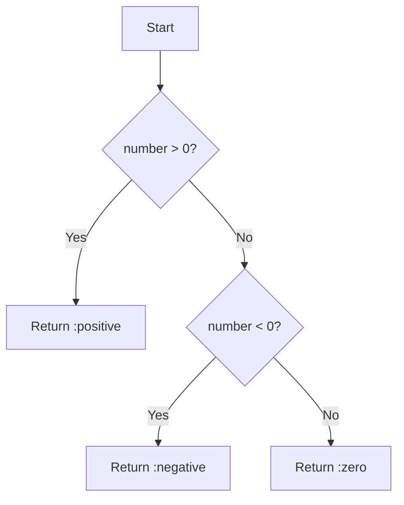

## 4.3. Using Guards for Function Clarity

In Elixir, guards are a powerful feature that enhances the expressiveness and clarity of function definitions. They allow developers to specify additional conditions that must be met for a function clause to be executed. This section will delve into the intricacies of using guards effectively, exploring their syntax, capabilities, and limitations. By the end of this guide, you'll be equipped to leverage guards to write more precise and maintainable Elixir code.

### Adding Conditions to Patterns

Guards are used in conjunction with pattern matching to refine the conditions under which a function clause is chosen. They are specified using the `when` keyword, followed by a boolean expression. This expression can include comparisons, type checks, and other logical operations.

#### Example: Basic Guard Usage

Consider a simple function that categorizes numbers as positive, negative, or zero:

```elixir
defmodule NumberClassifier do
  def classify(number) when number > 0 do
    :positive
  end

  def classify(number) when number < 0 do
    :negative
  end

  def classify(0) do
    :zero
  end
end
```

In this example, guards are used to ensure that the correct clause is executed based on the value of `number`. The use of guards makes the function's intent clear and the code concise.

#### Visualizing Guard Execution

To better understand how guards work, consider the following flowchart that illustrates the decision-making process in the `classify` function:



### Complex Guards

Guards can be combined using logical operators such as `and`, `or`, and `not` to form more complex conditions. This allows for sophisticated decision-making logic within function clauses.

#### Example: Combining Guards

Let's enhance our number classifier to handle even and odd numbers:

```elixir
defmodule AdvancedNumberClassifier do
  def classify(number) when number > 0 and rem(number, 2) == 0 do
    :positive_even
  end

  def classify(number) when number > 0 and rem(number, 2) != 0 do
    :positive_odd
  end

  def classify(number) when number < 0 and rem(number, 2) == 0 do
    :negative_even
  end

  def classify(number) when number < 0 and rem(number, 2) != 0 do
    :negative_odd
  end

  def classify(0) do
    :zero
  end
end
```

In this example, we use the `rem/2` function to determine if a number is even or odd, and combine it with other conditions using `and`.

#### Visualizing Complex Guards

The following flowchart illustrates the decision-making process for the `AdvancedNumberClassifier`:

```mermaid
flowchart TD
    A[Start] --> B{number > 0?}
    B -- Yes --> C{rem(number, 2) == 0?}
    C -- Yes --> D[Return :positive_even]
    C -- No --> E[Return :positive_odd]
    B -- No --> F{number < 0?}
    F -- Yes --> G{rem(number, 2) == 0?}
    G -- Yes --> H[Return :negative_even]
    G -- No --> I[Return :negative_odd]
    F -- No --> J[Return :zero]
```

### Limitations and Workarounds

While guards are powerful, they come with certain limitations. Only a subset of Elixir's functions can be used within guards, primarily those that are guaranteed to be free of side effects and execute quickly.

#### Allowed Functions in Guards

Guards support a limited set of functions, including:

- Comparison operators: `==`, `!=`, `>`, `<`, `>=`, `<=`
- Boolean operators: `and`, `or`, `not`
- Arithmetic operators: `+`, `-`, `*`, `/`
- Type-checking functions: `is_atom/1`, `is_binary/1`, `is_integer/1`, etc.
- Other functions: `abs/1`, `length/1`, `rem/2`, etc.

#### Example: Guard Limitations

Consider a scenario where you want to use a custom function within a guard:

```elixir
defmodule CustomGuard do
  def is_even(number) do
    rem(number, 2) == 0
  end

  def classify(number) when is_even(number) do
    :even
  end

  def classify(number) do
    :odd
  end
end
```

This code will result in a compilation error because `is_even/1` is not a permitted function in guards.

#### Workaround: Using Helper Functions

To work around this limitation, you can use helper functions outside of guards:

```elixir
defmodule CustomGuard do
  def classify(number) when rem(number, 2) == 0 do
    :even
  end

  def classify(number) do
    :odd
  end
end
```

By moving the logic directly into the guard, we adhere to the constraints while maintaining clarity.

### Elixir Unique Features

Elixir's pattern matching and guard clauses are tightly integrated, allowing for expressive and concise code. The language's emphasis on immutability and functional purity complements the use of guards, ensuring predictable and reliable function behavior.

### Differences and Similarities

Guards in Elixir are similar to conditional statements in other languages but are more tightly integrated with pattern matching. Unlike traditional `if` statements, guards are part of the function's signature, making them a natural extension of pattern matching.

### Design Considerations

When using guards, consider the following:

- **Clarity**: Use guards to make your function's intent clear. Avoid overly complex guards that may obscure the logic.
- **Performance**: Ensure that guard expressions are efficient, as they are evaluated frequently.
- **Readability**: Use guards to complement pattern matching, not replace it. Strive for a balance between expressiveness and simplicity.

### Try It Yourself

Experiment with the following exercises to deepen your understanding of guards:

1. Modify the `AdvancedNumberClassifier` to include a guard that checks if a number is a multiple of 3.
2. Create a function that uses guards to classify a list of numbers into positive, negative, and zero categories.
3. Implement a guard that checks if a string is a palindrome.

### Knowledge Check

- What are the primary functions allowed in guards?
- How do guards enhance function clarity in Elixir?
- What are some limitations of using guards, and how can they be overcome?

### Embrace the Journey

Remember, mastering guards is just one step in your Elixir journey. As you continue to explore the language, you'll discover more ways to write expressive and efficient code. Keep experimenting, stay curious, and enjoy the process!

## Quiz: Using Guards for Function Clarity



### What is the primary purpose of using guards in Elixir?

- [x] To add additional conditions to pattern matching
- [ ] To replace pattern matching entirely
- [ ] To execute side-effectful functions
- [ ] To improve the performance of function calls

> **Explanation:** Guards are used to add additional conditions to pattern matching, refining the criteria under which a function clause is executed.

### Which of the following functions can be used in a guard?

- [x] is_integer/1
- [ ] IO.puts/1
- [ ] Enum.map/2
- [x] rem/2

> **Explanation:** Only a subset of functions, such as `is_integer/1` and `rem/2`, are allowed in guards. Functions with side effects or that are not guaranteed to be quick are not permitted.

### How can you work around the limitation of not being able to use custom functions in guards?

- [x] Use helper functions outside of guards
- [ ] Use `if` statements instead
- [ ] Avoid using guards altogether
- [ ] Use macros to bypass the limitation

> **Explanation:** The recommended approach is to use helper functions outside of guards to perform the necessary logic.

### What keyword is used to introduce a guard in Elixir?

- [x] when
- [ ] if
- [ ] guard
- [ ] case

> **Explanation:** The `when` keyword is used to introduce a guard in Elixir.

### Can guards be used to execute side-effectful operations?

- [ ] Yes
- [x] No

> **Explanation:** Guards cannot execute side-effectful operations; they are limited to pure expressions.

### What logical operators can be used to combine conditions in guards?

- [x] and
- [x] or
- [x] not
- [ ] xor

> **Explanation:** Guards can use `and`, `or`, and `not` to combine conditions.

### Why is it important to keep guard expressions efficient?

- [x] They are evaluated frequently
- [ ] They are compiled into separate functions
- [ ] They determine the order of function execution
- [ ] They are used for debugging purposes

> **Explanation:** Guard expressions are evaluated frequently, so it's important to keep them efficient to avoid performance issues.

### What is a common use case for guards in Elixir?

- [x] Refining function clauses based on additional conditions
- [ ] Replacing all pattern matching
- [ ] Executing complex algorithms
- [ ] Handling exceptions

> **Explanation:** Guards are commonly used to refine function clauses based on additional conditions.

### Which of the following is a valid guard expression?

- [x] number > 0 and rem(number, 2) == 0
- [ ] IO.puts("Hello")
- [ ] Enum.map(list, &(&1 * 2))
- [ ] :ok

> **Explanation:** The expression `number > 0 and rem(number, 2) == 0` is a valid guard expression, as it uses allowed functions and operators.

### True or False: Guards can be used to replace pattern matching entirely.

- [ ] True
- [x] False

> **Explanation:** Guards are used in conjunction with pattern matching, not as a replacement for it.


