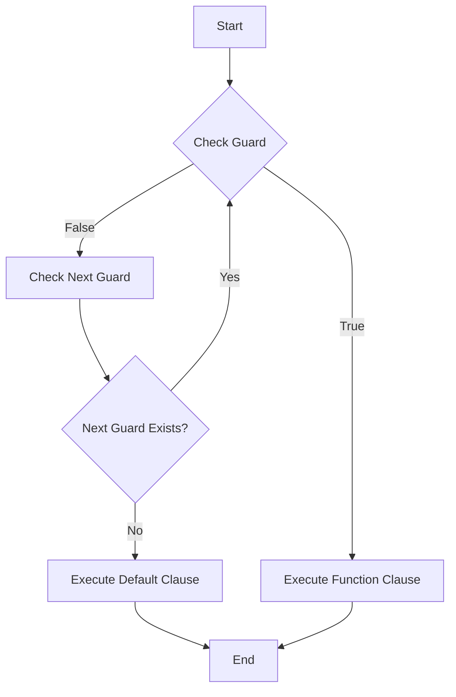

## 4.3. Using Guards for Function Clarity

In Elixir, guards are a powerful feature that allows developers to add additional conditions to function clauses, enhancing both clarity and reliability. By using guards, you can ensure that functions only execute when specific conditions are met, leading to more robust and predictable code. In this section, we will explore how guards work, how to use them effectively, and their limitations.

### Adding Conditions to Patterns

Guards in Elixir are used to add conditions to pattern matching. They allow you to specify additional constraints that must be satisfied for a function clause to be executed. This is particularly useful when you want to differentiate between cases that would otherwise match the same pattern.

#### Basic Guard Syntax

Guards are specified using the `when` keyword, followed by one or more guard expressions. Here is a simple example:

```elixir
defmodule Example do
  def greet(age) when age < 18 do
    "Hello, young one!"
  end

  def greet(age) when age >= 18 do
    "Hello, adult!"
  end
end
```

In this example, the `greet/1` function uses guards to differentiate between people who are under 18 and those who are 18 or older.

#### Ensuring Functions Only Execute When Certain Conditions Are Met

Guards can be used to enforce that certain conditions are met before a function clause is executed. This can help prevent errors and ensure that your functions behave as expected.

Consider the following example, where we want to ensure that a function only processes even numbers:

```elixir
defmodule NumberProcessor do
  def process(number) when rem(number, 2) == 0 do
    "Even number: #{number}"
  end

  def process(_number) do
    "Not an even number"
  end
end
```

Here, the `process/1` function uses a guard to check if the number is even. If the guard condition is not met, the second clause is executed.

### Complex Guards

Guards can be combined using logical operators to create more complex conditions. This allows you to express intricate logic in a clear and concise manner.

#### Combining Multiple Conditions

You can use logical operators such as `and`, `or`, and `not` to combine multiple conditions in a guard. Here's an example:

```elixir
defmodule ComplexGuard do
  def check(value) when is_integer(value) and value > 0 and rem(value, 2) == 0 do
    "Positive even integer"
  end

  def check(value) when is_integer(value) and value < 0 do
    "Negative integer"
  end

  def check(value) when is_float(value) do
    "Float value"
  end

  def check(_value) do
    "Unknown type"
  end
end
```

In this example, the `check/1` function uses complex guards to differentiate between positive even integers, negative integers, float values, and other types.

### Limitations and Workarounds

While guards are powerful, they have certain limitations. Understanding these limitations is crucial for using guards effectively.

#### Allowed Functions in Guards

Guards in Elixir are restricted to a limited set of functions. This is because guards need to be free of side effects and must execute quickly. The following are some of the functions allowed in guards:

- Arithmetic operators: `+`, `-`, `*`, `/`
- Comparison operators: `==`, `!=`, `<=`, `>=`, `<`, `>`
- Boolean operators: `and`, `or`, `not`
- Type-checking functions: `is_integer/1`, `is_float/1`, `is_atom/1`, etc.
- Other functions: `abs/1`, `length/1`, `rem/2`, etc.

Functions that are not allowed in guards include those that may have side effects, such as I/O operations or those that can fail, like `Enum.map/2`.

#### Workarounds for Guard Limitations

When you encounter a situation where you need to use a function that is not allowed in a guard, you can often refactor your code to work around this limitation. One common approach is to perform the necessary computation outside of the guard and pass the result as an argument to the function.

```elixir
defmodule Workaround do
  def process(list) do
    length = length(list)
    do_process(list, length)
  end

  defp do_process(list, length) when length > 0 do
    "Non-empty list: #{inspect(list)}"
  end

  defp do_process(_list, _length) do
    "Empty list"
  end
end
```

In this example, we calculate the length of the list before calling the `do_process/2` function, allowing us to use the length in a guard.

### Visualizing Guards in Elixir

To better understand how guards work, let's visualize the flow of a function with guards using a flowchart.


```mermaid
flowchart TD
    A[Start] --> B{Check Guard}
    B -->|True| C[Execute Function Clause]
    B -->|False| D[Check Next Guard]
    D --> E{Next Guard Exists?}
    E -->|Yes| B
    E -->|No| F[Execute Default Clause]
    F --> G[End]
    C --> G
```

**Description:** This flowchart illustrates the decision-making process in an Elixir function with guards. The function checks each guard in sequence, executing the corresponding clause when a guard evaluates to true. If no guards match, a default clause is executed.

### Try It Yourself

To get a hands-on understanding of guards, try modifying the code examples above. For instance, you can:

- Add additional guard clauses to handle more cases.
- Experiment with different logical operators in complex guards.
- Refactor the code to work around guard limitations by moving computations outside the guard.

### References and Links

- [Elixir Guards](https://elixir-lang.org/getting-started/case-cond-and-if.html#guards) - Official Elixir documentation on guards.
- [Pattern Matching in Elixir](https://elixir-lang.org/getting-started/pattern-matching.html) - Learn more about pattern matching in Elixir.
- [Elixir School: Guards](https://elixirschool.com/en/lessons/basics/guards/) - A comprehensive guide to using guards in Elixir.

### Knowledge Check

- What are guards used for in Elixir?
- What are some functions that are allowed in guards?
- How can you work around the limitations of guards in Elixir?

### Embrace the Journey

Remember, mastering guards in Elixir is just one step in your journey to becoming an expert in functional programming. As you continue to explore Elixir, you'll find that guards are a powerful tool for writing clear, concise, and reliable code. Keep experimenting, stay curious, and enjoy the journey!

## Quiz Time!



### What is the primary purpose of guards in Elixir?

- [x] To add additional conditions to pattern matching
- [ ] To perform side-effect operations
- [ ] To handle exceptions
- [ ] To optimize performance

> **Explanation:** Guards are used to add additional conditions to pattern matching, ensuring that functions only execute when specific conditions are met.

### Which of the following functions is allowed in guards?

- [x] is_integer/1
- [ ] Enum.map/2
- [ ] IO.puts/1
- [ ] File.read/1

> **Explanation:** Guards are restricted to a limited set of functions that are free of side effects and execute quickly, such as is_integer/1.

### How can you work around the limitations of guards?

- [x] Perform computations outside the guard and pass the result as an argument
- [ ] Use any function within the guard
- [ ] Ignore guard limitations
- [ ] Use side-effect functions in guards

> **Explanation:** To work around guard limitations, perform necessary computations outside the guard and pass the result as an argument to the function.

### What logical operators can be used to combine conditions in guards?

- [x] and, or, not
- [ ] +, -, *
- [ ] <, >, ==
- [ ] ++, --, **

> **Explanation:** Logical operators such as and, or, and not can be used to combine multiple conditions in guards.

### True or False: Guards can contain any Elixir function.

- [ ] True
- [x] False

> **Explanation:** Guards are restricted to a limited set of functions that are free of side effects and execute quickly.

### What keyword is used to specify guards in Elixir?

- [x] when
- [ ] if
- [ ] else
- [ ] cond

> **Explanation:** The when keyword is used to specify guards in Elixir, allowing additional conditions to be added to pattern matching.

### Which of the following is a limitation of guards in Elixir?

- [x] They cannot contain functions with side effects
- [ ] They cannot be used in pattern matching
- [ ] They cannot be combined with logical operators
- [ ] They cannot be used in function clauses

> **Explanation:** Guards cannot contain functions with side effects, as they need to be free of side effects and execute quickly.

### What is a common workaround for guard limitations?

- [x] Perform computations outside the guard
- [ ] Use side-effect functions in guards
- [ ] Ignore guard limitations
- [ ] Use any function within the guard

> **Explanation:** A common workaround for guard limitations is to perform necessary computations outside the guard and pass the result as an argument.

### What type of functions are typically used in guards?

- [x] Type-checking functions
- [ ] I/O functions
- [ ] File operations
- [ ] Network operations

> **Explanation:** Type-checking functions are typically used in guards, as they are free of side effects and execute quickly.

### True or False: Guards can be used to differentiate between cases that would otherwise match the same pattern.

- [x] True
- [ ] False

> **Explanation:** Guards can be used to differentiate between cases that would otherwise match the same pattern, ensuring that functions only execute when specific conditions are met.




