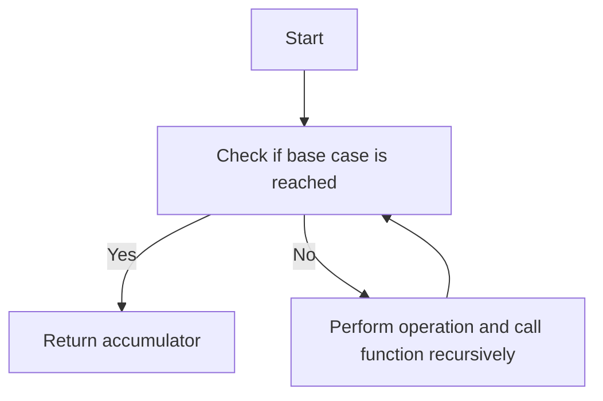

## 4.4. Tail Call Optimization in Recursion

In the world of functional programming, recursion is a fundamental concept that allows us to solve problems by breaking them down into smaller, more manageable sub-problems. Elixir, being a functional language, embraces recursion as a primary mechanism for iteration and looping. However, naive recursive implementations can lead to stack overflow errors, especially when dealing with large input sizes. This is where Tail Call Optimization (TCO) comes into play, enabling us to write efficient recursive functions that are both scalable and performant.

### Writing Efficient Recursive Functions

#### Transforming Recursive Calls into Tail Positions

Tail Call Optimization is a technique used by the Elixir compiler to optimize recursive function calls. A function call is said to be in a "tail position" if it is the last operation performed before the function returns. When a recursive call is in a tail position, the compiler can optimize the call to reuse the current function's stack frame, preventing the stack from growing with each recursive call.

To achieve TCO, we need to ensure that our recursive calls are in tail positions. Let's explore how to transform recursive functions into tail-recursive ones.

**Example: Factorial Function**

A classic example of recursion is the factorial function. Here's a naive recursive implementation:

```elixir
defmodule Factorial do
  def calculate(0), do: 1
  def calculate(n) when n > 0 do
    n * calculate(n - 1)
  end
end
```

In this implementation, the recursive call `calculate(n - 1)` is not in a tail position because it is followed by a multiplication operation. To make it tail-recursive, we can introduce an accumulator:

```elixir
defmodule Factorial do
  def calculate(n), do: calculate(n, 1)

  defp calculate(0, acc), do: acc
  defp calculate(n, acc) when n > 0 do
    calculate(n - 1, n * acc)
  end
end
```

Now, the recursive call `calculate(n - 1, n * acc)` is in a tail position, allowing the compiler to optimize it.

#### Avoiding Stack Overflows

By transforming recursive functions into tail-recursive ones, we can avoid stack overflow errors. This is crucial for functions that need to handle large input sizes, as it ensures that the function can scale without consuming excessive stack space.

**Example: Fibonacci Sequence**

The Fibonacci sequence is another common example of recursion. Here's a naive implementation:

```elixir
defmodule Fibonacci do
  def calculate(0), do: 0
  def calculate(1), do: 1
  def calculate(n) when n > 1 do
    calculate(n - 1) + calculate(n - 2)
  end
end
```

This implementation is not only inefficient but also prone to stack overflow for large `n`. Let's rewrite it using tail recursion:

```elixir
defmodule Fibonacci do
  def calculate(n), do: calculate(n, 0, 1)

  defp calculate(0, a, _), do: a
  defp calculate(n, a, b) when n > 0 do
    calculate(n - 1, b, a + b)
  end
end
```

In this tail-recursive version, we use two accumulators `a` and `b` to keep track of the last two Fibonacci numbers, ensuring that the recursive call is in a tail position.

### Examples

#### Implementing Factorial, Fibonacci, and Tree Traversals

Let's delve deeper into practical examples of tail-recursive functions, including factorial, Fibonacci, and tree traversals.

**Factorial Function**

We've already seen the tail-recursive implementation of the factorial function. Here's a quick recap:

```elixir
defmodule Factorial do
  def calculate(n), do: calculate(n, 1)

  defp calculate(0, acc), do: acc
  defp calculate(n, acc) when n > 0 do
    calculate(n - 1, n * acc)
  end
end
```

**Fibonacci Sequence**

Similarly, the tail-recursive Fibonacci function:

```elixir
defmodule Fibonacci do
  def calculate(n), do: calculate(n, 0, 1)

  defp calculate(0, a, _), do: a
  defp calculate(n, a, b) when n > 0 do
    calculate(n - 1, b, a + b)
  end
end
```

**Tree Traversals**

Tree traversal is another area where recursion is commonly used. Let's implement a tail-recursive in-order traversal of a binary tree.

```elixir
defmodule BinaryTree do
  defstruct value: nil, left: nil, right: nil

  def inorder_traversal(tree), do: inorder_traversal(tree, [])

  defp inorder_traversal(nil, acc), do: acc
  defp inorder_traversal(%BinaryTree{value: value, left: left, right: right}, acc) do
    acc
    |> inorder_traversal(left)
    |> List.insert_at(-1, value)
    |> inorder_traversal(right)
  end
end
```

In this implementation, we use an accumulator `acc` to collect the values of the nodes in the correct order. The recursive calls are in tail positions, allowing for optimization.

### Visualizing Tail Call Optimization

To better understand how Tail Call Optimization works, let's visualize the process using a flowchart.



**Description:** This flowchart illustrates the process of a tail-recursive function. The function checks if the base case is reached. If yes, it returns the accumulator. If no, it performs an operation and calls the function recursively, with the recursive call being in a tail position.

### Elixir Unique Features

Elixir's support for Tail Call Optimization is one of its unique features, allowing developers to write efficient recursive functions without worrying about stack overflow errors. This is particularly beneficial for applications that require high scalability and performance.

### Differences and Similarities

Tail Call Optimization is a concept found in many functional languages, but its implementation and support can vary. In Elixir, TCO is seamlessly integrated into the language, making it a natural fit for writing idiomatic Elixir code.

### Try It Yourself

To solidify your understanding of Tail Call Optimization, try modifying the examples above. Experiment with different recursive functions and see how you can transform them into tail-recursive ones. Consider implementing additional algorithms, such as quicksort or mergesort, using tail recursion.

### Knowledge Check

- What is Tail Call Optimization, and why is it important in Elixir?
- How can you transform a recursive function into a tail-recursive one?
- What are the benefits of using tail recursion over naive recursion?

### Embrace the Journey

Remember, mastering Tail Call Optimization is just one step in your journey to becoming an expert Elixir developer. As you continue to explore the language, you'll discover more powerful techniques and patterns that will enhance your ability to build scalable, efficient applications. Keep experimenting, stay curious, and enjoy the journey!

## Quiz: Tail Call Optimization in Recursion



### What is Tail Call Optimization?

- [x] A technique to optimize recursive function calls by reusing the current function's stack frame.
- [ ] A method to increase the speed of function execution.
- [ ] A way to reduce the memory usage of a program.
- [ ] A technique to improve code readability.

> **Explanation:** Tail Call Optimization is a technique used to optimize recursive function calls by reusing the current function's stack frame, preventing stack overflow errors.

### How can you achieve Tail Call Optimization in a recursive function?

- [x] By ensuring the recursive call is the last operation in the function.
- [ ] By using a loop instead of recursion.
- [ ] By increasing the function's stack size.
- [ ] By using global variables.

> **Explanation:** To achieve Tail Call Optimization, the recursive call must be the last operation in the function, allowing the compiler to optimize the call.

### What is the main benefit of using Tail Call Optimization?

- [x] It prevents stack overflow errors in recursive functions.
- [ ] It makes the code easier to read.
- [ ] It increases the speed of function execution.
- [ ] It reduces the number of lines of code.

> **Explanation:** The main benefit of Tail Call Optimization is that it prevents stack overflow errors, allowing recursive functions to handle large input sizes.

### Which of the following is a tail-recursive implementation of the factorial function?

- [x] `def calculate(n), do: calculate(n, 1); defp calculate(0, acc), do: acc; defp calculate(n, acc) when n > 0, do: calculate(n - 1, n * acc)`
- [ ] `def calculate(n) when n == 0, do: 1; def calculate(n), do: n * calculate(n - 1)`
- [ ] `def calculate(n), do: Enum.reduce(1..n, 1, &*/2)`
- [ ] `def calculate(n), do: n * calculate(n - 1)`

> **Explanation:** The first option is a tail-recursive implementation because the recursive call is the last operation in the function.

### True or False: Tail Call Optimization is automatically applied to all recursive functions in Elixir.

- [ ] True
- [x] False

> **Explanation:** False. Tail Call Optimization is only applied when the recursive call is in a tail position.

### What is a common pitfall when writing recursive functions without Tail Call Optimization?

- [x] Stack overflow errors.
- [ ] Increased code readability.
- [ ] Faster execution times.
- [ ] Reduced memory usage.

> **Explanation:** A common pitfall is stack overflow errors, which occur when the stack grows too large due to non-tail-recursive calls.

### Which of the following is NOT a benefit of Tail Call Optimization?

- [ ] Prevents stack overflow errors.
- [ ] Allows recursive functions to handle large input sizes.
- [x] Increases the speed of function execution.
- [ ] Reduces memory usage.

> **Explanation:** While Tail Call Optimization prevents stack overflow errors and allows handling large input sizes, it does not inherently increase the speed of function execution.

### In the context of Tail Call Optimization, what is an accumulator?

- [x] A variable used to store intermediate results in a tail-recursive function.
- [ ] A function that accumulates values over time.
- [ ] A data structure used to store large amounts of data.
- [ ] A method to increase function execution speed.

> **Explanation:** An accumulator is a variable used to store intermediate results in a tail-recursive function, allowing the recursive call to be in a tail position.

### What is the primary goal of transforming a recursive function into a tail-recursive one?

- [x] To enable Tail Call Optimization and prevent stack overflow errors.
- [ ] To make the code more readable.
- [ ] To increase the speed of function execution.
- [ ] To reduce the number of lines of code.

> **Explanation:** The primary goal is to enable Tail Call Optimization, which prevents stack overflow errors by reusing the current function's stack frame.

### True or False: Tail Call Optimization is a feature unique to Elixir.

- [ ] True
- [x] False

> **Explanation:** False. Tail Call Optimization is a concept found in many functional languages, not just Elixir.


