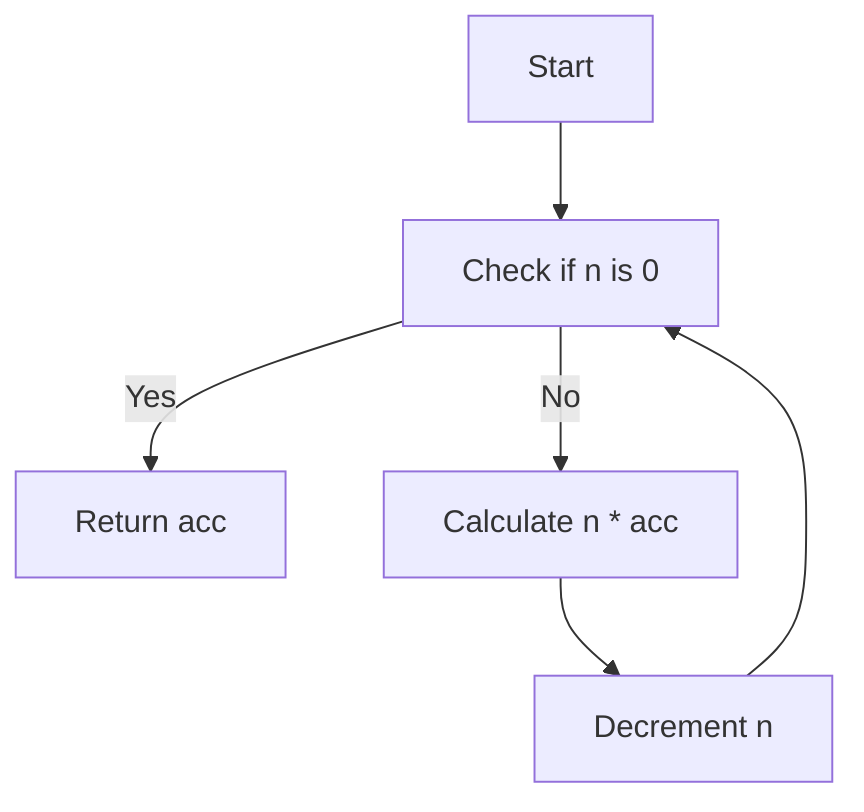

## 4.4. Tail Call Optimization in Recursion

In the realm of functional programming, recursion is a fundamental concept that allows us to solve problems by breaking them down into smaller, more manageable sub-problems. Elixir, being a functional language, embraces recursion as a primary mechanism for iteration. However, naive recursion can lead to inefficiencies and stack overflows, especially when dealing with large input sizes. This is where Tail Call Optimization (TCO) comes into play. In this section, we will explore how to write efficient recursive functions in Elixir using TCO, ensuring our applications remain scalable and performant.

### Writing Efficient Recursive Functions

To harness the power of recursion effectively, we must understand how to transform recursive calls into tail positions. A function call is in a tail position if it is the last operation performed before the function returns. Tail call optimization allows the Elixir compiler to optimize tail-recursive functions, reusing the current function's stack frame for the recursive call, thus preventing stack overflow and reducing memory usage.

#### Transforming Recursive Calls into Tail Positions

Consider a simple recursive function to calculate the factorial of a number:

```elixir
defmodule Math do
  def factorial(0), do: 1
  def factorial(n) when n > 0 do
    n * factorial(n - 1)
  end
end
```

In this example, the multiplication operation `n * factorial(n - 1)` is performed after the recursive call, meaning it's not in a tail position. To optimize this function using TCO, we must ensure the recursive call is the last operation:

```elixir
defmodule Math do
  def factorial(n), do: factorial(n, 1)

  defp factorial(0, acc), do: acc
  defp factorial(n, acc) when n > 0 do
    factorial(n - 1, n * acc)
  end
end
```

Here, we've introduced an accumulator `acc` to carry the result through each recursive call. The recursive call `factorial(n - 1, n * acc)` is now in a tail position, allowing the Elixir runtime to optimize it effectively.

### Avoiding Stack Overflows

Tail call optimization is crucial for ensuring scalability when dealing with large input sizes. Without TCO, each recursive call consumes a stack frame, leading to a stack overflow for sufficiently large inputs. By transforming recursive calls into tail positions, we enable the Elixir runtime to reuse stack frames, mitigating this risk.

#### Ensuring Scalability for Large Input Sizes

Let's explore another example: calculating Fibonacci numbers. A naive recursive implementation can quickly lead to inefficiencies:

```elixir
defmodule Fibonacci do
  def fib(0), do: 0
  def fib(1), do: 1
  def fib(n) when n > 1 do
    fib(n - 1) + fib(n - 2)
  end
end
```

This implementation is not only inefficient due to repeated calculations but also lacks tail call optimization. A tail-recursive version can be implemented using an accumulator:

```elixir
defmodule Fibonacci do
  def fib(n), do: fib(n, 0, 1)

  defp fib(0, a, _), do: a
  defp fib(n, a, b) when n > 0 do
    fib(n - 1, b, a + b)
  end
end
```

In this version, `fib(n - 1, b, a + b)` is in a tail position, allowing the Elixir runtime to optimize it. This approach ensures that our Fibonacci function can handle large input sizes efficiently.

### Examples: Implementing Factorial, Fibonacci, and Tree Traversals

Let's delve into some practical examples to solidify our understanding of tail call optimization in Elixir. We'll implement functions for calculating factorials, Fibonacci numbers, and traversing trees.

#### Factorial

We've already seen a tail-recursive implementation of the factorial function. Here's a quick recap:

```elixir
defmodule Math do
  def factorial(n), do: factorial(n, 1)

  defp factorial(0, acc), do: acc
  defp factorial(n, acc) when n > 0 do
    factorial(n - 1, n * acc)
  end
end
```

#### Fibonacci

Similarly, our tail-recursive Fibonacci function ensures efficient computation for large input sizes:

```elixir
defmodule Fibonacci do
  def fib(n), do: fib(n, 0, 1)

  defp fib(0, a, _), do: a
  defp fib(n, a, b) when n > 0 do
    fib(n - 1, b, a + b)
  end
end
```

#### Tree Traversals

Tree structures are another common use case for recursion. Let's implement a tail-recursive function to traverse a binary tree in-order:

```elixir
defmodule Tree do
  defstruct value: nil, left: nil, right: nil

  def inorder_traversal(tree), do: inorder_traversal(tree, [])

  defp inorder_traversal(nil, acc), do: Enum.reverse(acc)
  defp inorder_traversal(%Tree{value: value, left: left, right: right}, acc) do
    inorder_traversal(left, [value | inorder_traversal(right, acc)])
  end
end
```

In this example, we use an accumulator to collect the traversal results, ensuring the recursive call is in a tail position.

### Visualizing Tail Call Optimization

To better understand how tail call optimization works, let's visualize the process using a flowchart. The diagram below illustrates the flow of a tail-recursive factorial function:


```mermaid
graph TD;
  A[Start] --> B[Check if n is 0];
  B -->|Yes| C[Return acc];
  B -->|No| D[Calculate n * acc];
  D --> E[Decrement n];
  E --> B;
```

**Diagram Description:** This flowchart shows the flow of a tail-recursive factorial function. The function checks if `n` is zero, returning the accumulator if true. Otherwise, it calculates `n * acc`, decrements `n`, and recursively calls itself, reusing the stack frame.

### Try It Yourself

To deepen your understanding, try modifying the provided examples. Experiment with different recursive problems, such as calculating the greatest common divisor (GCD) or implementing a depth-first search (DFS) on a graph. Ensure your solutions are tail-recursive and test them with large input sizes to observe the benefits of tail call optimization.

### References and Links

- [Elixir Official Documentation](https://elixir-lang.org/docs.html)
- [Functional Programming Concepts](https://en.wikipedia.org/wiki/Functional_programming)
- [Tail Call Optimization Explained](https://www.coursera.org/lecture/programming-languages/tail-recursion-optimization-3Zb8o)

### Knowledge Check

- What is tail call optimization, and why is it important in Elixir?
- How can you transform a recursive function to be tail-recursive?
- What are the benefits of using tail call optimization in recursive functions?
- Try implementing a tail-recursive version of a function that calculates the sum of a list of numbers.

### Embrace the Journey

Remember, mastering tail call optimization is just one step in your journey as an Elixir developer. As you progress, you'll encounter more complex problems and design patterns. Keep experimenting, stay curious, and enjoy the process of learning and growing as a developer!

## Quiz Time!



### What is the primary benefit of tail call optimization?

- [x] Preventing stack overflow
- [ ] Improving code readability
- [ ] Increasing execution speed
- [ ] Enhancing code maintainability

> **Explanation:** Tail call optimization prevents stack overflow by reusing the current stack frame for tail-recursive calls.

### Which of the following is a characteristic of a tail-recursive function?

- [x] The recursive call is the last operation before the function returns.
- [ ] It uses multiple recursive calls.
- [ ] It requires a helper function.
- [ ] It is always more efficient than iterative solutions.

> **Explanation:** A tail-recursive function has its recursive call as the last operation, allowing for stack frame reuse.

### In a tail-recursive factorial function, what role does the accumulator play?

- [x] It stores intermediate results to be returned when the base case is reached.
- [ ] It increases the function's complexity.
- [ ] It is used to handle errors.
- [ ] It decreases memory usage.

> **Explanation:** The accumulator stores intermediate results, allowing the function to return the final result when the base case is reached.

### How can you ensure a recursive function is tail-recursive?

- [x] Make sure the recursive call is the last operation in the function.
- [ ] Use multiple recursive calls.
- [ ] Avoid using an accumulator.
- [ ] Ensure the function is pure.

> **Explanation:** Ensuring the recursive call is the last operation makes the function tail-recursive.

### Which of the following is a potential downside of not using tail call optimization?

- [x] Stack overflow for large input sizes
- [ ] Increased code readability
- [ ] Improved execution speed
- [ ] Simplified debugging

> **Explanation:** Without tail call optimization, recursive functions can cause stack overflow for large inputs.

### What is a common technique used to transform a recursive function into a tail-recursive one?

- [x] Introducing an accumulator
- [ ] Using a loop
- [ ] Adding more recursive calls
- [ ] Removing base cases

> **Explanation:** Introducing an accumulator helps carry intermediate results, enabling tail recursion.

### In the context of Elixir, what is a stack frame?

- [x] A data structure used to store information about a function call
- [ ] A loop construct
- [ ] A type of variable
- [ ] A syntax error

> **Explanation:** A stack frame is a data structure used to store information about a function call, including parameters and local variables.

### How does Elixir handle tail-recursive functions differently from non-tail-recursive ones?

- [x] It reuses the current stack frame for tail-recursive functions.
- [ ] It executes them in parallel.
- [ ] It compiles them into machine code.
- [ ] It ignores them.

> **Explanation:** Elixir reuses the current stack frame for tail-recursive functions, preventing stack overflow.

### What is the purpose of the `Enum.reverse/1` function in a tail-recursive tree traversal?

- [x] To reverse the accumulated list of values for correct order
- [ ] To sort the list of values
- [ ] To filter out duplicates
- [ ] To concatenate lists

> **Explanation:** `Enum.reverse/1` reverses the accumulated list of values to maintain the correct traversal order.

### True or False: Tail call optimization is only applicable to functional programming languages.

- [ ] True
- [x] False

> **Explanation:** Tail call optimization can be applied in any language that supports it, not just functional programming languages.


