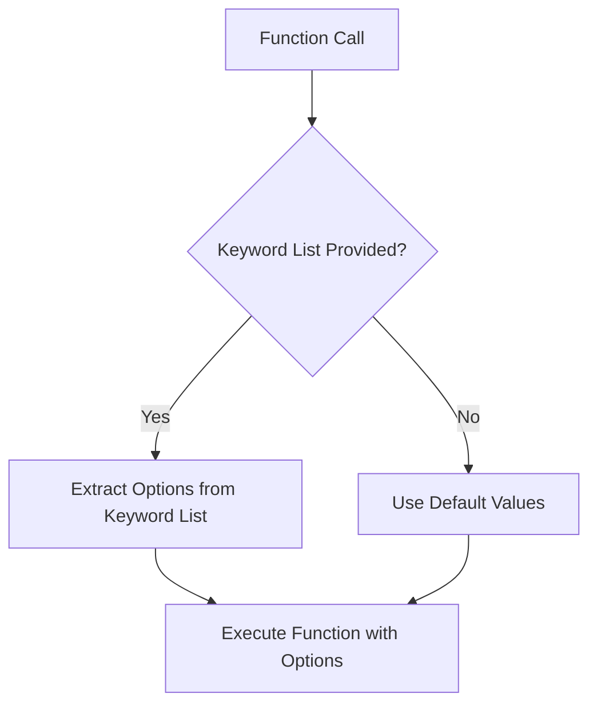

## 4.5. Functional Options and Default Arguments

In Elixir, the use of functional options and default arguments is a powerful pattern that allows developers to create flexible and maintainable code. This pattern is particularly useful when designing APIs or functions that require optional parameters. By leveraging Elixir's features such as keyword lists and pattern matching, we can provide default values and configure function behavior without resorting to overloading. Let's dive into the details of how to effectively use functional options and default arguments in Elixir.

### Using Keyword Lists for Options

Keyword lists are a fundamental data structure in Elixir, often used to pass optional parameters to functions. They are essentially lists of tuples, where each tuple consists of an atom and a value. This makes them ideal for representing options, as they are both flexible and easy to work with.

#### Why Use Keyword Lists?

- **Flexibility**: Keyword lists allow you to pass a variable number of options to a function, making your API more flexible.
- **Readability**: The use of atoms as keys makes the options self-descriptive and easy to read.
- **Order Preservation**: Unlike maps, keyword lists preserve the order of elements, which can be important in certain contexts.

#### Implementing Keyword Lists

Let's see how we can use keyword lists to pass options to a function:

```elixir
defmodule MyModule do
  def greet(name, opts \\ []) do
    greeting = Keyword.get(opts, :greeting, "Hello")
    punctuation = Keyword.get(opts, :punctuation, "!")
    "#{greeting}, #{name}#{punctuation}"
  end
end

IO.puts MyModule.greet("Alice") # Output: Hello, Alice!
IO.puts MyModule.greet("Bob", greeting: "Hi") # Output: Hi, Bob!
IO.puts MyModule.greet("Charlie", punctuation: ".") # Output: Hello, Charlie.
```

In this example, the `greet/2` function takes a name and an optional keyword list of options. We use `Keyword.get/3` to retrieve the value of each option, providing a default value if the option is not present.

### Setting Default Values

Setting default values for function arguments is a common practice in Elixir, allowing you to simplify API usage and reduce boilerplate code. By providing sensible defaults, you can make your functions easier to use and understand.

#### Default Arguments in Function Definitions

Elixir allows you to define default values for function arguments directly in the function signature. This is particularly useful for optional parameters that have a common default value.

```elixir
defmodule MyModule do
  def greet(name, greeting \\ "Hello", punctuation \\ "!") do
    "#{greeting}, #{name}#{punctuation}"
  end
end

IO.puts MyModule.greet("Alice") # Output: Hello, Alice!
IO.puts MyModule.greet("Bob", "Hi") # Output: Hi, Bob!
IO.puts MyModule.greet("Charlie", "Hey", ".") # Output: Hey, Charlie.
```

In this example, the `greet/3` function has default values for the `greeting` and `punctuation` arguments. If these arguments are not provided, the defaults are used.

#### Combining Keyword Lists with Default Arguments

You can combine keyword lists with default arguments to create even more flexible APIs. This approach allows you to provide default values for common options while still supporting additional, less common options via a keyword list.

```elixir
defmodule MyModule do
  def greet(name, opts \\ []) do
    greeting = Keyword.get(opts, :greeting, "Hello")
    punctuation = Keyword.get(opts, :punctuation, "!")
    style = Keyword.get(opts, :style, :formal)

    message = case style do
      :formal -> "#{greeting}, #{name}#{punctuation}"
      :casual -> "#{greeting} #{name}#{punctuation}"
    end

    message
  end
end

IO.puts MyModule.greet("Alice") # Output: Hello, Alice!
IO.puts MyModule.greet("Bob", greeting: "Hi", style: :casual) # Output: Hi Bob!
IO.puts MyModule.greet("Charlie", punctuation: ".", style: :formal) # Output: Hello, Charlie.
```

Here, the `greet/2` function uses a keyword list to provide options for `greeting`, `punctuation`, and `style`. The `style` option allows you to choose between a formal and casual greeting style.

### Examples

Let's explore some more examples to see how functional options and default arguments can be used in real-world scenarios.

#### Configuring Function Behavior Without Overloading

One of the key benefits of using functional options and default arguments is that they allow you to configure function behavior without resorting to overloading. This makes your code more maintainable and easier to understand.

Consider a function that sends an email. You might want to provide options for the subject, body, and attachments, but not all of these options are required for every email.

```elixir
defmodule EmailSender do
  def send_email(to, opts \\ []) do
    subject = Keyword.get(opts, :subject, "No Subject")
    body = Keyword.get(opts, :body, "No Content")
    attachments = Keyword.get(opts, :attachments, [])

    IO.puts "Sending email to #{to}"
    IO.puts "Subject: #{subject}"
    IO.puts "Body: #{body}"
    IO.puts "Attachments: #{Enum.join(attachments, ", ")}"
  end
end

EmailSender.send_email("alice@example.com")
EmailSender.send_email("bob@example.com", subject: "Meeting Reminder", body: "Don't forget our meeting at 3 PM.")
EmailSender.send_email("charlie@example.com", attachments: ["file1.pdf", "file2.jpg"])
```

In this example, the `send_email/2` function uses a keyword list to provide options for `subject`, `body`, and `attachments`. This allows you to configure the email without having to define multiple overloaded versions of the function.

### Design Considerations

When using functional options and default arguments, there are a few design considerations to keep in mind:

- **Simplicity**: Keep your APIs simple and intuitive. Provide sensible defaults and avoid unnecessary complexity.
- **Documentation**: Clearly document the available options and their default values. This helps users understand how to use your API effectively.
- **Validation**: Consider validating the options to ensure they are within acceptable ranges or formats. This can prevent runtime errors and improve the robustness of your code.

### Elixir Unique Features

Elixir provides several unique features that make it particularly well-suited for implementing functional options and default arguments:

- **Pattern Matching**: Elixir's pattern matching capabilities allow you to destructure keyword lists and extract options in a concise and readable way.
- **Immutability**: The immutability of data structures in Elixir ensures that options passed to a function cannot be modified, leading to more predictable and reliable code.
- **Functional Composition**: Elixir's support for functional composition allows you to build complex behaviors by combining simple functions, making it easier to implement flexible APIs.

### Differences and Similarities

Functional options and default arguments in Elixir are similar to optional parameters and default values in other programming languages, but there are some key differences:

- **Keyword Lists vs. Named Parameters**: In Elixir, keyword lists are used to pass options, whereas other languages may use named parameters or objects.
- **Pattern Matching**: Elixir's pattern matching provides a more powerful and expressive way to handle options compared to traditional conditional statements.
- **Immutability**: The immutability of Elixir's data structures ensures that options are not accidentally modified, which can be a common issue in languages with mutable data structures.

### Try It Yourself

To get a better understanding of functional options and default arguments, try modifying the examples provided in this section. Experiment with different options and default values to see how they affect the behavior of the functions. Consider adding new options or changing the default values to suit your needs.

### Visualizing Functional Options and Default Arguments

To better understand how functional options and default arguments work in Elixir, let's visualize the flow of data using a Mermaid.js diagram.



This diagram illustrates the decision-making process when a function is called with functional options. If a keyword list is provided, the options are extracted from it; otherwise, default values are used.

### Knowledge Check

Before we wrap up, let's test your understanding of functional options and default arguments with a few questions:

1. What is the primary advantage of using keyword lists for options in Elixir?
2. How can you provide default values for function arguments in Elixir?
3. What are some design considerations to keep in mind when using functional options?
4. How does Elixir's immutability benefit the use of functional options?

### Summary

In this section, we've explored the use of functional options and default arguments in Elixir. We've seen how keyword lists can be used to pass optional parameters, and how default values can simplify API usage. By leveraging Elixir's unique features such as pattern matching and immutability, we can create flexible and maintainable code. Remember to keep your APIs simple, document your options clearly, and validate inputs to ensure robust and reliable code.

## Quiz: Functional Options and Default Arguments



### What is a primary benefit of using keyword lists for options in Elixir?

- [x] Flexibility in passing optional parameters
- [ ] Improved performance
- [ ] Automatic type checking
- [ ] Enhanced security

> **Explanation:** Keyword lists provide flexibility in passing a variable number of optional parameters to functions.

### How can you provide default values for function arguments in Elixir?

- [x] By specifying default values in the function signature
- [ ] By using global variables
- [ ] By using environment variables
- [ ] By using a separate configuration file

> **Explanation:** Default values can be specified directly in the function signature, allowing for optional parameters.

### What is a key feature of Elixir that aids in handling functional options?

- [x] Pattern matching
- [ ] Object-oriented inheritance
- [ ] Dynamic typing
- [ ] Manual memory management

> **Explanation:** Pattern matching allows for concise and expressive handling of options in Elixir.

### What is the default value used for the `greeting` option in the `greet/2` function example?

- [x] "Hello"
- [ ] "Hi"
- [ ] "Hey"
- [ ] "Greetings"

> **Explanation:** The default value for the `greeting` option is "Hello" as specified in the function.

### Which of the following is a design consideration when using functional options?

- [x] Simplicity and intuitive API design
- [ ] Maximizing the number of options
- [ ] Using complex data structures
- [ ] Avoiding documentation

> **Explanation:** Keeping APIs simple and intuitive is crucial when using functional options.

### How does Elixir's immutability benefit the use of functional options?

- [x] Ensures options are not accidentally modified
- [ ] Increases execution speed
- [ ] Reduces memory usage
- [ ] Allows for dynamic typing

> **Explanation:** Immutability ensures that options cannot be modified, leading to more predictable code.

### What is the purpose of the `Keyword.get/3` function in Elixir?

- [x] To retrieve a value from a keyword list with a default
- [ ] To sort a keyword list
- [ ] To convert a keyword list to a map
- [ ] To remove an element from a keyword list

> **Explanation:** `Keyword.get/3` retrieves a value from a keyword list, providing a default if the key is not present.

### What is a similarity between functional options in Elixir and optional parameters in other languages?

- [x] Both allow for optional parameters with default values
- [ ] Both require static typing
- [ ] Both use objects to pass options
- [ ] Both improve runtime performance

> **Explanation:** Both functional options in Elixir and optional parameters in other languages allow for optional parameters with default values.

### How can you combine keyword lists with default arguments in Elixir?

- [x] By using keyword lists for less common options and defaults for common ones
- [ ] By using keyword lists for all options
- [ ] By using default arguments exclusively
- [ ] By avoiding keyword lists entirely

> **Explanation:** Combining keyword lists with default arguments allows for flexibility in handling both common and less common options.

### True or False: Keyword lists in Elixir preserve the order of elements.

- [x] True
- [ ] False

> **Explanation:** Keyword lists in Elixir preserve the order of elements, unlike maps.



Remember, this is just the beginning. As you progress, you'll build more complex and interactive applications. Keep experimenting, stay curious, and enjoy the journey!
