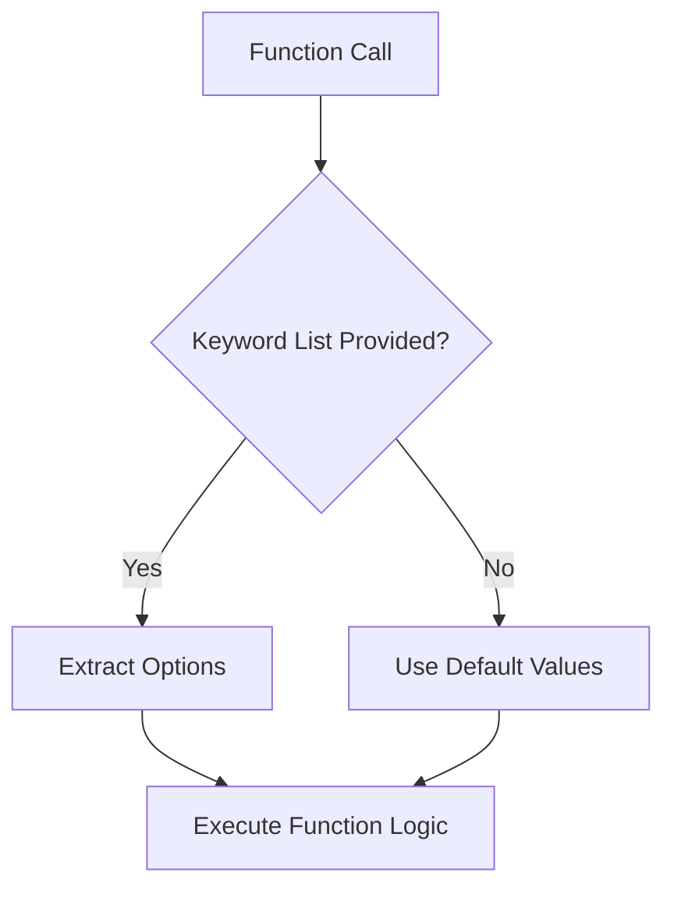

## 4.5. Functional Options and Default Arguments

In Elixir, designing functions that are both flexible and easy to use is crucial for creating robust and maintainable applications. Functional options and default arguments play a significant role in achieving this goal. This section delves into the idiomatic patterns of using keyword lists for options and setting default values, providing expert insights and practical examples to enhance your Elixir programming skills.

### Using Keyword Lists for Options

Keyword lists are a fundamental feature in Elixir, offering a simple yet powerful way to pass optional parameters to functions. Unlike positional arguments, keyword lists allow for greater flexibility and readability, particularly when dealing with functions that require numerous optional parameters.

#### Why Use Keyword Lists?

Keyword lists in Elixir are essentially lists of tuples, where each tuple consists of an atom key and its corresponding value. They provide several advantages:

- **Readability**: By naming parameters, keyword lists make function calls more self-explanatory.
- **Flexibility**: You can pass parameters in any order and omit those you don't need.
- **Extensibility**: Adding new options doesn't break existing function calls.

#### Implementing Keyword Lists

Consider a scenario where you have a function that configures a connection to a database. Instead of using multiple positional arguments, you can use a keyword list to pass optional parameters:

```elixir
defmodule DatabaseConnector do
  def connect(opts \\ []) do
    host = Keyword.get(opts, :host, "localhost")
    port = Keyword.get(opts, :port, 5432)
    user = Keyword.get(opts, :user, "admin")
    password = Keyword.get(opts, :password, "secret")

    # Simulate connection logic
    IO.puts("Connecting to #{host}:#{port} as #{user}")
  end
end

# Usage
DatabaseConnector.connect(host: "db.example.com", user: "root")
```

In this example, the `connect/1` function uses `Keyword.get/3` to retrieve values from the options list, providing default values if a key is not present.

#### Best Practices for Keyword Lists

- **Use Keyword.get/3**: Always provide a default value to avoid unexpected errors.
- **Document Options**: Clearly document the available options and their defaults.
- **Validate Inputs**: Consider adding validation logic to ensure the options passed are correct.

### Setting Default Values

Default arguments in Elixir simplify function interfaces by reducing the number of parameters a user must explicitly provide. This is particularly useful for maintaining backward compatibility and reducing cognitive load on developers.

#### Defining Default Arguments

Elixir allows you to define default values for function parameters directly in the function signature. This feature is particularly useful for providing sensible defaults while still allowing customization.

```elixir
defmodule Greeter do
  def greet(name, greeting \\ "Hello") do
    IO.puts("#{greeting}, #{name}!")
  end
end

# Usage
Greeter.greet("Alice")           # Outputs: Hello, Alice!
Greeter.greet("Bob", "Hi")       # Outputs: Hi, Bob!
```

In this example, the `greet/2` function has a default value for the `greeting` parameter. If no greeting is provided, it defaults to "Hello".

#### Combining Keyword Lists and Default Arguments

For even greater flexibility, you can combine keyword lists with default arguments. This approach allows you to mix positional arguments with optional keyword arguments, providing a clear and concise API.

```elixir
defmodule Notification do
  def send_message(recipient, opts \\ []) do
    message = Keyword.get(opts, :message, "You have a new notification")
    priority = Keyword.get(opts, :priority, :normal)

    IO.puts("Sending '#{message}' to #{recipient} with priority #{priority}")
  end
end

# Usage
Notification.send_message("Bob", message: "Meeting at 10 AM", priority: :high)
Notification.send_message("Alice")
```

### Examples

#### Configuring Function Behavior Without Overloading

Overloading functions with multiple versions to accommodate different parameter sets is common in some languages. However, in Elixir, using keyword lists and default arguments can achieve similar flexibility without the complexity of function overloading.

Consider a logging function that can log messages at different levels:

```elixir
defmodule Logger do
  def log(message, opts \\ []) do
    level = Keyword.get(opts, :level, :info)
    timestamp = Keyword.get(opts, :timestamp, :os.system_time(:seconds))

    IO.puts("[#{level}] #{timestamp}: #{message}")
  end
end

# Usage
Logger.log("System started")
Logger.log("User login failed", level: :error)
```

In this example, the `log/2` function uses keyword lists to handle optional parameters like `level` and `timestamp`, providing a flexible interface for logging messages.

### Visualizing Functional Options and Default Arguments

To better understand how functional options and default arguments work together, let's visualize their interaction using a flowchart.


```mermaid
graph TD;
    A[Function Call] --> B{Keyword List Provided?};
    B -- Yes --> C[Extract Options];
    B -- No --> D[Use Default Values];
    C --> E[Execute Function Logic];
    D --> E[Execute Function Logic];
```

**Diagram Description**: This flowchart illustrates the decision-making process when a function is called with optional parameters. It checks if a keyword list is provided, extracts options if available, or uses default values if not, before executing the function logic.

### Elixir Unique Features

Elixir's functional nature and its powerful pattern matching capabilities make it uniquely suited for implementing functional options and default arguments. Here are some Elixir-specific features that enhance these patterns:

- **Pattern Matching**: Use pattern matching to destructure keyword lists directly in function heads, providing a clean and expressive way to handle options.
- **Immutable Data Structures**: Elixir's immutable data structures ensure that default values and options do not inadvertently alter the state, leading to more predictable code behavior.
- **Pipe Operator (`|>`)**: Chain function calls with the pipe operator to create clean and readable code when working with functional options.

### Differences and Similarities

Functional options and default arguments in Elixir share similarities with other languages but also have distinct differences:

- **Similarities**: Like Python and Ruby, Elixir allows default arguments in function signatures, providing a straightforward way to handle optional parameters.
- **Differences**: Unlike Java or C++, Elixir does not support method overloading. Instead, it uses pattern matching and default arguments to achieve similar flexibility without the complexity of multiple method signatures.

### Design Considerations

When implementing functional options and default arguments, consider the following:

- **Clarity vs. Flexibility**: Balance the need for a flexible API with the clarity of function signatures. Avoid overly complex options that can confuse users.
- **Performance**: While keyword lists are convenient, they can be slower than maps for large datasets. Consider using maps if performance is a concern.
- **Backward Compatibility**: Use default arguments to maintain backward compatibility as your API evolves.

### Try It Yourself

Experiment with the concepts covered in this section by modifying the provided code examples. Try adding new options to the functions or changing the default values to see how it affects the behavior. This hands-on approach will reinforce your understanding and help you master functional options and default arguments in Elixir.

### Key Takeaways

- **Keyword Lists**: Use keyword lists to pass optional parameters in a flexible and readable way.
- **Default Arguments**: Define default values to simplify function interfaces and maintain backward compatibility.
- **Combine Approaches**: Combine keyword lists with default arguments for maximum flexibility and clarity.
- **Elixir's Strengths**: Leverage Elixir's pattern matching and immutable data structures to implement these patterns effectively.

## Quiz Time!



### What is the primary advantage of using keyword lists for optional parameters in Elixir?

- [x] Flexibility and readability
- [ ] Improved performance
- [ ] Reduced memory usage
- [ ] Simplified syntax

> **Explanation:** Keyword lists provide flexibility and readability by allowing named parameters that can be passed in any order and omitted if not needed.

### How do you provide a default value for a parameter in Elixir?

- [x] By specifying the default value in the function signature
- [ ] By using a separate function
- [ ] By using a keyword list
- [ ] By using a global variable

> **Explanation:** Default values are specified directly in the function signature, allowing optional parameters to be omitted in function calls.

### What is a potential downside of using keyword lists for large datasets?

- [x] Slower performance compared to maps
- [ ] Increased memory usage
- [ ] Lack of flexibility
- [ ] Difficulty in maintaining code

> **Explanation:** Keyword lists can be slower than maps for large datasets due to their list-based structure.

### Which Elixir feature allows chaining function calls for cleaner code?

- [x] Pipe operator (`|>`)
- [ ] Pattern matching
- [ ] Keyword lists
- [ ] Default arguments

> **Explanation:** The pipe operator (`|>`) allows chaining function calls, leading to cleaner and more readable code.

### Can Elixir functions be overloaded like in Java or C++?

- [ ] Yes, Elixir supports function overloading.
- [x] No, Elixir uses pattern matching and default arguments instead.
- [ ] Yes, but only for certain types of functions.
- [ ] No, Elixir does not support multiple function signatures.

> **Explanation:** Elixir does not support function overloading. Instead, it uses pattern matching and default arguments to achieve similar flexibility.

### What is the purpose of `Keyword.get/3` in Elixir?

- [x] To retrieve a value from a keyword list with a default
- [ ] To create a new keyword list
- [ ] To remove a value from a keyword list
- [ ] To sort a keyword list

> **Explanation:** `Keyword.get/3` retrieves a value from a keyword list, providing a default if the key is not present.

### How can you ensure backward compatibility when updating a function's API?

- [x] Use default arguments for new parameters
- [ ] Remove old parameters
- [ ] Use global variables
- [ ] Avoid adding new parameters

> **Explanation:** Default arguments allow new parameters to be added without breaking existing function calls, maintaining backward compatibility.

### What is a key benefit of Elixir's immutable data structures in the context of default arguments?

- [x] Predictable code behavior
- [ ] Faster execution
- [ ] Reduced memory usage
- [ ] Simplified syntax

> **Explanation:** Immutable data structures ensure that default values and options do not inadvertently alter the state, leading to more predictable code behavior.

### How can you document the available options and defaults for a function?

- [x] Use comments and documentation strings
- [ ] Use global variables
- [ ] Use a separate file
- [ ] Use a configuration script

> **Explanation:** Comments and documentation strings are used to clearly document the available options and their defaults.

### True or False: Keyword lists in Elixir are essentially lists of tuples.

- [x] True
- [ ] False

> **Explanation:** Keyword lists are indeed lists of tuples, where each tuple consists of an atom key and its corresponding value.



Remember, mastering functional options and default arguments in Elixir is just the beginning. As you continue to explore the language, you'll discover even more powerful patterns and techniques to enhance your applications. Keep experimenting, stay curious, and enjoy the journey!
