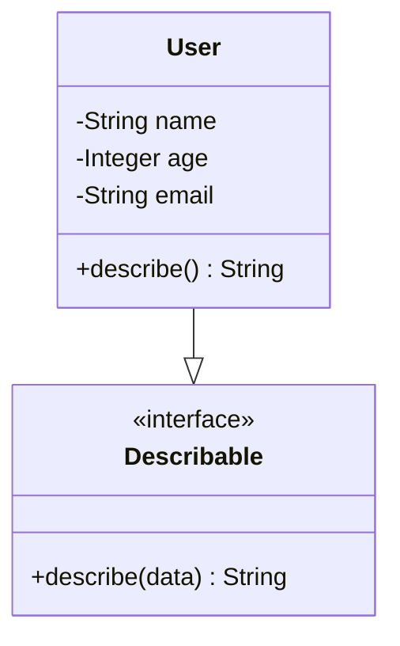

## 4.6. Using Structs and Protocols

In the world of Elixir, structs and protocols are powerful tools that allow developers to model data and implement polymorphic behavior in a clean and efficient manner. This section delves into the intricacies of using structs and protocols, providing you with the knowledge to leverage these features in your Elixir applications.

### Data Modeling with Structs

Structs in Elixir are a way to define custom data types with named fields. They are built on top of maps, providing a way to enforce a specific structure for your data. Structs are immutable, like all data in Elixir, and they come with a set of default values.

#### Defining Clear Contracts for Data Types

When you define a struct, you are essentially creating a contract for your data. This contract specifies the fields that must be present and their default values. Here's how you can define a struct in Elixir:

```elixir
defmodule User do
  defstruct name: "Anonymous", age: 0, email: nil
end
```

In this example, we define a `User` struct with three fields: `name`, `age`, and `email`. Each field has a default value, which can be overridden when creating an instance of the struct.

#### Creating and Using Structs

To create an instance of a struct, you use the `%StructName{}` syntax:

```elixir
# Creating a User struct with default values
default_user = %User{}

# Creating a User struct with custom values
custom_user = %User{name: "Alice", age: 30, email: "alice@example.com"}
```

Structs provide a way to ensure that your data adheres to a specific format, making your code more predictable and easier to maintain.

#### Accessing and Updating Struct Fields

You can access and update fields in a struct using the dot notation:

```elixir
# Accessing fields
IO.puts(custom_user.name)  # Output: Alice

# Updating fields
updated_user = %User{custom_user | age: 31}
```

Remember, structs are immutable, so updating a field creates a new struct with the updated value.

### Polymorphism with Protocols

Protocols in Elixir provide a mechanism for polymorphism, allowing you to write generic code that can work with different data types. They are similar to interfaces in other languages but are more flexible and dynamic.

#### Writing Generic Code with Protocols

Protocols define a set of functions that must be implemented by any data type that wants to conform to the protocol. Here's an example of defining a simple protocol:

```elixir
defprotocol Describable do
  @doc "Returns a description of the data"
  def describe(data)
end
```

This `Describable` protocol requires implementing a `describe/1` function that returns a description of the data.

#### Implementing Protocols

To implement a protocol for a specific data type, you use the `defimpl` macro. Let's implement the `Describable` protocol for the `User` struct:

```elixir
defimpl Describable, for: User do
  def describe(user) do
    "User: #{user.name}, Age: #{user.age}, Email: #{user.email}"
  end
end
```

Now, you can call the `describe/1` function on any `User` struct:

```elixir
IO.puts(Describable.describe(custom_user))  # Output: User: Alice, Age: 30, Email: alice@example.com
```

#### Built-in Protocols: `Enumerable` and `String.Chars`

Elixir comes with several built-in protocols, such as `Enumerable` and `String.Chars`, which you can implement for your custom data types.

##### Implementing the `Enumerable` Protocol

The `Enumerable` protocol allows you to make your data type enumerable, enabling it to work with functions like `Enum.map/2` and `Enum.reduce/3`. Here's how you might implement it for a custom collection:

```elixir
defmodule MyCollection do
  defstruct items: []

  defimpl Enumerable do
    def count(%MyCollection{items: items}), do: {:ok, length(items)}
    def member?(%MyCollection{items: items}, value), do: {:ok, value in items}
    def reduce(%MyCollection{items: items}, acc, fun), do: Enum.reduce(items, acc, fun)
  end
end
```

##### Implementing the `String.Chars` Protocol

The `String.Chars` protocol is used to convert a data type to a string. Implementing this protocol allows you to use the `to_string/1` function:

```elixir
defimpl String.Chars, for: User do
  def to_string(user) do
    "User: #{user.name}"
  end
end

IO.puts(to_string(custom_user))  # Output: User: Alice
```

### Custom Protocols

Creating custom protocols allows you to define your own set of functions that different data types can implement. This is particularly useful when you want to enforce a specific behavior across multiple modules.

#### Example: A Custom Protocol for Logging

Let's create a custom protocol for logging data:

```elixir
defprotocol Loggable do
  @doc "Logs the data"
  def log(data)
end

defimpl Loggable, for: User do
  def log(user) do
    IO.puts("Logging user: #{user.name}")
  end
end
```

With this `Loggable` protocol, any data type that implements it can be logged using the `log/1` function.

### Visualizing Structs and Protocols

To better understand how structs and protocols work together, let's visualize their relationship using a class diagram:



In this diagram, the `User` struct implements the `Describable` protocol, providing a concrete implementation of the `describe/1` function.

### Design Considerations

When using structs and protocols, consider the following:

- **Use Structs for Data Integrity**: Structs are ideal for ensuring data integrity and providing a clear contract for your data types.
- **Leverage Protocols for Flexibility**: Protocols allow you to write flexible and reusable code by defining a set of functions that different data types can implement.
- **Avoid Overuse**: While protocols are powerful, overusing them can lead to complex and hard-to-maintain code. Use them judiciously to solve specific problems.

### Elixir Unique Features

Elixir's approach to structs and protocols is unique in several ways:

- **Immutability**: Both structs and protocols embrace Elixir's immutable nature, ensuring that data remains consistent and predictable.
- **Dynamic Dispatch**: Protocols provide dynamic dispatch, allowing you to write polymorphic code without the need for inheritance or complex type hierarchies.
- **Integration with the BEAM**: Elixir's structs and protocols are designed to work seamlessly with the BEAM VM, providing efficient and performant data handling.

### Differences and Similarities

Structs and protocols are often compared to classes and interfaces in object-oriented languages. However, there are key differences:

- **Structs vs. Classes**: Structs are simpler and more lightweight than classes, focusing on data rather than behavior.
- **Protocols vs. Interfaces**: Protocols offer more flexibility than interfaces, allowing for dynamic dispatch and implementation for existing data types.

### Try It Yourself

Experiment with structs and protocols by modifying the examples provided. Try adding new fields to the `User` struct or implementing additional protocols. This hands-on approach will deepen your understanding and help you master these powerful Elixir features.

### Knowledge Check

- What is the primary purpose of structs in Elixir?
- How do protocols enable polymorphism in Elixir?
- Can you implement a protocol for a built-in data type? Why or why not?
- What are some common use cases for custom protocols?

### Summary

In this section, we've explored the power of structs and protocols in Elixir. By defining clear data contracts with structs and implementing polymorphic behavior with protocols, you can create robust, flexible, and maintainable code. Remember, this is just the beginning. As you continue your journey with Elixir, keep experimenting and exploring new ways to leverage these features.

## Quiz: Using Structs and Protocols



### What is the primary purpose of structs in Elixir?

- [x] To define custom data types with named fields
- [ ] To provide a way to inherit behavior from other modules
- [ ] To enable dynamic typing
- [ ] To replace maps entirely

> **Explanation:** Structs in Elixir are used to define custom data types with named fields, providing a clear contract for data.

### How do protocols enable polymorphism in Elixir?

- [x] By defining a set of functions that different data types can implement
- [ ] By allowing inheritance from other modules
- [ ] By providing a way to override functions
- [ ] By enabling dynamic typing

> **Explanation:** Protocols define a set of functions that different data types can implement, allowing for polymorphic behavior.

### Can you implement a protocol for a built-in data type?

- [x] Yes
- [ ] No

> **Explanation:** You can implement protocols for built-in data types, allowing them to conform to the protocol's behavior.

### What is the `String.Chars` protocol used for?

- [x] Converting a data type to a string
- [ ] Enumerating over a collection
- [ ] Logging data
- [ ] Formatting numbers

> **Explanation:** The `String.Chars` protocol is used to convert a data type to a string, enabling the use of `to_string/1`.

### Which of the following is a built-in protocol in Elixir?

- [x] Enumerable
- [ ] Loggable
- [ ] Describable
- [ ] Serializable

> **Explanation:** `Enumerable` is a built-in protocol in Elixir, allowing data types to be enumerated over.

### What is the result of updating a field in a struct?

- [x] A new struct with the updated value
- [ ] The original struct is modified
- [ ] An error is raised
- [ ] The field is ignored

> **Explanation:** Updating a field in a struct creates a new struct with the updated value, as structs are immutable.

### What is the syntax to create an instance of a struct?

- [x] `%StructName{}`
- [ ] `StructName.new()`
- [ ] `create StructName`
- [ ] `new StructName`

> **Explanation:** The syntax to create an instance of a struct is `%StructName{}`.

### What is a key difference between structs and classes?

- [x] Structs focus on data, while classes focus on behavior
- [ ] Structs allow inheritance, while classes do not
- [ ] Structs are mutable, while classes are immutable
- [ ] Structs are used for polymorphism, while classes are not

> **Explanation:** Structs focus on data, providing a simple way to define custom data types, while classes often focus on behavior.

### What is the purpose of the `defimpl` macro?

- [x] To implement a protocol for a specific data type
- [ ] To define a new protocol
- [ ] To create a new struct
- [ ] To override a function

> **Explanation:** The `defimpl` macro is used to implement a protocol for a specific data type, providing the required functions.

### True or False: Protocols in Elixir allow for dynamic dispatch.

- [x] True
- [ ] False

> **Explanation:** Protocols in Elixir provide dynamic dispatch, allowing different data types to implement the same set of functions.



Remember, mastering structs and protocols in Elixir is a journey. Keep experimenting, stay curious, and enjoy the process of learning and growing as a developer!
