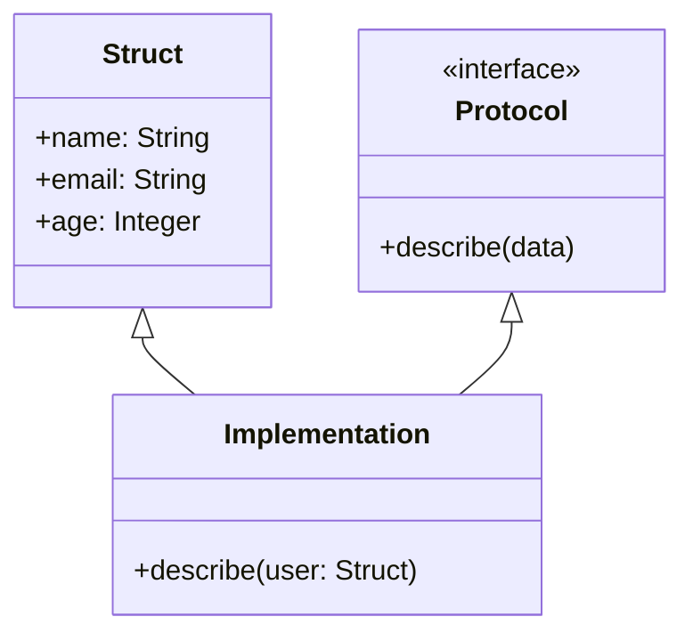

## 4.6. Using Structs and Protocols

In this section, we delve into the powerful features of Elixir's structs and protocols, which are essential tools for advanced data modeling and polymorphism. This guide will equip you with the knowledge to define clear contracts for data types using structs and write generic, reusable code through protocols.

### Data Modeling with Structs

Elixir's structs are a cornerstone for data modeling, providing a way to define and enforce a clear contract for data types. Structs are built on top of maps but come with additional benefits such as compile-time checks and default values.

#### Defining Structs

To define a struct in Elixir, you use the `defstruct` keyword within a module. Here’s a simple example:

```elixir
defmodule User do
  defstruct name: "Anonymous", email: nil, age: 0
end
```

In this example, we define a `User` struct with three fields: `name`, `email`, and `age`. Each field can have a default value, which is used if no value is provided when creating an instance of the struct.

#### Creating and Using Structs

Creating an instance of a struct is straightforward:

```elixir
# Create a new User struct
john = %User{name: "John Doe", email: "john.doe@example.com", age: 30}

# Accessing fields
IO.puts(john.name) # Output: John Doe
```

Structs are immutable, meaning that any changes to a struct result in a new struct:

```elixir
# Update the age field
updated_john = %{john | age: 31}

IO.puts(updated_john.age) # Output: 31
```

#### Enforcing Data Contracts

Structs enforce a contract on the data they hold. Attempting to access or update a field that doesn't exist in the struct will result in a compile-time error, providing a layer of safety:

```elixir
# This will raise a compile-time error
# invalid_john = %{john | height: 180}
```

### Polymorphism with Protocols

Protocols in Elixir provide a mechanism for polymorphism, allowing you to write functions that can operate on different data types. They are similar to interfaces in other languages but are more flexible and dynamic.

#### Defining Protocols

A protocol is defined using the `defprotocol` keyword. Here’s an example of a simple protocol:

```elixir
defprotocol Describable do
  @doc "Returns a string description of the data"
  def describe(data)
end
```

#### Implementing Protocols

To use a protocol, you need to provide implementations for the data types you want to support. Here’s how you can implement the `Describable` protocol for our `User` struct:

```elixir
defimpl Describable, for: User do
  def describe(user) do
    "User: #{user.name}, Email: #{user.email}, Age: #{user.age}"
  end
end
```

Now, you can use the `describe` function on any `User` struct:

```elixir
IO.puts(Describable.describe(john)) # Output: User: John Doe, Email: john.doe@example.com, Age: 30
```

#### Built-in Protocols

Elixir comes with several built-in protocols, such as `Enumerable`, `String.Chars`, and `Inspect`. Here’s an example of implementing the `String.Chars` protocol for the `User` struct:

```elixir
defimpl String.Chars, for: User do
  def to_string(user) do
    "#{user.name} (#{user.email})"
  end
end

IO.puts(to_string(john)) # Output: John Doe (john.doe@example.com)
```

### Implementing Custom Protocols

Creating custom protocols allows you to extend the language’s capabilities to fit your specific domain needs.

#### Example: A Custom Protocol

Let's create a custom protocol called `Calculable` to calculate some properties of different geometric shapes.

```elixir
defprotocol Calculable do
  @doc "Calculates the area of a shape"
  def area(shape)

  @doc "Calculates the perimeter of a shape"
  def perimeter(shape)
end
```

#### Implementing `Calculable` for Different Shapes

Now, let's define a couple of structs for geometric shapes and implement the `Calculable` protocol for them.

```elixir
defmodule Circle do
  defstruct radius: 0
end

defmodule Rectangle do
  defstruct width: 0, height: 0
end

defimpl Calculable, for: Circle do
  def area(%Circle{radius: r}) do
    :math.pi() * r * r
  end

  def perimeter(%Circle{radius: r}) do
    2 * :math.pi() * r
  end
end

defimpl Calculable, for: Rectangle do
  def area(%Rectangle{width: w, height: h}) do
    w * h
  end

  def perimeter(%Rectangle{width: w, height: h}) do
    2 * (w + h)
  end
end
```

#### Using the `Calculable` Protocol

With the implementations in place, you can now calculate the area and perimeter of different shapes:

```elixir
circle = %Circle{radius: 5}
rectangle = %Rectangle{width: 4, height: 6}

IO.puts("Circle area: #{Calculable.area(circle)}")
IO.puts("Rectangle perimeter: #{Calculable.perimeter(rectangle)}")
```

### Elixir Unique Features

Elixir's approach to structs and protocols offers unique advantages:

- **Compile-time Guarantees**: Structs provide compile-time guarantees about the structure of your data.
- **Dynamic Dispatch**: Protocols enable dynamic dispatch, allowing functions to operate on different types without knowing their specifics at compile time.
- **Extensibility**: You can extend existing codebases with new protocols and implementations without modifying existing code.

### Differences and Similarities with Other Patterns

Structs can be compared to classes in object-oriented languages, but they lack methods and inheritance. Protocols offer a form of polymorphism similar to interfaces but are more flexible due to their dynamic nature.

### Design Considerations

- **When to Use Structs**: Use structs when you need to define a clear data model with specific fields and default values.
- **When to Use Protocols**: Use protocols when you need polymorphic behavior across different data types.
- **Avoid Overuse**: While powerful, avoid overusing protocols for simple cases where a function with pattern matching might suffice.

### Try It Yourself

Experiment with the code examples provided. Try adding new fields to structs or implementing additional protocols. Consider how you might use structs and protocols in your current projects to improve code clarity and extensibility.

### Visualizing Structs and Protocols

Below is a diagram illustrating the relationship between structs and protocols in Elixir:


```mermaid
classDiagram
    class Struct {
        +name: String
        +email: String
        +age: Integer
    }
    class Protocol {
        <<interface>>
        +describe(data)
    }
    class Implementation {
        +describe(user: Struct)
    }
    Struct <|-- Implementation
    Protocol <|-- Implementation
```

This diagram shows how a struct (`Struct`) is implemented and how a protocol (`Protocol`) is defined and implemented by a specific data type (`Implementation`).

### Knowledge Check

- **What are the benefits of using structs over plain maps?**
- **How do protocols enable polymorphism in Elixir?**
- **What are the differences between structs and classes in object-oriented programming?**

### Key Takeaways

- Structs provide a safe and clear way to model data in Elixir.
- Protocols enable polymorphic behavior, allowing functions to operate on various data types.
- Elixir's unique features, such as compile-time checks and dynamic dispatch, make structs and protocols powerful tools for developers.

### Embrace the Journey

Remember, mastering structs and protocols is a journey. As you continue to explore Elixir, you'll find more ways to leverage these features to write clean, efficient, and maintainable code. Keep experimenting, stay curious, and enjoy the process!

## Quiz Time!



### What is a primary benefit of using structs in Elixir?

- [x] Compile-time guarantees about data structure
- [ ] Inheritance and method definitions
- [ ] Built-in support for polymorphism
- [ ] Automatic serialization

> **Explanation:** Structs provide compile-time guarantees about the fields they contain, ensuring data integrity.

### How do protocols in Elixir differ from interfaces in other languages?

- [x] They allow dynamic dispatch
- [ ] They support inheritance
- [ ] They are only for built-in types
- [ ] They require method implementations

> **Explanation:** Protocols in Elixir allow dynamic dispatch, enabling functions to operate on different types without compile-time knowledge of them.

### Which keyword is used to define a struct in Elixir?

- [x] defstruct
- [ ] defmodule
- [ ] defrecord
- [ ] defclass

> **Explanation:** The `defstruct` keyword is used to define a struct in Elixir.

### What does implementing a protocol for a data type allow you to do?

- [x] Define specific behavior for that data type
- [ ] Create subclasses of the data type
- [ ] Automatically serialize the data type
- [ ] Add methods to the data type

> **Explanation:** Implementing a protocol allows you to define specific behavior for the data type in question.

### What is a key difference between structs and maps in Elixir?

- [x] Structs have a defined set of fields
- [ ] Maps support pattern matching
- [ ] Structs can inherit fields
- [ ] Maps are immutable

> **Explanation:** Structs have a defined set of fields, providing more structure and safety compared to maps.

### What is the purpose of the `for` keyword in protocol implementation?

- [x] To specify the data type the protocol is implemented for
- [ ] To loop over data types
- [ ] To define default protocol behavior
- [ ] To import other modules

> **Explanation:** The `for` keyword specifies the data type that the protocol implementation targets.

### Which of the following is a built-in protocol in Elixir?

- [x] Enumerable
- [ ] Collectible
- [ ] Serializable
- [ ] Comparable

> **Explanation:** `Enumerable` is a built-in protocol in Elixir, used for collections that can be enumerated.

### How do structs enforce data contracts?

- [x] By providing compile-time checks
- [ ] By allowing inheritance
- [ ] By supporting dynamic typing
- [ ] By using runtime exceptions

> **Explanation:** Structs enforce data contracts through compile-time checks, ensuring that only defined fields are used.

### What is a benefit of using protocols for polymorphism?

- [x] They allow functions to work with multiple data types
- [ ] They provide a fixed method signature
- [ ] They support inheritance
- [ ] They automatically serialize data

> **Explanation:** Protocols enable polymorphic behavior, allowing functions to operate on various data types.

### True or False: Protocols in Elixir can be extended without modifying existing code.

- [x] True
- [ ] False

> **Explanation:** Protocols can be extended with new implementations for additional data types without altering existing code.




