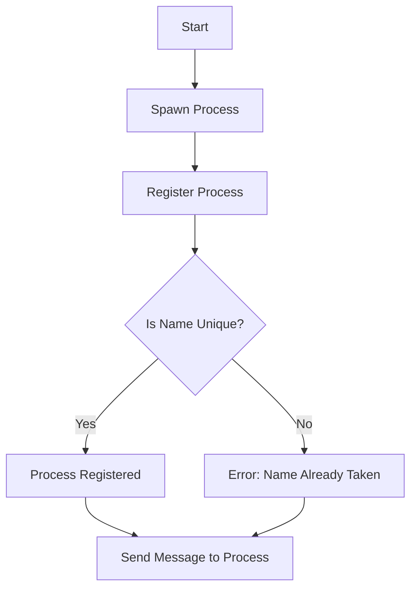

## 4.7. Registry and Named Processes

In Elixir, processes are the fundamental units of concurrency, and managing them efficiently is crucial for building scalable and fault-tolerant applications. This section delves into the concepts of registry and named processes, providing expert insights into their implementation and use cases.

### Process Registration

Process registration is a technique used to assign a unique identifier, typically an atom, to a process. This allows other processes to communicate with it without needing to know its process identifier (PID). Naming processes simplifies inter-process communication and enhances code readability.

#### Naming Processes for Easy Access and Communication

Naming a process involves associating an atom with a PID. This can be done using the `Process.register/2` function. Here's a simple example:

```elixir
defmodule MyProcess do
  def start_link do
    pid = spawn_link(fn -> loop() end)
    Process.register(pid, :my_process)
    {:ok, pid}
  end

  defp loop do
    receive do
      :stop -> :ok
      _ -> loop()
    end
  end
end
```

In this example, the process is registered with the name `:my_process`. Other processes can send messages to it using this name:

```elixir
send(:my_process, :stop)
```

**Key Considerations:**

- **Uniqueness:** Each name must be unique within the node. Attempting to register a name that is already in use will result in an error.
- **Scope:** Registered names are local to the node. For distributed systems, consider using global registration mechanisms.

### Using the Registry Module

The `Registry` module in Elixir provides a more flexible and scalable way to manage process names, especially when dealing with dynamic process groups. It allows for multiple processes to be registered under the same key, supporting features like key-value storage and process lookup.

#### Managing Dynamic Process Groups and Lookups

To use the `Registry` module, you first need to define a registry:

```elixir
defmodule MyApp.Registry do
  use Registry, keys: :unique, name: MyApp.Registry
end
```

This creates a registry with unique keys. You can also create a registry with duplicate keys if needed:

```elixir
defmodule MyApp.DupRegistry do
  use Registry, keys: :duplicate, name: MyApp.DupRegistry
end
```

**Registering Processes:**

```elixir
{:ok, _} = Registry.register(MyApp.Registry, :my_key, :my_value)
```

**Looking Up Processes:**

```elixir
case Registry.lookup(MyApp.Registry, :my_key) do
  [{pid, value}] -> IO.puts("Found process #{inspect(pid)} with value #{inspect(value)}")
  [] -> IO.puts("No process found")
end
```

**Key Features:**

- **Scalability:** Suitable for applications with a large number of dynamic processes.
- **Flexibility:** Supports both unique and duplicate keys, allowing for various use cases.
- **Efficiency:** Optimized for concurrent access and updates.

### Use Cases

The registry and named processes pattern is versatile and can be applied in various scenarios. Here are some common use cases:

#### Implementing Worker Pools

Worker pools are essential for managing a group of worker processes that perform tasks concurrently. The `Registry` module can be used to track and manage these workers efficiently.

**Example:**

```elixir
defmodule Worker do
  def start_link(id) do
    pid = spawn_link(fn -> loop(id) end)
    Registry.register(MyApp.Registry, id, pid)
    {:ok, pid}
  end

  defp loop(id) do
    receive do
      {:work, task} ->
        IO.puts("Worker #{id} processing #{task}")
        loop(id)
    end
  end
end

# Starting workers
{:ok, _} = Worker.start_link(:worker1)
{:ok, _} = Worker.start_link(:worker2)

# Sending tasks
send(Registry.lookup(MyApp.Registry, :worker1), {:work, "Task A"})
send(Registry.lookup(MyApp.Registry, :worker2), {:work, "Task B"})
```

#### Supervised Task Management

In supervised task management, processes are monitored and restarted if they fail. The `Registry` module can be used to keep track of tasks and their states.

**Example:**

```elixir
defmodule TaskSupervisor do
  use Supervisor

  def start_link do
    Supervisor.start_link(__MODULE__, [], name: __MODULE__)
  end

  def init(_) do
    children = [
      {Registry, keys: :unique, name: MyApp.TaskRegistry}
    ]

    Supervisor.init(children, strategy: :one_for_one)
  end
end

defmodule TaskWorker do
  def start_link(task_id) do
    pid = spawn_link(fn -> perform_task(task_id) end)
    Registry.register(MyApp.TaskRegistry, task_id, pid)
    {:ok, pid}
  end

  defp perform_task(task_id) do
    # Simulate task processing
    :timer.sleep(1000)
    IO.puts("Task #{task_id} completed")
  end
end

# Starting the supervisor
{:ok, _} = TaskSupervisor.start_link()

# Starting tasks
{:ok, _} = TaskWorker.start_link(:task1)
{:ok, _} = TaskWorker.start_link(:task2)
```

### Visualizing Process Registration and Registry Usage

To better understand the flow of process registration and registry usage, let's visualize the architecture using Mermaid.js diagrams.



**Diagram Description:** This flowchart illustrates the process of spawning a process, registering it with a unique name, and handling potential errors if the name is already taken. Once registered, messages can be sent to the process using its name.

### Design Considerations

When implementing registry and named processes, consider the following:

- **Concurrency:** Ensure that the registry can handle concurrent access efficiently.
- **Fault Tolerance:** Use supervisors to monitor and restart processes in case of failures.
- **Scalability:** Design the registry to support a large number of dynamic processes.
- **Performance:** Optimize lookup and registration operations for minimal latency.

### Elixir Unique Features

Elixir's concurrency model, based on the BEAM VM, provides unique features that enhance the implementation of registry and named processes:

- **Lightweight Processes:** Elixir processes are lightweight and can be spawned in large numbers without significant overhead.
- **Fault Tolerance:** The "let it crash" philosophy, combined with supervisors, ensures robust error handling.
- **Distributed Systems:** Elixir's built-in support for distributed systems allows for process registration across nodes.

### Differences and Similarities

Registry and named processes are often compared to other patterns like global registration and process groups. Here's how they differ:

- **Global Registration:** Unlike local registration, global registration allows for process names to be shared across nodes.
- **Process Groups:** While registries can manage groups of processes, process groups focus on broadcasting messages to multiple processes.

### Try It Yourself

To deepen your understanding, try modifying the code examples provided:

- **Experiment with Duplicate Keys:** Change the registry to support duplicate keys and observe how multiple processes can be registered under the same key.
- **Implement a Load Balancer:** Create a simple load balancer that distributes tasks among worker processes using the registry.

### Knowledge Check

Before moving on, let's reinforce what we've learned:

- **What is the primary purpose of process registration?**
- **How does the `Registry` module enhance process management?**
- **What are some common use cases for registry and named processes?**

### Embrace the Journey

Remember, mastering registry and named processes is just one step in your Elixir journey. As you continue to explore the language, you'll discover more powerful patterns and techniques. Keep experimenting, stay curious, and enjoy the process of building robust, scalable applications with Elixir!

## Quiz: Registry and Named Processes



### What is the primary purpose of process registration in Elixir?

- [x] To assign a unique identifier to a process for easy communication
- [ ] To increase the process execution speed
- [ ] To reduce memory usage
- [ ] To enhance the graphical user interface

> **Explanation:** Process registration assigns a unique identifier, typically an atom, to a process, allowing easy communication without needing to know its PID.

### Which function is used to register a process with a name in Elixir?

- [x] `Process.register/2`
- [ ] `Process.spawn/2`
- [ ] `Registry.register/2`
- [ ] `Process.link/2`

> **Explanation:** The `Process.register/2` function is used to associate a name with a process PID.

### What is a key feature of the `Registry` module in Elixir?

- [x] It supports both unique and duplicate keys
- [ ] It automatically restarts failed processes
- [ ] It enhances the graphical user interface
- [ ] It reduces the need for supervisors

> **Explanation:** The `Registry` module supports both unique and duplicate keys, allowing for flexible process management.

### In the context of Elixir, what does the "let it crash" philosophy refer to?

- [x] Allowing processes to fail and be restarted by supervisors
- [ ] Intentionally crashing processes to test fault tolerance
- [ ] Crashing processes to free up resources
- [ ] Using crash logs to debug applications

> **Explanation:** The "let it crash" philosophy involves allowing processes to fail and be restarted by supervisors, ensuring robust error handling.

### How can you send a message to a registered process in Elixir?

- [x] Using the registered name with the `send/2` function
- [ ] Using the PID with the `send/2` function
- [ ] Using the registered name with the `spawn/2` function
- [ ] Using the PID with the `spawn/2` function

> **Explanation:** You can send a message to a registered process using its registered name with the `send/2` function.

### What is a common use case for the `Registry` module in Elixir?

- [x] Implementing worker pools
- [ ] Enhancing graphical user interfaces
- [ ] Reducing memory usage
- [ ] Increasing process execution speed

> **Explanation:** The `Registry` module is commonly used to implement worker pools by managing dynamic process groups.

### What is the scope of registered process names in Elixir?

- [x] Local to the node
- [ ] Global across all nodes
- [ ] Limited to the current module
- [ ] Limited to the current function

> **Explanation:** Registered process names are local to the node, meaning they are not shared across nodes.

### What happens if you try to register a process with a name that is already taken?

- [x] An error is raised
- [ ] The process is registered with a different name
- [ ] The existing process is replaced
- [ ] The registration is ignored

> **Explanation:** An error is raised if you try to register a process with a name that is already taken.

### Which of the following is NOT a feature of Elixir's concurrency model?

- [x] Heavyweight processes
- [ ] Lightweight processes
- [ ] Fault tolerance
- [ ] Distributed systems support

> **Explanation:** Elixir processes are lightweight, not heavyweight, allowing for efficient concurrency.

### True or False: The `Registry` module can only be used for unique keys.

- [ ] True
- [x] False

> **Explanation:** The `Registry` module can be configured to support both unique and duplicate keys.


