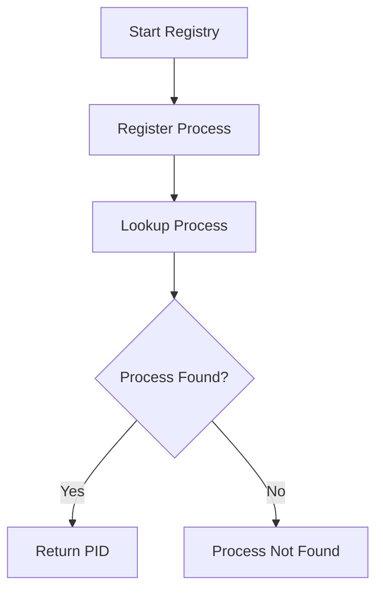

## 4.7. Registry and Named Processes

In the world of concurrent programming, Elixir shines with its robust process management capabilities. At the heart of this capability are registries and named processes, which provide a way to manage and communicate with processes efficiently. This section delves into the intricacies of these concepts, providing expert guidance on how to leverage them for building scalable, maintainable systems.

### Process Registration

Process registration is a fundamental concept in Elixir that allows developers to assign names to processes. This makes it easier to reference and communicate with processes without needing to remember their process identifiers (PIDs).

#### Naming Processes for Easy Access and Communication

In Elixir, processes can be named using atoms, which are unique identifiers within an Elixir application. Naming a process allows you to send messages to it without knowing its PID, which simplifies inter-process communication.

```elixir
defmodule MyProcess do
  use GenServer

  # Client API

  def start_link(name) do
    GenServer.start_link(__MODULE__, %{}, name: name)
  end

  def say_hello(name) do
    GenServer.call(name, :hello)
  end

  # Server Callbacks

  def init(state) do
    {:ok, state}
  end

  def handle_call(:hello, _from, state) do
    {:reply, "Hello, world!", state}
  end
end

# Start the process with a name
{:ok, _pid} = MyProcess.start_link(:my_named_process)

# Call the process using its name
IO.puts(MyProcess.say_hello(:my_named_process)) # Outputs: Hello, world!
```

In this example, we define a `GenServer` process and start it with a name `:my_named_process`. We can then communicate with it using its name, which abstracts away the need to handle PIDs directly.

### Using the Registry Module

While naming processes with atoms is useful, it has limitations, especially in dynamic systems where processes are created and destroyed frequently. This is where the `Registry` module comes into play, providing a more flexible and scalable way to manage process names.

#### Managing Dynamic Process Groups and Lookups

The `Registry` module allows you to create registries that can store multiple key-value pairs, where keys are names and values are PIDs. This is particularly useful for managing dynamic groups of processes.

```elixir
defmodule MyApp.RegistryDemo do
  def start do
    # Start a registry
    {:ok, _} = Registry.start_link(keys: :unique, name: MyApp.Registry)

    # Start a process and register it
    {:ok, pid} = MyProcess.start_link(:undefined)
    Registry.register(MyApp.Registry, :my_dynamic_process, pid)

    # Lookup the process
    case Registry.lookup(MyApp.Registry, :my_dynamic_process) do
      [{pid, _value}] -> IO.puts("Process found with PID: #{inspect(pid)}")
      [] -> IO.puts("Process not found")
    end
  end
end

MyApp.RegistryDemo.start()
```

In this example, we start a registry and register a process with a dynamic name. The `Registry.lookup/2` function is then used to find the process by its name.

#### Visualizing Registry Usage


```mermaid
graph TD;
    A[Start Registry] --> B[Register Process];
    B --> C[Lookup Process];
    C --> D{Process Found?};
    D -->|Yes| E[Return PID];
    D -->|No| F[Process Not Found];
```

This flowchart illustrates the process of starting a registry, registering a process, and performing a lookup.

### Use Cases

Registries and named processes are powerful tools in Elixir, enabling a wide range of use cases. Let's explore some common scenarios where these features shine.

#### Implementing Worker Pools

Worker pools are a common pattern in concurrent systems, allowing for efficient task distribution and load balancing. Elixir's `Registry` module can be used to manage a pool of worker processes.

```elixir
defmodule Worker do
  use GenServer

  def start_link(id) do
    GenServer.start_link(__MODULE__, %{}, name: via_tuple(id))
  end

  defp via_tuple(id) do
    {:via, Registry, {MyApp.WorkerRegistry, id}}
  end

  # Other GenServer callbacks...
end

defmodule WorkerPool do
  def start_pool(size) do
    Registry.start_link(keys: :unique, name: MyApp.WorkerRegistry)

    for id <- 1..size do
      Worker.start_link(id)
    end
  end
end

# Start a pool of 5 workers
WorkerPool.start_pool(5)
```

In this example, we define a worker module that registers itself in a registry using a unique ID. The `WorkerPool` module starts a specified number of workers, each with a unique ID.

#### Supervised Task Management

Supervision trees are a core concept in Elixir, providing fault tolerance and resilience. By combining registries with supervision trees, you can create robust systems that dynamically manage tasks.

```elixir
defmodule TaskSupervisor do
  use Supervisor

  def start_link() do
    Supervisor.start_link(__MODULE__, :ok, name: __MODULE__)
  end

  def init(:ok) do
    children = [
      {Registry, keys: :unique, name: MyApp.TaskRegistry}
    ]

    Supervisor.init(children, strategy: :one_for_one)
  end
end

defmodule DynamicTask do
  use GenServer

  def start_link(id) do
    GenServer.start_link(__MODULE__, %{}, name: via_tuple(id))
  end

  defp via_tuple(id) do
    {:via, Registry, {MyApp.TaskRegistry, id}}
  end

  # Other GenServer callbacks...
end

# Start the supervisor
TaskSupervisor.start_link()

# Start a dynamic task
DynamicTask.start_link(:task1)
```

Here, we define a `TaskSupervisor` that starts a registry as part of its supervision tree. The `DynamicTask` module registers tasks in the registry, allowing for dynamic task management.

### Design Considerations

When using registries and named processes, it's important to consider the following:

- **Scalability**: Ensure that your registry can handle the expected number of processes and lookups efficiently.
- **Fault Tolerance**: Use supervision trees to manage registries and processes, ensuring that failures are handled gracefully.
- **Naming Conflicts**: Avoid naming conflicts by using unique identifiers for processes.
- **Performance**: Consider the performance implications of frequent lookups and updates in large registries.

### Elixir Unique Features

Elixir's unique features, such as lightweight processes and the BEAM VM's concurrency model, make registries and named processes particularly powerful. The ability to handle millions of processes concurrently allows for highly scalable systems.

### Differences and Similarities

Registries and named processes are often compared to similar patterns in other languages, such as service locators or dependency injection. However, Elixir's approach is more lightweight and integrated with its concurrency model, providing unique advantages in terms of scalability and fault tolerance.

### Try It Yourself

Experiment with the concepts covered in this section by modifying the code examples. Try creating a registry with different key types, or implement a worker pool with varying sizes. Observe how the system behaves under different conditions and explore the impact of different design choices.

---

## Quiz Time!



### What is the primary benefit of naming processes in Elixir?

- [x] Simplifies inter-process communication by using names instead of PIDs.
- [ ] Increases the performance of the system.
- [ ] Allows processes to be started without supervision.
- [ ] Enables processes to run on different nodes.

> **Explanation:** Naming processes allows for easier communication by using names instead of PIDs, simplifying the code and making it more readable.

### How does the `Registry` module enhance process management?

- [x] It allows dynamic registration and lookup of processes.
- [ ] It automatically balances the load among processes.
- [ ] It provides a graphical interface for process management.
- [ ] It ensures processes are fault-tolerant by default.

> **Explanation:** The `Registry` module allows for dynamic registration and lookup of processes, making it suitable for managing dynamic groups of processes.

### What is a key consideration when using registries in Elixir?

- [x] Avoid naming conflicts by using unique identifiers.
- [ ] Ensure all processes are supervised by a single supervisor.
- [ ] Use only static names for processes.
- [ ] Limit the number of processes to 100.

> **Explanation:** Naming conflicts can cause issues in process lookup, so it's important to use unique identifiers for processes.

### Which Elixir feature makes registries and named processes particularly powerful?

- [x] Lightweight processes and the BEAM VM's concurrency model.
- [ ] The ability to run on multiple nodes.
- [ ] Built-in support for distributed transactions.
- [ ] Automatic code reloading.

> **Explanation:** Elixir's lightweight processes and the BEAM VM's concurrency model allow for highly scalable systems, making registries and named processes powerful tools.

### What is a common use case for using the `Registry` module?

- [x] Implementing worker pools.
- [ ] Storing application configuration.
- [ ] Managing database connections.
- [ ] Logging application events.

> **Explanation:** The `Registry` module is commonly used for implementing worker pools, where dynamic process management is required.

### How can you ensure fault tolerance when using registries?

- [x] Use supervision trees to manage registries and processes.
- [ ] Avoid using registries in production environments.
- [ ] Limit the number of processes to reduce failure points.
- [ ] Use only static names for processes.

> **Explanation:** Supervision trees provide fault tolerance by managing registries and processes, ensuring that failures are handled gracefully.

### What is the purpose of the `:via` tuple in process registration?

- [x] It allows processes to be registered and looked up via a custom mechanism.
- [ ] It provides a way to log process activity.
- [ ] It ensures processes are started in a specific order.
- [ ] It allows processes to communicate across nodes.

> **Explanation:** The `:via` tuple allows processes to be registered and looked up via a custom mechanism, such as a registry.

### Which of the following is NOT a benefit of using named processes?

- [x] Increases the performance of the system.
- [ ] Simplifies inter-process communication.
- [ ] Makes code more readable.
- [ ] Allows for easier debugging.

> **Explanation:** While named processes simplify communication and make code more readable, they do not inherently increase system performance.

### What strategy should be used to avoid naming conflicts in registries?

- [x] Use unique identifiers for process names.
- [ ] Limit the number of processes to 10.
- [ ] Use only numeric identifiers.
- [ ] Ensure all processes are supervised by a single supervisor.

> **Explanation:** Using unique identifiers for process names helps avoid naming conflicts in registries.

### True or False: The `Registry` module can only be used with `GenServer` processes.

- [ ] True
- [x] False

> **Explanation:** The `Registry` module can be used with any process, not just `GenServer` processes, as it provides a general mechanism for process registration and lookup.



Remember, mastering registries and named processes in Elixir is a journey. Keep experimenting, stay curious, and enjoy the process of building scalable and maintainable systems.
