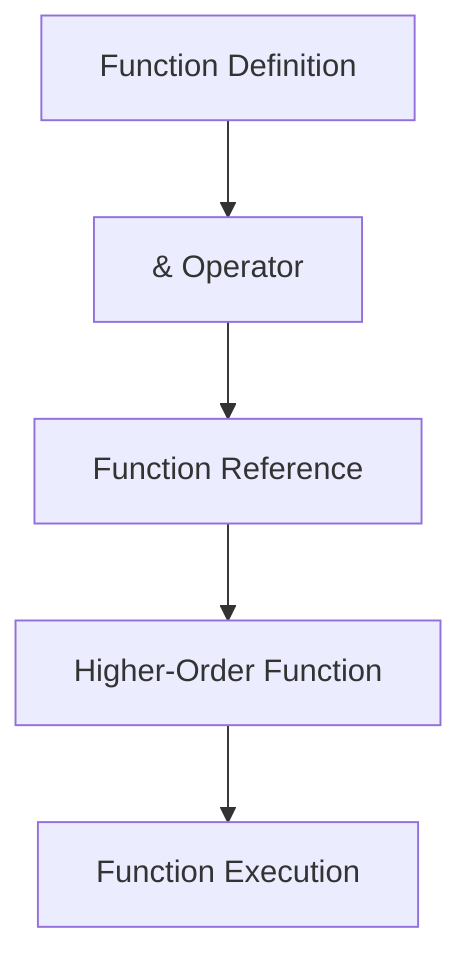
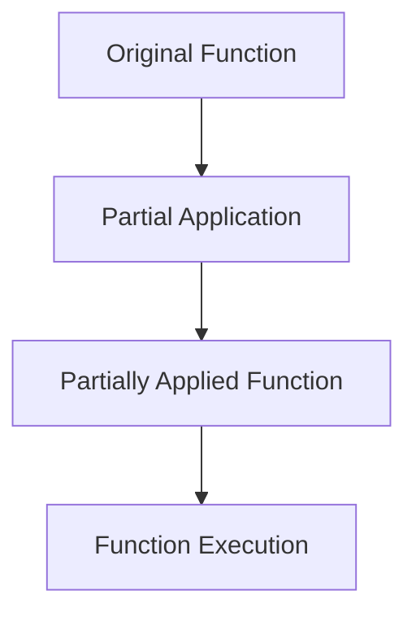

## 4.8. Composing Functions with `&` and the Capture Operator

In Elixir, the `&` capture operator is a powerful tool that allows developers to create concise and expressive function references. This capability is essential for writing idiomatic Elixir code, especially when working with higher-order functions and pipelines. In this section, we will explore how to use the `&` operator to simplify function references, create partially applied functions, and streamline code in various contexts.

### Simplifying Function References

The `&` operator in Elixir is used to capture functions, providing a shorthand way to reference existing functions without explicitly defining anonymous functions. This can lead to more readable and maintainable code.

#### Using `&Module.function/arity` for Concise Code

One of the most common uses of the `&` operator is to reference a function within a module. The syntax `&Module.function/arity` allows you to capture a function with a specific arity (number of arguments) from a module. This is particularly useful when passing functions as arguments to higher-order functions.

**Example:**

```elixir
# Define a module with a simple function
defmodule Math do
  def square(x), do: x * x
end

# Capture the square function using the & operator
square_function = &Math.square/1

# Use the captured function in a list transformation
squared_numbers = Enum.map([1, 2, 3, 4], square_function)

IO.inspect(squared_numbers) # Output: [1, 4, 9, 16]
```

In this example, the `&Math.square/1` syntax captures the `square` function from the `Math` module, allowing it to be passed directly to `Enum.map/2`. This eliminates the need to define an anonymous function explicitly.

#### Visualizing Function Capture

To better understand how the `&` operator captures functions, let's visualize the process using a diagram.



**Diagram Description:** This flowchart illustrates the process of capturing a function using the `&` operator. The function definition is transformed into a function reference, which can then be passed to a higher-order function for execution.

### Creating Partially Applied Functions

Partial application is a functional programming technique where a function is applied to some of its arguments, producing another function that takes the remaining arguments. In Elixir, the `&` operator can be used to create partially applied functions by capturing functions with preset arguments.

#### Capturing Functions with Preset Arguments

To create a partially applied function, you can use the `&` operator in combination with the `fn` keyword to specify preset arguments. This allows you to create specialized functions from more general ones.

**Example:**

```elixir
# Define a function that adds two numbers
defmodule Math do
  def add(a, b), do: a + b
end

# Create a partially applied function that adds 10 to any number
add_ten = &Math.add(10, &1)

# Use the partially applied function
result = add_ten.(5)

IO.inspect(result) # Output: 15
```

In this example, `&Math.add(10, &1)` creates a new function that adds 10 to its argument. The `&1` is a placeholder for the argument that will be passed to the partially applied function.

#### Visualizing Partial Application

Let's visualize the concept of partial application using a diagram.



**Diagram Description:** This flowchart shows how partial application transforms an original function into a partially applied function, which can then be executed with the remaining arguments.

### Examples of Streamlining Code

The `&` operator is particularly useful in Elixir's pipelines and higher-order functions, where concise function references can significantly improve code readability and maintainability.

#### Streamlining Code in Pipelines

Pipelines are a powerful feature in Elixir that allow you to chain function calls in a readable and expressive manner. The `&` operator can be used to simplify function references within pipelines.

**Example:**

```elixir
# Define a module with multiple functions
defmodule Math do
  def add(a, b), do: a + b
  def multiply(a, b), do: a * b
end

# Use pipelines to perform a series of transformations
result = [1, 2, 3, 4]
|> Enum.map(&Math.add(&1, 2))
|> Enum.map(&Math.multiply(&1, 3))

IO.inspect(result) # Output: [9, 12, 15, 18]
```

In this example, the `&` operator is used to reference the `add` and `multiply` functions within the pipeline, resulting in a clean and readable transformation sequence.

#### Streamlining Code in Higher-Order Functions

Higher-order functions are functions that take other functions as arguments or return them as results. The `&` operator can simplify the process of passing functions to higher-order functions.

**Example:**

```elixir
# Define a module with a filter function
defmodule Filter do
  def even?(x), do: rem(x, 2) == 0
end

# Use a higher-order function to filter a list
even_numbers = Enum.filter([1, 2, 3, 4, 5, 6], &Filter.even?/1)

IO.inspect(even_numbers) # Output: [2, 4, 6]
```

In this example, the `&Filter.even?/1` syntax captures the `even?` function, allowing it to be passed directly to `Enum.filter/2`.

### Elixir Unique Features

Elixir's `&` operator is a unique feature that sets it apart from many other functional programming languages. It provides a concise and expressive way to work with functions, making it an essential tool for Elixir developers.

#### Differences and Similarities with Other Languages

While many functional programming languages support function composition and partial application, Elixir's `&` operator offers a distinct syntax that simplifies these tasks. This makes Elixir particularly well-suited for writing clean and maintainable code.

### Design Considerations

When using the `&` operator, it's important to consider the readability and maintainability of your code. While the `&` operator can simplify function references, overusing it can lead to code that is difficult to understand. It's essential to strike a balance between conciseness and clarity.

### Try It Yourself

To deepen your understanding of the `&` operator, try modifying the examples provided in this section. Experiment with different functions, arguments, and pipelines to see how the `&` operator can simplify your code.

### Knowledge Check

- What is the purpose of the `&` operator in Elixir?
- How can you create a partially applied function using the `&` operator?
- What are some benefits of using the `&` operator in pipelines?

### Summary

In this section, we've explored how to use the `&` operator in Elixir to capture functions, create partially applied functions, and streamline code in pipelines and higher-order functions. By mastering the `&` operator, you can write more concise, expressive, and maintainable Elixir code.

## Quiz: Composing Functions with `&` and the Capture Operator



### What is the primary purpose of the `&` operator in Elixir?

- [x] To capture functions for concise references
- [ ] To define anonymous functions
- [ ] To perform arithmetic operations
- [ ] To declare variables

> **Explanation:** The `&` operator is used to capture functions, allowing for concise references and simplifying function composition.

### How can you create a partially applied function in Elixir?

- [x] By using the `&` operator with preset arguments
- [ ] By defining a new function with fewer arguments
- [ ] By using the `fn` keyword exclusively
- [ ] By using the `case` statement

> **Explanation:** The `&` operator can be used with preset arguments to create partially applied functions, allowing for more specialized function behavior.

### Which of the following is a benefit of using the `&` operator in pipelines?

- [x] It simplifies function references
- [ ] It increases code complexity
- [ ] It requires additional syntax
- [ ] It limits function composition

> **Explanation:** The `&` operator simplifies function references in pipelines, making the code more readable and maintainable.

### What is the syntax for capturing a function with the `&` operator?

- [x] `&Module.function/arity`
- [ ] `fn Module.function/arity`
- [ ] `Module.function(&)`
- [ ] `capture Module.function/arity`

> **Explanation:** The correct syntax for capturing a function with the `&` operator is `&Module.function/arity`.

### What is a key consideration when using the `&` operator?

- [x] Balancing conciseness and clarity
- [ ] Maximizing code length
- [ ] Avoiding function references
- [ ] Using it exclusively for anonymous functions

> **Explanation:** It's important to balance conciseness and clarity when using the `&` operator to ensure the code remains understandable.

### Can the `&` operator be used for arithmetic operations?

- [ ] Yes
- [x] No

> **Explanation:** The `&` operator is not used for arithmetic operations; it is specifically for capturing functions.

### What is a common use case for the `&` operator in Elixir?

- [x] Passing functions to higher-order functions
- [ ] Declaring variables
- [ ] Performing string concatenation
- [ ] Defining modules

> **Explanation:** A common use case for the `&` operator is passing functions to higher-order functions, simplifying code and enhancing readability.

### How does the `&` operator enhance code readability?

- [x] By providing concise function references
- [ ] By adding more syntax
- [ ] By increasing code length
- [ ] By requiring additional comments

> **Explanation:** The `&` operator enhances code readability by providing concise function references, reducing the need for verbose anonymous functions.

### What is the result of using the `&` operator incorrectly?

- [x] Syntax errors or unexpected behavior
- [ ] Improved performance
- [ ] Increased code clarity
- [ ] Automatic code correction

> **Explanation:** Incorrect use of the `&` operator can lead to syntax errors or unexpected behavior, highlighting the importance of understanding its proper usage.

### Is the `&` operator unique to Elixir?

- [x] Yes
- [ ] No

> **Explanation:** The `&` operator is a unique feature of Elixir, providing a distinct syntax for capturing functions and enhancing functional programming capabilities.



Remember, mastering the `&` operator is just one step in your journey to becoming an expert Elixir developer. Keep experimenting, stay curious, and enjoy the process of learning and growing in your craft!
