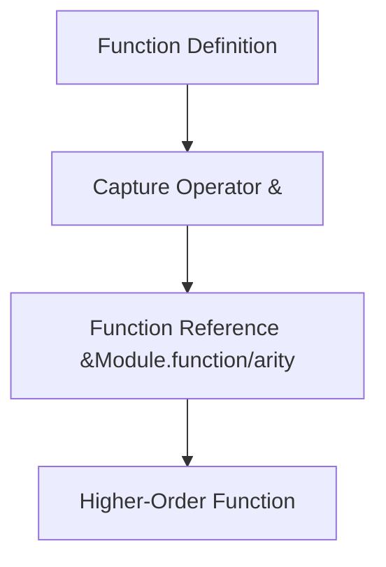
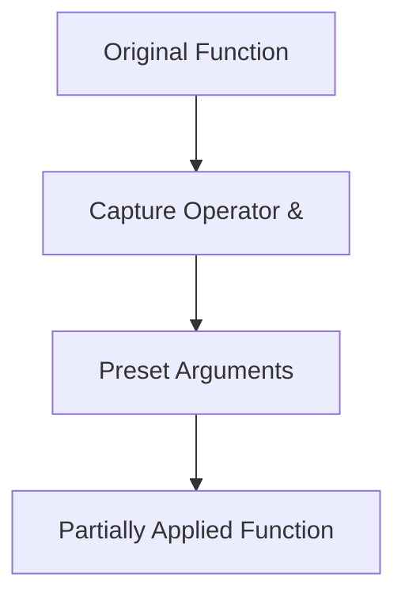
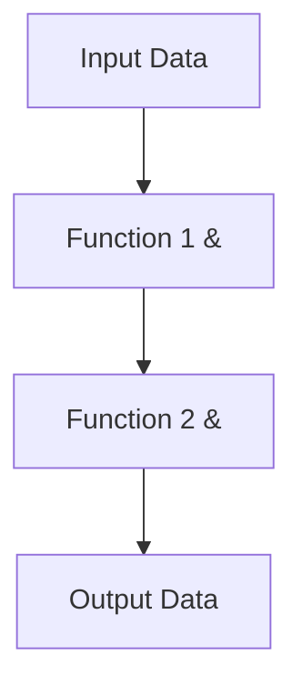

## 4.8. Composing Functions with `&` and the Capture Operator

In the realm of functional programming, Elixir stands out with its expressive syntax and powerful features. Among these features, the capture operator (`&`) is a versatile tool that enables developers to write concise, readable, and efficient code. In this section, we will delve into the intricacies of composing functions using the `&` capture operator, exploring its applications in simplifying function references, creating partially applied functions, and enhancing code pipelines.

### Simplifying Function References

One of the primary uses of the capture operator in Elixir is to simplify function references. This is particularly useful when working with higher-order functions, such as those found in the `Enum` and `Stream` modules. By using the `&` operator, we can create a shorthand reference to a function, making our code more concise and readable.

#### Using `&Module.function/arity` for Concise Code

The syntax `&Module.function/arity` allows us to capture a function from a module, specifying its arity (the number of arguments it takes). This is especially useful when passing functions as arguments to other functions.

**Example:**

```elixir
# Traditional way of passing a function
Enum.map([1, 2, 3], fn x -> String.to_string(x) end)

# Using the capture operator
Enum.map([1, 2, 3], &String.to_string/1)
```

In the example above, both lines of code achieve the same result: converting a list of integers to a list of strings. However, the second version using the capture operator is more concise and expressive.

#### Visualizing Function Capture

To better understand how the capture operator works, let's visualize the process of capturing a function reference.


```mermaid
graph TD;
    A[Function Definition] --> B[Capture Operator &];
    B --> C[Function Reference &Module.function/arity];
    C --> D[Higher-Order Function];
```

**Caption:** The flow of capturing a function reference using the `&` operator.

### Creating Partially Applied Functions

Another powerful feature of the capture operator is its ability to create partially applied functions. This allows us to preset some arguments of a function, resulting in a new function that requires fewer arguments.

#### Capturing Functions with Preset Arguments

By using the capture operator, we can bind specific arguments to a function, effectively creating a new function with a reduced arity. This technique is particularly useful in scenarios where we need to repeatedly apply a function with the same set of arguments.

**Example:**

```elixir
# Define a function that adds two numbers
add = fn a, b -> a + b end

# Create a partially applied function that always adds 10
add_ten = &add.(10, &1)

# Use the partially applied function
result = Enum.map([1, 2, 3], add_ten) # [11, 12, 13]
```

In this example, `add_ten` is a partially applied function that adds 10 to its argument. The `&1` in the capture expression represents the first argument that will be passed to `add_ten`.

#### Visualizing Partial Application

Let's visualize the process of creating a partially applied function.


```mermaid
graph TD;
    A[Original Function] --> B[Capture Operator &];
    B --> C[Preset Arguments];
    C --> D[Partially Applied Function];
```

**Caption:** The process of creating a partially applied function using the `&` operator.

### Streamlining Code in Pipelines and Higher-Order Functions

The capture operator shines when used in conjunction with Elixir's powerful pipeline operator (`|>`). By combining these two features, we can create elegant and readable code that flows naturally from one function to the next.

#### Examples of Streamlined Code

Let's explore some examples where the capture operator simplifies code in pipelines and higher-order functions.

**Example:**

```elixir
# Traditional way of processing a list
result = Enum.map([1, 2, 3], fn x -> x * 2 end)
          |> Enum.filter(fn x -> rem(x, 2) == 0 end)

# Using the capture operator
result = [1, 2, 3]
         |> Enum.map(&(&1 * 2))
         |> Enum.filter(&(rem(&1, 2) == 0))
```

In this example, the capture operator is used to create anonymous functions within the pipeline, resulting in cleaner and more readable code.

#### Visualizing Function Composition in Pipelines

To illustrate the flow of function composition in pipelines, let's use a diagram.


```mermaid
graph TD;
    A[Input Data] --> B[Function 1 &];
    B --> C[Function 2 &];
    C --> D[Output Data];
```

**Caption:** The flow of data through a pipeline using the capture operator for function composition.

### Elixir Unique Features

Elixir's unique features, such as its emphasis on immutability and concurrency, make the capture operator an essential tool for writing idiomatic and efficient code. By leveraging the capture operator, developers can create more modular and reusable code, taking full advantage of Elixir's functional programming paradigm.

### Differences and Similarities

The capture operator in Elixir is similar to function references in other functional programming languages, such as Haskell's partial application or JavaScript's arrow functions. However, Elixir's syntax and integration with the pipeline operator provide a distinct and powerful way to compose functions, making it a standout feature in the language.

### Design Considerations

When using the capture operator, it's important to consider readability and maintainability. While the capture operator can make code more concise, overusing it can lead to cryptic code that is difficult to understand. Striking a balance between conciseness and clarity is key to writing effective Elixir code.

### Try It Yourself

To reinforce your understanding of the capture operator, try modifying the examples provided in this section. Experiment with creating your own partially applied functions and integrating them into pipelines. Consider how the capture operator can simplify your existing code and enhance its readability.

### Knowledge Check

Before moving on, let's review some key concepts covered in this section:

- The capture operator (`&`) simplifies function references and allows for concise code.
- Partially applied functions can be created by presetting arguments using the capture operator.
- The capture operator is particularly useful in pipelines and higher-order functions.

### Embrace the Journey

Remember, mastering the capture operator is just one step in your journey to becoming an expert Elixir developer. As you continue to explore Elixir's features and design patterns, you'll discover new ways to write expressive and efficient code. Keep experimenting, stay curious, and enjoy the journey!

## Quiz Time!



### What is the primary use of the capture operator in Elixir?

- [x] To simplify function references
- [ ] To create new data types
- [ ] To manage concurrency
- [ ] To handle errors

> **Explanation:** The capture operator is primarily used to simplify function references in Elixir.

### How do you create a partially applied function using the capture operator?

- [x] By presetting some arguments of a function
- [ ] By defining a new function with fewer arguments
- [ ] By using the `def` keyword
- [ ] By creating a new module

> **Explanation:** Partially applied functions are created by presetting some arguments of a function using the capture operator.

### Which operator is often used in conjunction with the capture operator to create pipelines?

- [x] The pipeline operator (`|>`)
- [ ] The equality operator (`==`)
- [ ] The addition operator (`+`)
- [ ] The subtraction operator (`-`)

> **Explanation:** The pipeline operator (`|>`) is often used with the capture operator to create pipelines.

### What does the `&1` represent in a capture expression?

- [x] The first argument passed to the function
- [ ] The function's arity
- [ ] The module name
- [ ] The function name

> **Explanation:** In a capture expression, `&1` represents the first argument passed to the function.

### What is a potential drawback of overusing the capture operator?

- [x] Code can become cryptic and difficult to understand
- [ ] It can lead to increased memory usage
- [ ] It can cause runtime errors
- [ ] It can slow down execution

> **Explanation:** Overusing the capture operator can make code cryptic and difficult to understand.

### Which of the following is NOT a benefit of using the capture operator?

- [ ] Simplifies function references
- [ ] Creates partially applied functions
- [x] Increases code verbosity
- [ ] Enhances code readability

> **Explanation:** The capture operator does not increase code verbosity; it simplifies and enhances readability.

### What is the syntax for capturing a function from a module?

- [x] `&Module.function/arity`
- [ ] `Module.function/arity`
- [ ] `function/arity`
- [ ] `&function/arity`

> **Explanation:** The syntax for capturing a function from a module is `&Module.function/arity`.

### What is the result of `Enum.map([1, 2, 3], &(&1 * 2))`?

- [x] `[2, 4, 6]`
- [ ] `[1, 2, 3]`
- [ ] `[3, 6, 9]`
- [ ] `[0, 1, 2]`

> **Explanation:** The expression doubles each element in the list, resulting in `[2, 4, 6]`.

### How does the capture operator enhance code in pipelines?

- [x] By creating concise and readable function compositions
- [ ] By increasing execution speed
- [ ] By reducing memory usage
- [ ] By handling errors automatically

> **Explanation:** The capture operator enhances code in pipelines by creating concise and readable function compositions.

### True or False: The capture operator can only be used with functions from the `Enum` module.

- [ ] True
- [x] False

> **Explanation:** The capture operator can be used with functions from any module, not just the `Enum` module.



By mastering the capture operator and its applications, you'll be well-equipped to write elegant and efficient Elixir code. Continue exploring the possibilities, and don't hesitate to experiment with new patterns and techniques.
