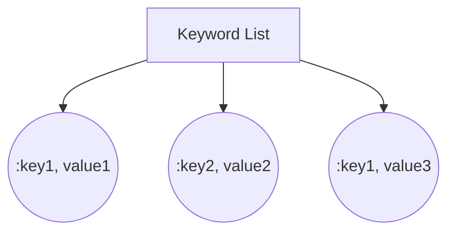
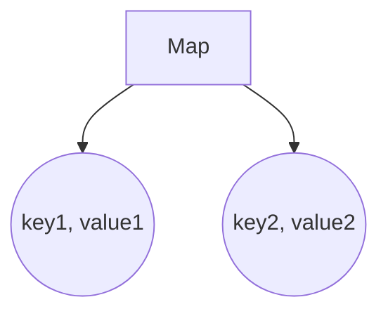

## 4.9. Using Keyword Lists and Maps Appropriately

In Elixir, choosing the right data structure is crucial for writing efficient and maintainable code. Two commonly used data structures are keyword lists and maps. Understanding their differences, appropriate use cases, and best practices will help you leverage their strengths effectively.

### Differences Between Keyword Lists and Maps

Keyword lists and maps are both key-value data structures in Elixir, but they have distinct characteristics that make them suitable for different scenarios.

#### Keyword Lists

- **Ordered**: Keyword lists maintain the order of elements as they are inserted. This feature can be useful when the order of elements is significant.
- **Allow Duplicates**: Keyword lists can have duplicate keys, which can be useful in certain contexts where multiple values for the same key are needed.
- **Access Performance**: Accessing elements in a keyword list is generally slower than in a map because it requires linear traversal to find the key.

#### Maps

- **Unordered**: Maps do not maintain the order of elements. They are optimized for fast key lookups.
- **Unique Keys**: Maps enforce unique keys, meaning each key can only appear once.
- **Access Performance**: Maps provide constant-time complexity for key lookups, making them more efficient for frequent access operations.

### Appropriate Use Cases

Choosing between keyword lists and maps depends on the specific requirements of your application. Here are some guidelines to help you decide:

#### Keyword Lists

- **Options and Configuration**: Keyword lists are often used for passing options to functions, especially when the order of options matters or when you want to allow duplicate keys.
- **Small Data Sets**: When dealing with small collections of data where performance is not a critical concern, keyword lists can be a simple and effective choice.

#### Maps

- **Structured Data**: Maps are ideal for representing structured data where each key is unique, such as JSON-like data or database records.
- **Frequent Access**: If your application requires frequent access to elements by key, maps provide better performance due to their constant-time lookup.

### Best Practices

To ensure consistency and clarity in your code, follow these best practices when working with keyword lists and maps:

#### Consistency in Data Structure Selection

- **Use Keyword Lists for Options**: When defining functions that accept options, use keyword lists to allow flexibility in the order and duplication of options.
- **Use Maps for Data Storage**: For storing and manipulating structured data, prefer maps to take advantage of their efficient access and unique key enforcement.

#### Clarity in Code

- **Explicitness**: Be explicit about the data structure you are using. When defining a function that accepts a keyword list, use the `Keyword` module to make it clear that the function expects a keyword list.
- **Documentation**: Document the expected data structure in your function's documentation to avoid confusion for other developers.

#### Performance Considerations

- **Optimize for Access Patterns**: Consider the access patterns of your application. If you need to frequently access elements by key, use maps to optimize performance.
- **Avoid Unnecessary Conversions**: Avoid converting between keyword lists and maps unless necessary, as this can introduce overhead and complexity.

### Code Examples

Let's explore some code examples to illustrate the appropriate use of keyword lists and maps in Elixir.

#### Using Keyword Lists for Options

```elixir
defmodule Config do
  # Function that accepts options as a keyword list
  def configure(opts \\ []) do
    # Accessing options with default values
    host = Keyword.get(opts, :host, "localhost")
    port = Keyword.get(opts, :port, 8080)

    IO.puts("Connecting to #{host}:#{port}")
  end
end

# Example usage
Config.configure(host: "example.com", port: 443)
Config.configure(port: 3000)
```

In this example, the `configure/1` function accepts a keyword list of options, allowing flexibility in specifying the host and port.

#### Using Maps for Structured Data

```elixir
defmodule User do
  # Function that accepts a map representing a user
  def print_user_info(%{name: name, age: age}) do
    IO.puts("Name: #{name}, Age: #{age}")
  end
end

# Example usage
user = %{name: "Alice", age: 30}
User.print_user_info(user)
```

Here, the `print_user_info/1` function expects a map with specific keys, making it suitable for structured data representation.

### Visualizing Keyword Lists and Maps

To better understand the differences between keyword lists and maps, let's visualize their structures using Mermaid.js diagrams.

#### Keyword List Structure



In this diagram, we see a keyword list with duplicate keys and ordered elements.

#### Map Structure



This diagram illustrates a map with unique keys and unordered elements.

### Try It Yourself

Experiment with the code examples provided to deepen your understanding of keyword lists and maps. Try modifying the examples to see how different data structures affect the behavior of your code.

#### Exercise

1. Modify the `configure/1` function to accept additional options, such as `:protocol` and `:timeout`.
2. Create a new function in the `User` module that updates a user's age and returns the updated map.

### References and Links

- [Elixir Keyword Module Documentation](https://hexdocs.pm/elixir/Keyword.html)
- [Elixir Map Module Documentation](https://hexdocs.pm/elixir/Map.html)
- [Elixir Getting Started Guide](https://elixir-lang.org/getting-started/introduction.html)

### Knowledge Check

- What are the key differences between keyword lists and maps in Elixir?
- When should you use keyword lists over maps, and vice versa?
- How can you ensure clarity and consistency when using these data structures in your code?

### Embrace the Journey

Remember, mastering the use of keyword lists and maps is just one step in your journey to becoming an expert Elixir developer. Keep experimenting, stay curious, and enjoy the process of learning and growing in your craft.

## Quiz: Using Keyword Lists and Maps Appropriately



### What is a key characteristic of keyword lists in Elixir?

- [x] They maintain the order of elements.
- [ ] They enforce unique keys.
- [ ] They provide constant-time lookup.
- [ ] They are optimized for large data sets.

> **Explanation:** Keyword lists maintain the order of elements, which is one of their key characteristics.

### When should you use maps over keyword lists?

- [x] When you need fast key lookups.
- [ ] When you need to maintain the order of elements.
- [ ] When you need to allow duplicate keys.
- [ ] When you are dealing with small data sets.

> **Explanation:** Maps provide constant-time complexity for key lookups, making them suitable for scenarios where fast access is required.

### What is a common use case for keyword lists?

- [x] Passing options to functions.
- [ ] Storing structured data.
- [ ] Representing JSON-like data.
- [ ] Frequent access operations.

> **Explanation:** Keyword lists are often used for passing options to functions due to their flexibility in order and duplication.

### How do maps differ from keyword lists in terms of key uniqueness?

- [x] Maps enforce unique keys.
- [ ] Maps allow duplicate keys.
- [ ] Maps maintain the order of keys.
- [ ] Maps are slower for key lookups.

> **Explanation:** Maps enforce unique keys, meaning each key can only appear once.

### Which data structure should you use for structured data representation?

- [x] Maps
- [ ] Keyword lists
- [ ] Lists
- [ ] Tuples

> **Explanation:** Maps are ideal for representing structured data where each key is unique.

### What is a best practice when using keyword lists for function options?

- [x] Use the `Keyword` module for clarity.
- [ ] Use maps for better performance.
- [ ] Avoid using keyword lists altogether.
- [ ] Use tuples instead.

> **Explanation:** Using the `Keyword` module makes it clear that a function expects a keyword list, enhancing code clarity.

### What is a performance consideration when choosing between keyword lists and maps?

- [x] Maps provide faster access due to constant-time lookup.
- [ ] Keyword lists are faster for large data sets.
- [ ] Maps maintain the order of elements.
- [ ] Keyword lists enforce unique keys.

> **Explanation:** Maps provide constant-time complexity for key lookups, making them more efficient for frequent access operations.

### How can you ensure consistency in data structure selection?

- [x] Use keyword lists for options and maps for data storage.
- [ ] Use maps for all scenarios.
- [ ] Use keyword lists for structured data.
- [ ] Avoid using maps altogether.

> **Explanation:** Using keyword lists for options and maps for data storage ensures consistency and leverages the strengths of each data structure.

### What is a key advantage of using maps for frequent access operations?

- [x] Constant-time lookup performance.
- [ ] Ability to maintain order.
- [ ] Allowance for duplicate keys.
- [ ] Simplicity in small data sets.

> **Explanation:** Maps provide constant-time complexity for key lookups, making them suitable for frequent access operations.

### True or False: Keyword lists are unordered and enforce unique keys.

- [ ] True
- [x] False

> **Explanation:** Keyword lists maintain the order of elements and allow duplicate keys, unlike maps.




