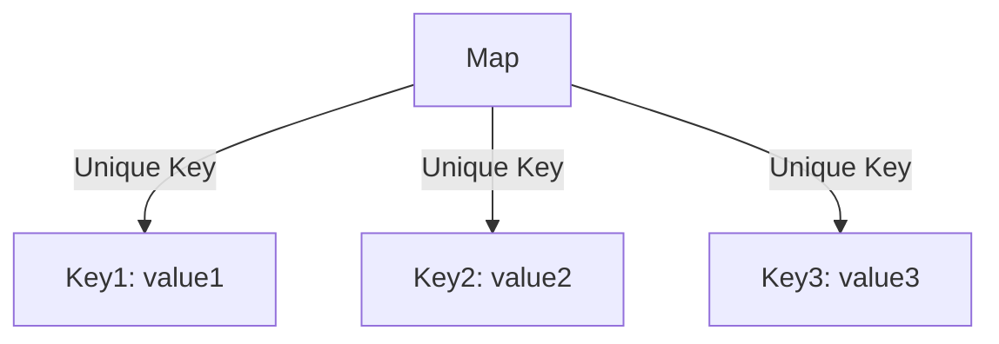

## 4.9. Using Keyword Lists and Maps Appropriately

In Elixir, choosing the right data structure is crucial for writing efficient and maintainable code. Two fundamental data structures that often come into play are **Keyword Lists** and **Maps**. Understanding their differences, appropriate use cases, and best practices can significantly enhance your ability to design robust Elixir applications.

### Differences Between Keyword Lists and Maps

Keyword lists and maps are both key-value data structures in Elixir, but they differ in several important ways. Let's explore these differences in detail.

#### Ordering and Duplication

- **Keyword Lists**:
  - **Ordered**: Keyword lists maintain the order of elements as they are inserted. This can be useful when the order of elements is significant.
  - **Allow Duplicates**: You can have multiple entries with the same key in a keyword list. This is particularly useful in scenarios where you need to represent repeated options or parameters.

- **Maps**:
  - **Unordered**: Maps do not maintain the order of elements. They are optimized for fast access and manipulation, not for maintaining order.
  - **Unique Keys**: Maps enforce unique keys. If you attempt to insert a duplicate key, the new value will overwrite the existing one.

#### Access Performance

- **Keyword Lists**:
  - **Linear Time Access**: Accessing elements in a keyword list is a linear operation, as it requires traversing the list to find the key.
  
- **Maps**:
  - **Constant Time Access**: Maps provide constant time access to elements, making them much more efficient for lookups compared to keyword lists.

### Appropriate Use Cases

Understanding when to use keyword lists versus maps is essential for effective Elixir programming.

#### Keyword Lists for Options

Keyword lists are often used for passing options to functions. They are particularly useful in scenarios where:

- **Order Matters**: The order of options is significant, such as when options are processed sequentially.
- **Multiple Entries**: You need to allow for repeated keys or parameters.

Example:

```elixir
defmodule Example do
  def process_options(opts) do
    Enum.each(opts, fn {key, value} ->
      IO.puts("Processing #{key}: #{value}")
    end)
  end
end

# Usage
Example.process_options([{:debug, true}, {:timeout, 30}, {:debug, false}])
```

In this example, the `process_options` function processes each option in the order they are provided, allowing for repeated keys.

#### Maps for Structured Data

Maps are ideal for representing structured data where:

- **Key Uniqueness**: Each key should be unique, representing distinct attributes or properties.
- **Fast Access**: You need efficient access and update operations.

Example:

```elixir
defmodule User do
  defstruct name: nil, age: nil, email: nil
end

user = %User{name: "Alice", age: 30, email: "alice@example.com"}
IO.puts("User's name: #{user.name}")
```

Here, a map is used to model a user with unique attributes, providing fast access to each property.

### Best Practices

When working with keyword lists and maps, consider these best practices to ensure consistency and clarity in your code.

#### Consistency in Data Structure Selection

- **Choose the Right Tool**: Use keyword lists for options and configurations where order and duplication are relevant. Use maps for structured data requiring unique keys and fast access.
- **Avoid Mixing**: Avoid mixing keyword lists and maps for similar purposes within the same context. This can lead to confusion and inconsistency in your codebase.

#### Clarity and Readability

- **Descriptive Keys**: Use descriptive keys that clearly convey the purpose of the data they represent.
- **Document Intent**: Clearly document the intent and expected structure of your data, especially when using keyword lists with repeated keys.

#### Performance Considerations

- **Optimize for Access Patterns**: Consider the access patterns of your application when choosing between keyword lists and maps. If fast lookups are critical, prefer maps.
- **Avoid Unnecessary Conversions**: Avoid converting between keyword lists and maps unnecessarily, as this can introduce overhead and complexity.

### Code Examples and Exercises

Let's explore some code examples to reinforce these concepts.

#### Example: Using Keyword Lists for Options

```elixir
defmodule Config do
  def apply_settings(settings) do
    Enum.each(settings, fn {key, value} ->
      IO.puts("Applying #{key}: #{value}")
    end)
  end
end

# Try It Yourself
# Modify the settings to include repeated keys and observe the output.
Config.apply_settings([{:theme, "dark"}, {:font_size, 12}, {:theme, "light"}])
```

#### Example: Using Maps for Structured Data

```elixir
defmodule Product do
  defstruct name: nil, price: nil, stock: nil
end

product = %Product{name: "Laptop", price: 1000, stock: 5}

# Try It Yourself
# Update the product's price and observe the changes.
updated_product = %{product | price: 900}
IO.inspect(updated_product)
```

### Visualizing Data Structures

To better understand the differences between keyword lists and maps, let's visualize their structures using Mermaid.js.

#### Keyword List Structure

```mermaid
graph TD;
    A[Keyword List] -->|Ordered| B[Element 1: {:key1, value1}]
    A -->|Ordered| C[Element 2: {:key2, value2}]
    A -->|Ordered| D[Element 3: {:key1, value3}]
```

In this diagram, we see that a keyword list maintains the order of elements and allows duplicate keys.

#### Map Structure


```mermaid
graph TD;
    E[Map] -->|Unique Key| F[Key1: value1]
    E -->|Unique Key| G[Key2: value2]
    E -->|Unique Key| H[Key3: value3]
```

The map diagram illustrates that each key is unique, and the structure does not preserve the order of insertion.

### Knowledge Check

To solidify your understanding, let's pose some questions and exercises.

#### Questions

1. What are the key differences between keyword lists and maps in Elixir?
2. When should you use a keyword list over a map?
3. How does the access performance differ between keyword lists and maps?

#### Exercises

1. Create a function that accepts a keyword list of options and processes them in order.
2. Define a map representing a book with attributes like title, author, and ISBN. Update one of the attributes and print the updated map.

### Embrace the Journey

Remember, mastering data structures like keyword lists and maps is just the beginning of your journey in Elixir. As you continue to explore and experiment, you'll discover more powerful patterns and techniques that will elevate your skills as an Elixir developer. Keep experimenting, stay curious, and enjoy the journey!

### References and Links

- [Elixir Documentation on Keyword Lists](https://hexdocs.pm/elixir/Keyword.html)
- [Elixir Documentation on Maps](https://hexdocs.pm/elixir/Map.html)
- [Functional Programming in Elixir](https://elixir-lang.org/getting-started/functional-programming.html)

## Quiz Time!



### What is a key difference between keyword lists and maps in Elixir?

- [x] Keyword lists allow duplicate keys, while maps require unique keys.
- [ ] Maps allow duplicate keys, while keyword lists require unique keys.
- [ ] Both keyword lists and maps allow duplicate keys.
- [ ] Neither keyword lists nor maps allow duplicate keys.

> **Explanation:** Keyword lists allow duplicate keys, which is useful for options, while maps require unique keys for structured data.

### When should you prefer using a map over a keyword list?

- [x] When you need fast access and unique keys.
- [ ] When you need to maintain the order of elements.
- [ ] When you need to allow duplicate keys.
- [ ] When you need to pass options to a function.

> **Explanation:** Maps are preferred for fast access and unique keys, making them ideal for structured data.

### How does access performance differ between keyword lists and maps?

- [x] Keyword lists have linear time access, while maps have constant time access.
- [ ] Maps have linear time access, while keyword lists have constant time access.
- [ ] Both keyword lists and maps have linear time access.
- [ ] Both keyword lists and maps have constant time access.

> **Explanation:** Keyword lists have linear time access due to their list structure, while maps offer constant time access.

### Which data structure should you use for passing options to a function?

- [x] Keyword list
- [ ] Map
- [ ] Tuple
- [ ] List

> **Explanation:** Keyword lists are commonly used for passing options to functions due to their ordered nature and ability to handle duplicate keys.

### What is a best practice when choosing between keyword lists and maps?

- [x] Use keyword lists for options and maps for structured data.
- [ ] Use maps for options and keyword lists for structured data.
- [ ] Always use maps for both options and structured data.
- [ ] Always use keyword lists for both options and structured data.

> **Explanation:** It is best practice to use keyword lists for options and maps for structured data to ensure clarity and performance.

### What is a characteristic of keyword lists in Elixir?

- [x] They maintain the order of elements.
- [ ] They provide constant time access.
- [ ] They enforce unique keys.
- [ ] They are immutable.

> **Explanation:** Keyword lists maintain the order of elements, making them suitable for ordered options.

### How can you update a value in a map?

- [x] Using the update syntax `%{map | key: value}`
- [ ] Using the append function
- [ ] Using the insert function
- [ ] Using the push function

> **Explanation:** You can update a value in a map using the update syntax `%{map | key: value}`.

### Which data structure is more efficient for lookups?

- [x] Map
- [ ] Keyword list
- [ ] Tuple
- [ ] List

> **Explanation:** Maps are more efficient for lookups due to their constant time access.

### Can keyword lists have duplicate keys?

- [x] True
- [ ] False

> **Explanation:** Keyword lists can have duplicate keys, which is useful for scenarios like passing options.

### Are maps ordered in Elixir?

- [x] False
- [ ] True

> **Explanation:** Maps are not ordered in Elixir; they are optimized for fast access, not maintaining order.



Remember, this is just the beginning. As you progress, you'll build more complex and efficient Elixir applications. Keep experimenting, stay curious, and enjoy the journey!
