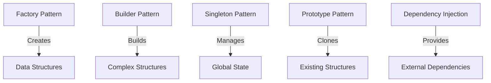

## 5.1. Understanding Creational Patterns in Functional Languages

In the world of software design, creational patterns play a pivotal role in object creation mechanisms. While these patterns are traditionally associated with object-oriented programming (OOP), they also have significant relevance in functional programming languages like Elixir. This section delves into how creational patterns adapt to functional paradigms, emphasizing Elixir's unique features and capabilities.

### Adapting Patterns to Functional Programming

Functional programming (FP) introduces concepts such as immutability and pure functions, which significantly influence design patterns. In FP, the focus shifts from objects and their interactions to functions and data transformations. This shift necessitates a reevaluation of traditional creational patterns.

#### Immutability and Pure Functions

Immutability ensures that data structures cannot be modified after creation. This leads to safer and more predictable code, as functions do not have side effects. Pure functions, which always produce the same output for the same input, further reinforce this predictability.

**Key Considerations:**

- **Data Structures:** Use immutable data structures to ensure consistency and thread safety.
- **Function Composition:** Leverage pure functions to build complex behaviors through composition.

#### Relevance in Elixir

Elixir, built on the Erlang VM, embraces functional programming principles while providing powerful concurrency and fault-tolerance features. Understanding when and how to apply traditional creational patterns in Elixir is crucial for building robust applications.

**Key Considerations:**

- **Concurrency:** Utilize Elixir's lightweight processes to manage state and behavior.
- **Fault Tolerance:** Leverage OTP (Open Telecom Platform) for building resilient systems.

### Overview of Creational Patterns

Creational patterns abstract the instantiation process, making a system independent of how its objects are created, composed, and represented. Let's explore some common creational patterns and their equivalents in Elixir.

#### Factory Pattern

The Factory Pattern provides an interface for creating objects in a superclass, but allows subclasses to alter the type of objects that will be created.

**Elixir Equivalent:**

In Elixir, the Factory Pattern can be implemented using functions and modules. Instead of creating objects, we create data structures or processes.

```elixir
defmodule ShapeFactory do
  def create_shape(:circle, radius) do
    %Circle{radius: radius}
  end

  def create_shape(:square, side) do
    %Square{side: side}
  end
end

# Usage
circle = ShapeFactory.create_shape(:circle, 5)
square = ShapeFactory.create_shape(:square, 10)
```

**Key Points:**

- **Pattern Matching:** Use pattern matching to determine which data structure to create.
- **Modules as Factories:** Leverage modules to encapsulate creation logic.

#### Builder Pattern

The Builder Pattern separates the construction of a complex object from its representation, allowing the same construction process to create different representations.

**Elixir Equivalent:**

In Elixir, the Builder Pattern can be implemented using functions that progressively build up a data structure.

```elixir
defmodule PizzaBuilder do
  defstruct size: nil, toppings: []

  def new(), do: %PizzaBuilder{}

  def set_size(pizza, size), do: %{pizza | size: size}

  def add_topping(pizza, topping), do: %{pizza | toppings: [topping | pizza.toppings]}
end

# Usage
pizza = PizzaBuilder.new()
|> PizzaBuilder.set_size("large")
|> PizzaBuilder.add_topping("pepperoni")
|> PizzaBuilder.add_topping("mushrooms")
```

**Key Points:**

- **Pipelines:** Use pipelines to chain function calls and build up the data structure.
- **Immutability:** Each function returns a new version of the data structure.

#### Singleton Pattern

The Singleton Pattern ensures a class has only one instance and provides a global point of access to it.

**Elixir Equivalent:**

In Elixir, the Singleton Pattern can be achieved using a process that maintains state.

```elixir
defmodule Config do
  use GenServer

  def start_link(initial_state) do
    GenServer.start_link(__MODULE__, initial_state, name: __MODULE__)
  end

  def init(state), do: {:ok, state}

  def get(key) do
    GenServer.call(__MODULE__, {:get, key})
  end

  def handle_call({:get, key}, _from, state) do
    {:reply, Map.get(state, key), state}
  end
end

# Start the singleton process
{:ok, _pid} = Config.start_link(%{database_url: "localhost"})

# Access the singleton
Config.get(:database_url)
```

**Key Points:**

- **GenServer:** Use GenServer to manage state and provide a global access point.
- **Process Naming:** Name the process to ensure a single instance.

#### Prototype Pattern

The Prototype Pattern creates new objects by copying an existing object, known as the prototype.

**Elixir Equivalent:**

In Elixir, the Prototype Pattern can be implemented using maps or structs and the `Map.merge/2` function.

```elixir
defmodule Prototype do
  def clone(prototype, overrides \\ %{}) do
    Map.merge(prototype, overrides)
  end
end

# Usage
original = %{name: "Prototype", value: 42}
clone = Prototype.clone(original, %{value: 100})
```

**Key Points:**

- **Map Merging:** Use map merging to create new instances with modifications.
- **Structs:** Leverage structs for more structured prototypes.

#### Dependency Injection

Dependency Injection involves providing a component with its dependencies from the outside, rather than having it construct them itself.

**Elixir Equivalent:**

In Elixir, dependency injection can be achieved using module attributes and configurations.

```elixir
defmodule MyApp.Config do
  @moduledoc """
  Application configuration.
  """

  @config Application.get_env(:my_app, __MODULE__)

  def get(key), do: Map.get(@config, key)
end

# Configuration in config.exs
config :my_app, MyApp.Config,
  database_url: "localhost"

# Usage
MyApp.Config.get(:database_url)
```

**Key Points:**

- **Application Environment:** Use the application environment for configuration.
- **Module Attributes:** Leverage module attributes to access configuration values.

### Visualizing Creational Patterns in Elixir

To better understand how these patterns fit into Elixir's functional paradigm, let's visualize the relationships and processes involved.



**Diagram Description:** This diagram illustrates how different creational patterns in Elixir relate to data structures, state management, and dependency handling.

### Design Considerations

When implementing creational patterns in Elixir, consider the following:

- **Immutability:** Ensure data structures remain immutable to maintain consistency and thread safety.
- **Concurrency:** Leverage Elixir's concurrency model to manage state and behavior effectively.
- **Pattern Matching:** Use pattern matching to simplify logic and improve code readability.
- **Pipelines:** Utilize pipelines to build complex data structures through function composition.

### Elixir Unique Features

Elixir offers unique features that enhance the implementation of creational patterns:

- **Lightweight Processes:** Use processes to manage state and behavior concurrently.
- **OTP Framework:** Leverage OTP for building fault-tolerant and resilient systems.
- **Pattern Matching:** Simplify logic and improve readability with pattern matching.

### Differences and Similarities

While creational patterns in Elixir share similarities with their OOP counterparts, there are key differences:

- **State Management:** Elixir uses processes to manage state, whereas OOP relies on objects.
- **Immutability:** Elixir emphasizes immutability, while OOP often involves mutable objects.
- **Concurrency:** Elixir's concurrency model differs significantly from traditional OOP threading models.

### Try It Yourself

Experiment with the code examples provided by modifying the data structures and functions. Try creating new patterns or adapting existing ones to suit your needs. Remember, the goal is to understand how these patterns fit into Elixir's functional paradigm.

### Knowledge Check

- How does immutability influence creational patterns in Elixir?
- What are the key differences between Elixir's concurrency model and traditional OOP threading models?
- How can pattern matching simplify logic in creational patterns?

### Embrace the Journey

As you explore creational patterns in Elixir, remember that this is just the beginning. The more you experiment and apply these concepts, the more proficient you'll become in building robust and scalable applications. Stay curious, keep experimenting, and enjoy the journey!

## Quiz: Understanding Creational Patterns in Functional Languages



### Which Elixir feature is crucial for implementing the Singleton Pattern?

- [x] GenServer
- [ ] Structs
- [ ] Protocols
- [ ] Macros

> **Explanation:** GenServer is used to manage state and provide a global access point, making it ideal for implementing the Singleton Pattern in Elixir.

### What is the primary benefit of using the Builder Pattern in Elixir?

- [x] Building complex data structures through function composition
- [ ] Managing global state
- [ ] Cloning existing objects
- [ ] Providing external dependencies

> **Explanation:** The Builder Pattern in Elixir allows for building complex data structures through function composition, leveraging pipelines and immutability.

### How does Elixir's concurrency model differ from traditional OOP threading models?

- [x] It uses lightweight processes
- [ ] It relies on mutable objects
- [ ] It uses inheritance for state management
- [ ] It requires manual memory management

> **Explanation:** Elixir's concurrency model uses lightweight processes, which are more efficient and scalable compared to traditional OOP threading models.

### What is a key advantage of using pattern matching in Elixir?

- [x] Simplifying logic and improving code readability
- [ ] Allowing mutable state
- [ ] Enabling inheritance
- [ ] Supporting manual memory management

> **Explanation:** Pattern matching simplifies logic and improves code readability by allowing concise and expressive code.

### Which pattern is used to provide a component with its dependencies from the outside?

- [x] Dependency Injection
- [ ] Factory Pattern
- [ ] Prototype Pattern
- [ ] Singleton Pattern

> **Explanation:** Dependency Injection involves providing a component with its dependencies from the outside, rather than having it construct them itself.

### What is the role of the OTP framework in Elixir?

- [x] Building fault-tolerant and resilient systems
- [ ] Managing mutable state
- [ ] Enabling inheritance
- [ ] Supporting manual memory management

> **Explanation:** The OTP framework in Elixir is used for building fault-tolerant and resilient systems, leveraging processes and supervisors.

### How can map merging be used in Elixir?

- [x] To create new instances with modifications
- [ ] To manage global state
- [ ] To provide external dependencies
- [ ] To enable inheritance

> **Explanation:** Map merging in Elixir can be used to create new instances with modifications, similar to the Prototype Pattern.

### What is a key consideration when implementing creational patterns in Elixir?

- [x] Ensuring data structures remain immutable
- [ ] Allowing mutable state
- [ ] Enabling inheritance
- [ ] Supporting manual memory management

> **Explanation:** Ensuring data structures remain immutable is crucial for maintaining consistency and thread safety in Elixir.

### Which pattern involves creating objects by copying an existing object?

- [x] Prototype Pattern
- [ ] Factory Pattern
- [ ] Singleton Pattern
- [ ] Dependency Injection

> **Explanation:** The Prototype Pattern involves creating new objects by copying an existing object, known as the prototype.

### True or False: Elixir's concurrency model relies on objects and inheritance.

- [ ] True
- [x] False

> **Explanation:** False. Elixir's concurrency model relies on lightweight processes and does not use objects or inheritance.


