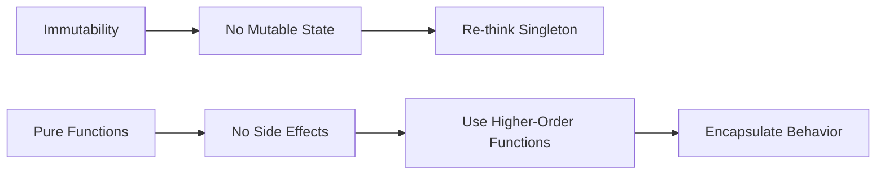

## 5.1. Understanding Creational Patterns in Functional Languages

In the realm of software architecture, design patterns serve as a blueprint for solving common problems. Creational patterns, in particular, focus on the mechanisms of object creation, aiming to increase flexibility and reuse in the instantiation process. However, when we transition from object-oriented programming (OOP) to functional programming (FP), the landscape changes significantly. In this section, we will delve into how creational patterns adapt to the functional paradigm, especially in Elixir, a language that embraces immutability and concurrency.

### Adapting Patterns to Functional Programming

#### Recognizing How Immutability and Pure Functions Influence Design

In functional programming, immutability and pure functions are foundational principles. Immutability ensures that once a data structure is created, it cannot be changed. Pure functions, on the other hand, guarantee that a function's output is determined solely by its input values, without observable side effects. These principles have a profound impact on how we approach design patterns:

- **Immutability**: In functional languages, objects are typically immutable. This means that many traditional creational patterns, which rely on mutable state, need to be rethought. For instance, the Singleton pattern, which ensures a class has only one instance, must be adapted since global mutable state is discouraged.
  
- **Pure Functions**: The emphasis on pure functions means that patterns must avoid side effects. This can lead to the use of higher-order functions and closures to encapsulate behavior without relying on mutable state.

#### Visualizing the Impact of Immutability and Pure Functions

Let's visualize how immutability and pure functions influence design patterns in functional programming:


```mermaid
graph LR
    A[Immutability] --> B[No Mutable State]
    B --> C[Re-think Singleton]
    D[Pure Functions] --> E[No Side Effects]
    E --> F[Use Higher-Order Functions]
    F --> G[Encapsulate Behavior]
```

**Diagram Description**: This diagram illustrates the flow from immutability and pure functions to the need for rethinking traditional patterns like Singleton and the use of higher-order functions to encapsulate behavior.

### Relevance in Elixir

#### Identifying When Traditional Patterns Are Applicable or Need Modification

Elixir, as a functional language built on the Erlang VM, provides unique features such as lightweight processes and the Actor model, which influence how we implement design patterns. Let's explore when traditional creational patterns are applicable in Elixir and when they require modification:

- **Factory Pattern**: In Elixir, the Factory pattern can be implemented using functions and modules to create and initialize data structures. Unlike OOP, where factories often manage object lifecycle, in Elixir, they focus on data transformation and creation.

- **Builder Pattern**: The Builder pattern in Elixir leverages functions to construct complex data structures. Since Elixir emphasizes immutability, builders often return new data structures rather than modifying existing ones.

- **Singleton Pattern**: The Singleton pattern is less relevant in Elixir due to its emphasis on process-based concurrency. Instead, we use named processes or application environment configurations to achieve similar goals.

- **Prototype Pattern**: In Elixir, the Prototype pattern can be achieved through process cloning, where a process serves as a template for creating new processes.

### Overview of Creational Patterns

#### Discussing Patterns Like Factory, Builder, Singleton, and Their Elixir Equivalents

Let's delve deeper into each of these patterns and see how they are adapted in Elixir:

#### Factory Pattern

**Intent**: The Factory pattern provides an interface for creating objects in a superclass, but allows subclasses to alter the type of objects that will be created.

**Elixir Equivalent**: In Elixir, factories are often implemented as modules with functions that return data structures.

**Sample Code Snippet**:

```elixir
defmodule ShapeFactory do
  def create_shape(:circle, radius) do
    %Circle{radius: radius}
  end

  def create_shape(:square, side_length) do
    %Square{side_length: side_length}
  end
end

# Usage
circle = ShapeFactory.create_shape(:circle, 5)
square = ShapeFactory.create_shape(:square, 10)
```

**Design Considerations**: In Elixir, the Factory pattern is more about data creation and transformation. It leverages pattern matching to provide a clean and concise interface.

#### Builder Pattern

**Intent**: The Builder pattern separates the construction of a complex object from its representation, allowing the same construction process to create different representations.

**Elixir Equivalent**: Builders in Elixir are typically functions that return a series of transformations on data structures.

**Sample Code Snippet**:

```elixir
defmodule HouseBuilder do
  def build_house do
    %House{}
    |> add_walls()
    |> add_roof()
    |> add_windows()
  end

  defp add_walls(house), do: %{house | walls: "Brick walls"}
  defp add_roof(house), do: %{house | roof: "Tile roof"}
  defp add_windows(house), do: %{house | windows: "Double glazed"}
end

# Usage
house = HouseBuilder.build_house()
```

**Design Considerations**: The Builder pattern in Elixir emphasizes immutability, returning new data structures at each step. This approach aligns with the functional paradigm, ensuring that builders are pure and side-effect-free.

#### Singleton Pattern

**Intent**: The Singleton pattern ensures a class has only one instance and provides a global point of access to it.

**Elixir Equivalent**: In Elixir, we achieve similar functionality using named processes or application environment configurations.

**Sample Code Snippet**:

```elixir
defmodule Logger do
  use GenServer

  # Client API
  def start_link(_) do
    GenServer.start_link(__MODULE__, [], name: __MODULE__)
  end

  def log(message) do
    GenServer.call(__MODULE__, {:log, message})
  end

  # Server Callbacks
  def init(_) do
    {:ok, []}
  end

  def handle_call({:log, message}, _from, state) do
    IO.puts("Logging: #{message}")
    {:reply, :ok, state}
  end
end

# Usage
{:ok, _} = Logger.start_link(nil)
Logger.log("This is a log message.")
```

**Design Considerations**: In Elixir, the Singleton pattern is less about restricting instantiation and more about providing a centralized process for managing state or behavior.

#### Prototype Pattern

**Intent**: The Prototype pattern creates new objects by copying an existing object, known as the prototype.

**Elixir Equivalent**: In Elixir, processes can serve as prototypes, with new processes being spawned based on an existing process's state.

**Sample Code Snippet**:

```elixir
defmodule Worker do
  def start_link(initial_state) do
    spawn_link(fn -> loop(initial_state) end)
  end

  defp loop(state) do
    receive do
      {:work, task} ->
        new_state = process_task(task, state)
        loop(new_state)
    end
  end

  defp process_task(task, state) do
    # Process the task and return new state
    state
  end
end

# Usage
worker1 = Worker.start_link(%{tasks_completed: 0})
worker2 = Worker.start_link(%{tasks_completed: 0})
```

**Design Considerations**: The Prototype pattern in Elixir leverages process spawning, allowing new processes to inherit initial states or behaviors from existing ones.

### Elixir Unique Features

**Highlighting Elixir Programming Language Unique and Specific Features**

Elixir's unique features, such as its concurrency model and pattern matching, make it particularly well-suited for implementing creational patterns in a functional style. Here are some key features:

- **Pattern Matching**: Elixir's pattern matching allows for concise and expressive code, particularly when implementing factories and builders.

- **Concurrency Model**: Elixir's lightweight processes and message-passing model enable efficient implementation of patterns like Singleton and Prototype.

- **Immutability**: Elixir's emphasis on immutability aligns well with the functional adaptations of creational patterns, ensuring data integrity and thread safety.

### Differences and Similarities

**Note Any Patterns That Are Commonly Confused With One Another, Clarifying Distinctions**

- **Factory vs. Builder**: While both patterns involve creating objects, the Factory pattern focuses on creating instances based on input parameters, whereas the Builder pattern involves a step-by-step construction process.

- **Singleton vs. Prototype**: The Singleton pattern provides a single point of access, often using a named process, while the Prototype pattern involves cloning processes or data structures.

### Try It Yourself

Encourage experimentation by suggesting modifications to the code examples:

- **Modify the Factory Pattern**: Add a new shape type to the `ShapeFactory` module and implement its creation logic.

- **Extend the Builder Pattern**: Add more features to the `HouseBuilder` module, such as doors or a garden, and observe how the builder functions evolve.

- **Experiment with the Singleton Pattern**: Implement a named process that manages a configuration state, allowing dynamic updates during runtime.

- **Prototype Pattern Exploration**: Create a process that maintains a stateful counter and spawn multiple clones to see how they operate independently.

### Knowledge Check

- **Pose Questions or Small Challenges**: What are the advantages of using named processes for implementing Singleton patterns in Elixir?

- **Include Exercises or Practice Problems**: Implement a simple inventory management system using the Builder pattern to construct different types of products.

- **Summarize Key Takeaways**: Creational patterns in Elixir leverage the language's functional nature, focusing on immutability and process-based concurrency.

### Embrace the Journey

Remember, this is just the beginning of your exploration into creational patterns in functional programming. As you progress, you'll discover more complex patterns and techniques. Keep experimenting, stay curious, and enjoy the journey!

## Quiz Time!



### What is a key characteristic of functional programming that influences design patterns?

- [x] Immutability
- [ ] Inheritance
- [ ] Polymorphism
- [ ] Encapsulation

> **Explanation:** Immutability is a core principle of functional programming, affecting how design patterns are implemented.

### How does Elixir typically implement the Singleton pattern?

- [x] Using named processes
- [ ] Using global variables
- [ ] Using class instances
- [ ] Using mutable state

> **Explanation:** Elixir uses named processes to achieve Singleton-like behavior, avoiding mutable state.

### Which Elixir feature allows for concise implementation of the Factory pattern?

- [x] Pattern matching
- [ ] Inheritance
- [ ] Polymorphism
- [ ] Encapsulation

> **Explanation:** Pattern matching enables concise and expressive code in Elixir, particularly for factories.

### What is the main difference between the Factory and Builder patterns?

- [x] Factory creates instances based on parameters, Builder constructs step-by-step
- [ ] Factory uses inheritance, Builder uses composition
- [ ] Factory is mutable, Builder is immutable
- [ ] Factory is for concurrency, Builder is for sequential tasks

> **Explanation:** The Factory pattern focuses on instance creation, while the Builder pattern involves a step-by-step construction process.

### How does Elixir's concurrency model benefit the Prototype pattern?

- [x] By allowing process cloning
- [ ] By using global state
- [ ] By enforcing immutability
- [ ] By providing inheritance

> **Explanation:** Elixir's concurrency model supports process cloning, aligning with the Prototype pattern.

### Which Elixir feature ensures data integrity in creational patterns?

- [x] Immutability
- [ ] Inheritance
- [ ] Polymorphism
- [ ] Encapsulation

> **Explanation:** Immutability ensures data integrity and thread safety in Elixir.

### What is a common use case for the Builder pattern in Elixir?

- [x] Constructing complex data structures
- [ ] Managing global state
- [ ] Implementing polymorphism
- [ ] Creating class hierarchies

> **Explanation:** The Builder pattern is used to construct complex data structures in a step-by-step manner.

### What is a potential modification to the Factory pattern in Elixir?

- [x] Adding new shape types
- [ ] Using mutable state
- [ ] Implementing inheritance
- [ ] Creating global variables

> **Explanation:** Adding new shape types to the Factory pattern allows for extensibility and flexibility.

### How does Elixir handle side effects in creational patterns?

- [x] By using pure functions
- [ ] By using global state
- [ ] By using mutable variables
- [ ] By using inheritance

> **Explanation:** Elixir emphasizes pure functions to handle side effects, ensuring predictable behavior.

### True or False: The Singleton pattern in Elixir relies on mutable global state.

- [ ] True
- [x] False

> **Explanation:** False. The Singleton pattern in Elixir avoids mutable global state, using named processes instead.


