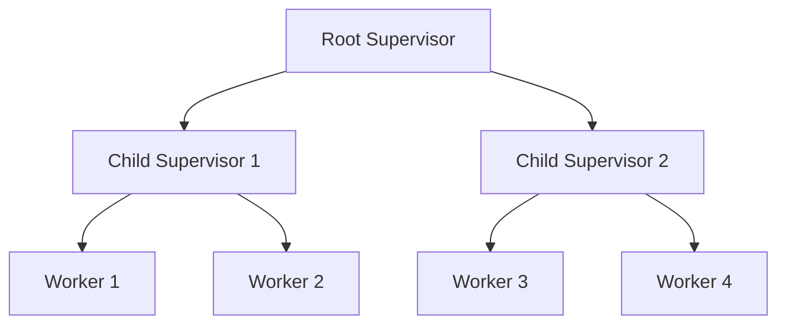

## 5.10. The Supervisor Pattern

In the world of Elixir and the Open Telecom Platform (OTP), the Supervisor Pattern is a cornerstone for building resilient, fault-tolerant systems. Supervisors are specialized processes designed to monitor other processes, known as child processes, and take predefined actions when these child processes fail. This pattern is crucial for maintaining system stability and reliability, especially in distributed and concurrent environments.

### Core Concept of Supervisors

Supervisors are an integral part of the OTP framework, which provides a set of libraries and design principles for building concurrent and fault-tolerant applications. The primary role of a supervisor is to monitor its child processes and restart them when they fail. This capability is essential for creating systems that can recover from errors and continue operating without human intervention.

#### Key Responsibilities of Supervisors

1. **Monitoring**: Supervisors keep track of the state of their child processes.
2. **Restarting**: When a child process crashes, the supervisor restarts it according to a specified strategy.
3. **Isolation**: Supervisors help isolate faults, preventing a failure in one part of the system from affecting others.

### Designing Supervision Trees

A supervision tree is a hierarchical structure of supervisors and workers (child processes) that defines how processes are organized and monitored. This structure is fundamental to achieving fault isolation and recovery in Elixir applications.

#### Building a Supervision Tree

1. **Root Supervisor**: The top-level supervisor that oversees the entire application.
2. **Child Supervisors**: Supervisors that manage specific parts of the application, each responsible for a subset of processes.
3. **Workers**: The actual processes that perform the application's tasks.

Here's a simple diagram illustrating a basic supervision tree:



#### Benefits of Supervision Trees

- **Fault Isolation**: By organizing processes hierarchically, failures can be contained within specific branches of the tree.
- **Scalability**: Supervision trees can be expanded as the application grows, adding more supervisors and workers as needed.
- **Maintainability**: Clear separation of concerns makes it easier to manage and understand the system's structure.

### Strategies

Supervisors in Elixir can be configured with different strategies that determine how they respond to child process failures. Understanding these strategies is crucial for designing effective supervision trees.

#### Common Supervision Strategies

1. **`:one_for_one`**: If a child process terminates, only that process is restarted. This is the most common strategy.
2. **`:one_for_all`**: If a child process terminates, all other child processes are terminated and then restarted. This strategy is useful when child processes are interdependent.
3. **`:rest_for_one`**: If a child process terminates, the terminated process and any processes started after it are restarted.
4. **`:simple_one_for_one`**: A simplified version of `:one_for_one` for dynamically adding and removing child processes.

#### Choosing the Right Strategy

- Use **`:one_for_one`** when child processes are independent and can be restarted individually.
- Use **`:one_for_all`** when child processes are tightly coupled and depend on each other to function correctly.
- Use **`:rest_for_one`** when there is a dependency chain among child processes.
- Use **`:simple_one_for_one`** for scenarios where you need to manage a dynamic set of similar processes.

### Examples

Let's explore how to implement a supervisor in Elixir using the `:one_for_one` strategy. We'll create a simple application with a supervisor and a worker process.

#### Step-by-Step Implementation

1. **Define the Worker Module**

```elixir
defmodule MyApp.Worker do
  use GenServer

  # Client API
  def start_link(arg) do
    GenServer.start_link(__MODULE__, arg, name: __MODULE__)
  end

  # Server Callbacks
  def init(arg) do
    {:ok, arg}
  end

  def handle_call(:get_state, _from, state) do
    {:reply, state, state}
  end
end
```

2. **Define the Supervisor Module**

```elixir
defmodule MyApp.Supervisor do
  use Supervisor

  def start_link(arg) do
    Supervisor.start_link(__MODULE__, arg, name: __MODULE__)
  end

  def init(_arg) do
    children = [
      {MyApp.Worker, :worker_arg}
    ]

    Supervisor.init(children, strategy: :one_for_one)
  end
end
```

3. **Start the Application**

```elixir
defmodule MyApp.Application do
  use Application

  def start(_type, _args) do
    MyApp.Supervisor.start_link(:ok)
  end
end
```

#### Explanation

- **Worker Module**: Implements a simple GenServer that maintains a state.
- **Supervisor Module**: Defines a supervisor that starts and monitors the worker process using the `:one_for_one` strategy.
- **Application Module**: Starts the supervisor when the application is launched.

### Design Considerations

When designing supervision trees, consider the following:

- **Process Dependencies**: Understand the dependencies between processes to choose the appropriate supervision strategy.
- **Restart Intensity**: Configure the maximum number of restarts allowed within a given time frame to prevent endless restart loops.
- **Error Logging**: Implement logging to capture errors and understand why processes are failing.

### Elixir Unique Features

Elixir's integration with the Erlang VM (BEAM) provides unique features that enhance the Supervisor Pattern:

- **Lightweight Processes**: Elixir processes are lightweight, allowing for thousands of concurrent processes.
- **Hot Code Swapping**: Update code without stopping the system, maintaining uptime.
- **Built-in Fault Tolerance**: The BEAM VM is designed for fault tolerance, making it ideal for building robust systems.

### Differences and Similarities

The Supervisor Pattern in Elixir shares similarities with other languages' patterns for managing process lifecycles, such as the Actor Model. However, Elixir's implementation is tightly integrated with OTP, providing a more comprehensive and fault-tolerant approach.

### Try It Yourself

Experiment with the code examples by:

- Modifying the worker's behavior to simulate failures and observe how the supervisor handles them.
- Changing the supervision strategy to `:one_for_all` or `:rest_for_one` and see the impact on the system.
- Adding more workers to the supervision tree and testing different configurations.

### Knowledge Check

- What are the key responsibilities of a supervisor in Elixir?
- How does the `:one_for_one` strategy differ from `:one_for_all`?
- Why is fault isolation important in supervision trees?

### Embrace the Journey

Remember, mastering the Supervisor Pattern is just the beginning of building resilient systems in Elixir. As you progress, you'll discover more advanced techniques and patterns that will enhance your applications' reliability and performance. Keep experimenting, stay curious, and enjoy the journey!

## Quiz: The Supervisor Pattern



### What is the primary role of a supervisor in Elixir?

- [x] To monitor and restart child processes
- [ ] To execute business logic
- [ ] To manage database connections
- [ ] To handle user authentication

> **Explanation:** The primary role of a supervisor is to monitor its child processes and restart them when they fail.

### Which supervision strategy restarts only the failed child process?

- [x] `:one_for_one`
- [ ] `:one_for_all`
- [ ] `:rest_for_one`
- [ ] `:simple_one_for_one`

> **Explanation:** The `:one_for_one` strategy restarts only the failed child process.

### In which scenario would you use the `:one_for_all` strategy?

- [x] When child processes are interdependent
- [ ] When child processes are independent
- [ ] When you have a dynamic set of processes
- [ ] When you need to restart the last started process

> **Explanation:** The `:one_for_all` strategy is used when child processes are interdependent and need to be restarted together.

### What is a supervision tree?

- [x] A hierarchical structure of supervisors and workers
- [ ] A data structure for storing process states
- [ ] A method for optimizing database queries
- [ ] A tool for managing user sessions

> **Explanation:** A supervision tree is a hierarchical structure of supervisors and workers that defines how processes are organized and monitored.

### Which strategy is suitable for dynamically adding and removing child processes?

- [x] `:simple_one_for_one`
- [ ] `:one_for_one`
- [ ] `:one_for_all`
- [ ] `:rest_for_one`

> **Explanation:** The `:simple_one_for_one` strategy is suitable for dynamically adding and removing child processes.

### What is the benefit of using supervision trees?

- [x] Fault isolation
- [ ] Faster database queries
- [ ] Improved user interface
- [ ] Enhanced security

> **Explanation:** Supervision trees provide fault isolation, preventing a failure in one part of the system from affecting others.

### How does Elixir's integration with the BEAM VM enhance the Supervisor Pattern?

- [x] By providing lightweight processes and built-in fault tolerance
- [ ] By offering faster execution speeds
- [ ] By simplifying database interactions
- [ ] By improving user authentication

> **Explanation:** Elixir's integration with the BEAM VM enhances the Supervisor Pattern by providing lightweight processes and built-in fault tolerance.

### What should you consider when designing supervision trees?

- [x] Process dependencies and restart intensity
- [ ] User interface design
- [ ] Database schema
- [ ] Network latency

> **Explanation:** When designing supervision trees, consider process dependencies and restart intensity to ensure effective fault tolerance.

### What is the purpose of the `init` function in a supervisor module?

- [x] To define child processes and supervision strategy
- [ ] To execute business logic
- [ ] To handle user authentication
- [ ] To manage database connections

> **Explanation:** The `init` function in a supervisor module is used to define child processes and the supervision strategy.

### True or False: The Supervisor Pattern is unique to Elixir.

- [ ] True
- [x] False

> **Explanation:** The Supervisor Pattern is not unique to Elixir; it is a common pattern in concurrent and fault-tolerant systems, but Elixir's implementation is tightly integrated with OTP.


