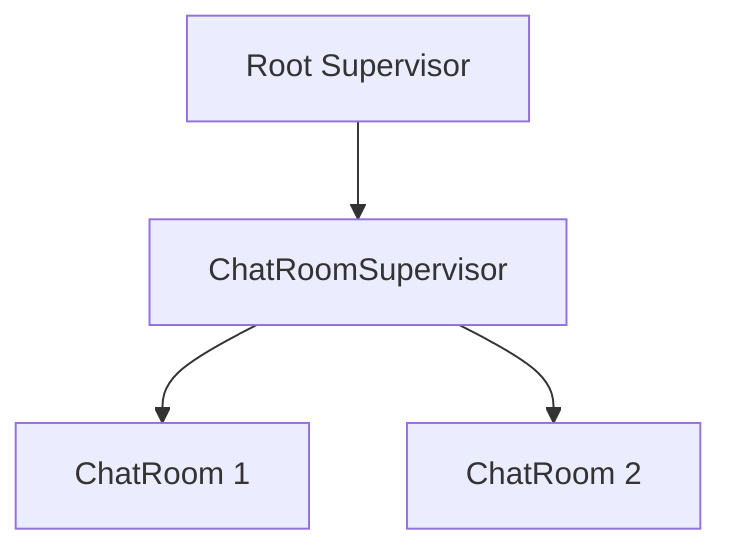

## 5.10. The Supervisor Pattern

In the world of Elixir and its underlying Erlang VM, the Supervisor Pattern is a fundamental design approach for building fault-tolerant, resilient systems. This pattern is a core component of the Open Telecom Platform (OTP) framework, which provides a set of libraries and design principles for building concurrent and distributed systems. In this section, we will delve into the Supervisor Pattern, exploring its core concepts, design strategies, and practical applications in Elixir.

### Core Concept of Supervisors

Supervisors are specialized processes whose primary role is to monitor and manage other processes, known as child processes. The main responsibility of a supervisor is to ensure that its child processes are running correctly and to restart them if they fail. This automatic restart capability is crucial for building systems that can recover from unexpected errors and continue operating without manual intervention.

#### Key Responsibilities of Supervisors

- **Monitoring:** Supervisors keep an eye on the health of child processes, detecting failures and taking appropriate actions.
- **Restarting:** When a child process crashes, the supervisor restarts it according to a predefined strategy.
- **Fault Isolation:** Supervisors help isolate faults by organizing processes into hierarchies, preventing failures from propagating throughout the system.

### Designing Supervision Trees

A supervision tree is a hierarchical structure of supervisors and worker processes. It is designed to isolate faults and manage the lifecycle of processes effectively. In a supervision tree, each supervisor can have multiple child processes, which can be either workers or other supervisors, forming a tree-like structure.

#### Building a Supervision Tree

1. **Identify Components:** Determine the components of your system that require supervision, such as GenServers or other processes.
2. **Define Hierarchies:** Organize these components into a hierarchical structure, with supervisors at each level managing their respective child processes.
3. **Choose Supervision Strategies:** Decide on the appropriate supervision strategy for each supervisor based on the criticality and behavior of its child processes.

### Supervision Strategies

Elixir provides several supervision strategies that dictate how a supervisor should respond to child process failures. Understanding these strategies is essential for designing robust supervision trees.

#### Common Supervision Strategies

- **`:one_for_one`:** If a child process terminates, only that process is restarted. This strategy is suitable when child processes are independent of each other.
- **`:one_for_all`:** If a child process terminates, all other child processes are terminated and restarted. This strategy is useful when child processes are interdependent.
- **`:rest_for_one`:** If a child process terminates, the terminated process and any subsequent child processes are restarted. This strategy is applicable when processes have a sequential dependency.
- **`:simple_one_for_one`:** This strategy is used for dynamically managing a large number of similar child processes, such as a pool of worker processes.

### Examples of Building Resilient Applications

To illustrate the practical application of the Supervisor Pattern, let's walk through an example of building a simple yet resilient application using OTP conventions.

#### Example: Building a Chat Application

Imagine we are building a chat application where each chat room is managed by a separate GenServer process. We want to ensure that if a chat room process crashes, it is automatically restarted without affecting other chat rooms.

```elixir
defmodule ChatRoom do
  use GenServer

  # Client API

  def start_link(name) do
    GenServer.start_link(__MODULE__, name, name: name)
  end

  def send_message(room, message) do
    GenServer.cast(room, {:send_message, message})
  end

  # Server Callbacks

  def init(name) do
    {:ok, %{name: name, messages: []}}
  end

  def handle_cast({:send_message, message}, state) do
    IO.puts("Message received in #{state.name}: #{message}")
    {:noreply, %{state | messages: [message | state.messages]}}
  end
end

defmodule ChatRoomSupervisor do
  use Supervisor

  def start_link(opts) do
    Supervisor.start_link(__MODULE__, :ok, opts)
  end

  def init(:ok) do
    children = [
      {ChatRoom, name: :chat_room_1},
      {ChatRoom, name: :chat_room_2}
    ]

    Supervisor.init(children, strategy: :one_for_one)
  end
end
```

In this example, we define a `ChatRoom` GenServer that handles chat messages and a `ChatRoomSupervisor` that supervises multiple chat room processes. The supervisor uses the `:one_for_one` strategy, ensuring that if one chat room crashes, only that room is restarted.

### Visualizing Supervision Trees

To better understand the structure of supervision trees, let's visualize a simple supervision tree using Mermaid.js.


```mermaid
graph TD;
    A[Root Supervisor] --> B[ChatRoomSupervisor]
    B --> C[ChatRoom 1]
    B --> D[ChatRoom 2]
```

This diagram illustrates a basic supervision tree where the root supervisor oversees a `ChatRoomSupervisor`, which in turn manages individual chat room processes.

### Key Participants in the Supervisor Pattern

- **Supervisor:** A process responsible for monitoring and managing child processes.
- **Child Processes:** The processes being supervised, which can be workers or other supervisors.
- **Supervision Tree:** A hierarchical arrangement of supervisors and workers.

### Applicability of the Supervisor Pattern

The Supervisor Pattern is applicable in scenarios where:

- **Fault Tolerance is Critical:** Systems that require high availability and resilience benefit from supervision.
- **Process Isolation is Needed:** Supervisors help isolate faults, preventing failures from affecting the entire system.
- **Dynamic Process Management:** When managing a dynamic set of processes, such as a pool of workers, supervisors simplify process lifecycle management.

### Design Considerations

When implementing the Supervisor Pattern, consider the following:

- **Choosing the Right Strategy:** Select a supervision strategy that aligns with the dependencies and criticality of your processes.
- **Balancing Restart Intensity:** Configure restart intensity to avoid excessive restarts, which can lead to system instability.
- **Monitoring and Alerts:** Implement monitoring and alerting mechanisms to detect and respond to failures promptly.

### Elixir Unique Features

Elixir's integration with the Erlang VM and OTP framework provides unique features that enhance the Supervisor Pattern:

- **Lightweight Processes:** Elixir's lightweight processes make it feasible to run a large number of supervised processes concurrently.
- **Hot Code Swapping:** Elixir supports hot code swapping, allowing you to update running systems without downtime.
- **Built-in Fault Tolerance:** The Erlang VM's built-in fault tolerance mechanisms complement the Supervisor Pattern, providing robust error recovery.

### Differences and Similarities

The Supervisor Pattern shares similarities with other fault-tolerant design patterns, such as the Circuit Breaker Pattern. However, it is distinct in its focus on process supervision and automatic restarts, rather than managing external service calls.

### Try It Yourself

To deepen your understanding of the Supervisor Pattern, try modifying the example code to add more chat rooms or implement different supervision strategies. Experiment with simulating process failures and observe how the supervisor handles them.

### Knowledge Check

- What is the primary responsibility of a supervisor in Elixir?
- How does the `:one_for_all` strategy differ from the `:one_for_one` strategy?
- Why is fault isolation important in a supervision tree?
- How can you dynamically manage a large number of similar child processes using supervisors?

### Embrace the Journey

Remember, mastering the Supervisor Pattern is a journey. As you progress, you'll gain the skills to build more complex and resilient systems. Keep experimenting, stay curious, and enjoy the process of learning and applying Elixir's powerful design patterns!

## Quiz Time!



### What is the primary responsibility of a supervisor in Elixir?

- [x] Monitoring child processes and restarting them on failure
- [ ] Managing database connections
- [ ] Handling user authentication
- [ ] Rendering web pages

> **Explanation:** Supervisors are responsible for monitoring and restarting child processes in case of failure, ensuring system resilience.

### Which supervision strategy restarts only the failed child process?

- [x] `:one_for_one`
- [ ] `:one_for_all`
- [ ] `:rest_for_one`
- [ ] `:simple_one_for_one`

> **Explanation:** The `:one_for_one` strategy restarts only the failed child process, leaving others unaffected.

### What is a supervision tree?

- [x] A hierarchical structure of supervisors and worker processes
- [ ] A data structure for storing user sessions
- [ ] A method for optimizing database queries
- [ ] A tool for generating HTML templates

> **Explanation:** A supervision tree is a hierarchical arrangement of supervisors and worker processes designed to isolate faults.

### How does the `:one_for_all` strategy work?

- [x] It restarts all child processes if one fails
- [ ] It restarts only the failed child process
- [ ] It restarts the failed process and its subsequent siblings
- [ ] It does not restart any processes

> **Explanation:** The `:one_for_all` strategy restarts all child processes if one fails, useful for interdependent processes.

### What is the benefit of using supervision trees?

- [x] Fault isolation and process management
- [ ] Faster database queries
- [ ] Improved user interface design
- [ ] Enhanced encryption algorithms

> **Explanation:** Supervision trees provide fault isolation and effective process management, crucial for building resilient systems.

### Which Elixir feature supports hot code swapping?

- [x] Erlang VM
- [ ] GenServer
- [ ] Plug
- [ ] Phoenix

> **Explanation:** The Erlang VM supports hot code swapping, allowing updates to running systems without downtime.

### What does the `:rest_for_one` strategy do?

- [x] Restarts the failed process and its subsequent siblings
- [ ] Restarts all child processes
- [ ] Restarts only the failed process
- [ ] Does not restart any processes

> **Explanation:** The `:rest_for_one` strategy restarts the failed process and its subsequent siblings, suitable for sequential dependencies.

### How can you dynamically manage a large number of similar child processes?

- [x] Using the `:simple_one_for_one` strategy
- [ ] By manually restarting each process
- [ ] Through a single GenServer
- [ ] Using a database connection pool

> **Explanation:** The `:simple_one_for_one` strategy is designed for dynamically managing a large number of similar child processes.

### What is a key consideration when configuring restart intensity?

- [x] Avoiding excessive restarts to prevent instability
- [ ] Ensuring all processes are restarted simultaneously
- [ ] Minimizing the number of supervisors
- [ ] Increasing the number of child processes

> **Explanation:** Configuring restart intensity is crucial to avoid excessive restarts, which can lead to system instability.

### True or False: Supervisors in Elixir can only manage worker processes.

- [ ] True
- [x] False

> **Explanation:** Supervisors can manage both worker processes and other supervisors, allowing for hierarchical supervision trees.



By mastering the Supervisor Pattern, you are well on your way to building robust, fault-tolerant applications in Elixir. Embrace the power of OTP and continue exploring the vast possibilities it offers for creating resilient systems.
