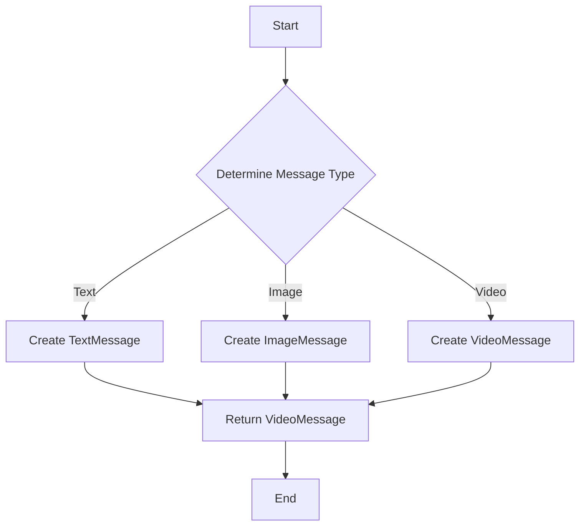

## 5.2. Factory Pattern with Functions and Modules

In the world of software design patterns, the Factory Pattern stands out as a powerful tool for managing object creation. In Elixir, a functional programming language known for its concurrency and fault-tolerance, the Factory Pattern can be implemented using functions and modules. This approach not only encapsulates the creation logic but also leverages Elixir's unique features to create scalable and maintainable applications.

### Understanding the Factory Pattern

**Intent:** The Factory Pattern is a creational design pattern that provides an interface for creating objects in a superclass but allows subclasses to alter the type of objects that will be created. In Elixir, this pattern is adapted to work with functions and modules, enabling dynamic and flexible object creation.

**Key Participants:**

- **Factory Function:** Encapsulates the logic for creating objects or data structures.
- **Modules:** Serve as blueprints for the objects being created.
- **Dynamic Module Creation:** Allows for runtime generation of modules or structs.

### Creating Factory Functions

Factory functions in Elixir are used to encapsulate the logic required to create complex data structures or processes. By using functions, we can abstract away the details of object creation, making our code more modular and easier to maintain.

#### Example: Factory Function for Message Types

Let's consider a scenario where we need to create different types of messages in a chat application. Each message type might have different attributes and behaviors.

```elixir
defmodule MessageFactory do
  def create_message(:text, content) do
    %TextMessage{content: content}
  end

  def create_message(:image, url) do
    %ImageMessage{url: url}
  end

  def create_message(:video, url, duration) do
    %VideoMessage{url: url, duration: duration}
  end
end

defmodule TextMessage do
  defstruct [:content]
end

defmodule ImageMessage do
  defstruct [:url]
end

defmodule VideoMessage do
  defstruct [:url, :duration]
end
```

In this example, the `MessageFactory` module provides a `create_message` function that takes a type and relevant parameters to create different message structs. This encapsulation allows us to easily extend the factory to support new message types without altering existing code.

### Dynamic Module Creation

Elixir's metaprogramming capabilities allow us to dynamically create modules or structs at runtime. This is particularly useful when the exact structure of the data is not known until runtime.

#### Example: Dynamic Struct Creation

Suppose we want to create a dynamic struct based on user input or configuration:

```elixir
defmodule DynamicStructFactory do
  def create_struct(fields) do
    fields
    |> Enum.map(&{&1, nil})
    |> Enum.into(%{})
  end
end

# Usage
fields = [:name, :age, :email]
dynamic_struct = DynamicStructFactory.create_struct(fields)
IO.inspect(dynamic_struct) # Outputs: %{name: nil, age: nil, email: nil}
```

In this example, the `create_struct` function takes a list of fields and creates a map with those fields initialized to `nil`. This approach can be extended to create more complex data structures dynamically.

### Use Cases for the Factory Pattern

The Factory Pattern is particularly useful in scenarios where:

- The instantiation logic is complex and involves multiple steps.
- The exact type of object to be created is determined at runtime.
- There is a need to abstract the creation of objects to adhere to the Open/Closed Principle.

#### Example: Process Initialization

In Elixir, processes are lightweight and can be used to model concurrent activities. The Factory Pattern can be used to initialize processes with different configurations.

```elixir
defmodule ProcessFactory do
  def start_process(:worker, args) do
    Worker.start_link(args)
  end

  def start_process(:supervisor, args) do
    Supervisor.start_link(args)
  end
end

defmodule Worker do
  use GenServer

  def start_link(args) do
    GenServer.start_link(__MODULE__, args, name: __MODULE__)
  end

  def init(args) do
    {:ok, args}
  end
end

defmodule Supervisor do
  use Supervisor

  def start_link(args) do
    Supervisor.start_link(__MODULE__, args, name: __MODULE__)
  end

  def init(_args) do
    children = [
      {Worker, []}
    ]

    Supervisor.init(children, strategy: :one_for_one)
  end
end
```

In this example, the `ProcessFactory` module provides a `start_process` function that abstracts the initialization of different types of processes. This allows for flexible and reusable process creation logic.

### Design Considerations

When implementing the Factory Pattern in Elixir, consider the following:

- **Simplicity:** Keep the factory functions simple and focused on object creation. Avoid adding business logic to these functions.
- **Extensibility:** Design the factory to be easily extensible. New types should be added without modifying existing code.
- **Performance:** Be mindful of the performance implications of dynamic module creation, especially in high-load scenarios.

### Elixir Unique Features

Elixir's functional nature and powerful metaprogramming capabilities make it uniquely suited for implementing the Factory Pattern. The use of functions and modules allows for clean and efficient encapsulation of creation logic, while dynamic module creation provides flexibility and adaptability.

### Differences and Similarities

The Factory Pattern in Elixir differs from traditional object-oriented implementations in that it leverages functions and modules instead of classes and objects. However, the core intent remains the same: to abstract and encapsulate the creation of complex data structures or processes.

### Try It Yourself

Experiment with the provided examples by:

- Adding new message types to the `MessageFactory`.
- Modifying the `DynamicStructFactory` to initialize fields with default values.
- Extending the `ProcessFactory` to support additional process types.

### Visualizing the Factory Pattern

To better understand the Factory Pattern in Elixir, let's visualize the process flow using a Mermaid.js diagram.



This diagram illustrates the decision-making process within the `MessageFactory` module, where the type of message determines the creation path.

### Knowledge Check

- What are the key participants in the Factory Pattern?
- How does dynamic module creation enhance the Factory Pattern in Elixir?
- What are some use cases for the Factory Pattern in Elixir?

### Embrace the Journey

Remember, mastering design patterns is a journey. As you explore the Factory Pattern in Elixir, keep experimenting and refining your approach. The flexibility and power of Elixir's functional paradigm offer endless possibilities for creating robust and maintainable applications.

## Quiz: Factory Pattern with Functions and Modules



### What is the primary intent of the Factory Pattern?

- [x] To provide an interface for creating objects in a superclass but allow subclasses to alter the type of objects that will be created.
- [ ] To manage the lifecycle of objects.
- [ ] To encapsulate the behavior of objects.
- [ ] To define a one-to-one relationship between classes.

> **Explanation:** The Factory Pattern is designed to provide an interface for creating objects, allowing subclasses to determine the type of objects created.

### How does Elixir's Factory Pattern differ from traditional object-oriented implementations?

- [x] It uses functions and modules instead of classes and objects.
- [ ] It does not support dynamic creation of objects.
- [ ] It requires a separate factory class for each object type.
- [ ] It is not applicable in functional programming.

> **Explanation:** In Elixir, the Factory Pattern leverages functions and modules, aligning with the functional programming paradigm.

### What is a key benefit of using factory functions in Elixir?

- [x] They encapsulate the logic required to create complex data structures.
- [ ] They increase the complexity of the codebase.
- [ ] They require more memory.
- [ ] They eliminate the need for modules.

> **Explanation:** Factory functions encapsulate creation logic, making the codebase more modular and maintainable.

### What is the role of dynamic module creation in the Factory Pattern?

- [x] It allows for runtime generation of modules or structs.
- [ ] It restricts the creation of new modules.
- [ ] It simplifies the creation of static modules.
- [ ] It eliminates the need for factory functions.

> **Explanation:** Dynamic module creation enables the generation of modules or structs at runtime, providing flexibility.

### Which of the following is a use case for the Factory Pattern in Elixir?

- [x] Abstracting the instantiation of complex data structures.
- [ ] Simplifying the process of garbage collection.
- [ ] Enhancing the performance of recursive functions.
- [ ] Managing memory allocation.

> **Explanation:** The Factory Pattern is used to abstract and encapsulate the creation of complex data structures.

### What should be avoided when implementing factory functions?

- [x] Adding business logic to factory functions.
- [ ] Using functions to encapsulate creation logic.
- [ ] Extending the factory to support new types.
- [ ] Keeping the factory functions simple.

> **Explanation:** Factory functions should focus on object creation and not include business logic.

### How can the Factory Pattern be extended in Elixir?

- [x] By adding new types without modifying existing code.
- [ ] By rewriting the entire factory function.
- [ ] By removing existing types.
- [ ] By adding business logic to the factory functions.

> **Explanation:** The Factory Pattern should be designed to be easily extensible, allowing new types to be added without altering existing code.

### What is a potential performance consideration when using dynamic module creation?

- [x] It may impact performance in high-load scenarios.
- [ ] It simplifies memory management.
- [ ] It always improves performance.
- [ ] It eliminates the need for optimization.

> **Explanation:** Dynamic module creation can impact performance, especially in scenarios with high load.

### What is the purpose of the `create_message` function in the `MessageFactory` example?

- [x] To create different message structs based on the type.
- [ ] To manage the lifecycle of messages.
- [ ] To delete message structs.
- [ ] To handle message serialization.

> **Explanation:** The `create_message` function is responsible for creating different message structs based on the specified type.

### True or False: The Factory Pattern in Elixir can be used to initialize processes with different configurations.

- [x] True
- [ ] False

> **Explanation:** The Factory Pattern can be used to abstract the initialization of processes with various configurations, enhancing flexibility and reusability.


