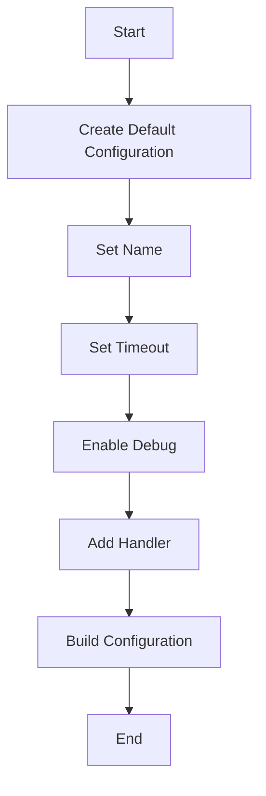

## 5.3. Builder Pattern Using Functional Approaches

In the realm of software design patterns, the Builder Pattern is a creational pattern that provides a flexible solution to constructing complex objects. In Elixir, a functional programming language, we can leverage functional approaches to implement the Builder Pattern effectively. This section will guide you through the nuances of using the Builder Pattern in Elixir, focusing on step-by-step object construction, immutable data structures, and fluent interfaces.

### Step-by-Step Object Construction

The Builder Pattern is particularly useful when you need to construct a complex object step by step. In Elixir, this is achieved through a series of functions that build up the desired data structure incrementally. Each function call returns a new instance of the data structure, ensuring immutability.

#### Key Concepts

- **Function Chaining**: Each function in the chain returns a modified version of the data structure, allowing for a fluent interface.
- **Incremental Construction**: Build the object piece by piece, adding or modifying properties as needed.
- **Separation of Concerns**: Each function focuses on a specific aspect of the object construction, enhancing modularity and readability.

#### Example: Building a Complex Configuration

Let's consider an example where we need to configure a GenServer with multiple options. We'll use a series of functions to construct the configuration step by step.

```elixir
defmodule GenServerConfig do
  defstruct name: nil, timeout: 5000, debug: false, handlers: []

  def new() do
    %GenServerConfig{}
  end

  def set_name(config, name) do
    %GenServerConfig{config | name: name}
  end

  def set_timeout(config, timeout) do
    %GenServerConfig{config | timeout: timeout}
  end

  def enable_debug(config) do
    %GenServerConfig{config | debug: true}
  end

  def add_handler(config, handler) do
    %GenServerConfig{config | handlers: [handler | config.handlers]}
  end
end

# Usage
config = GenServerConfig.new()
|> GenServerConfig.set_name("MyGenServer")
|> GenServerConfig.set_timeout(10000)
|> GenServerConfig.enable_debug()
|> GenServerConfig.add_handler(&handle_call/3)
```

In this example, we start with a default configuration and apply a series of transformations to build the desired configuration. Each function call returns a new instance of the configuration, maintaining immutability.

### Immutable Data Structures

Immutability is a core principle of functional programming and Elixir. When using the Builder Pattern, it's crucial to ensure that each step in the construction process returns a new instance of the data structure rather than modifying the existing one.

#### Benefits of Immutability

- **Thread Safety**: Immutable data structures are inherently thread-safe, making them ideal for concurrent applications.
- **Predictability**: Functions that operate on immutable data are easier to reason about, as they don't have side effects.
- **Ease of Testing**: Testing becomes simpler because functions don't alter the state of the data.

#### Implementing Immutability

In Elixir, immutability is achieved by returning new instances of data structures. The `struct` keyword is often used to define data structures with default values, which can then be transformed using pattern matching and the update syntax.

```elixir
defmodule ImmutableBuilder do
  defstruct parts: []

  def new() do
    %ImmutableBuilder{}
  end

  def add_part(builder, part) do
    %ImmutableBuilder{builder | parts: [part | builder.parts]}
  end
end

# Usage
builder = ImmutableBuilder.new()
|> ImmutableBuilder.add_part("Part A")
|> ImmutableBuilder.add_part("Part B")
```

### Fluent Interfaces in Elixir

Fluent interfaces provide a way to chain function calls in a readable and expressive manner. In Elixir, this is often achieved using the pipe operator (`|>`), which allows you to pass the result of one function as the input to the next.

#### Creating Fluent Interfaces

To create a fluent interface, design your functions to accept the data structure as the first argument and return a modified version of it. This enables seamless chaining of function calls.

```elixir
defmodule FluentBuilder do
  defstruct steps: []

  def new() do
    %FluentBuilder{}
  end

  def add_step(builder, step) do
    %FluentBuilder{builder | steps: [step | builder.steps]}
  end

  def build(builder) do
    Enum.reverse(builder.steps)
  end
end

# Usage
result = FluentBuilder.new()
|> FluentBuilder.add_step("Step 1")
|> FluentBuilder.add_step("Step 2")
|> FluentBuilder.build()
```

### Examples

Let's explore a more complex example where we configure a GenServer with multiple options using the Builder Pattern.

#### Configuring a GenServer

```elixir
defmodule GenServerBuilder do
  defstruct name: nil, timeout: 5000, debug: false, handlers: []

  def new() do
    %GenServerBuilder{}
  end

  def set_name(builder, name) do
    %GenServerBuilder{builder | name: name}
  end

  def set_timeout(builder, timeout) do
    %GenServerBuilder{builder | timeout: timeout}
  end

  def enable_debug(builder) do
    %GenServerBuilder{builder | debug: true}
  end

  def add_handler(builder, handler) do
    %GenServerBuilder{builder | handlers: [handler | builder.handlers]}
  end

  def build(builder) do
    # Here we would typically start the GenServer with the built configuration
    IO.inspect(builder, label: "GenServer Configuration")
  end
end

# Usage
GenServerBuilder.new()
|> GenServerBuilder.set_name("MyGenServer")
|> GenServerBuilder.set_timeout(10000)
|> GenServerBuilder.enable_debug()
|> GenServerBuilder.add_handler(&handle_call/3)
|> GenServerBuilder.build()
```

### Design Considerations

When implementing the Builder Pattern in Elixir, consider the following:

- **Function Purity**: Ensure that each function is pure, meaning it doesn't have side effects or depend on external state.
- **Error Handling**: Consider how to handle errors during the construction process. You might use pattern matching or the `with` construct to manage errors gracefully.
- **Performance**: While immutability provides many benefits, it can also lead to increased memory usage. Be mindful of performance implications when working with large data structures.

### Elixir Unique Features

Elixir offers several unique features that enhance the implementation of the Builder Pattern:

- **Pattern Matching**: Use pattern matching to destructure and transform data structures efficiently.
- **Pipe Operator**: The pipe operator (`|>`) allows for clean and readable chaining of function calls.
- **Structs**: Define data structures with default values and use them to create immutable instances.

### Differences and Similarities

The Builder Pattern in Elixir differs from its implementation in object-oriented languages in several ways:

- **Immutability**: Unlike object-oriented languages where objects are often mutable, Elixir emphasizes immutability.
- **Function Chaining**: Elixir uses function chaining with the pipe operator, whereas object-oriented languages might use method chaining.
- **Data Structures**: Elixir relies on structs and maps for data structures, while object-oriented languages use classes and objects.

### Visualizing the Builder Pattern

To better understand the Builder Pattern in Elixir, let's visualize the process using a flowchart.



This flowchart illustrates the step-by-step construction of a GenServer configuration using the Builder Pattern. Each step represents a function call that transforms the configuration.

### Try It Yourself

Now that we've explored the Builder Pattern in Elixir, try modifying the code examples to suit your needs. Experiment with adding new configuration options or changing the order of function calls. This hands-on approach will deepen your understanding of the pattern.

### Knowledge Check

- What are the key benefits of using the Builder Pattern in Elixir?
- How does immutability enhance the Builder Pattern?
- Why is the pipe operator important for fluent interfaces?
- What are some potential performance considerations when using the Builder Pattern?

### Embrace the Journey

Remember, this is just the beginning. As you progress, you'll build more complex and interactive applications using the Builder Pattern in Elixir. Keep experimenting, stay curious, and enjoy the journey!

## Quiz: Builder Pattern Using Functional Approaches



### What is the primary benefit of using the Builder Pattern in Elixir?

- [x] Constructing complex objects step by step
- [ ] Enhancing object-oriented inheritance
- [ ] Simplifying database queries
- [ ] Improving network communication

> **Explanation:** The Builder Pattern is used to construct complex objects step by step, providing flexibility and clarity in the construction process.

### How does immutability benefit the Builder Pattern in Elixir?

- [x] Ensures thread safety and predictability
- [ ] Increases memory usage
- [ ] Complicates error handling
- [ ] Limits the use of structs

> **Explanation:** Immutability ensures thread safety and predictability by preventing side effects and making functions easier to reason about.

### What role does the pipe operator play in fluent interfaces?

- [x] Allows chaining of function calls
- [ ] Enables pattern matching
- [ ] Simplifies recursion
- [ ] Enhances error handling

> **Explanation:** The pipe operator (`|>`) allows for chaining of function calls, creating a fluent interface that is readable and expressive.

### Which Elixir feature is crucial for implementing the Builder Pattern?

- [x] Structs
- [ ] GenServers
- [ ] Processes
- [ ] ETS tables

> **Explanation:** Structs are crucial for implementing the Builder Pattern as they provide a way to define and transform immutable data structures.

### What is a potential drawback of using the Builder Pattern with large data structures?

- [x] Increased memory usage
- [ ] Reduced code readability
- [ ] Difficulty in testing
- [ ] Lack of modularity

> **Explanation:** While the Builder Pattern offers many benefits, it can lead to increased memory usage when working with large data structures due to immutability.

### How can errors be handled during the construction process in Elixir?

- [x] Using pattern matching or the `with` construct
- [ ] Ignoring them
- [ ] Using global variables
- [ ] Relying on side effects

> **Explanation:** Errors can be handled using pattern matching or the `with` construct to manage them gracefully during the construction process.

### What is a key difference between the Builder Pattern in Elixir and object-oriented languages?

- [x] Emphasis on immutability
- [ ] Use of classes
- [ ] Reliance on inheritance
- [ ] Focus on mutable state

> **Explanation:** The Builder Pattern in Elixir emphasizes immutability, whereas object-oriented languages often rely on mutable state and classes.

### What is the purpose of function purity in the Builder Pattern?

- [x] Ensures no side effects or external dependencies
- [ ] Increases complexity
- [ ] Reduces performance
- [ ] Limits code reuse

> **Explanation:** Function purity ensures that functions have no side effects or external dependencies, making them predictable and easier to test.

### How can you create a fluent interface in Elixir?

- [x] Design functions to accept and return the data structure
- [ ] Use global variables for state management
- [ ] Implement inheritance
- [ ] Rely on mutable objects

> **Explanation:** To create a fluent interface, design functions to accept the data structure as the first argument and return a modified version, enabling chaining.

### True or False: The Builder Pattern in Elixir can be used to configure a GenServer with multiple options.

- [x] True
- [ ] False

> **Explanation:** True. The Builder Pattern can be used to configure a GenServer with multiple options by constructing the configuration step by step.


